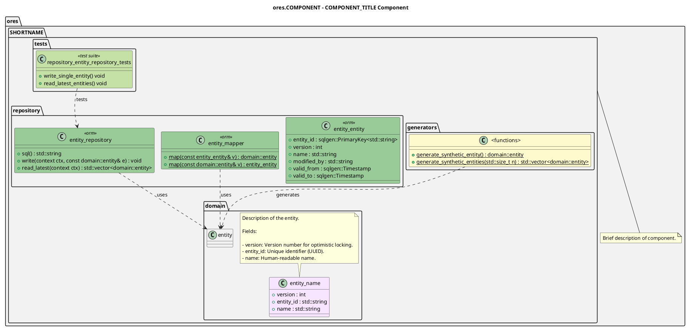

# When to use this skill

When you need to create or update the architectural documentation for an ORE Studio component. This includes the org-mode component model file and the PlantUML diagram that visualizes the component's internal structure.


# How to use this skill

1.  **Identify the component** from the request (e.g., `ores.assets`, `ores.iam`).
2.  Create the modeling directory if it doesn't exist.
3.  Create the org-mode component model file following the structure in Detailed instructions.
4.  Create the PlantUML diagram file following the PlantUML conventions.
5.  Generate the PNG diagram using CMake.
6.  Update the system model if this is a new component.


# Detailed instructions


## File organization

Component models are located under each component's `modeling` directory:

-   `projects/COMPONENT/modeling/COMPONENT.org` - Org-mode documentation
-   `projects/COMPONENT/modeling/COMPONENT.puml` - PlantUML class diagram
-   `projects/COMPONENT/modeling/COMPONENT.png` - Generated PNG diagram


## Step 1: Create the org-mode component model

Create `projects/COMPONENT/modeling/COMPONENT.org` with this structure:

```org
:PROPERTIES:
:ID: GUID
:END:
#+title: ORE Studio COMPONENT_TITLE Component
#+author: Marco Craveiro
#+options: <:nil c:nil todo:nil ^:nil d:nil date:nil author:nil toc:nil html-postamble:nil
#+startup: inlineimages

Brief description paragraph for [[id:D04D3476-D7C5-3954-A33B-C641EBCB43F6][ORE Studio]].

* Component Architecture

Diagram:

#+attr_html: :width 100% :alt Description
#+caption: ORE Studio COMPONENT_TITLE Component Diagram
[[file:COMPONENT.png][file:COMPONENT.png]]

This module provides [DESCRIPTION]. Key features include:

- Feature 1: description
- Feature 2: description
- Message-based API: asynchronous request/response handlers (subsystem range
  =0xNNNN-0xNNNN=)
- Temporal database support: version tracking with =valid_from= and =valid_to=
  fields
- Synthetic data generation: test data generation for development

The module is organized into namespaces: domain (core entities), repository
([[https://en.wikipedia.org/wiki/Object%E2%80%93relational_mapping][ORM]] and persistence), service (business logic), messaging (API handlers), and
generators (test data).

* Domain Types

| Type       | Description                    |
|------------+--------------------------------|
| =type1=    | Description of type1           |
| =type2=    | Description of type2           |

* Database Tables

| Table      | Type     | Description                    |
|------------+----------+--------------------------------|
| =table1=   | Temporal | Description of table1          |
| =table2=   | Junction | Description of table2          |

All temporal tables use bitemporal fields (=valid_from=, =valid_to=) for
historical tracking.

| Top: [[id:C0CF98E8-082F-2F04-2533-94B2DA9BE3D2][Documentation]] | Previous: [[id:D773166D-0C91-8CB4-3323-42166BC07687][System Model]] |
```

Key fields to update:

-   `GUID`: Generate using `python3 -c "import uuid; print(uuid.uuid4())"`
-   `COMPONENT`: The component name (e.g., `ores.assets`)
-   `COMPONENT_TITLE`: Human-readable title (e.g., `Assets`, `IAM`)
-   Update the feature list to match the component's capabilities
-   Add domain types and database tables as appropriate


## Step 2: Create the PlantUML diagram

Create `projects/COMPONENT/modeling/COMPONENT.puml` with this structure:




### PlantUML conventions

| Element    | Stereotype              | Color   | Description                        |
|---------- |----------------------- |------- |---------------------------------- |
| Domain     | (none)                  | #F7E5FF | Core domain entities               |
| ORM        | <a id="org683bead"></a> | #99CB99 | Repository entities/mappers        |
| Generators | (none)                  | #FFFACD | Test data generators               |
| Tests      | <a id="orgbcbdf3b"></a> | #C5E1A5 | Test suite classes                 |
| Namespaces | (none)                  | #F2F2F2 | All namespaces use this background |


### Layout tips

-   Use `together { }` to group related classes horizontally
-   Use `-[hidden]down-` and `-[hidden]right-` for invisible layout connections
-   Place notes using `note top of CLASS` or `note right of CLASS`
-   Use `..>` for dependency arrows with labels like `: uses` or `: generates`


## Step 3: Generate the diagram

Generate the PNG using CMake:

```sh
cmake --build --preset linux-clang-debug --target generate_SHORTNAME_diagram
```

Where `SHORTNAME` is the component's short name without the `ores.` prefix (e.g., `assets`, `iam`, `risk`).

If the CMake target doesn't exist, you need to add it to the component's `CMakeLists.txt`:

```cmake
add_plantuml_diagram(
    NAME ${project_name}_diagram
    INPUT_FILE "${CMAKE_CURRENT_SOURCE_DIR}/modeling/${project_name}.puml"
    OUTPUT_DIR "${CMAKE_CURRENT_SOURCE_DIR}/modeling"
)
```


## Step 4: Update system model

If this is a new component, update the system model:

1.  Add the component to `projects/modeling/ores.puml`
2.  Update `projects/modeling/system_model.org` with the component description
3.  Regenerate the system diagram:

```sh
cmake --build --preset linux-clang-debug --target generate_ores_diagram
```

See the [PlantUML Class Modeler](../plantuml-class-modeler/SKILL.md) skill for detailed PlantUML conventions.


## Step 5: Deploy the site

After creating or updating component models, run the `deploy_site` target to regenerate the documentation website. This ensures the new org-mode files are properly published and linked:

```sh
cmake --build --preset linux-clang-debug --target deploy_site
```

This step is necessary because the org-mode component models are published to the documentation website and need to be included in the site generation.
