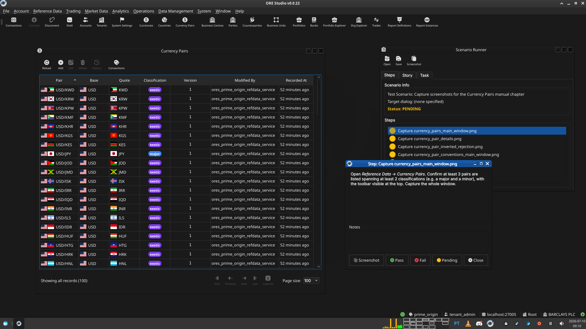
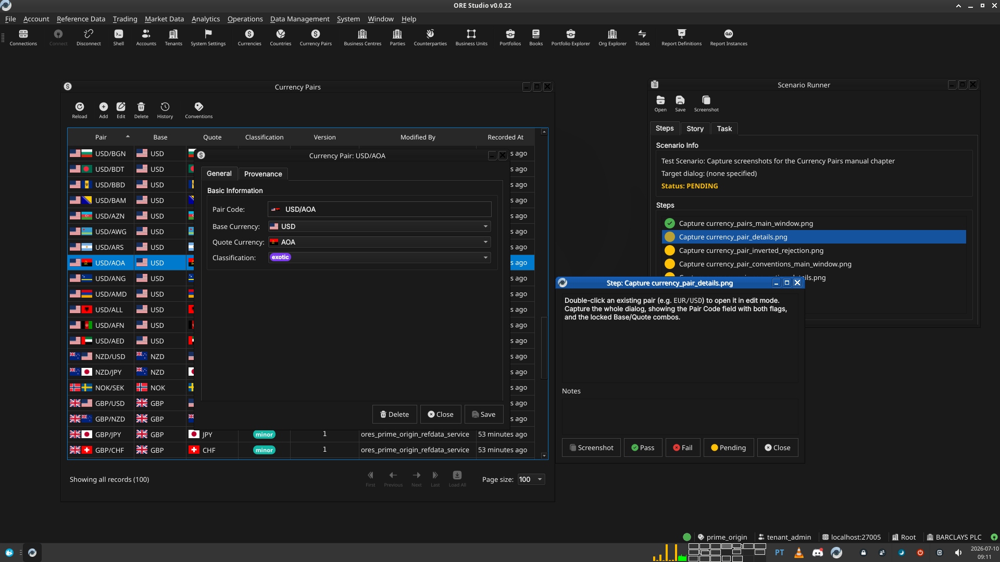
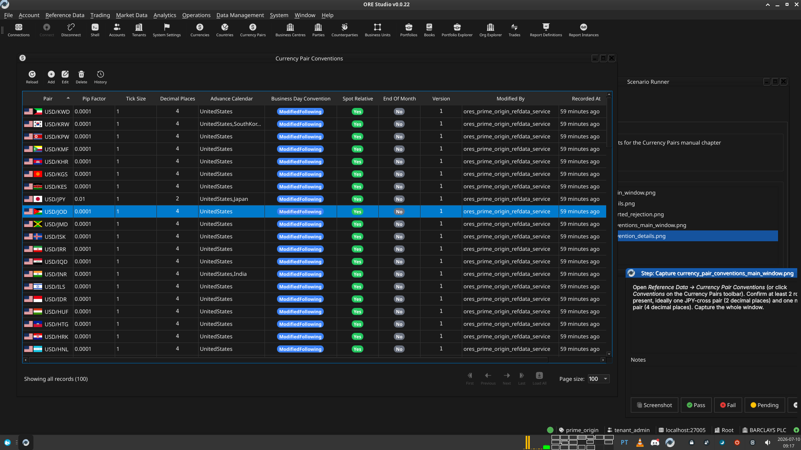
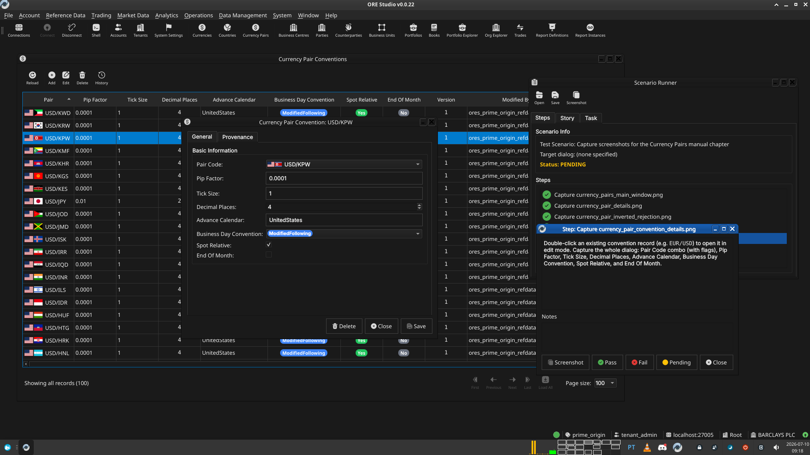
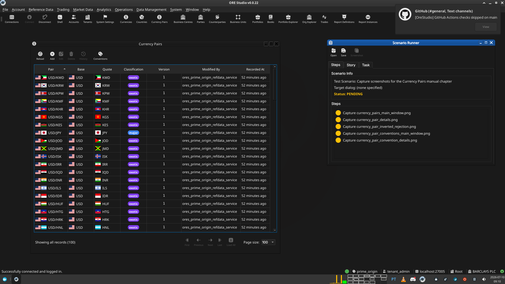

:PROPERTIES:
:ID: A976A11A-93B1-4703-8F09-8741CF9BC0F0
:END:
#+title: Test Scenario: Capture screenshots for the Currency Pairs manual chapter
#+description: Set up UI state and capture the five screenshot placeholders in chapter_5b_currency_pairs.org.
#+type: test_scenario
#+level: s1
#+filetags: :currency-pair-refdata:sprint_22:v0:
#+target_dialog:
#+created: 2026-07-10
#+updated: 2026-07-10
#+environment:
#+todo: PENDING | PASSED FAILED

This page documents a test scenario verifying [[id:5E8C3909-3BCD-4BBD-9748-2B551054A3B9][Document currency pairs and conventions in the user manual]] in [[id:04A121FA-00D6-43EB-9B21-04EDC1FA493D][Currency pair support in reference data]]. It is filled in with the target dialog and checklist of steps before testing starts; the QA Validation Runner panel rewrites =* Results= in place on save.

* Scenario Info

| Field         | Value                                   |
|---------------+------------------------------------------|
| Verifies task | [[id:5E8C3909-3BCD-4BBD-9748-2B551054A3B9][Document currency pairs and conventions in the user manual]] |
| Parent story  | [[id:04A121FA-00D6-43EB-9B21-04EDC1FA493D][Currency pair support in reference data]]   |
| Target dialog | CurrencyPairMdiWindow, CurrencyPairDetailDialog, CurrencyPairConventionMdiWindow, CurrencyPairConventionDetailDialog |
| Clients       |                                         |
| State         | PENDING                               |

* Context

Log in as =tenant_admin@barclays_plc= (password =Secure-Password-123=)
and select the BARCLAYS PLC party. If the DB was recreated since, run
=compass shell -f
projects/ores.shell/scripts/library/provisioning/barclays_system_provision.ores=
first — it seeds currency pairs and conventions including JPY
crosses. Services and the Qt client should already be running
(=compass services status=, =compass client start= if not).

This scenario is not a pass/fail correctness check; it exists to walk
through the exact UI states needed for the five screenshot
placeholders in [[proj:doc/manual/user_guide/chapter_5b_currency_pairs.org][=chapter_5b_currency_pairs.org=]]. Take the screenshot
at each step, save it under [[proj:doc/assets/images][=assets/images/=]] using the filename given,
then mark the step PASS once captured.

* Steps

** Capture currency_pairs_main_window.png

Open /Reference Data → Currency Pairs/. Confirm at least 3 pairs are
listed spanning at least 2 classifications (e.g. a major and a
minor), with the toolbar visible at the top. Capture the whole
window.

*** Result

| Field  | Value |
|--------+-------|
| Status | PASS |
| Notes  |  |

** Capture currency_pair_details.png

Double-click an existing pair (e.g. =EUR/USD=) to open it in edit
mode. Capture the whole dialog, showing the Pair Code field with both
flags, and the locked Base/Quote combos.

*** Result

| Field  | Value |
|--------+-------|
| Status | PASS |
| Notes  |  |

** Capture currency_pair_inverted_rejection.png

With =EUR/USD= already on file, open a new Currency Pair Details
dialog in create mode. Set Base Currency to =USD= and Quote Currency
to =EUR=, then click Save. Capture the resulting "Inverted Pair"
warning dialog. Close without saving afterwards.

*** Result

| Field  | Value |
|--------+-------|
| Status | PASS |
| Notes  | Could not take a screenshot due to message box being modal. created a capture. saved screenshot using OS app under ./tmp/Screenshot from 2026-07-10 09-15-56.png |

** Capture currency_pair_conventions_main_window.png

Open /Reference Data → Currency Pair Conventions/ (or click
/Conventions/ on the Currency Pairs toolbar). Confirm at least 2 rows
are present, ideally one JPY-cross pair (2 decimal places) and one
non-JPY pair (4 decimal places). Capture the whole window.

*** Result

| Field  | Value |
|--------+-------|
| Status | PASS |
| Notes  |  |

** Capture currency_pair_convention_details.png

Double-click an existing convention record (e.g. =EUR/USD=) to open
it in edit mode. Capture the whole dialog: Pair Code combo (with
flags), Pip Factor, Tick Size, Decimal Places, Advance Calendar,
Business Day Convention, Spot Relative, and End Of Month.

*** Result

| Field  | Value |
|--------+-------|
| Status | PASS |
| Notes  |  |

** Read the manual in the Qt client

Added retroactively per [[id:43A1EE0A-374D-4EA1-BC72-BADDDC525D20][How do I capture screenshots for a manual chapter?]] —
not yet run for this scenario. Rebuild the Qt-embedded HTML help
(=compass build --direct help= then
=cmake --build --preset <preset> --target deploy_help_qch=), restart the
Qt client, open the Currency Pairs chapter in /Help → User Manual/, and
read it top to bottom: confirm the prose reads correctly, the segues
work, and every screenshot appears where expected and matches its
caption.

*** Result

| Field  | Value |
|--------+-------|
| Status | PENDING |

** Check the built PDF

Added retroactively, same as above — not yet run. Open the rebuilt
=user_manual.pdf= (e.g. =zathura= or =evince=) at the Currency Pairs
chapter's pages and confirm layout, figure numbering, and captions look
correct in the PDF's own rendering.

*** Result

| Field  | Value |
|--------+-------|
| Status | PENDING |

* Results

| Field         | Value |
|---------------+-------|
| Status        | PENDING |
| Completed at  | 2026-07-10T08:18:17Z (5 capture steps only — the two review steps below were added after this run and still need to be worked) |
| Branch        | feature/currency-pair-manual-chapter |
| Commit        | 8e69c1f9c |
| Worktree      | prime_origin |

* Notes

