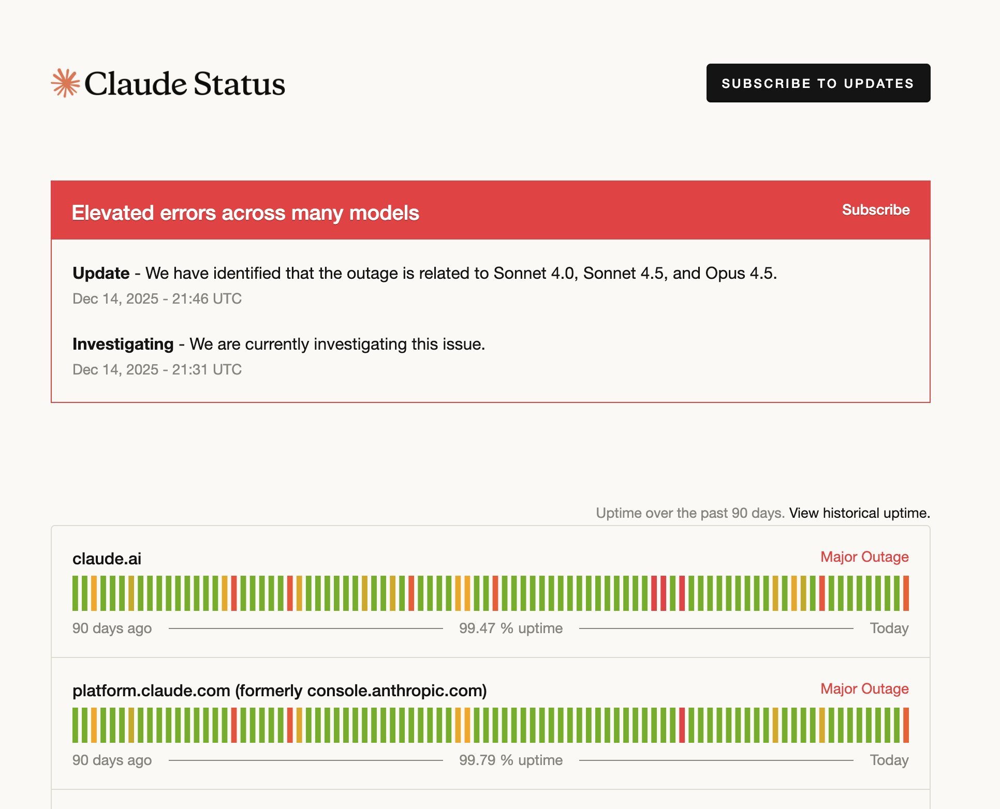

:PROPERTIES:
:ID: 9e5c2bb2-95bc-42e5-ad63-9b103a5d59f2
:END:
#+title: Add "uptime" screen
#+description: Add "uptime" screen
#+type: capture
#+version: 2
#+level: cross
#+filetags: :code:capture:near:
#+created: 2026-05-21
#+updated: 2026-05-21

This page is a [[id:671f18e4-e09c-4b3b-bd24-d33df8ae38a6][capture]] in the *near* bucket of the product backlog — a pre-sprint idea, not yet pulled into a sprint as a story.

See the claude page for ideas:

