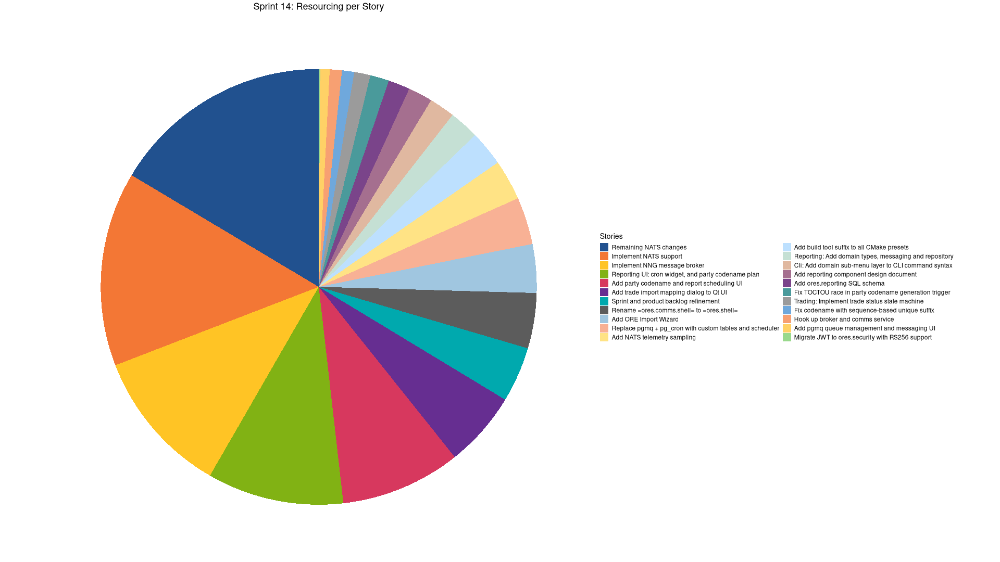
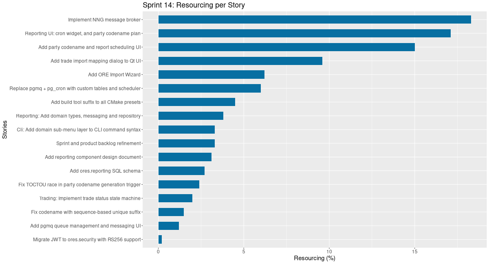
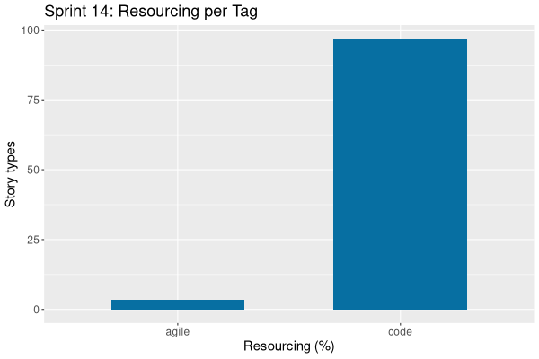

:PROPERTIES:
:ID: 93CE19DF-1501-11F1-8EF4-40B0768014EB
:END:
#+title: Sprint Backlog 14
#+options: <:nil c:nil ^:nil d:nil date:nil author:nil toc:nil html-postamble:nil
#+todo: STARTED | COMPLETED CANCELLED POSTPONED BLOCKED
#+tags: { code(c) infra(i) analysis(n) agile(a) }
#+startup: inlineimages

* Sprint Mission

- Work on messaging infrastructure.

* Stories

** Active

#+begin: clocktable :maxlevel 3 :scope subtree :tags t :indent nil :emphasize nil :scope file :narrow 75 :formula % :block today
#+TBLNAME: today_summary
#+CAPTION: Clock summary at [2026-03-12 Thu 23:58], for Thursday, March 12, 2026.
|       | <75>                                           |        |      |      |       |
| Tags  | Headline                                       | Time   |      |      |     % |
|-------+------------------------------------------------+--------+------+------+-------|
|       | *Total time*                                   | *4:20* |      |      | 100.0 |
|-------+------------------------------------------------+--------+------+------+-------|
|       | Stories                                        | 4:20   |      |      | 100.0 |
|       | Active                                         |        | 4:20 |      | 100.0 |
| agile | Sprint and product backlog refinement          |        |      | 1:48 |  41.5 |
| code  | Implement NNG message broker                   |        |      | 1:00 |  23.1 |
| code  | Fix codename with sequence-based unique suffix |        |      | 0:45 |  17.3 |
| code  | Hook up broker and comms service               |        |      | 0:47 |  18.1 |
#+end:

#+begin: clocktable :maxlevel 3 :scope subtree :tags t :indent nil :emphasize nil :scope file :narrow 75 :formula %
#+TBLNAME: sprint_summary
#+CAPTION: Clock summary at [2026-03-12 Thu 23:58]
|       | <75>                                                    |         |       |      |       |
| Tags  | Headline                                                | Time    |       |      |     % |
|-------+---------------------------------------------------------+---------+-------+------+-------|
|       | *Total time*                                            | *51:16* |       |      | 100.0 |
|-------+---------------------------------------------------------+---------+-------+------+-------|
|       | Stories                                                 | 51:16   |       |      | 100.0 |
|       | Active                                                  |         | 51:16 |      | 100.0 |
| agile | Sprint and product backlog refinement                   |         |       | 3:23 |   6.6 |
| code  | Add ORE Import Wizard                                   |         |       | 3:00 |   5.9 |
| code  | Add reporting component design document                 |         |       | 1:30 |   2.9 |
| code  | Add ores.reporting SQL schema                           |         |       | 1:20 |   2.6 |
| code  | Reporting: Add domain types, messaging and repository   |         |       | 1:50 |   3.6 |
| code  | Trading: Implement trade status state machine           |         |       | 0:59 |   1.9 |
| code  | Cli: Add domain sub-menu layer to CLI command syntax    |         |       | 1:35 |   3.1 |
| code  | Add pgmq queue management and messaging UI              |         |       | 0:34 |   1.1 |
| code  | Reporting UI: cron widget, and party codename plan      |         |       | 8:19 |  16.2 |
| code  | Add party codename and report scheduling UI             |         |       | 7:19 |  14.3 |
| code  | Replace pgmq + pg_cron with custom tables and scheduler |         |       | 2:54 |   5.7 |
| code  | Fix TOCTOU race in party codename generation trigger    |         |       | 1:10 |   2.3 |
| code  | Migrate JWT to ores.security with RS256 support         |         |       | 0:07 |   0.2 |
| code  | Implement NNG message broker                            |         |       | 8:55 |  17.4 |
| code  | Add build tool suffix to all CMake presets              |         |       | 2:10 |   4.2 |
| code  | Fix codename with sequence-based unique suffix          |         |       | 0:45 |   1.5 |
| code  | Add trade import mapping dialog to Qt UI                |         |       | 4:39 |   9.1 |
| code  | Hook up broker and comms service                        |         |       | 0:47 |   1.5 |
#+end:

*** STARTED Sprint and product backlog refinement                     :agile:
    :LOGBOOK:
    CLOCK: [2026-03-12 Thu 22:30]--[2026-03-12 Thu 23:10] =>  0:40
    CLOCK: [2026-03-12 Thu 21:10]--[2026-03-12 Thu 22:18] =>  1:08
    CLOCK: [2026-02-28 Sat 22:30]--[2026-03-01 Sun 00:05] =>  1:35
    :END:

Updates to sprint and product backlog.

#+begin_src emacs-lisp :exports none
;; agenda
(org-agenda-file-to-front)
#+end_src

#+name: pie-stories-chart
#+begin_src R :var sprint_summary=sprint_summary :colnames yes :results file graphics :exports results :file sprint_backlog_14_stories_pie_sorted.png :width 1920 :height 1080
library(conflicted)
library(ggplot2)
library(tidyverse)
library(tibble)

# Filter to only rows with actual story data (non-empty Tags column)
clean_sprint_summary <- sprint_summary %>% dplyr::filter(!is.na(Tags) & nzchar(Tags))
stories <- unlist(clean_sprint_summary[2])
percent_values <- as.numeric(unlist(clean_sprint_summary[6]))

# Create a data frame and explicitly sort the stories by defining factor levels
df <- data.frame(
  stories = stories,
  percent = percent_values
) %>%
  # 1. Sort the data frame by percentage in descending order
  arrange(desc(percent)) %>%
  # 2. Convert 'stories' to a factor, setting the levels based on the sorted order.
  # This makes the order of the slices explicit for ggplot.
  mutate(
    stories = factor(stories, levels = stories),
    lab.pos = cumsum(percent) - 0.5 * percent
  )

# Manually selected colors to resemble the screenshot
custom_palette <- c(
  "#21518f", "#f37735", "#ffc425", "#81b214", "#d7385e",
  "#662e91", "#00a9ae", "#5c5c5c", "#a0c6e0", "#f8b195",
  "#ffe385", "#bde0fe", "#c5e0d4", "#e0b8a0", "#a56f8f",
  "#7a448a", "#4a9a9b", "#9b9b9b", "#6fa8dc", "#f7a072",
  "#ffd166", "#99d98c", "#ef5d60", "#9d529f", "#3a86ff",
  "#c1d6e1", "#f9e0ac", "#c2d6a4", "#e69a8d", "#a07d9f"
)

# Ensure the palette has enough colors for all stories.
if (length(custom_palette) < length(df$stories)) {
  warning("Not enough custom colors for all stories. Colors will repeat.")
  custom_palette <- rep(custom_palette, length.out = length(df$stories))
}

p <- ggplot(df, aes(x = "", y = percent, fill = stories)) +
  geom_bar(width = 1, stat = "identity") +
  coord_polar("y", start = 0) +
  scale_fill_manual(values = custom_palette) +
  ggtitle("Sprint 14: Resourcing per Story")  +
  labs(x = NULL, y = NULL, fill = "Stories") +
  theme_minimal() +
  theme(
    axis.text.x = element_blank(),
    panel.grid.major = element_blank(),
    panel.grid.minor = element_blank(),
    plot.title = element_text(hjust = 0.5, size = 18),
    legend.position = "right",
    legend.title = element_text(size = 14),
    legend.text = element_text(size = 12)
  )

print(p)
#+end_src

#+RESULTS: pie-stories-chart

#+name: stories-chart
#+begin_src R :var sprint_summary=sprint_summary :colnames yes :results file graphics :exports results :file sprint_backlog_14_stories.png :width 1200 :height 650
library(conflicted)
library(grid)
library(tidyverse)
library(tibble)

# Filter to only rows with actual story data (non-empty Tags column)
clean_sprint_summary <- sprint_summary %>% dplyr::filter(Tags != "")
names <- unlist(clean_sprint_summary[2])
values <- as.numeric(unlist(clean_sprint_summary[6]))

# Create a data frame.
df <- data.frame(
  cost = values,
  stories = factor(names, levels = names[order(values, decreasing = FALSE)]),
  y = seq(length(names)) * 0.9
)

# Setup the colors
blue <- "#076fa2"

p <- ggplot(df) +
  aes(x = cost, y = stories) +
  geom_col(fill = blue, width = 0.6) +
  ggtitle("Sprint 14: Resourcing per Story") +
  xlab("Resourcing (%)") + ylab("Stories") +
  theme(text = element_text(size = 15))

print(p)
#+end_src

#+RESULTS: stories-chart

#+name: tags-chart
#+begin_src R :var sprint_summary=sprint_summary :colnames yes :results file graphics :exports results :file sprint_backlog_14_tags.png :width 600 :height 400
library(conflicted)
library(grid)
library(tidyverse)
library(tibble)

clean_sprint_summary <- sprint_summary %>% dplyr::filter(Tags != "")
names <- unlist(clean_sprint_summary[1])
values <- as.numeric(unlist(clean_sprint_summary[6]))

df <- data.frame(
  cost = values,
  tags = names,
  y = seq(length(names)) * 0.9
)

df2 <- setNames(aggregate(df$cost, by = list(df$tags), FUN = sum), c("cost", "tags"))

blue <- "#076fa2"

p <- ggplot(df2) +
  aes(x = cost, y = tags) +
  geom_col(fill = blue, width = 0.6) +
  ggtitle("Sprint 14: Resourcing per Tag") +
  xlab("Resourcing (%)") + ylab("Story types") +
  theme(text = element_text(size = 15))

print(p)
#+end_src

#+RESULTS: tags-chart

*** COMPLETED Add ORE Import Wizard                                    :code:
    :LOGBOOK:
    CLOCK: [2026-03-01 Sun 11:00]--[2026-03-01 Sun 14:00] =>  3:00
    :END:

#+begin_quote
This pull request delivers a robust ORE data import solution, enabling users to
seamlessly bring ORE directory structures and their contained financial data
into OreStudio. It provides a guided, multi-step wizard experience, backed by
sophisticated backend logic to process, organize, and integrate the data while
handling potential conflicts and ensuring data integrity.

Highlights:

- New ORE Import Wizard: Introduced a comprehensive 7-page QWizard
  (OreImportWizard) to facilitate the import of ORE directory data into
  OreStudio, covering directory scanning, hierarchy building, and trade import.
- Backend Logic for ORE Data Processing: Implemented core logic in the ores.ore
  layer, including ore_directory_scanner for classifying files,
  ore_hierarchy_builder for constructing portfolio/book hierarchies with
  intelligent naming and deduplication, and ore_import_planner for generating a
  complete import plan based on user choices and existing data.
- Enhanced UI Integration: Integrated the ORE Import Wizard into the Qt UI,
  accessible via the 'File' menu and a new toolbar button in the Portfolio
  Explorer. The wizard features asynchronous scanning, dynamic fetching of
  currencies and portfolios, and batched trade imports with live progress
  reporting.
- Intelligent Data Handling: Added features for detecting currency and portfolio
  XML files by root element, stripping configurable path segments for cleaner
  hierarchy, human-readable naming conventions for portfolios and books, and
  flexible re-import modes (add new trades only or create new temporal
  versions).
#+end_quote

Merged stories:

*ORE Importer: portfolio and trade support*

Now that we have the basics for trades, books and portfolios, we can do a very
basic ORE importer:

- point it to the samples directory;
- for each folder, if it has subfolders, create a portfolio. If it contains the
  trades file, make it a book.
- add each trade in the trade file.

Notes:

- users should be able to choose top-level portfolio to import it into.
  counterparty.

*** COMPLETED Add reporting component design document                  :code:
    :LOGBOOK:
    CLOCK: [2026-03-01 Sun 15:00]--[2026-03-01 Sun 16:30] =>  1:30
    :END:

#+begin_quote
This pull request establishes the foundational design for a new reporting
component, ores.reporting, within ORE Studio. It provides a detailed blueprint
for how reports will be defined, scheduled, and executed, focusing on a robust
domain model, clear state transitions, and integration with existing scheduling
and analytics services. The design aims to support various report types,
starting with risk reports, and lays the groundwork for future enhancements like
distributed execution and advanced output handling.

Highlights:

- New Component Design: Introduced the comprehensive design specification for
  ores.reporting, a new domain component in ORE Studio responsible for defining
  and executing analytical reports.
- Core Concepts Defined: Detailed the domain model, including report_type
  enumeration, report_definition (template), report_instance (single execution),
  and risk_report_config for type-specific settings.
- Dual State Machines: Designed distinct state machines for report_definition
  (draft, active, suspended, archived) and report_instance (pending, running,
  completed, failed, cancelled) to manage their lifecycles.
- Scheduler Integration: Outlined the integration with ores.scheduler for
  cron-based recurring execution and event-driven instance creation, leveraging
  pg_cron.
- Extensibility and Future Plans: Addressed future extensibility with planned
  support for ores.grid for distributed execution and identified open questions
  regarding output storage, execution environment, concurrency, and
  cancellation.
#+end_quote

*** COMPLETED Add ores.reporting SQL schema                            :code:
    :LOGBOOK:
    CLOCK: [2026-03-02 Mon 09:10]--[2026-03-02 Mon 10:30] =>  1:20
    :END:

#+begin_quote
This pull request significantly expands the database capabilities by introducing
a dedicated ores.reporting schema. It provides the foundational tables,
functions, and triggers necessary to define, schedule, execute, and track
various reports, particularly focusing on financial risk analytics. The new
schema incorporates advanced features like FSM-driven lifecycle management,
configurable concurrency policies, and granular risk parameter settings, all
while ensuring data integrity and security through robust validation and
Row-Level Security. This change enables a structured and scalable approach to
reporting within the system.

Highlights:

- New Reporting Schema: Introduced a comprehensive SQL schema for the
  ores.reporting component, enabling robust report management and execution.
- Report Definitions and Instances: Added tables for report_definitions
  (templates with FSM lifecycle, cron schedules) and report_instances
  (individual execution records with FSM lifecycle).
- Concurrency and Report Types: Implemented enum tables for concurrency_policies
  (skip, queue, fail) and report_types (risk, grid) to provide flexible control
  over report execution and categorization.
- Risk Report Configuration: Included a detailed risk_report_configs table to
  store ORE analytics parameters (NPV, cashflow, XVA, VaR, SIMM) and temporal
  junction tables for portfolio and book scoping.
- Lifecycle Management and Notifications: Integrated Finite State Machine (FSM)
  population scripts for both report definition and instance lifecycles, along
  with NOTIFY triggers on all tables for real-time UI updates.
- Row-Level Security (RLS): Applied RLS policies across reporting tables to
  ensure tenant and party isolation, enhancing data security and multi-tenancy
  support.
- Schema Validation Integration: Registered the new ores_reporting_ component
  prefix within the schema validator to ensure proper recognition and management
  of the new database objects.
#+end_quote

*** COMPLETED Reporting: Add domain types, messaging and repository    :code:
    :LOGBOOK:
    CLOCK: [2026-03-02 Mon 10:30]--[2026-03-02 Mon 12:20] =>  1:50
    :END:

#+begin_quote
This pull request establishes a foundational reporting subsystem within the ores
project. It introduces a new C++ component, ores.reporting, complete with its
core domain models, data access layers, and messaging protocols. This enables
the system to manage various aspects of reporting, including defining report
types, handling concurrency policies for report execution, scheduling report
definitions, and tracking individual report instances.

Highlights:

- New Reporting Component: Introduced a new C++ component, ores.reporting, to
  manage all aspects of report generation and tracking.
- Core Domain Types: Added foundational domain types: report_type,
  concurrency_policy, report_definition, and report_instance.
- Messaging Protocols: Implemented messaging protocols for CRUD operations and
  history retrieval for all four new reporting entities, registering 32 new
  message types in ores.comms.
- Repository Layer: Developed a repository layer for each reporting entity to handle data persistence and retrieval.
- Code Generation Models: Included code generator models under
  projects/ores.codegen/models/reporting/ for automated generation of related
  code artifacts.
- Build System Integration: Integrated the new ores.reporting component into the
  project's CMake build system.
#+end_quote

*** COMPLETED Trading: Implement trade status state machine            :code:
    :LOGBOOK:
    CLOCK: [2026-03-02 Mon 12:21]--[2026-03-02 Mon 13:20] =>  0:59
    :END:

#+begin_quote
This pull request significantly enhances the trade management system by
introducing a formal state machine for tracking trade statuses and a detailed
taxonomy for classifying trade activities. These changes provide a more
structured and robust framework for managing trade lifecycles, ensuring data
integrity through enforced state transitions and improving the granularity of
event tracking for reporting and analysis. The update also includes essential
bug fixes to improve build stability and data isolation.

Highlights:

- Trade Status State Machine Implementation: Introduced a robust trade status
  Finite State Machine (FSM) within the ores.dq module, defining states (new,
  live, expired, cancelled) and transitions (initial booking, confirm, cancel,
  expire) to manage the operational lifecycle of trades. This FSM is now
  integrated into the ores.trading module to enforce valid state changes.
- Activity Type Taxonomy: Replaced the previous lifecycle_events concept with a
  comprehensive activity_type taxonomy. This new system classifies trade events
  into categories like 'new activity', 'lifecycle event', 'misbooking',
  'valuation change', and 'cancellation', providing detailed P&L attribution and
  reporting capabilities. Each activity type can optionally map to an FpML event
  type and/or an FSM transition.
- Database Schema and C++ Domain Model Updates: Updated the database schema to
  include new tables for FpML event types and activity types, and modified the
  ores_trading_trades_tbl to incorporate activity_type_code and status_id
  columns. Corresponding C++ domain objects, mappers, and repositories were
  added or updated across ores.dq and ores.trading to support these new
  structures.
- Trade Status Resolution Service: Implemented a
  trade_status_service::resolve_status() function that validates and applies FSM
  transitions. This service ensures that trade status changes are only permitted
  if they correspond to a valid FSM transition linked to the activity type and
  are allowed from the trade's current state.
- Bug Fixes and Refactoring: Addressed a bug in the reflectcpp portfile by
  removing an incorrect bson-1.0 to bson rename, which had prevented sqlgen from
  building. Also, corrected cross-tenant data leakage issues in ores.refdata
  repositories by adding tenant_id to read/delete WHERE clauses.
#+end_quote

*** COMPLETED Cli: Add domain sub-menu layer to CLI command syntax     :code:
    :LOGBOOK:
    CLOCK: [2026-03-03 Tue 09:10]--[2026-03-03 Tue 10:45] =>  1:35
    :END:

#+begin_quote
This pull request significantly refactors the ORE Studio CLI's command structure
by introducing a new domain layer. This architectural change organizes commands
into logical categories such as 'refdata', 'iam', 'dq', and 'variability',
enhancing the clarity and scalability of the CLI. The updated syntax requires
users to specify a domain before an entity and operation, providing a more
structured and intuitive command-line experience.

Highlights:

- New CLI Command Syntax: Introduced a new domain sub-menu layer to the CLI
  command syntax, changing it from 'ores.cli ' to 'ores.cli '.
- New Domain Categories: Defined four new top-level domains: 'refdata', 'iam',
  'dq', and 'variability', to logically group related entities and commands.
- Core Parser Refactoring: Refactored the core CLI argument parser to support
  the new domain-prefixed command structure, including new domain-specific
  parsers.
- Documentation and Test Updates: Updated all existing entity parsers, CLI
  documentation examples, and test cases to conform to the new domain-based
  syntax.
#+end_quote

*** COMPLETED Add pgmq queue management and messaging UI               :code:
    :LOGBOOK:
    CLOCK: [2026-03-03 Tue 10:46]--[2026-03-03 Tue 11:20] => 0:34
    :END:

#+begin_quote
This pull request delivers a robust and user-friendly message queue management
solution. It integrates a new message queuing subsystem into the core
application, enabling comprehensive control and monitoring of pgmq queues. The
changes span database schema, communication protocols, backend service logic,
and a rich graphical user interface, providing a complete end-to-end feature for
managing message queues.

Highlights:

- New Message Queue (MQ) Subsystem: Introduced a complete MQ subsystem with new
  protocol message types (0xB000-0xB013) for queue management and messaging
  operations, including creation, deletion, purging, sending, reading, popping,
  and deleting messages.
- Queue Metrics and Monitoring: Implemented a time-series database schema
  (ores_mq_metrics_samples_tbl) for storing pgmq queue metrics, along with a
  pg_cron job (ores_mq_scrape_metrics_fn) to automatically scrape and persist
  these metrics every minute. The pg_cron job is initialized at service startup.
- Comprehensive Queue Monitor UI: Developed a full-featured Qt-based UI for
  monitoring and managing pgmq queues. This includes a ClientQueueModel for live
  merged views of queue metadata and metrics, a QueueMonitorMdiWindow with
  actions for queue CRUD and charting, a QueueDetailDialog for publishing and
  interacting with messages, and a QueueChartWindow for visualizing time-series
  queue depth and total messages sent.
- Protocol Version Update: Updated the communication protocol to version 46.3 to
  reflect the addition of the new MQ subsystem and its associated message types.
#+end_quote

*** COMPLETED Reporting UI: cron widget, and party codename plan       :code:
    :LOGBOOK:
    CLOCK: [2026-03-03 Tue 13:30]--[2026-03-03 Tue 14:20] =>  0:50
    CLOCK: [2026-03-03 Tue 11:21]--[2026-03-03 Tue 12:00] =>  0:39
    CLOCK: [2026-03-02 Mon 21:00]--[2026-03-02 Mon 23:00] =>  2:00
    CLOCK: [2026-03-02 Mon 13:30]--[2026-03-02 Mon 18:20] =>  4:50
    :END:

#+begin_quote
This pull request significantly enhances the reporting capabilities of the ORE
Studio by introducing a full-fledged Qt user interface for managing report
configurations and instances. It also lays the groundwork for robust, isolated
event processing through a new party codename design, ensuring secure and
scalable report scheduling. The changes span across UI components, backend
services, and core code generation logic, providing a more intuitive and
powerful experience for defining and monitoring reports.

Highlights:

- Reporting UI Integration: Introduced a comprehensive Qt UI for managing report
  types, concurrency policies, report definitions, and report instances,
  including dedicated MDI windows, detail dialogs, and history views.
- Cron Expression Management: Added interactive CronExpressionWidget and
  CronEditorDialog for intuitive creation and editing of cron schedules within
  the UI.
- Report Scheduling Backend: Implemented backend message handlers for scheduling
  and unscheduling report definitions, leveraging pg_cron for job management and
  pgmq for event queueing.
- Party Codename Design: Introduced a detailed design plan for adding a unique,
  human-readable codename to the party entity, primarily for per-party pgmq
  queue isolation and internal identification.
- Qt Codegen Enhancements: Extended the code generation system to support
  optional timestamp fields, UUID handling, and improved integer casting in Qt
  models.
- Tenant Provisioning Wizard Update: Integrated new steps into the tenant
  provisioning wizard to allow selection and automatic creation of initial
  report definitions.
- Iconography Expansion: Added new icons for 'Arrow Trending', 'Chart Multiple',
  and 'Tasks App' to enhance UI clarity for trading, reporting, and job
  management.
#+end_quote

*** COMPLETED Add party codename and report scheduling UI              :code:
    :LOGBOOK:
    CLOCK: [2026-03-03 Tue 14:21]--[2026-03-03 Tue 21:40] =>  7:19
    :END:

#+begin_quote
This pull request significantly enhances the system's multi-tenancy and
reporting capabilities. It introduces a unique codename for each party, which is
leveraged for isolated messaging queues and improved UI representation. The
report scheduling interface has been refined with better data handling, live
updates, and a more robust user experience including mandatory change reasons
for modifications. A major architectural improvement is the centralized handling
of session context and authentication stamping, ensuring consistent and secure
data manipulation across various services. Additionally, the message queue
monitoring and background job scheduling mechanisms have been updated to respect
party-level isolation, leading to a more secure and reliable system.

Highlights:

- Party Codename Implementation: Introduced a globally unique adjective_noun
  codename for each party, automatically generated by a SQL trigger using
  ores_utility_generate_whimsical_name_fn(). This codename is now used as a
  prefix for per-party PGMQ queues ({codename}_report_events) to ensure tenant
  isolation outside of Row-Level Security (RLS). The codename is exposed in the
  Qt party list (hidden by default) and as a read-only field in the party detail
  dialog.
- Enhanced Report Scheduling UI: Improved the report definition UI by fixing a
  missing party_id during saving, adding event subscriptions for live updates,
  and implementing client-side calculation of the 'Next Fire' column from cron
  expressions. Edits to report definitions now trigger a change reason dialog.
- Centralized Session Context Propagation & Authentication Stamping: Implemented
  comprehensive session context propagation (actor, tenant, party) through raw
  SQL execute functions, enforcing service account constants. A new C++23
  requires-expression template helper, stamp_auth, was added to
  tenant_aware_handler to centralize the stamping of authentication fields
  (modified_by, performed_by, tenant_id, party_id) across various message
  handler subsystems.
- MQ Queue Monitoring Improvements: Fixed queue visibility in the MQ queue
  monitor to display only queues relevant to the currently selected party
  (app.current_party_id), thereby enforcing party-scoped isolation. New
  party-scoped SQL functions (ores_mq_list_party_queues_fn,
  ores_mq_metrics_party_fn, ores_mq_metric_samples_fn) were introduced to manage
  this isolation.
- Idempotent MQ Metrics Scrape Job Registration: The MQ metrics scrape job
  registration was made idempotent, preventing duplicate job creation on service
  startup. The job now correctly uses a party-scoped context for querying
  existing job definitions, ensuring proper RLS policy adherence.
#+end_quote

*** COMPLETED Replace pgmq + pg_cron with custom tables and scheduler  :code:
    :LOGBOOK:
    CLOCK: [2026-03-03 Tue 21:41]--[2026-03-04 Wed 00:35] =>  2:54
    :END:

#+begin_quote
This pull request represents a significant architectural shift, moving away from
reliance on external PostgreSQL extensions for message queuing and job
scheduling. By implementing these functionalities natively within custom tables
and an in-process C++ scheduler, the system gains tighter integration with its
RLS architecture, improved control over data structures, and a more unified
codebase. This change impacts core messaging and scheduling mechanisms,
requiring updates across various components including the communication
protocol, UI, and reporting services.

Highlights:

- Extension Removal: The external PostgreSQL extensions pgmq and pg_cron have
  been entirely removed from the system, replaced by native infrastructure.
- Custom Message Queue (MQ) Tables: New custom ores_mq_* tables (mq_queues,
  mq_messages, mq_message_archive, mq_queue_stats, mq_channel_messages stub)
  have been introduced, offering three scope levels (party, tenant, system) and
  two queue types (task, channel) with native Row-Level Security (RLS).
- In-Process C++ Scheduler: A new in-process C++ scheduler loop (scheduler_loop)
  has been implemented using boost::asio::steady_timer, replacing the previous
  pg_cron jobs. It supports sql_action_handler for executing SQL and
  mq_action_handler for sending MQ messages.
- Scheduler Job Instances: A new TimescaleDB hypertable,
  ores_scheduler_job_instances_tbl, now stores the execution history for
  scheduled jobs, replacing cron.job_run_details.
- Updated MQ Protocol and Service: The ores.mq component has been significantly
  updated with new domain types, queue/message/stats repositories, and an
  mq_service facade. The communication protocol has been bumped to v48.0 to
  reflect these breaking changes.
- UI Updates: The ores.qt MQ Monitor now displays scope_type, queue_type,
  description, pending_count, and processing_count, with codename-based
  filtering removed. Report scheduling in ores.reporting now uses the new
  mq_service.
#+end_quote

*** COMPLETED Fix TOCTOU race in party codename generation trigger     :code:
    :LOGBOOK:
    CLOCK: [2026-03-04 Wed 00:36]--[2026-03-04 Wed 01:46] =>  1:14
    :END:

#+begin_quote
This pull request enhances the robustness of the database by resolving a
concurrency issue in the party codename generation logic. By introducing an
advisory lock, it prevents race conditions that previously led to data integrity
violations and unstable automated tests.

Highlights:

- Race Condition Fix: Addressed a Time-of-Check-to-Time-of-Use (TOCTOU) race
  condition that could lead to unique constraint violations during concurrent
  party codename generation.
- Concurrency Control: Implemented pg_advisory_xact_lock within the BEFORE
  INSERT trigger to serialize the codename generation process, ensuring
  uniqueness.
- CI Stability: Resolved intermittent CI failures caused by duplicate key errors
  in parallel test runs.
#+end_quote

*** COMPLETED Migrate JWT to ores.security with RS256 support          :code:
    :LOGBOOK:
    CLOCK: [2026-03-04 Wed 01:47]--[2026-03-04 Wed 01:54] =>  0:07
    :END:

#+begin_quote
This pull request significantly enhances the security and scalability of the
system's authentication mechanism by centralizing JWT handling and introducing
robust asymmetric encryption. It enables secure, distributed authentication
across services, which is crucial for the upcoming NNG broker architecture.
Additionally, it addresses a critical race condition in party codename
generation, improving system stability.

Highlights:

- JWT Infrastructure Migration: The JWT authentication infrastructure has been
  moved from the private ores.http module to the shared ores.security module,
  making it accessible across all services.
- RS256 Asymmetric Signing Support: Asymmetric RS256 signing and verification
  have been implemented, allowing the IAM service to mint tokens with a private
  key while other services verify them using only a public key.
- Extended JWT Claims: The jwt_claims structure has been extended to include
  tenant_id and party_id fields, essential for distributed service
  authentication.
- IAM Login Response Update: The IAM service now mints an RS256 JWT upon
  successful login and includes it in the login_response, providing a token for
  subsequent authenticated requests.
- Protocol Version Bump: The communication protocol major version has been
  incremented to 49.0 to reflect the breaking change of adding the JWT field to
  the login_response.
- TOCTOU Race Condition Fix: A Time-of-Check to Time-of-Use (TOCTOU) race
  condition in the party codename generation trigger has been fixed by
  introducing a pg_advisory_xact_lock.
#+end_quote

*** COMPLETED Implement NNG message broker                             :code:
    :LOGBOOK:
    CLOCK: [2026-03-12 Thu 13:20]--[2026-03-12 Thu 14:20] =>  1:00
    CLOCK: [2026-03-05 Thu 19:00]--[2026-03-05 Thu 21:10] =>  2:10
    CLOCK: [2026-03-05 Thu 14:00]--[2026-03-05 Thu 16:15] =>  2:15
    CLOCK: [2026-03-05 Thu 09:00]--[2026-03-05 Thu 12:30] =>  3:30
    :END:

NNG message broker — JWT in frames, broker protocol, routing, and service
registration:

#+begin_quote
This pull request introduces a foundational message broker architecture using
NNG, designed to centralize message routing between client-facing services and
backend components. It significantly enhances security and scalability by
embedding JWT tokens directly into message frames for independent service
validation and provides a robust mechanism for services to dynamically register
their message handling capabilities with the broker. This change paves the way
for a more distributed and resilient system.

Highlights:

- NNG-based Message Broker Introduction: A new standalone ores.mq.broker
  executable has been introduced, implementing an NNG-based message broker
  architecture to route binary protocol frames between clients and registered
  backend services.
- JWT in Message Frames: The core protocol (v50.0) now embeds JWT tokens
  directly within every message frame via a new jwt_size field, allowing
  services to independently validate client identity without a central session
  store. The CRC calculation has been updated to include these JWT bytes.
- Broker Protocol and Service Registration: New broker-specific message types
  (register_service_request/response, token_refresh_request/response) have been
  added, enabling services to self-register their handled message type ranges
  with the broker and request token refreshes.
- Auth Session Refactor for JWT: The auth_session_service has been refactored to
  support JWT validation, including a new jwt_validator_fn and a secondary
  session_id_index_ for efficient session lookup by JWT session_id claims.
- Service Self-Registration: The ores.comms.service now includes logic to
  connect to the broker backend at startup and register all its handled message
  type ranges, integrating it into the new brokered communication model.
#+end_quote

Implement a NNG-based broker:

#+begin_quote
This pull request significantly refactors the application's integration with the
NNG message broker. It introduces a dedicated service runner to manage broker
communication, centralizing the logic for registration and message processing.
This change enhances modularity, enables asynchronous message handling, and
improves the overall robustness and scalability of the messaging infrastructure
by isolating NNG-specific operations.

Highlights:

- New NNG Service Runner: Introduced a new nng_service_runner class to
  encapsulate the logic for registering with the NNG broker and handling message
  reception and dispatching in a dedicated, persistent loop.
- Refactored Broker Integration: The application.cpp was refactored to utilize
  the new nng_service_runner, moving the broker registration and message
  processing into a separate thread for improved concurrency and separation of
  concerns.
- Asynchronous Message Dispatching: Implemented an asynchronous adapter within
  the application.cpp to dispatch raw NNG messages through the existing
  message_dispatcher using boost::asio::co_spawn, allowing for non-blocking
  message handling.
- Enhanced Error Handling: Added logic to generate minimal error response frames
  when NNG message parsing fails, ensuring robust communication with the broker.
- Message Dispatcher Access: Exposed the shared message_dispatcher via a new
  dispatcher() method in the server class, enabling external components like the
  NNG service runner to utilize the same message handling registry.

#+end_quote

*** COMPLETED Add build tool suffix to all CMake presets               :code:
    :LOGBOOK:
    CLOCK: [2026-03-10 Tue 22:00]--[2026-03-11 Wed 00:10] =>  2:10
    :END:

#+begin_quote
This pull request refactors the CMake preset configuration to explicitly include
the build tool (Ninja or Make) in all preset names, enhancing clarity and
flexibility. It introduces dedicated hidden presets for Ninja and Make to
centralize generator settings and specific build tool options, such as disabling
colored output for Make. This change also expands build options for Linux and
macOS to include both Ninja and Make, while standardizing Windows builds on
Ninja. Additionally, the PR simplifies the parallel build configuration by
removing automatic detection from 'CMakeLists.txt' and updates all internal
documentation and skill instructions to align with these new conventions.

Highlights:

- CMake Preset Renaming: All CMake presets have been renamed to explicitly
  include the build tool (Ninja or Make) in their names, following the pattern
  {platform}-{compiler}-{buildtype}-{tool}.
- Build Tool Specific Presets: Hidden 'ninja' and 'make' presets were introduced
  to centralize generator settings and specific build tool configurations, such
  as disabling colored diagnostics for Make.
- Expanded Platform Support: Linux and macOS now support both Ninja and Make
  variants, while Windows builds are standardized on Ninja only.
- Parallel Build Simplification: Automatic parallel build level detection was
  removed from 'CMakeLists.txt', deferring this configuration to user
  environment variables or build tool defaults.
- Documentation Updates: All relevant documentation and skill files have been
  updated to reflect the new CMake preset naming conventions and revised
  parallel build instructions.
#+end_quote

*** COMPLETED Fix codename with sequence-based unique suffix           :code:
    :LOGBOOK:
    CLOCK: [2026-03-12 Thu 19:00]--[2026-03-12 Thu 19:45] =>  0:45
    :END:

#+begin_quote
This pull request addresses a critical race condition in the codename generation
process for parties, which was leading to database unique key violations during
batch inserts. By fundamentally changing how unique codenames are generated, it
ensures data integrity and allows for the reintroduction of efficient batch
insert operations, significantly improving performance and reliability.

Highlights:

- Codename Race Condition Fix: Resolved an intermittent 'duplicate key'
  violation in codename generation caused by a race condition in the
  ores_refdata_parties_codename_uniq_idx trigger, which previously used a NOT
  EXISTS check and an ineffective advisory lock.
- Sequence-Based Suffix Implementation: Replaced the problematic advisory lock
  and NOT EXISTS loop with a new sequence-based suffix mechanism to ensure
  unique codenames.
- New Utility Function: Introduced ores_utility_to_base26_fn(bigint) to encode
  sequence values into lowercase base-26 strings, satisfying codename regex
  constraints.
- New Database Sequence: Created ores_refdata_party_codename_seq to provide
  unique, MVCC-independent sequence values for codename suffixes.
- Simplified Codename Trigger: Updated the ores_refdata_parties_insert_fn
  trigger to append the base-26 encoded sequence value to whimsical names,
  ensuring uniqueness for each row in a batch.
- Reinstated Batch Inserts: Reverted party_repository::write(vector) to use
  proper batch inserts, as the previous workaround of sequential single-row
  inserts is no longer necessary due to the new codename generation logic.
#+end_quote

*** COMPLETED Rename currency asset classes                            :code:

*Rationale*: implemented in previous sprint.

We should avoid the term "asset classes" unless it is used in the usual asset
class context. Many of the values are not really what one things of asset
classes.

*** COMPLETED Alert for unsaved modified entities                      :code:

*Rationale*: implemented in previous sprint.

If a user changes an entity but does not save it, we should alert the user.
Also, we probably should add a cancel button to all detail dialogs.

*** CANCELLED Hook up broker and comms service                         :code:
    :LOGBOOK:
    CLOCK: [2026-03-12 Thu 23:11]--[2026-03-12 Thu 23:58] =>  0:47
    :END:

We have introduced the broker but we did not validate that the infrastructure
works as expected.

*** STARTED Add trade import mapping dialog to Qt UI                   :code:
    :LOGBOOK:
    CLOCK: [2026-03-01 Sun 10:52]--[2026-03-01 Sun 13:41] =>  2:49
    CLOCK: [2026-03-01 Sun 09:01]--[2026-03-01 Sun 10:51] =>  1:50
    :END:

Add a mapping dialog to the Qt UI for importing ORE portfolio XML files. The
dialog should allow users to:

1. Select an ORE portfolio XML file.
2. Preview the trades that will be imported (count, types, counterparties).
3. Select the ORES book to import trades into.
4. Map ORE =CounterParty= names to ORES counterparties (or auto-create).
5. Review and confirm the import.

This dialog should be accessible from the book list window toolbar when a book
is selected (similar to the currency import button on the currency list window).

Files to modify:

- =BookMdiWindow.hpp/cpp= - add import toolbar action
- New =ImportTradeDialog.hpp/cpp= - the mapping and preview dialog
- =BookController.hpp/cpp= - wire up the import action

Acceptance criteria:

- Import button is visible and enabled when a book is selected.
- Dialog shows trade preview with counterparty mapping.
- Successful import creates trades in the selected book.
- Trades appear in the trade list after import.

*** STARTED Implement NATS support                                     :code:
    :LOGBOOK:
    CLOCK: [2026-03-13 Fri 11:24]
    CLOCK: [2026-03-13 Fri 11:15]--[2026-03-13 Fri 11:24] =>  0:09
    CLOCK: [2026-03-13 Fri 09:30]--[2026-03-13 Fri 11:15] =>  1:45
    :END:

NNG seems like a lot of work. Let's try NATS first.

*** Improvements to detail dialogs                                    :code:

We've implemented most of these but check:

- For most dialogs, pressing escape should be the same as closing it.
- We should also add a "cancel" button to dialogs, makes it a bit more "normal".
- New dialogs use toolbars instead of buttons at the bottom.

*** No samples in sessions                                             :code:

For some reason we are no longer sampling for sessions. Investigate why.

*** Check change reasons on delete                                     :code:

Seems like we do not have change reasons on entity deletes. We need to update
all entities.

*** Add party level currency and country restrictions                  :code:

At present a party can use all currencies and all countries. In reality we
normally want to restrict this at the party level. We won't be able to do a full
implementation of this right now but it is a good idea to put in the framework
so that we start to get a feel for how to work with RLS.

#+begin_quote
This pull request significantly enhances the reference data management system by
introducing party-specific visibility for currencies and countries. It
establishes a robust framework for granular control over which reference data
elements are accessible to different parties, addressing a limitation where all
such data was previously tenant-wide. The changes span the entire application
stack, from database schema and generated C++ code to service-level filtering,
ensuring a comprehensive and well-integrated solution.

Highlights:

- New Party-Visibility Junction Tables: Introduced
  ores_refdata_party_currencies_tbl and ores_refdata_party_countries_tbl to
  control which currencies and countries are visible to specific parties, moving
  from tenant-wide visibility to per-party control.
- Full Stack Codegen: Generated the complete domain, repository, service, and
  test layers for both new entities using codegen models, ensuring consistency
  and reducing manual effort.
- Service Integration: Integrated filtering logic into existing currency_service
  and country_service to leverage the new junction tables, adding
  list_currencies_for_party and list_countries_for_party methods.
- Bitemporal Support: Implemented bitemporal functionality for the new junction
  tables, including valid_from and valid_to columns, versioning, and soft-delete
  rules.
#+end_quote

***

*** Add auxiliary types to their entities                              :code:

The toolbars of each entity should have icons for the auxiliary types they use.
Also we may need to make the menu options a bit more obvious (e.g. "Purpose
Types"?).

* Footer

| Previous: [[id:9A4009E7-0E6C-11F1-852D-40B0768014EB][Sprint Backlog 13]] |
