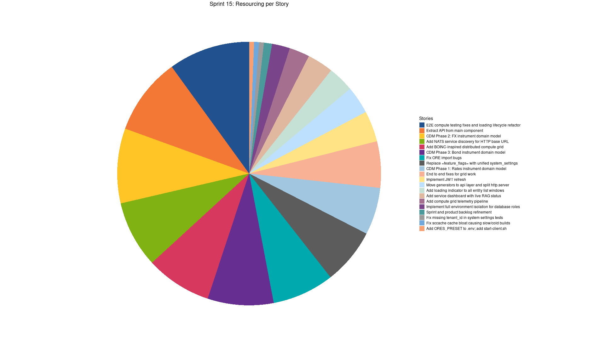
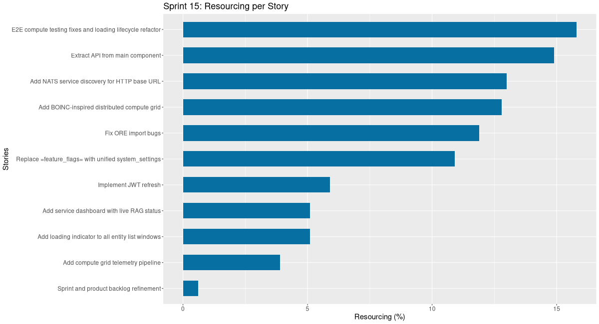
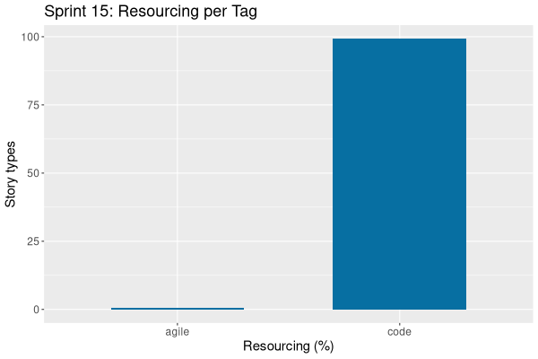

:PROPERTIES:
:ID: 0B23D554-23BA-11F1-9F0E-40B0768014EB
:END:
#+title: Sprint Backlog 15
#+options: <:nil c:nil ^:nil d:nil date:nil author:nil toc:nil html-postamble:nil
#+todo: STARTED | COMPLETED CANCELLED POSTPONED BLOCKED
#+tags: { code(c) infra(i) analysis(n) agile(a) }
#+startup: inlineimages

* Sprint Mission

- Implement compute grid.

* Stories

** Active

#+begin: clocktable :maxlevel 3 :scope subtree :tags t :indent nil :emphasize nil :scope file :narrow 75 :formula % :block today
#+TBLNAME: today_summary
#+CAPTION: Clock summary at [2026-03-26 Thu 08:08], for Thursday, March 26, 2026.
|      | <75>                           |        |      |      |       |
| Tags | Headline                       | Time   |      |      |     % |
|------+--------------------------------+--------+------+------+-------|
|      | *Total time*                   | *2:23* |      |      | 100.0 |
|------+--------------------------------+--------+------+------+-------|
|      | Stories                        | 2:23   |      |      | 100.0 |
|      | Active                         |        | 2:23 |      | 100.0 |
| code | End to end fixes for grid work |        |      | 2:23 | 100.0 |
#+end:

#+begin: clocktable :maxlevel 3 :scope subtree :tags t :indent nil :emphasize nil :scope file :narrow 75 :formula %
#+TBLNAME: sprint_summary
#+CAPTION: Clock summary at [2026-03-26 Thu 08:08]
|       | <75>                                                     |         |       |      |       |
| Tags  | Headline                                                 | Time    |       |      |     % |
|-------+----------------------------------------------------------+---------+-------+------+-------|
|       | *Total time*                                             | *66:46* |       |      | 100.0 |
|-------+----------------------------------------------------------+---------+-------+------+-------|
|       | Stories                                                  | 66:46   |       |      | 100.0 |
|       | Active                                                   |         | 66:46 |      | 100.0 |
| agile | Sprint and product backlog refinement                    |         |       | 0:54 |   1.3 |
| code  | Add BOINC-inspired distributed compute grid              |         |       | 7:03 |  10.6 |
| code  | Fix ORE import bugs                                      |         |       | 6:35 |   9.9 |
| code  | Add loading indicator to all entity list windows         |         |       | 2:49 |   4.2 |
| code  | Replace =feature_flags= with unified system_settings     |         |       | 5:59 |   9.0 |
| code  | Implement JWT refresh                                    |         |       | 3:16 |   4.9 |
| code  | Add compute grid telemetry pipeline                      |         |       | 2:10 |   3.2 |
| code  | Add service dashboard with live RAG status               |         |       | 2:49 |   4.2 |
| code  | E2E compute testing fixes and loading lifecycle refactor |         |       | 8:43 |  13.1 |
| code  | Add NATS service discovery for HTTP base URL             |         |       | 7:10 |  10.7 |
| code  | Extract API from main component                          |         |       | 8:13 |  12.3 |
| code  | Fix missing tenant_id in system settings tests           |         |       | 0:30 |   0.7 |
| code  | Fix sccache cache bloat causing slow/cold builds         |         |       | 0:30 |   0.7 |
| code  | Move generators to api layer and split http.server       |         |       | 2:55 |   4.4 |
| code  | Implement full environment isolation for database roles  |         |       | 1:53 |   2.8 |
| code  | Add ORES_PRESET to .env; add start-client.sh             |         |       | 0:30 |   0.7 |
| code  | End to end fixes for grid work                           |         |       | 4:47 |   7.2 |
#+end:

*** STARTED Sprint and product backlog refinement                     :agile:
    :LOGBOOK:
    CLOCK: [2026-03-24 Tue 22:00]--[2026-03-24 Tue 22:34] =>  0:34
    CLOCK: [2026-03-20 Fri 09:50]--[2026-03-20 Fri 10:10] =>  0:20
    :END:

Updates to sprint and product backlog.

#+begin_src emacs-lisp :exports none
;; agenda
(org-agenda-file-to-front)
#+end_src

#+name: pie-stories-chart
#+begin_src R :var sprint_summary=sprint_summary :colnames yes :results file graphics :exports results :file sprint_backlog_15_stories_pie_sorted.png :width 1920 :height 1080
library(conflicted)
library(ggplot2)
library(tidyverse)
library(tibble)

# Filter to only rows with actual story data (non-empty Tags column)
clean_sprint_summary <- sprint_summary %>% dplyr::filter(!is.na(Tags) & nzchar(Tags))
stories <- unlist(clean_sprint_summary[2])
percent_values <- as.numeric(unlist(clean_sprint_summary[6]))

# Create a data frame and explicitly sort the stories by defining factor levels
df <- data.frame(
  stories = stories,
  percent = percent_values
) %>%
  # 1. Sort the data frame by percentage in descending order
  arrange(desc(percent)) %>%
  # 2. Convert 'stories' to a factor, setting the levels based on the sorted order.
  # This makes the order of the slices explicit for ggplot.
  mutate(
    stories = factor(stories, levels = stories),
    lab.pos = cumsum(percent) - 0.5 * percent
  )

# Manually selected colors to resemble the screenshot
custom_palette <- c(
  "#21518f", "#f37735", "#ffc425", "#81b214", "#d7385e",
  "#662e91", "#00a9ae", "#5c5c5c", "#a0c6e0", "#f8b195",
  "#ffe385", "#bde0fe", "#c5e0d4", "#e0b8a0", "#a56f8f",
  "#7a448a", "#4a9a9b", "#9b9b9b", "#6fa8dc", "#f7a072",
  "#ffd166", "#99d98c", "#ef5d60", "#9d529f", "#3a86ff",
  "#c1d6e1", "#f9e0ac", "#c2d6a4", "#e69a8d", "#a07d9f"
)

# Ensure the palette has enough colors for all stories.
if (length(custom_palette) < length(df$stories)) {
  warning("Not enough custom colors for all stories. Colors will repeat.")
  custom_palette <- rep(custom_palette, length.out = length(df$stories))
}

p <- ggplot(df, aes(x = "", y = percent, fill = stories)) +
  geom_bar(width = 1, stat = "identity") +
  coord_polar("y", start = 0) +
  scale_fill_manual(values = custom_palette) +
  ggtitle("Sprint 15: Resourcing per Story")  +
  labs(x = NULL, y = NULL, fill = "Stories") +
  theme_minimal() +
  theme(
    axis.text.x = element_blank(),
    panel.grid.major = element_blank(),
    panel.grid.minor = element_blank(),
    plot.title = element_text(hjust = 0.5, size = 18),
    legend.position = "right",
    legend.title = element_text(size = 14),
    legend.text = element_text(size = 12)
  )

print(p)
#+end_src

#+RESULTS: pie-stories-chart

#+name: stories-chart
#+begin_src R :var sprint_summary=sprint_summary :colnames yes :results file graphics :exports results :file sprint_backlog_15_stories.png :width 1200 :height 650
library(conflicted)
library(grid)
library(tidyverse)
library(tibble)

# Filter to only rows with actual story data (non-empty Tags column)
clean_sprint_summary <- sprint_summary %>% dplyr::filter(Tags != "")
names <- unlist(clean_sprint_summary[2])
values <- as.numeric(unlist(clean_sprint_summary[6]))

# Create a data frame.
df <- data.frame(
  cost = values,
  stories = factor(names, levels = names[order(values, decreasing = FALSE)]),
  y = seq(length(names)) * 0.9
)

# Setup the colors
blue <- "#076fa2"

p <- ggplot(df) +
  aes(x = cost, y = stories) +
  geom_col(fill = blue, width = 0.6) +
  ggtitle("Sprint 15: Resourcing per Story") +
  xlab("Resourcing (%)") + ylab("Stories") +
  theme(text = element_text(size = 15))

print(p)
#+end_src

#+RESULTS: stories-chart

#+name: tags-chart
#+begin_src R :var sprint_summary=sprint_summary :colnames yes :results file graphics :exports results :file sprint_backlog_15_tags.png :width 600 :height 400
library(conflicted)
library(grid)
library(tidyverse)
library(tibble)

clean_sprint_summary <- sprint_summary %>% dplyr::filter(Tags != "")
names <- unlist(clean_sprint_summary[1])
values <- as.numeric(unlist(clean_sprint_summary[6]))

df <- data.frame(
  cost = values,
  tags = names,
  y = seq(length(names)) * 0.9
)

df2 <- setNames(aggregate(df$cost, by = list(df$tags), FUN = sum), c("cost", "tags"))

blue <- "#076fa2"

p <- ggplot(df2) +
  aes(x = cost, y = tags) +
  geom_col(fill = blue, width = 0.6) +
  ggtitle("Sprint 15: Resourcing per Tag") +
  xlab("Resourcing (%)") + ylab("Story types") +
  theme(text = element_text(size = 15))

print(p)
#+end_src

#+RESULTS: tags-chart

*** COMPLETED Add BOINC-inspired distributed compute grid              :code:
    :LOGBOOK:
    CLOCK: [2026-03-21 Sat 07:02]--[2026-03-21 Sat 07:20] =>  0:18
    CLOCK: [2026-03-20 Fri 22:12]--[2026-03-20 Fri 23:59] =>  1:47
    CLOCK: [2026-03-20 Fri 15:02]--[2026-03-20 Fri 20:00] =>  4:58
    :END:

#+begin_quote
This pull request implements a comprehensive distributed compute grid inspired
by BOINC, integrating it deeply into the ORE Studio ecosystem. It introduces new
domain entities, services, and executables, leveraging modern messaging and
database technologies for efficient and scalable computation.

Highlights:

- Compute Grid Implementation: This PR introduces a BOINC-inspired distributed
  compute grid across all layers of the ORE Studio stack, including domain
  library, SQL schema, service executable, messaging protocol, wrapper
  executable, HTTP endpoints, CLI commands, and Qt list windows.
- Key Components: Key components include ores.compute domain library,
  ores.compute.service executable, ores.compute.wrapper executable, and
  integration with NATS JetStream for message handling.
- Event-Driven Architecture: The architecture is primarily event-driven, using
  NATS JetStream for lifecycle transitions and PostgreSQL triggers for eventing,
  replacing legacy PGMQ and pg_cron implementations.
- Documentation Updates: The PR updates UML diagrams and removes legacy plan
  documents, providing comprehensive documentation for the new compute grid.
#+end_quote

*** COMPLETED Fix ORE import bugs                                      :code:
    :LOGBOOK:
    CLOCK: [2026-03-19 Thu 14:04]--[2026-03-19 Thu 17:40] =>  3:36
    CLOCK: [2026-03-19 Thu 10:00]--[2026-03-19 Thu 12:59] =>  2:59
    :END:

#+begin_quote
This pull request significantly improves the robustness and usability of the
application by addressing several critical bugs across ORE import, trading
services, and the Qt UI. Key changes include enhanced data mapping for ORE
currency types, better handling of trade statuses, and dynamic loading of
activity types in the UI. Additionally, UI components now retain their layout,
and the project version has been updated to reflect the new sprint cycle.

Highlights:

- ORE Import Bug Fixes: Resolved an Invalid monetary_nature: Crypto error by
  implementing a mapping for ORE CurrencyType values to appropriate database
  codes (e.g., Metal to commodity, Crypto to synthetic, others to fiat).
- UI Enhancements (Qt): Introduced a subject_prefix field to the AddItemDialog
  for environments (editable) and connections (read-only from linked
  environments), improving configuration clarity. Fixed an issue where
  ConnectionBrowserMdiWindow failed to restore its size and splitter position
  upon reopening.
- Trading Service Stability: Addressed an Invalid status_id: nil UUID bug by
  ensuring trade_status_service::resolve_status is called before every trade
  write operation, guaranteeing valid status IDs.
- Dynamic Activity Type Loading: Added a new trading.v1.activity_types.list NATS
  endpoint, allowing clients to dynamically fetch valid activity type codes from
  the database. This change also fixes Unknown activity type code: New import
  errors in the ORE Import Wizard by replacing hardcoded lifecycle events with
  an async database fetch.
- Sprint Management & Version Bump: Opened Sprint 15 and updated the project
  version to 0.0.15, reflecting ongoing development and release cycles.
#+end_quote

*** COMPLETED Add loading indicator to all entity list windows         :code:
    :LOGBOOK:
    CLOCK: [2026-03-19 Thu 17:41]--[2026-03-19 Thu 18:00] =>  0:19
    CLOCK: [2026-03-19 Thu 22:10]--[2026-03-20 Fri 00:40] =>  2:30
    :END:

#+begin_quote
This pull request significantly improves the user experience across all entity
list windows by introducing a consistent loading indicator and centralizing the
data reloading logic. By moving common loading state management to the base
class, it reduces code duplication and simplifies future maintenance, ensuring
that users receive clear visual feedback during data fetches.

Highlights:

- Centralized Reload Logic: Refactored the data reload lifecycle in the base
  EntityListMdiWindow class, centralizing common steps like clearing stale
  indicators and managing loading states.
- Loading Indicator Added: Introduced an indeterminate 4px progress bar
  (browser-style) to all entity list windows to visually indicate data loading.
- Method Renaming and Delegation: Renamed the reload() override to doReload() in
  all 45 subclasses of EntityListMdiWindow, with the base class now handling the
  reload() call and delegating to doReload().
- Explorer Window Integration: Applied the new loading indicator and reload
  logic to OrgExplorerMdiWindow and PortfolioExplorerMdiWindow, ensuring
  consistent loading feedback.
#+end_quote

*** COMPLETED Replace =feature_flags= with unified system_settings     :code:
    :LOGBOOK:
    CLOCK: [2026-03-20 Fri 10:11]--[2026-03-20 Fri 12:20] =>  2:09
    CLOCK: [2026-03-20 Fri 13:50]--[2026-03-20 Fri 17:40] =>  3:50
    :END:

#+begin_quote
Summary:

Replaces the old boolean-only `ores_variability_feature_flags_tbl` (and its
`system_flags_service` typed wrapper) with a single unified
`ores_variability_system_settings_tbl` that supports boolean, integer, string,
and JSON value types. All code across the stack — database, service, messaging,
CLI, shell, HTTP, Qt UI — has been migrated to the new type. All legacy
`feature_flags` and `system_flags` files and names have been removed.

Changes:

- Phase 1–5 (variability): New `ores_variability_system_settings_tbl` SQL
  schema, domain type, JSON/table I/O, entity/mapper/repository, service with
  typed accessors (`get_bool`, `get_int`, `get_string`, `get_json`), NATS
  handler/protocol (`variability.v1.settings.*`), eventing
  (`system_setting_changed_event`)
- Phase 6 (shell): Migrated `variability_commands` from `list-flags`/`add-flag`
  to `list-settings`/`save-setting`
- Phase 7 (CLI): New `add_system_setting_options`, `system_settings_parser`;
  updated `entity` enum, `add_options` variant, application dispatch
- Phase 8 (cross-module): Updated `iam_routes`, `iam` auth handler,
  `variability_routes`, `http.server` application, `wt.service` application
  context, Qt currency windows, `TenantProvisioningWizard`, event viewer
- Phase 9 (deletion): Removed all legacy files — 29
  `feature_flags`/`system_flags` source files, 5 test files, 4 CLI files;
  updated `registrar.cpp` and `variability_routes` to use new protocol/endpoint
- Rename pass: 14 Qt files renamed (`FeatureFlag*` → `SystemSetting*`); all
  string literals, log messages, SQL function names, ORG docs, JSON codegen
  models updated throughout
#+end_quote

*** COMPLETED Implement JWT refresh                                    :code:
    :LOGBOOK:
    CLOCK: [2026-03-21 Sat 00:00]--[2026-03-21 Sat 00:20] =>  0:20
    CLOCK: [2026-03-21 Sat 07:15]--[2026-03-21 Sat 07:50] =>  0:35
    CLOCK: [2026-03-21 Sat 10:01]--[2026-03-21 Sat 12:22] =>  0:35
    :END:

Problem:

#+begin_quote
2026-03-20 10:04:27.471965 [DEBUG] [ores.trading.messaging.trade_handler] Completed ores.dev.local1.trading.v1.trades.list
2026-03-20 10:05:17.241863 [DEBUG] [ores.trading.messaging.trade_handler] Handling ores.dev.local1.trading.v1.trades.list
2026-03-20 10:05:17.241962 [TRACE] [ores.security.jwt.jwt_authenticator] Validating JWT token
2026-03-20 10:05:17.242485 [WARN] [ores.security.jwt.jwt_authenticator] JWT verification failed: token expired
2026-03-20 10:05:17.242569 [DEBUG] [ores.trading.service.trade_service] Listing trades with offset=0, limit=100
#+end_quote

Add JWT auth telemetry hypertable:

#+begin_quote
This pull request significantly enhances the authentication system by
introducing comprehensive telemetry for JWT-based authentication events and
improving client-side session management. It establishes a TimescaleDB
hypertable to meticulously log all authentication-related activities, providing
valuable data for monitoring and analysis. Concurrently, the client application
now proactively refreshes JWTs and gracefully handles session expirations,
leading to a more resilient and user-friendly authentication experience.

Highlights:

- Authentication Telemetry Database: Introduced ores_iam_auth_events_tbl
  TimescaleDB hypertable to record various authentication events, including
  login success/failure, logout, token refresh, max session exceeded, and signup
  success/failure.
- Aggregated Views and Retention Policies: Created hourly and daily continuous
  aggregate views (ores_iam_auth_events_hourly_vw,
  ores_iam_auth_events_daily_vw) with retention policies set to 90 days for raw
  events and hourly views, and 3 years for daily views.
- Robust Event Recording: Ensured the auth_event_repository is insert-only and
  that telemetry failures do not interrupt the core authentication response flow
  by wrapping calls in try/catch blocks.
- Proactive JWT Refresh (Client-side): Implemented a QTimer in ClientManager to
  proactively refresh JWTs before they expire, improving user experience by
  preventing unexpected logouts.
- Automatic JWT Refresh (Server-side): Modified nats_session to automatically
  attempt JWT refresh when a token_expired error is received from the server,
  transparently handling token renewal.
- Session Expiry Handling: Added client-side logic in ClientManager and
  MainWindow to detect and notify users when a session has reached its maximum
  allowed duration (max_session_exceeded), prompting re-login.
- Error Reply Refactoring: Updated various *handler.hpp files in ores.compute to
  use error_reply for handling failed request context creation, standardizing
  error responses.
#+end_quote

JWT token refresh: configurable lifetimes, refresh subject, token_expired propagation:

#+begin_quote
This pull request significantly refines the Identity and Access Management (IAM)
system by introducing flexible JWT token management and robust error handling.
It allows administrators to configure token lifetimes, implements a secure token
refresh mechanism, and ensures that authentication-related errors are explicitly
communicated to clients rather than silently failing. These changes improve the
system's security, configurability, and overall reliability for token-based
authentication.

Highlights:

- Configurable JWT Token Lifetimes: Introduced new system settings
  (iam.token.access_lifetime_seconds,
  iam.token.party_selection_lifetime_seconds, iam.token.max_session_seconds,
  iam.token.refresh_threshold_pct) to allow dynamic configuration of JWT access
  token, party selection token, and maximum session durations. Hardcoded values
  are replaced with these configurable settings.
- JWT Token Refresh Mechanism: Implemented a new token refresh endpoint
  (iam.v1.auth.refresh) and a validate_allow_expired() method in the JWT
  authenticator. This allows clients to obtain new access tokens using an
  expired but otherwise valid token, subject to a maximum session ceiling.
- Enhanced Error Propagation: Fixed a silent fallback bug in
  make_request_context(), which now explicitly returns error_code::token_expired
  for expired tokens and error_code::unauthorized for invalid/missing tokens. An
  error_reply() helper was added to send these errors via X-Error NATS headers.
- Widespread Error Handling Update: Updated all 48 domain handler files across
  various services to correctly handle and propagate the new std::expected
  return type from make_request_context(), ensuring consistent client-side error
  feedback.
- Hot-Reloading of Token Settings: Enabled account_handler and auth_handler to
  hot-reload token settings dynamically upon receiving
  ores.variability.system_setting_changed events, eliminating the need for
  service restarts when these settings are updated.
#+end_quote

JWT refresh: shell reactive retry and Qt proactive timer (Phases 4-5):

#+begin_quote
This pull request implements JWT token refresh functionality in both the shell
and Qt clients. It introduces reactive retries in the shell upon token
expiration and proactive refresh timers in the Qt client to prevent session
expiry. The changes ensure a smoother user experience by automatically
refreshing tokens and prompting re-login only when necessary.

Highlights:

- JWT Refresh - Shell: The nats_session::authenticated_request() function now
  validates the X-Error header in each reply. If a token_expired error is
  detected, it triggers a refresh, retrieves an updated JWT, and retries the
  original request once. A max_session_exceeded error will throw an exception,
  prompting the user to re-login.
- JWT Refresh - Qt: The ClientManager now uses a QTimer that activates after
  each successful login and party selection. The timer fires at 80% of the token
  lifetime, triggering an iam.v1.auth.refresh call. A sessionExpired() signal is
  emitted if the refresh fails due to session expiry, which MainWindow connects
  to, displaying a warning dialog and reopening the login dialog.
- Completion of JWT Refresh Plan: This pull request finalizes the JWT token
  refresh plan, incorporating all five phases: system settings registration,
  configurable lifetimes, token_expired error propagation, shell reactive retry,
  and Qt proactive timer with session-expired dialog.
#+end_quote

*** COMPLETED Add compute grid telemetry pipeline                      :code:
    :LOGBOOK:
    CLOCK: [2026-03-21 Sat 10:40]--[2026-03-21 Sat 12:50] =>  2:10
    :END:

#+begin_quote
This pull request significantly enhances the compute grid's observability by
implementing a dedicated telemetry pipeline. It transitions the dashboard's data
sourcing from direct, ad-hoc database queries to a centralized,
time-series-based system using TimescaleDB. This change improves performance,
scalability, and consistency of monitoring data by introducing distinct
server-side and node-side samplers that collect and persist metrics, and a
unified NATS endpoint for dashboard consumption.

Highlights:

- Compute Grid Telemetry System: Introduced a comprehensive telemetry system for
  the compute grid, moving dashboard statistics from ad-hoc live queries to a
  robust TimescaleDB time-series storage.
- New TimescaleDB Hypertables: Added two new TimescaleDB hypertables,
  ores_compute_grid_samples_tbl for server-side metrics and
  ores_compute_node_samples_tbl for per-node execution statistics, both with
  30-day retention policies.
- Server-Side Poller (compute_grid_poller): Implemented a new
  compute_grid_poller in ores.compute.service that runs as an async Boost.ASIO
  coroutine, sampling and storing grid-wide metrics every 30 seconds.
- Node-Side Reporter (node_stats_reporter): Developed a node_stats_reporter in
  ores.compute.wrapper to accumulate per-task timing and byte-transfer metrics,
  publishing node_sample_message to NATS every 30 seconds for persistence by the
  compute service.
- NATS Request/Reply for Dashboard: Created a get_grid_stats NATS request/reply
  handler to serve the latest telemetry snapshot to the dashboard, replacing
  multiple ad-hoc NATS queries with a single, efficient call.
- Dashboard Integration: Updated the ComputeDashboardMdiWindow in the Qt client
  to consume data from the new get_grid_stats endpoint, populating all six
  statistical boxes from the unified response.
#+end_quote

*** COMPLETED Add service dashboard with live RAG status               :code:
    :LOGBOOK:
    CLOCK: [2026-03-21 Sat 10:40]--[2026-03-21 Sat 12:50] =>  2:10
    CLOCK: [2026-03-21 Sat 17:01]--[2026-03-21 Sat 17:40] =>  0:39
    :END:

#+begin_quote
This pull request introduces a service health monitoring system that provides
real-time insights into the status of all running services. It includes a new
TimescaleDB hypertable for storing service heartbeats, a reusable heartbeat
publisher coroutine, and a Qt UI dashboard for visualizing service health using
RAG status indicators. This enhancement improves operational visibility and
enables proactive issue detection.

Highlights:

- Service Health Monitoring: Introduces a comprehensive service health
  monitoring system using heartbeats and a RAG status dashboard.
- New TimescaleDB Hypertable: Adds a new TimescaleDB hypertable for persistent
  storage of service heartbeat samples.
- Heartbeat Publisher: Implements a reusable header-only coroutine for
  publishing service heartbeats via NATS.
- Qt UI Dashboard: Creates a new Qt UI dashboard to display service status with
  RAG indicators.
- Service Integration: Integrates heartbeat publishing into all domain services
  to ensure complete visibility.
#+end_quote

*** COMPLETED E2E compute testing fixes and loading lifecycle refactor :code:
    :LOGBOOK:
    CLOCK: [2026-03-21 Sat 10:40]--[2026-03-21 Sat 12:50] =>  2:10
    CLOCK: [2026-03-21 Sat 17:40]--[2026-03-22 Sun 00:13] =>  6:33
    :END:

#+begin_quote
This pull request significantly enhances the robustness and usability of the
compute grid and related data management features. It introduces a standardized
loading lifecycle for client-side models, streamlines change reason handling
across various detail dialogs, and improves data integrity by fixing UUID
generation and refining platform management for application versions. These
changes collectively contribute to a more stable and user-friendly application,
particularly for end-to-end testing and data entry workflows.

Highlights:

- Change Reason Symmetry: Introduced applies_to_new to the change reason domain
  type and SQL schema, ensuring that 'new record' operations can also be
  associated with specific, data-driven change reasons. This centralizes change
  reason prompting into a single helper method in DetailDialogBase for all
  operation types (create, amend, delete), eliminating duplication across detail
  dialogs.
- Compute RLS Policies: Fixed Row-Level Security (RLS) policies for compute
  applications and app versions, making them visible to all tenants as
  system-owned global registries.
- UUID Generation: Replaced hardcoded c0ffee00 UUIDs in the ORE app seed script
  with gen_random_uuid() and name-based idempotency, improving data integrity
  and consistency.
- ReflectCPP Compatibility: Removed a .response<list_settings_response>() call
  in variability routes that was causing a Clang consteval char/signed char
  deduction bug in reflectcpp.
- Loading Lifecycle Refactor: Addressed missing endLoading() calls in all six
  compute grid MdiWindows, which previously caused the reload button to be
  permanently disabled after the first load. This was achieved by introducing an
  AbstractClientModel base class with standard dataLoaded() and loadError()
  signals, and wiring these signals to endLoading() automatically via
  EntityListMdiWindow::connectModel().
- App Version Platform Management: Refactored app_version to support multiple
  platforms via a new junction table (ores_compute_app_version_platforms_tbl),
  replacing the previous single-string platform field. This includes updates to
  the domain, repository, CLI, and Qt UI to manage platform selections using a
  multi-select widget.
- Improved UI for App and Workunit Selection: Enhanced AppVersionDetailDialog
  with a QComboBox for selecting parent applications and WorkunitDetailDialog
  with QComboBoxes for selecting batches and app versions, replacing plain UUID
  text boxes for better user experience.
#+end_quote

*** COMPLETED Add NATS service discovery for HTTP base URL             :code:
    :LOGBOOK:
    CLOCK: [2026-03-22 Sun 09:17]--[2026-03-22 Sun 13:02] =>  3:45
    CLOCK: [2026-03-22 Sun 13:30]--[2026-03-22 Sun 16:55] =>  3:25
    :END:

#+begin_quote
This pull request introduces NATS service discovery for the HTTP base URL,
refactors code for better dependency management, and includes an architecture
migration plan. The changes aim to improve the client's ability to automatically
configure itself and lay the groundwork for a cleaner service architecture.

Highlights:

- NATS Service Discovery: Qt client now automatically discovers the HTTP
  server's base URL after login, eliminating manual http_port configuration.
- Code Reorganization: Protocol types are moved to ores.http (shared utility
  lib) so ores.qt can include them without linking ores.http.server.
- Architecture Migration Plan: An architecture migration plan is added for
  splitting service libraries into *.types (shared contract) and *.core
  (implementation) components.
#+end_quote

*** COMPLETED Extract API from main component                          :code:
    :LOGBOOK:
    CLOCK: [2026-03-22 Sun 19:40]--[2026-03-23 Mon 00:30] =>  4:50
    CLOCK: [2026-03-23 Mon 16:30]--[2026-03-23 Mon 17:30] =>  1:00
    CLOCK: [2026-03-23 Mon 21:02]--[2026-03-23 Mon 23:25] =>  2:23
    :END:

Extract ores.iam.api and ores.compute.api:

#+begin_quote
This pull request implements the first phase of a significant architecture
migration, separating the API contracts from the core logic for the Identity and
Access Management (IAM) and Compute domains. This refactoring enhances the
system's modularity by clearly defining interfaces and reducing tight coupling
between components. Consumers now interact with dedicated API layers for data
structures and messaging, while business logic and persistence are encapsulated
within the core modules. This change paves the way for a more maintainable and
scalable codebase.

Highlights:

- Architectural Refactoring: The ores.iam and ores.compute modules have been
  refactored into distinct API and core components to improve modularity and
  dependency management.
- New API Modules: Introduced ores.iam.api and ores.compute.api as shared
  contract layers, containing domain POCOs, IO helpers, eventing types, and
  protocol/messaging headers.
- Core Module Renaming: Existing ores.iam and ores.compute modules were renamed
  to ores.iam.core and ores.compute.core respectively, now housing handlers,
  service logic, repositories, and registrars.
- Dependency Updates: All consuming modules, including ores.qt, ores.cli,
  ores.shell, ores.http.server, ores.wt.service, ores.synthetic,
  ores.eventing/tests, ores.dq, ores.iam.service, ores.compute.service, and
  ores.compute.wrapper, have been updated to link against the correct new API or
  core layers.
- Test Configuration Fixes: Corrected CMakeLists files in the new API components
  to properly link ores.testing.lib.
#+end_quote

Split ores.refdata into ores.refdata.api and ores.refdata.core:

#+begin_quote
This pull request significantly improves the modularity and separation of
concerns within the ores.refdata component by splitting it into an API-focused
module and a core implementation module. This architectural change enhances
maintainability, reduces coupling, and clarifies dependencies across the
codebase. Additionally, it includes a quality-of-life improvement for local
development by automating the loading of test database credentials.

Highlights:

- Refdata Module Split: The ores.refdata component has been refactored into two
  distinct modules: ores.refdata.api for public contracts (domain types,
  eventing, messaging, CSV support) and ores.refdata.core for internal logic
  (handlers, repositories, generators, services).
- Consumer Updates: All dependent modules (ores.cli, ores.qt, ores.ore,
  ores.http.server, ores.wt.service, ores.iam.core, ores.eventing) have been
  updated to correctly reference the new ores.refdata.api module for their
  public contract needs or ores.refdata.core for internal logic.
- Local Development Setup: Added functionality to load ORES_TEST_DB_*
  credentials from the .env file during CMake configuration, streamlining local
  development testing.
#+end_quote

Split ores.scheduler, ores.assets, ores.variability and ores.synthetic into api
and core layers:

#+begin_quote
This pull request implements a significant architectural refactoring by
splitting several key modules into separate API and core layers. This change
enhances modularity, clarifies dependencies, and aligns the codebase with a
standardized three-layer service pattern. The API layers now exclusively define
interfaces and data structures, while the core layers encapsulate the business
logic and implementation details. This separation improves maintainability and
prepares the system for future development and scaling.

Highlights:

- Architectural Split: The ores.scheduler, ores.assets, ores.variability,
  ores.synthetic, ores.trading, and ores.reporting modules have been refactored
  into distinct *.api and *.core layers. The *.api layers now contain domain
  types, eventing, and messaging protocol headers, while the *.core layers
  retain handlers, repositories, generators, and service logic.
- New API Modules: New ores.assets.api, ores.reporting.api, and
  ores.scheduler.api modules were added, including their respective source,
  test, and modeling CMake configurations. This establishes clear boundaries for
  API definitions.
- Module Renaming: Existing ores.assets, ores.reporting, and ores.scheduler
  modules were renamed to ores.assets.core, ores.reporting.core, and
  ores.scheduler.core respectively, to house their core implementation logic.
- Dependency Updates: Numerous files across the codebase, including
  CMakeLists.txt files and C++ source/header files, were updated to reflect the
  new *.api and *.core naming conventions and adjust include paths and library
  linkages accordingly.
- Migration Progress: This change completes Phase 2 of the service architecture
  migration, ensuring all ten service libraries now adhere to the three-layer
  api/core/service pattern.
#+end_quote

*** COMPLETED Fix missing tenant_id in system settings tests           :code:
    :LOGBOOK:
    CLOCK: [2026-03-24 Tue 14:10]--[2026-03-24 Tue 14:40] =>  0:30
    :END:

#+begin_quote
This pull request addresses a critical issue in the system settings repository
tests where the tenant_id was not being properly set when creating system
setting objects. By modifying the test helper function and its invocations, the
tests now correctly provide a tenant_id, preventing database errors and ensuring
the reliability of repository operations related to system settings.

Highlights:

- Test Function Signature Update: The make_system_setting() function in
  repository_system_settings_repository_tests.cpp was updated to include
  tenant_id as a required parameter.
- Tenant ID Assignment: The tenant_id is now correctly assigned within the
  make_system_setting() function, addressing a previous omission.
- Call Site Corrections: All seven call sites of make_system_setting() across
  the test file have been modified to pass the h.tenant_id().to_string() value,
  ensuring proper tenant_id population.
- PostgreSQL Error Resolution: This change resolves an issue where PostgreSQL
  rejected INSERT statements due to an 'invalid input syntax for type uuid: ""'
  error, caused by the missing tenant_id.
#+end_quote

*** COMPLETED Fix sccache cache bloat causing slow/cold builds         :code:
    :LOGBOOK:
    CLOCK: [2026-03-24 Tue 17:30]--[2026-03-24 Tue 18:00] =>  0:30
    :END:

#+begin_quote
CI builds were taking 2+ hours even for trivial single-file changes.
Investigation revealed the GitHub Actions cache was at 11.5 GB — over the 10 GB
repo limit, causing LRU evictions of sccache entries and forcing cold full
rebuilds.

Root causes

| Cause                     | Detail                                                                                                                                       |
|---------------------------+----------------------------------------------------------------------------------------------------------------------------------------------|
| Per-PR sccache saves      | Every PR saved its own ~1 GB sccache entry. 12 entries across concurrent PRs = 8.5 GB of sccache alone                                       |
| sccache too small         | 1000M limit caused within-build LRU eviction for 1,362 source files; next build starts with a partial cache                                  |
| No cross-PR cache sharing | GitHub cache scoping means each PR can only read from its own scope or main, so Qt (6 × ~450 MB = 2.7 GB) and sccache were duplicated per PR |

Evidence

Step timings from a recent failed canary run (run 23465294275):

- All pre-build steps (Qt, vcpkg, sccache restore): ~2 minutes
- Run CTest workflow: 7,149 seconds (119 minutes)
- Post sccache save: 7s — saved successfully, then evicted by next concurrent PR
- The Cache CMake build output step added in some PR branches always completes
  in 1s (cache miss — the debug build output is 8.3 GB locally, far beyond
  GitHub's per-entry limits).
#+end_quote

*** COMPLETED Move generators to api layer and split http.server       :code:
    :LOGBOOK:
    CLOCK: [2026-03-24 Tue 22:35]--[2026-03-24 Tue 22:41] =>  0:06
    CLOCK: [2026-03-25 Wed 13:40]--[2026-03-25 Wed 16:29] =>  2:49
    :END:

#+begin_quote
This pull request implements a significant architectural refactoring by
relocating synthetic data generators from core to API layers across multiple
components and streamlining the ores.http.server module. The changes enhance
modularity and reduce tight coupling by moving domain-specific HTTP route
handlers and an in-memory authentication service to their appropriate domain
core or API layers. This effort aligns the codebase with a previously documented
architectural plan, improving maintainability and clarity of component
responsibilities.

Highlights:

- Generator Migration: Moved synthetic generators from core to api layers across
  ores.trading, ores.reporting, ores.iam, ores.refdata, and ores.compute
  components, along with their associated tests.
- Dependency Refinement: Corrected stale link dependencies in ores.dq.core and
  ores.ore to point to the appropriate api libraries, improving architectural
  clarity.
- Service Relocation: Relocated the auth_session_service from ores.iam.core to
  ores.iam.api, as it has no core dependencies and is in-memory only.
- HTTP Server Split: Restructured ores.http.server by moving domain-specific
  HTTP route handlers (iam, refdata, variability, assets) into their respective
  domain core modules, updating namespaces and dependencies.
- HTTP Server Simplification: Ensured ores.http.server now exclusively manages
  generic server infrastructure, with compute_routes being the only remaining
  domain-specific route.
- Directory Standardization: Standardized generator directory naming from
  generator/ (singular) to generators/ (plural) within the ores.trading
  component.
- New Dependency: Added faker-cxx::faker-cxx as a private dependency to the
  CMakeLists of affected api libraries to support generator functionality.
#+end_quote

*** COMPLETED Implement full environment isolation for database roles  :code:
    :LOGBOOK:
    CLOCK: [2026-03-25 Wed 16:30]--[2026-03-25 Wed 17:04] =>  0:34
    CLOCK: [2026-03-24 Tue 22:41]--[2026-03-25 Wed 00:00] =>  1:19
    :END:

#+begin_quote
This pull request significantly enhances the system's robustness and
maintainability by introducing full environment isolation for PostgreSQL
database roles and users. This change prevents cross-environment contamination
during development and testing. Alongside this, the PR includes substantial
architectural refactoring, moving data generators and core HTTP components to
more appropriate API layers, and relocating a key authentication service. These
structural improvements streamline development workflows and ensure more
reliable testing across different environments.

Highlights:

- Full Database Environment Isolation: Implemented environment-prefixed
  PostgreSQL roles and users, ensuring that database operations for one
  environment (e.g., local1) do not interfere with others (e.g., local2).
- PostgreSQL Scripting Enhancements: Resolved issues with psql variable
  substitution within DO blocks by utilizing set_config and current_setting for
  robust scripting.
- Improved Test Environment Setup: Introduced ORES_TEST_ENV_CMD to correctly
  pass environment variables to custom test runners (make rat), ensuring
  consistent test execution.
- Architectural Refactoring of Generators: Relocated various data generators
  from core to api layers across multiple services (IAM, Refdata, Trading,
  Reporting, Compute), promoting better modularity and dependency management.
- HTTP Core Extraction: Created a new ores.http.core module to house
  domain-layer HTTP route handlers, separating concerns from the ores.http.api
  module.
- Service Relocation: Moved the auth_session_service from iam.core to iam.api to
  resolve cyclic dependencies and improve the IAM module's structure.
- Test Fixes: Addressed variability core tests that were failing due to missing
  system tenant UUIDs.
#+end_quote

*** COMPLETED Add ORES_PRESET to .env; add start-client.sh             :code:
    :LOGBOOK:
    CLOCK: [2026-03-25 Wed 21:00]--[2026-03-25 Wed 21:30] =>  0:30
    :END:

#+begin_quote
This pull request significantly refines the development environment setup by
centralizing the build preset configuration within the .env file, ensuring
consistency across various operational scripts. It also introduces a new,
flexible script for launching the Qt client, enhancing the developer experience
with customizable instance colors and names. These changes collectively improve
the robustness and usability of the build and runtime environment for ORE
Studio.

Highlights:

- Centralized Preset Configuration: The init-environment.sh script now requires
  a --preset argument, which is then stored as ORES_PRESET in the .env file,
  establishing a single source of truth for the build preset across all tools.
- Service Script Enhancements: The start-services.sh, stop-services.sh, and
  status-services.sh scripts have been updated to source the ORES_PRESET from
  the .env file by default, with an option to override it via a command-line
  argument for ad-hoc use, removing hardcoded defaults.
- New Qt Client Launch Script: A new start-client.sh script has been added to
  launch the ORE Studio Qt client, offering options for specifying the build
  preset, custom instance colors (named or hex), and display names, enabling
  multiple colored instances to run simultaneously.
- Emacs Lisp Integration: The ores-prodigy.el Emacs Lisp file now automatically
  registers services based on the ORES_PRESET value loaded from the .env file,
  streamlining the setup process for Emacs users.
#+end_quote

*** COMPLETED End to end fixes for grid work                           :code:
    :LOGBOOK:
    CLOCK: [2026-03-26 Thu 07:10]--[2026-03-26 Thu 07:20] =>  0:10
    CLOCK: [2026-03-25 Wed 21:31]--[2026-03-25 Wed 23:55] =>  2:24
    CLOCK: [2026-03-26 Thu 00:00]--[2026-03-26 Thu 02:23] =>  2:23
    :END:

#+begin_quote
This pull request delivers a comprehensive set of fixes and enhancements across
the compute grid system, addressing critical end-to-end issues. The changes
improve the reliability of service status reporting, ensure accurate result
processing and data persistence, and refine the user interface for a more
intuitive experience. Key areas of improvement include data flow integrity,
authentication handling for internal services, and robust error management
within the compute infrastructure.

Highlights:

- Service Dashboard Improvements: Fixed services showing 'Red' on shutdown by
  raising the offline threshold to 120 seconds. Corrected version display from
  '1.0' to the actual version using the ORES_VERSION macro. Enhanced
  status-services.sh to distinguish between node and service counts.
- Compute Host Heartbeat and Timestamp Fixes: Addressed the 'Online hosts always
  0' issue by implementing an idle heartbeat sender in the wrapper. Resolved a
  silent timestamp bug where std::format produced nanoseconds that
  sqlgen::Timestamp couldn't parse, causing last_rpc_time to be NULL. Migrated
  timestamp conversion to ores.platform::datetime for cross-platform
  compatibility.
- Result Processing and Authentication: Fixed results getting stuck 'InProgress'
  by allowing result_handler::submit to use the service context directly, as the
  wrapper sends unauthenticated requests.
- Outcome Code Correction: Corrected the mapping of outcome codes, changing
  wrapper's internal 0/1 codes to the domain's 1=Success, 3=ClientError.
- Host ID Persistence: Resolved 'host_id all-zeros' by adding host_id to
  submit_result_request, ensuring the wrapper sends its host ID on submission,
  and the handler persists it to the result record.
- File Extension Preservation in URIs: Ensured original file extensions
  (.tar.gz, .csv, .xml) are preserved in package and workunit artifact URIs.
  Generalized HTTP compute routes from fixed /input and /config segments to a
  flexible /{artifact} parameter.
- UI Bug Fixes: Fixed a double-slash URL bug in AppVersionDetailDialog during
  re-upload URL construction. Resolved a SIGSEGV issue caused by a dangling
  window pointer in onWindowMenuAboutToShow.
- Result UI Enhancements: Improved the Result UI by rendering 'State' and
  'Outcome' columns as colored pill badges (matching accounts table style) via
  ClientResultItemDelegate. Mapped labels to human-readable strings (e.g., Done,
  Running, Failed).
- Main Window Geometry Persistence: Implemented saving and restoring the main
  window's geometry across sessions.
- Compute Wrapper Robustness: Enhanced the compute wrapper with RAII thread
  cleanup and a terminate() guard on startup exceptions.
#+end_quote

*** Add =publication_params_schema= to artefact types                  :code:

The GLEIF librarian integration plan (=2026-02-08=) requires artefact types to
declare what parameters they accept so that the publish wizard can render
per-dataset configuration pages dynamically. The =PublishBundleWizard= and its
=LeiPartyConfigPage= are already in place, but the database column that drives
them is missing.

Tasks:

- [ ] Add =publication_params_schema jsonb= nullable column to
  =ores_dq_artefact_types_tbl= (new migration/alter script under
  =projects/ores.sql/create/dq/=).
- [ ] Populate the column for the two LEI artefact types
  (=gleif.lei_parties.small= and =gleif.lei_counterparties.small=) in
  =projects/ores.sql/populate/= with the JSON schema describing their accepted
  parameters (e.g. =target_party_ids= for counterparties).
- [ ] Update the =artefact_type= domain type and IO in =ores.dq.api= to include
  the new nullable field.
- [ ] Expose the schema via the =dq.v1.artefact_types.list= response so the Qt
  client can read it.
- [ ] Update =LeiPartyConfigPage= in =PublishBundleWizard= to read the schema
  and drive its UI from it rather than hard-coding the fields.

*** Add counterparty party scoping (librarian Phase 2)                 :code:

Phase 2 of the librarian party/counterparty publication plan
(=2026-02-11=). Phase 1 (dataset dependencies, optional bundle members, party
RLS on =party_counterparties_tbl=) is complete. Phase 2 scopes counterparties
to the publishing party, enabling per-party counterparty namespaces.

Prerequisite: the =publication_params_schema= story above must be merged first.

Tasks:

- [ ] Add =party_id uuid NOT NULL= column to =ores_refdata_counterparties_tbl=
  (migration script; back-fill existing rows with the tenant root party).
- [ ] Update =counterparty= domain type codegen model and regenerate
  =counterparty.hpp= / IO helpers to include =party_id=.
- [ ] Add party-scoped RLS policy on =counterparties_tbl= using
  =ores_iam_visible_party_ids_fn()=.
- [ ] Update =ores_dq_lei_counterparties_publish_fn()= to accept and use
  =target_party_ids= from the =p_params= argument.
- [ ] Populate =publication_params_schema= for =gleif.lei_counterparties.small=
  with the =target_party_ids= parameter definition.
- [ ] Update the counterparty repository =write= path to stamp =party_id=.
- [ ] Add =LeiCounterpartyConfigPage= to =PublishBundleWizard= (or extend the
  existing =LeiPartyConfigPage=) with a party picker for =target_party_ids=.

*** Unify compute wrapper nodes as replicated services                 :code:

Currently compute wrapper nodes are a special case: hardcoded instance names
(=node1=, =node2=, ...), pattern-matched separately in =status-services.sh=,
and given a dedicated "nodes" section in the service dashboard. All other
services are singletons and need no such handling.

The goal is a uniform service model where any service type has a
=replica_count= (defaulting to 1). Wrappers set theirs to N. Scripts and the
dashboard treat all services identically — showing =running/desired= — with no
special-casing for nodes.

The one non-trivial aspect is =--host-id= assignment: each wrapper replica
needs a stable, unique UUID for heartbeat tracking and telemetry. Options are
static UUIDs assigned per replica slot in a config file, or UUIDs generated
once at first start and persisted to a state file.

Tasks:

- [ ] Define a service manifest format (e.g. =services.toml=) with a
  =replicas= field per service type.
- [ ] Rewrite =start-services.sh= and =status-services.sh= to drive from the
  manifest rather than hardcoded names; remove =*node*= pattern matching.
- [ ] Generate or persist per-replica =host-id= values so restarts reuse the
  same UUID (avoids host churn in =ores_compute_hosts_tbl=).
- [ ] Update the service dashboard to show =running/desired= uniformly for all
  service types; remove the separate "nodes" counter.
- [ ] Remove the =nodes_running= / =nodes_stopped= special cases from the
  summary output.

*** Add support for running ORE samples                                :code:

It would be nice to point to a ORE directory and have ORES automatically pack
the samples, send it to the grid and retrieve the results.

*** End to end fixes for grid work                                     :code:
    :LOGBOOK:
    CLOCK: [2026-03-26 Thu 00:00]--[2026-03-26 Thu 02:23] =>  2:23
    :END:

*** DONE CDM Phase 1: Rates instrument domain model                    :code:
CLOSED: [2026-03-28 Sat 00:00]
    :LOGBOOK:
    CLOCK: [2026-03-26 Thu 15:00]--[2026-03-26 Thu 20:00] =>  5:00
    :END:

Implement the rates instrument domain model (Phase 1 of the CDM-inspired
instrument design). See [[file:../../plans/2026-03-26-cdm-instrument-domain-model.org][plan]] for architecture.

Covers Swap, CrossCurrencySwap, CapFloor, and Swaption, backed by two new
temporal tables: =ores_trading_instruments_tbl= and
=ores_trading_swap_legs_tbl=.

***** Tasks

- [X] SQL: =ores_trading_instruments_tbl= + notify trigger + drop files
- [X] SQL: =ores_trading_swap_legs_tbl= + notify trigger + drop files
- [X] SQL: Register in =trading_create.sql=, =drop_trading.sql=,
  =populate_trading.sql= + seed data
- [X] Domain: =instrument= struct, JSON I/O, table I/O, generator, protocol
- [X] Domain: =swap_leg= struct, JSON I/O, table I/O, generator, protocol
- [X] Repository: =instrument= entity, mapper, repository, service
- [X] Repository: =swap_leg= entity, mapper, repository, service
- [X] Server: messaging handler + registrar registration
- [X] Qt UI: =ClientInstrumentModel=, =InstrumentMdiWindow=,
  =InstrumentDetailDialog=, =InstrumentHistoryDialog=, =InstrumentController=,
  =MainWindow= integration
- [ ] CLI: =instruments list=, =instruments add=, =instruments delete= (deferred to follow-up)

***** Notes

Story is BLOCKED pending PR review. All implementation is complete except CLI
commands which are deferred to a follow-up story. Builds cleanly.

Pull Request: OreStudio/OreStudio#569

*** DONE CDM Phase 2: FX instrument domain model                       :code:
    :LOGBOOK:
    CLOCK: [2026-03-27 Fri 10:00]--[2026-03-27 Fri 18:00] =>  8:00
    :END:

Implement the FX instrument domain model (Phase 2 of the CDM-inspired
instrument design). See [[file:../../plans/2026-03-26-cdm-instrument-domain-model.org][plan]] for architecture.

Covers FxForward, FxSwap, and FxOption, backed by one new temporal table:
=ores_trading_fx_instruments_tbl= (bought/sold currencies and amounts,
value_date, settlement, and option fields for FxOption).

***** Tasks

- [X] SQL: =ores_trading_fx_instruments_tbl= + notify trigger + drop files
- [X] SQL: Register in =trading_create.sql=, =drop_trading.sql=
- [X] Domain: =fx_instrument= struct, JSON I/O, table I/O, generator, protocol
- [X] Repository: =fx_instrument= entity, mapper, repository
- [X] Service: =fx_instrument_service=
- [X] Server: messaging handler + registrar registration
- [X] Qt UI: =ClientFxInstrumentModel=, =FxInstrumentMdiWindow=,
  =FxInstrumentDetailDialog=, =FxInstrumentHistoryDialog=,
  =FxInstrumentController=, =MainWindow= integration
- [ ] Database: recreate to pick up new table

*** DONE CDM Phase 4: Credit instrument domain model                   :code:
CLOSED: [2026-03-28 Sat 00:00]

Implement the credit instrument domain model (Phase 4 of the CDM-inspired
instrument design). See [[file:../../plans/2026-03-26-cdm-instrument-domain-model.org][plan]] for architecture.

Covers CreditDefaultSwap, CDSIndex, and SyntheticCDO, backed by one new
temporal table: =ores_trading_credit_instruments_tbl= (reference_entity,
currency, notional, spread, recovery_rate, tenor, start_date, maturity_date,
day_count_code, payment_frequency_code, and optional fields for index_name,
index_series, seniority, restructuring, description).

***** Tasks

- [X] SQL: =ores_trading_credit_instruments_tbl= + notify trigger + drop files
- [X] SQL: Register in =trading_create.sql=, =drop_trading.sql=
- [X] Domain: =credit_instrument= struct, JSON I/O, table I/O, protocol messages
- [X] Repository: =credit_instrument= entity, mapper, repository
- [X] Service: =credit_instrument_service=
- [X] Server: messaging handler + registrar registration
- [X] Qt UI: =ClientCreditInstrumentModel=, =CreditInstrumentMdiWindow=,
  =CreditInstrumentDetailDialog=, =CreditInstrumentHistoryDialog=,
  =CreditInstrumentController=, =MainWindow= integration
- [ ] Database: recreate to pick up new table

*** DONE CDM Phase 3: Bond instrument domain model                     :code:
CLOSED: [2026-03-28 Sat 00:00]

Implement the bond instrument domain model (Phase 3 of the CDM-inspired
instrument design). See [[file:../../plans/2026-03-26-cdm-instrument-domain-model.org][plan]] for architecture.

Covers Bond, ForwardBond, CallableBond, ConvertibleBond, and BondRepo, backed
by one new temporal table: =ores_trading_bond_instruments_tbl= (issuer,
currency, face_value, coupon_rate, coupon_frequency_code, day_count_code,
issue_date, maturity_date, and optional fields for settlement_days, call_date,
conversion_ratio, description).

***** Tasks

- [X] SQL: =ores_trading_bond_instruments_tbl= + notify trigger + drop files
- [X] SQL: Register in =trading_create.sql=, =drop_trading.sql=
- [X] Domain: =bond_instrument= struct, JSON I/O, table I/O, protocol messages
- [X] Repository: =bond_instrument= entity, mapper, repository
- [X] Service: =bond_instrument_service=
- [X] Server: messaging handler + registrar registration
- [X] Qt UI: =ClientBondInstrumentModel=, =BondInstrumentMdiWindow=,
  =BondInstrumentDetailDialog=, =BondInstrumentHistoryDialog=,
  =BondInstrumentController=, =MainWindow= integration
- [ ] Database: recreate to pick up new table

*** TODO Refactor trading reference type boilerplate into shared templates :code:

The five new trading instrument reference data types (DayCountFractionType,
BusinessDayConventionType, FloatingIndexType, PaymentFrequencyType, LegType)
introduced in Phase 0 of the CDM instrument domain model follow the established
per-type file convention used throughout the codebase. However, because all five
types share the same structure (code + description + provenance), there is an
opportunity to reduce boilerplate in several layers without changing the
established pattern elsewhere.

Acceptance criteria:

- CLI =add_*_options= structs: Replace the five identical
  =add_*_type_options= structs and their =operator<<=  implementations with a
  single =add_trading_ref_type_options= struct shared across all five types,
  reducing 10 files to 1.

- CLI =application.cpp= template helpers: Extract the repeated =export_*=,
  =delete_*=, and =add_*= function bodies into private template helpers
  (=export_trading_ref_type=, =delete_trading_ref_type=,
  =add_trading_ref_type=) so each of the 15 per-type methods becomes a
  one-line call.

- Repository entity structs: Replace the five identical =*_entity= structs in
  =ores.trading.core= with a single =trading_ref_type_entity= base struct, and
  type-alias or inherit per type.

Scope: =ores.cli= and =ores.trading.core= only. The Qt UI layer (Controllers,
MdiWindows, DetailDialogs, HistoryDialogs, ClientModels) follows the same
per-type pattern as all other entity types in =ores.qt= and is out of scope for
this story.

*** STARTED Move badges to database                                    :code:
    :LOGBOOK:
    CLOCK: [2026-03-28 Sat 10:00]
    :END:

At present we did some hackery to use badges on Qt UI. ideally we want the
database to have some meta-data about badges and then use that to drive the UI
so we can reuse it for Wt. See [[file:../../plans/2026-03-28-badge-system-design.org][design]].

*Phase 1 — Infrastructure*

***** Tasks

- [ ] Create codegen model: =badge_severity_domain_entity.json=
- [ ] Create codegen model: =code_domain_domain_entity.json=
- [ ] Create codegen model: =badge_definition_domain_entity.json=
- [ ] Create codegen model: =badge_mapping_junction.json=
- [ ] Run codegen and integrate generated SQL artefacts
- [ ] Run codegen and integrate generated C++ artefacts
- [ ] Create population seed data from hardcoded colours
- [ ] Implement =BadgeCache= in =ores.qt=
- [ ] Wire =BadgeCache= into client startup sequence

*** Fix suspicious signup handler using raw ctx_ without tenant context :code:

The =signup()= method in =auth_handler.hpp= uses raw =ctx_= (the service-level
context with no tenant set) when calling =account_service= and
=authorization_service=. Every other authenticated handler either calls
=make_request_context()= to extract a tenant from the JWT, or explicitly calls
=ctx_.with_tenant(...)= to set one before proceeding.

Using =ctx_= directly means the =tenant_aware_pool= never sets
=app.current_tenant_id=, so PostgreSQL RLS policies have no tenant to filter
on. This may allow cross-tenant data leakage or bypass of tenant isolation
during account creation.

Tasks:

- [ ] Audit what tenant isolation =signup= requires (new-tenant bootstrap vs.
  existing-tenant self-service).
- [ ] Ensure =account_service= and =authorization_service= are always called
  with a valid tenant context.
- [ ] Add a test that verifies signup cannot write to the wrong tenant.

*** Document and enforce canonical IAM context setup patterns          :code:

Three distinct patterns for setting up the request context exist across
=ores.iam.core= messaging handlers, with no documented rule for when each
should be used:

1. =make_request_context()= — canonical path used by most handlers (e.g.
   =role_handler::list()=). Extracts the JWT, validates it, and calls
   =ctx.with_tenant(tenant_id)=.
2. =ctx_.with_tenant(tid, "")= — used in =auth_handler::login()= and
   =auth_is_tenant_bootstrap_mode()=. No JWT; derives tenant from hostname.
   Legitimate for pre-auth flows.
3. =tenant_context::with_tenant(ctx, code)= — used in
   =role_handler::assign_by_name()= / =revoke_by_name()= for cross-tenant
   switching after initial auth. Legitimate but distinct from (1).
4. Raw =ctx_= — used in =auth_handler::signup()=. No tenant set at all —
   likely a bug (see related story above).

Tasks:

- [ ] Document when each pattern is appropriate in a developer guide or code
  comment block near the handler base.
- [ ] Review all handlers to confirm each uses the appropriate pattern.
- [ ] Fix any handlers using an incorrect pattern.

*** Enforce single canonical entry point for authenticated IAM handlers :code:

All authenticated NATS handlers must set a valid tenant context before any
database access so that PostgreSQL RLS policies can filter by
=app.current_tenant_id=. Currently this is enforced only by convention.

The =tenant_aware_pool= is the sole mechanism that sets
=app.current_tenant_id=. If a handler bypasses =make_request_context()=, the
pool may use a stale or missing tenant ID, silently breaking tenant isolation.

Tasks:

- [ ] Define the canonical entry-point contract for authenticated vs. pre-auth
  handlers.
- [ ] Add a compile-time or runtime guard that detects missing tenant context
  before DB access (e.g. assertion in =tenant_aware_pool::acquire()=).
- [ ] Audit all existing handlers and confirm compliance.
- [ ] Update developer documentation to explain the enforcement mechanism.

*** Distinguish service roles from user roles; prevent leakage to tenants :code:

Service account roles (=IamService=, =RefdataService=, etc.) are internal
system roles assigned to NATS domain service accounts. They must never be:

1. Shown to users in role-assignment UIs (Roles dialog, account editor).
2. Copied to new tenants during provisioning — =ores_iam_provision_tenant_fn=
   currently copies all system-tenant roles, including service roles, to every
   provisioned tenant.

Exposing service roles to tenants is a security concern: a misconfigured
tenant admin could assign a service role to a user account, granting it
service-level permissions (e.g. =iam::*= for =IamService=).

Tasks:

- [ ] Add a =role_type= column (or equivalent discriminator) to
  =ores_iam_roles_tbl= with values =user= / =service=.
- [ ] Mark all service roles as =service= type in =iam_roles_populate.sql=.
- [ ] Update =ores_iam_provision_tenant_fn= to copy only =user=-type roles to
  new tenants.
- [ ] Update =role_handler::list()= and =authorization_service::list_roles()=
  to exclude =service=-type roles from responses to non-system tenants.
- [ ] Write a migration script to clean up service roles already copied to
  existing tenant records.
- [ ] Add integration tests confirming service roles cannot be assigned via the
  public API.

* Footer

| Previous: [[id:93CE19DF-1501-11F1-8EF4-40B0768014EB][Sprint Backlog 14]] | Next: TBD |
