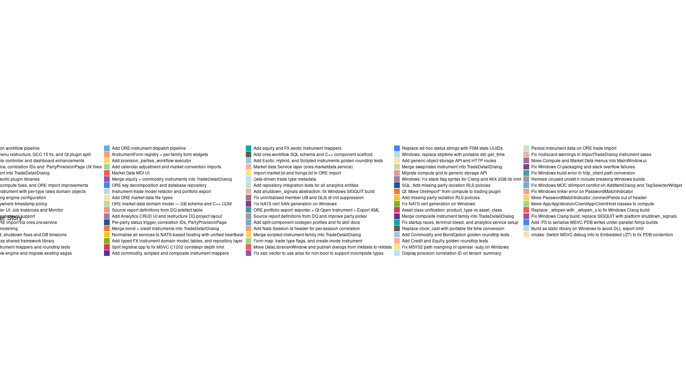
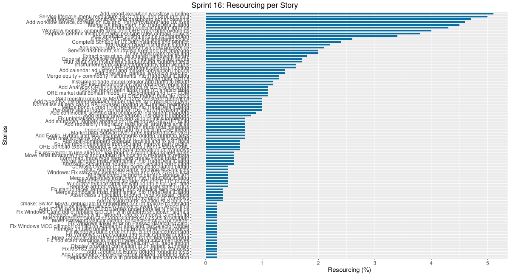
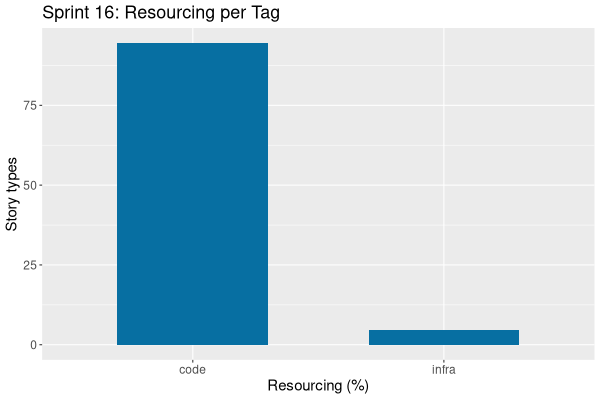

:PROPERTIES:
:ID: 9CE4BE1F-0D57-4927-8344-E66CBC72D882
:END:
#+title: Sprint Backlog 16
#+options: <:nil c:nil ^:nil d:nil date:nil author:nil toc:nil html-postamble:nil
#+todo: STARTED | COMPLETED CANCELLED POSTPONED BLOCKED
#+tags: { code(c) infra(i) analysis(n) agile(a) }
#+startup: inlineimages

* Sprint Mission

- TBD.

* Stories

** Active

#+begin: clocktable :maxlevel 3 :scope subtree :tags t :indent nil :emphasize nil :scope file :narrow 75 :formula % :block today
#+TBLNAME: today_summary
#+CAPTION: Clock summary at [2026-03-30 Mon 18:01], for Monday, March 30, 2026.
|      | <75>                                      |        |      |      |       |
| Tags | Headline                                  | Time   |      |      |     % |
|------+-------------------------------------------+--------+------+------+-------|
|      | *Total time*                              | *0:00* |      |      | 100.0 |
#+end:

#+begin: clocktable :maxlevel 3 :scope subtree :tags t :indent nil :emphasize nil :scope file :narrow 75 :formula %
#+TBLNAME: sprint_summary
#+CAPTION: Clock summary at [2026-03-30 Mon 18:01]
|       | <75>                                                     |         |       |      |       |
| Tags  | Headline                                                 | Time    |       |      |     % |
|-------+----------------------------------------------------------+---------+-------+------+-------|
|       | *Total time*                                             | *0:00*  |       |      | 100.0 |
#+end:

#+name: pie-stories-chart
#+begin_src R :var sprint_summary=sprint_summary :colnames yes :results file graphics :exports results :file sprint_backlog_16_stories_pie_sorted.png :width 1920 :height 1080
library(conflicted)
library(ggplot2)
library(tidyverse)
library(tibble)

# Filter to only rows with actual story data (non-empty Tags column)
clean_sprint_summary <- sprint_summary %>% dplyr::filter(!is.na(Tags) & nzchar(Tags))
stories <- unlist(clean_sprint_summary[2])
percent_values <- as.numeric(unlist(clean_sprint_summary[6]))

# Create a data frame and explicitly sort the stories by defining factor levels
df <- data.frame(
  stories = stories,
  percent = percent_values
) %>%
  # 1. Sort the data frame by percentage in descending order
  arrange(desc(percent)) %>%
  # 2. Convert 'stories' to a factor, setting the levels based on the sorted order.
  # This makes the order of the slices explicit for ggplot.
  mutate(
    stories = factor(stories, levels = stories),
    lab.pos = cumsum(percent) - 0.5 * percent
  )

# Manually selected colors to resemble the screenshot
custom_palette <- c(
  "#21518f", "#f37735", "#ffc425", "#81b214", "#d7385e",
  "#662e91", "#00a9ae", "#5c5c5c", "#a0c6e0", "#f8b195",
  "#ffe385", "#bde0fe", "#c5e0d4", "#e0b8a0", "#a56f8f",
  "#7a448a", "#4a9a9b", "#9b9b9b", "#6fa8dc", "#f7a072",
  "#ffd166", "#99d98c", "#ef5d60", "#9d529f", "#3a86ff",
  "#c1d6e1", "#f9e0ac", "#c2d6a4", "#e69a8d", "#a07d9f"
)

# Ensure the palette has enough colors for all stories.
if (length(custom_palette) < length(df$stories)) {
  warning("Not enough custom colors for all stories. Colors will repeat.")
  custom_palette <- rep(custom_palette, length.out = length(df$stories))
}

p <- ggplot(df, aes(x = "", y = percent, fill = stories)) +
  geom_bar(width = 1, stat = "identity") +
  coord_polar("y", start = 0) +
  scale_fill_manual(values = custom_palette) +
  ggtitle("Sprint 16: Resourcing per Story")  +
  labs(x = NULL, y = NULL, fill = "Stories") +
  theme_minimal() +
  theme(
    axis.text.x = element_blank(),
    panel.grid.major = element_blank(),
    panel.grid.minor = element_blank(),
    plot.title = element_text(hjust = 0.5, size = 18),
    legend.position = "right",
    legend.title = element_text(size = 14),
    legend.text = element_text(size = 12)
  )

print(p)
#+end_src

#+RESULTS: pie-stories-chart

#+name: stories-chart
#+begin_src R :var sprint_summary=sprint_summary :colnames yes :results file graphics :exports results :file sprint_backlog_16_stories.png :width 1200 :height 650
library(conflicted)
library(grid)
library(tidyverse)
library(tibble)

# Filter to only rows with actual story data (non-empty Tags column)
clean_sprint_summary <- sprint_summary %>% dplyr::filter(Tags != "")
names <- unlist(clean_sprint_summary[2])
values <- as.numeric(unlist(clean_sprint_summary[6]))

# Create a data frame.
df <- data.frame(
  cost = values,
  stories = factor(names, levels = names[order(values, decreasing = FALSE)]),
  y = seq(length(names)) * 0.9
)

# Setup the colors
blue <- "#076fa2"

p <- ggplot(df) +
  aes(x = cost, y = stories) +
  geom_col(fill = blue, width = 0.6) +
  ggtitle("Sprint 16: Resourcing per Story") +
  xlab("Resourcing (%)") + ylab("Stories") +
  theme(text = element_text(size = 15))

print(p)
#+end_src

#+RESULTS: stories-chart

#+name: tags-chart
#+begin_src R :var sprint_summary=sprint_summary :colnames yes :results file graphics :exports results :file sprint_backlog_16_tags.png :width 600 :height 400
library(conflicted)
library(grid)
library(tidyverse)
library(tibble)

clean_sprint_summary <- sprint_summary %>% dplyr::filter(Tags != "")
names <- unlist(clean_sprint_summary[1])
values <- as.numeric(unlist(clean_sprint_summary[6]))

df <- data.frame(
  cost = values,
  tags = names,
  y = seq(length(names)) * 0.9
)

df2 <- setNames(aggregate(df$cost, by = list(df$tags), FUN = sum), c("cost", "tags"))

blue <- "#076fa2"

p <- ggplot(df2) +
  aes(x = cost, y = tags) +
  geom_col(fill = blue, width = 0.6) +
  ggtitle("Sprint 16: Resourcing per Tag") +
  xlab("Resourcing (%)") + ylab("Story types") +
  theme(text = element_text(size = 15))

print(p)
#+end_src

#+RESULTS: tags-chart

*** TODO Distributed tracing: OpenTelemetry identifiers across Qt and NATS :analysis:

*Background*

OreStudio currently uses a single =Nats-Correlation-Id= header (UUID v4) that
is generated at the workflow service entry point and propagated to downstream
NATS calls. This lets you grep logs for a single workflow invocation, but it
does not answer two important questions:

1. *Which user session originated this request?* A single session may trigger
   dozens of top-level requests (bundle list, bundle install, party provision,
   bootstrap clear); there is no way to group them under one session identity.
2. *Which specific operation within the session is this?* Each Qt wizard step
   is a distinct user action; the current ID is generated server-side so the
   client cannot know it before the response arrives.

Furthermore, the relationship between the Qt client subsystem and the NATS
microservices subsystem is opaque: a log line in =ores.refdata= has no link
back to the Qt button click that ultimately caused it.

*OpenTelemetry trace model*

The W3C =traceparent= standard defines four fields carried in every call:

| Field       | Size     | Generated by       | Meaning                                          |
|-------------+----------+--------------------+--------------------------------------------------|
| version     | 1 byte   | fixed =00=         | Format version                                   |
| trace-id    | 16 bytes | originating client | One UUID for the entire top-level user action    |
| parent-id   | 8 bytes  | caller of this hop | The span ID of the *caller*, linking parent↔child|
| span-id     | 8 bytes  | this service       | Unique ID for this service's handling of the call|
| flags       | 1 byte   | originating client | Sampling decision                                |

Wire format: =traceparent: 00-<trace-id>-<parent-id>-<flags>=

Example call tree for =workflow.v1.parties.provision=:

#+begin_example
Qt client           trace=aabbcc  span=0001  parent=0000  (root span, generated by Qt)
  → workflow        trace=aabbcc  span=0002  parent=0001
    → refdata.save  trace=aabbcc  span=0003  parent=0002
    → iam.save      trace=aabbcc  span=0004  parent=0002
    → iam.add-party trace=aabbcc  span=0005  parent=0002
#+end_example

This allows reconstruction of the exact call tree from logs alone.

*What needs to change*

Two subsystems need to be joined:

1. *Qt client* — generates the root =trace-id= and the first =span-id= at the
   point of user action (button click / wizard Next). Passes both in every
   outgoing NATS message. Currently generates nothing.

2. *NATS microservices* — each handler extracts =traceparent=, records the
   =parent-id= (caller's span), generates a new =span-id= for itself, and
   forwards an updated =traceparent= (same =trace-id=, its own =span-id= as
   new =parent-id=) on every outbound NATS call.

In addition, a *session ID* (separate from trace/span) should be generated
once on login and attached to every request for the lifetime of that session,
enabling queries like "show all requests from user alice during session X".

Proposed NATS header set:

| Header              | Meaning                                         | Generated by         |
|---------------------+-------------------------------------------------+----------------------|
| =Nats-Correlation-Id= | Current per-operation ID (keep for compat)      | First handler        |
| =traceparent=         | W3C OpenTelemetry trace-id + span-id + parent   | Qt client / handler  |
| =Nats-Session-Id=     | UUID for the user's login session               | Qt client on login   |

*Scope of this story*

This story covers *analysis and design only*. Output: a plan document under
=doc/plans/= that specifies:

- Which headers to carry on every NATS message.
- How the Qt =ClientManager= generates and propagates =traceparent= and
  =Nats-Session-Id=.
- How =handler_helpers.hpp= is extended so =log_handler_entry= extracts,
  logs, and forwards all three headers in one call.
- Whether to retain =Nats-Correlation-Id= (backward compat) or replace it.
- What a =Nats-Session-Id= should be tied to (login token? UI session UUID?).
- The migration path: handlers currently log =correlation_id=; how to move to
  =traceparent= without breaking existing log grep patterns.
- Whether to integrate with an external OpenTelemetry collector (Jaeger /
  Tempo) or keep tracing in-process via log aggregation.

Implementation can follow as a separate story once the design is agreed.

***** Tasks

- [ ] Research W3C =traceparent= / =tracestate= spec and NATS header limits
- [ ] Identify all Qt entry points that should generate a root span (wizard
      steps, dialog confirms, background refresh calls)
- [ ] Identify all NATS handler hops that need span generation and forwarding
- [ ] Define the session ID lifecycle: created on login, invalidated on logout,
      stored in =ClientManager=
- [ ] Decide: replace =Nats-Correlation-Id= or keep alongside =traceparent=
- [ ] Decide: structured log fields vs free-text grep-friendly format
- [ ] Write =doc/plans/= document with the agreed design and migration steps

*** TODO Three-level provisioning: end-to-end testing                  :code:

End-to-end test of the complete three-level provisioning flow implemented
across PRs #582, #611, #614, #619, and the correlation ID / summary page
work on =feature/three-level-provisioning-e2e=. Branch:
=feature/three-level-provisioning-e2e=.

***** Tasks

- [ ] Provision a fresh tenant from scratch (recreate DB, start services)
- [ ] Log in as system admin; verify =TenantProvisioningWizard= fires
- [ ] Step through bundle selection and install; verify DQ bundle published
- [ ] Step through =PartyProvisionPage=; verify party + account created in DB
      with =status='Inactive'=
- [ ] Verify correlation ID appears on the summary page and matches
      =ores_workflow_workflow_instances_tbl.correlation_id=
- [ ] Verify bootstrap flag cleared; wizard does not reappear on next login
- [ ] Log in as the provisioned party admin; verify =PartyProvisioningWizard= fires
- [ ] Complete party wizard; verify party =status= set to =Active= in DB
- [ ] Verify =PartyProvisioningWizard= does not reappear on subsequent logins
- [ ] Verify compensation: force failure in each of the 3 workflow steps and
      confirm rolled-back state in DB for party, account, account_party
- [ ] Verify =Nats-Correlation-Id= header propagated to =refdata.v1.parties.save=
      and =iam.v1.accounts.save= (check server logs)

*** TODO Provisioned accounts: force password reset on first login       :code:

When =workflow.v1.parties.provision= creates an account it should set
=password_reset_required = true= so the party admin is forced to change the
initial password on first login. See Phase 4 in
[[file:../../plans/2026-03-30-three-level-provisioning-and-workflow-service.md][plan]].

***** Tasks

- [ ] Add =password_reset_required= column to =ores_iam_accounts_tbl= (or reuse
      existing field if present)
- [ ] =provision_parties_workflow=: set flag when creating account
- [ ] =auth_handler.hpp=: return =password_reset_required= in =login_response=
      if account flag is set, and reject login with a specific error code
- [ ] Qt: show password-change dialog on login when flag is set
- [ ] Clear flag on successful password change

*** TODO Multi-select LEI picker for PartyProvisionPage                  :code:

=LeiEntityPicker= currently supports single selection. Extend to multi-select
so the tenant admin can pick the full GLEIF hierarchy (root + subsidiaries)
in one pass, creating one =provision_party_input= entry per selected LEI.
See Phase 4 in
[[file:../../plans/2026-03-30-three-level-provisioning-and-workflow-service.md][plan]].

***** Tasks

- [ ] Extend =LeiEntityPicker= to support multi-select mode
- [ ] =PartyProvisionPage=: iterate selected LEIs, build one input row per LEI
- [ ] Derive =principal= per party (=username_base + "_" + short_code=)
- [ ] Show per-party rows in the page with optional credential override fields
- [ ] Summary page: list all provisioned usernames and their party names

*** TODO Async workflow progress for large party hierarchies             :code:

For tenants with more than ~20 parties the synchronous =provision-parties=
endpoint will time out. Add an async path: return =workflow_id= immediately
and poll =workflow.v1.status= from a progress page. See Phase 4 in
[[file:../../plans/2026-03-30-three-level-provisioning-and-workflow-service.md][plan]].

***** Tasks

- [ ] Add =workflow.v1.status= NATS subject + request/response types
- [ ] =workflow_handler=: implement status query by workflow ID
- [ ] Add async variant of =provision_parties_response= (returns =workflow_id= only)
- [ ] Qt: add =BundleInstallPage=-style async progress page in
      =TenantProvisioningWizard= with polling timer
- [ ] Threshold: use async path when =parties.size() > 5= (configurable)

*** TODO IAM/Refdata service boundary cleanup                            :code:

=ores.iam.core= currently crosses the service boundary in two places. These
are pre-existing violations noted in the plan and must be fixed to ensure
correct RLS enforcement and clean service ownership. See "Known pre-existing
violations" in
[[file:../../plans/2026-03-30-three-level-provisioning-and-workflow-service.md][plan]].

***** Tasks

- [ ] =bootstrap_handler.hpp=: replace direct =ores_refdata_parties_tbl= write
      with =refdata.v1.parties.save= NATS call
- [ ] =auth_handler.hpp=: replace direct =ores_refdata_parties_tbl= query
      (=auth_lookup_party=) with =refdata.v1.parties.get-by-principal= NATS call
      (add endpoint to =ores.refdata= if missing)
- [ ] Verify RLS policies still enforced end-to-end after refactor
- [ ] Remove cross-schema table includes from =ores.iam.core= CMake deps

*** TODO DQ/Refdata service boundary cleanup                             :code:

DQ bundle publication currently writes directly to =ores_refdata_*= tables.
This must be routed via =refdata.v1.*= NATS endpoints. See "Open Questions"
in [[file:../../plans/2026-03-30-three-level-provisioning-and-workflow-service.md][plan]].

***** Tasks

- [ ] Identify all direct =ores_refdata_*= writes inside =ores.dq= publication
      pipeline
- [ ] Add any missing =refdata.v1.*= NATS endpoints needed by DQ
- [ ] Rewrite DQ publication to use NATS calls instead of direct DB writes
- [ ] Verify bundle publish end-to-end after refactor
- [ ] Remove cross-schema table includes from =ores.dq= CMake deps

*** TODO Extend ores.workflow: trade-expiry workflow                     :code:

First financial workflow in =ores.workflow=: expire a trade and cascade to
positions, P&L reporting and scheduler cleanup. See Phase 5 in
[[file:../../plans/2026-03-30-three-level-provisioning-and-workflow-service.md][plan]].

***** Tasks

- [ ] Add =workflow.v1.trade-expiry= NATS subject + request/response types
- [ ] Implement =trade_expiry_workflow= executor (4 steps + compensation)
      - Step 1: =trading.v1.trades.expire=
      - Step 2: =risk.v1.positions.update=
      - Step 3: =reporting.v1.runs.trigger-pnl=
      - Step 4: =scheduler.v1.jobs.remove=
- [ ] Register in =workflow_handler= and =registrar.cpp=
- [ ] Qt: trigger from trade blotter context menu ("Expire trade")
- [ ] Integration test: verify all 4 steps and compensation

*** TODO Extend ores.workflow: barrier-event workflow                    :code:

Second financial workflow: apply a knock-in/out barrier event to a trade and
cascade to Greeks recomputation and reporting. See Phase 5 in
[[file:../../plans/2026-03-30-three-level-provisioning-and-workflow-service.md][plan]].

***** Tasks

- [ ] Add =workflow.v1.barrier-event= NATS subject + request/response types
- [ ] Implement =barrier_event_workflow= executor (3 steps + compensation)
      - Step 1: =trading.v1.trades.apply-barrier-event=
      - Step 2: =risk.v1.greeks.recompute=
      - Step 3: =reporting.v1.runs.trigger=
- [ ] Register in =workflow_handler= and =registrar.cpp=
- [ ] Qt: trigger from trade detail dialog when barrier condition is met
- [ ] Integration test: verify all 3 steps and compensation

*** TODO Positions domain model                                        :code:

Implement the positions domain model. A position aggregates the net exposure
for a given instrument and book combination, derived from the trade blotter.
See [[file:../../plans/2026-03-31-ore-trading-instrument-support.org][plan]] for context.

Covers long/short positions across all instrument families, backed by one new
temporal table: =ores_trading_positions_tbl= (book_id, instrument_id,
trade_type_code, quantity, notional, currency, as_of_date, and standard
temporal/audit fields).

***** Tasks

- [ ] SQL: =ores_trading_positions_tbl= + notify trigger + drop files
- [ ] SQL: Register in =trading_create.sql=, =drop_trading.sql=
- [ ] Domain: =position= struct, JSON I/O, table I/O, protocol messages
- [ ] Repository: =position= entity, mapper, repository
- [ ] Service: =position_service=
- [ ] Server: messaging handler + registrar registration
- [ ] Qt UI: =ClientPositionModel=, =PositionMdiWindow=, =PositionDetailDialog=,
  =PositionHistoryDialog=, =PositionController=, =MainWindow= integration
- [ ] Database: recreate to pick up new table

*** TODO Source report definitions from DQ instead of hardcoded C++   :code:

*Background*

Report definitions in =PartyProvisioningWizard= are currently hardcoded as a
=constexpr std::array= in C++ (=PartyProvisioningWizard.cpp=, ~line 427). This
is architecturally inconsistent with how all other seedable reference data is
handled in OreStudio, which uses the DQ artefact pipeline:

- A staging table (=dq_*_artefact_tbl=) holds the source data
- An artefact type entry in =ores_dq_artefact_types_tbl= maps staging → target
  + publish function
- A dataset (e.g. =ore.report_definitions=) references the staging table
- Bundles (=organisation=, or a new =ore_analytics= bundle) group datasets
- The publish function copies approved rows into the target table

Business units, portfolios, and books already follow this pattern. Report
definitions do not, causing two problems:

1. *Off-by-one fragility*: the array was declared =std::array<ReportEntry, 28>=
   with only 27 entries, producing a zero-initialised trailing entry with
   =name = ""=. This triggered a DB check constraint violation during party
   provisioning (fixed as a stopgap by changing the array size to 27).
2. *Non-evolvable*: adding, renaming, or adjusting a report definition requires
   a C++ recompile and new release. There is no way to update defaults via data
   tooling or deliver them as part of a bundle update.

*Target architecture*

#+begin_example
SQL seed data (populate script)
  → ores_dq_report_definitions_artefact_tbl   (staging)
    → ores_dq_report_definitions_publish_fn   (publish function)
      → ores_reporting_report_definitions_tbl (target, party-scoped)
#+end_example

The =PartyProvisioningWizard= loads candidate definitions by querying the DQ
artefact table for the selected bundle, presents them with checkboxes (same UX
as today), and on confirmation calls the existing
=reporting.v1.report-definitions.save= endpoint for each selected entry. The
hardcoded =k_default_reports= array is deleted.

*Scope*

This story covers the full stack end-to-end: SQL schema, DQ pipeline, seed
data, and Qt wizard refactor.

***** Tasks

- [ ] SQL: create =ores_dq_report_definitions_artefact_tbl= with columns
      =name=, =description=, =report_type=, =schedule_expression=,
      =concurrency_policy=, =display_order= plus standard DQ audit/temporal
      fields; add to =dq_create.sql= and =drop_dq.sql=
- [ ] SQL: write =ores_dq_report_definitions_publish_fn= that inserts approved
      artefact rows into =ores_reporting_report_definitions_tbl= scoped to the
      calling party (mirrors =ores_dq_books_publish_fn= pattern)
- [ ] SQL: register the new artefact type =report_definitions= in
      =dq_artefact_types_populate.sql= pointing at the staging table, target
      table, and publish function
- [ ] SQL: create seed populate script
      =populate/reporting/reporting_report_definitions_populate.sql= with the
      27 standard ORE analytics definitions (migrate from =k_default_reports=)
      and wire it into the reporting populate orchestrator
- [ ] SQL: add a new bundle =ore_analytics= (or extend =organisation=) in
      =dq_dataset_bundle_populate.sql= and register the
      =ore.report_definitions= dataset as a member
- [ ] API: add =get_report_definition_templates_request/response= to
      =ores.reporting.api= (or reuse the DQ artefact list endpoint) so the Qt
      client can fetch candidates without a direct DB query
- [ ] Qt: refactor =PartyReportSetupPage= to load report definition candidates
      from the API call above on =initializePage()= instead of iterating
      =k_default_reports=; remove the =constexpr= array entirely
- [ ] Qt: handle async load in =PartyReportSetupPage=: show a spinner while
      fetching, populate the list widget on success, show an error label on
      failure
- [ ] SQL: recreate database to pick up new tables and seed data; verify
      27 artefact rows present in staging table after =populate= run
- [ ] End-to-end test: run party provisioning wizard, confirm report
      definitions created in =ores_reporting_report_definitions_tbl= match the
      selected artefacts, confirm no check constraint violations

*** TODO Unify asset class modelling across trading and market data     :analysis:

*Background*

Asset classes are currently modelled independently — and inconsistently — in
three places, with no shared source of truth:

1. *Trading domain* (=ores.trading=): =instrument_family_t= is a hard-coded
   PostgreSQL =CREATE TYPE … AS ENUM= with eight values (=swap=, =fx=, =bond=,
   =credit=, =equity=, =commodity=, =composite=, =scripted=). Extending it
   requires a DDL =ALTER TYPE= migration and a C++ recompile.
   File: =projects/ores.sql/create/trading/trading_instrument_family_type_create.sql=

2. *Market data domain* (=ores.marketdata=): =asset_class= is a hard-coded C++
   enum (=fx=, =rates=, =credit=, =equity=, =commodity=, =inflation=, =bond=,
   =cross_asset=) serialised as an unconstrained =TEXT= column in
   =ores_marketdata_series_tbl=. No database-level validation exists; any
   string is accepted.
   Files: =projects/ores.marketdata.api/include/ores.marketdata.api/domain/asset_class.hpp=,
   =projects/ores.marketdata.core/src/repository/market_series_mapper.cpp=

3. *Refdata domain* (=ores_refdata_asset_classes_tbl=): a proper bitemporal
   reference table already exists, complete with a validation function
   (=ores_refdata_validate_asset_class_fn=) and a DQ publish pipeline.
   However it is seeded with FpML PascalCase codes (="Commodity"=,
   ="ForeignExchange"=, etc.) — a different namespace from both the trading
   enum and the market data enum — so it cannot serve as a shared source of
   truth without first seeding the ORE codes.
   Files: =projects/ores.sql/create/refdata/refdata_asset_classes_create.sql=,
   =projects/ores.sql/populate/fpml/fpml_asset_class_artefact_populate.sql=

4. *Qt client* (=ores.qt=): =ClientMarketSeriesModel= hard-codes the eight
   display labels in C++; =MarketSeriesMdiWindow= hard-codes filter combo
   entries. Any new asset class requires changes in at least four files across
   two subsystems.
   Files: =projects/ores.qt/src/ClientMarketSeriesModel.cpp=,
   =projects/ores.qt/src/MarketSeriesMdiWindow.cpp=

*Complete reconciliation audit*

The following table captures every representation of the asset class concept
currently in the codebase:

| ORE concept  | C++ enum              | DB stored as      | FpML code            | Qt label      |
|--------------+-----------------------+-------------------+----------------------+---------------|
| FX           | =asset_class::fx=     | ="fx"=            | =ForeignExchange=    | ="FX"=        |
| Rates        | =asset_class::rates=  | ="rates"=         | =InterestRate=       | ="Rates"=     |
| Credit       | =asset_class::credit= | ="credit"=        | =Credit=             | ="Credit"=    |
| Equity       | =asset_class::equity= | ="equity"=        | =Equity=             | ="Equity"=    |
| Commodity    | =asset_class::commodity= | ="commodity"=  | =Commodity=          | ="Commodity"= |
| Inflation    | =asset_class::inflation= | ="inflation"=  | /(not seeded)/       | ="Inflation"= |
| Bond         | =asset_class::bond=   | ="bond"=          | /(not seeded)/       | ="Bond"=      |
| Cross Asset  | =asset_class::cross_asset= | ="cross_asset"= | /(not seeded)/    | ="Cross Asset"= |

Trading-only =instrument_family_t= values that have no asset class counterpart:

| DB ENUM value  | Meaning                                         |
|----------------+-------------------------------------------------|
| =swap=         | Instrument structure / routing discriminator   |
| =composite=    | Instrument architecture                         |
| =scripted=     | Instrument architecture                         |

*Key finding: =instrument_family= and =asset_class= are different concepts*

=swap=, =composite=, and =scripted= are /instrument structures/ used by the
trading layer to route a trade to its product-specific extension table. They
are not risk classifications. A swap can belong to the =rates=, =credit=, or
=equity= asset class; the instrument family just says it /is/ a swap. The
overlap of names (=fx=, =bond=, =credit=, =equity=, =commodity=) is
coincidental — in the trading schema they identify instrument subtables, not
risk buckets. These two concepts should remain separate; the goal is to unify
the /asset class/ taxonomy only, not to merge it with instrument routing.

*Infrastructure that already exists*

The refdata infrastructure was clearly designed for exactly this unification:

- =ores_refdata_asset_classes_tbl= — bitemporal table with =code= + =coding_scheme_code= PK,
  allowing multiple namespaces (ORE codes and FpML codes) to coexist.
- =ores_refdata_validate_asset_class_fn(tenant_id, value)= — validation
  function, fully implemented but /not called/ from the market data insert
  trigger.
- =ores_dq_asset_classes_publish_fn= — DQ publish function that copies
  approved artefact rows into the refdata table.
- Notify trigger on =ores_refdata_asset_classes_tbl= — already wired for
  event-driven cache invalidation.

All that is missing is: (a) seeding the ORE codes into the DQ artefact table,
(b) calling the validation function from the =market_series= insert trigger,
and (c) a NATS endpoint so the Qt client can fetch the list dynamically.

*Why this matters*

- *No single source of truth.* The same concept is expressed three different
  ways (C++ enum, DB text, FpML string, Qt label) with no enforcement linking
  them.
- *No database enforcement.* The =TEXT= column in =market_series= accepts any
  string; correctness depends entirely on C++ serialisation code.
- *FpML seeding is incomplete.* =inflation=, =bond=, and =cross_asset= have
  no FpML counterpart seeded; they would fail validation if the function were
  called today.
- *Hard to extend.* Adding a new asset class requires DDL, a C++ enum change,
  serialiser changes, and Qt label updates with no data-driven path.
- *Client/UI fragility.* Combo entries are duplicated string literals that
  can silently diverge from server-side values.

*Target architecture*

=ores_refdata_asset_classes_tbl= (already exists) becomes the single
source of truth:

#+begin_example
ores_refdata_asset_classes_tbl
  code TEXT + coding_scheme_code TEXT  →  composite PK

  coding_scheme_code = 'ORE'  (new, canonical):
    fx, rates, credit, equity, commodity, inflation, bond, cross_asset

  coding_scheme_code = 'FPML_ASSET_CLASS'  (already seeded, extend):
    Commodity, Credit, Equity, ForeignExchange, InterestRate,
    SecuritiesFinancing  +  add missing: Inflation, Bond

ores_marketdata_series_tbl.asset_class  TEXT
  → validated via ores_refdata_validate_asset_class_fn() in insert trigger
  → FK enforced at DB level

ores_trading_trades_tbl.instrument_family
  → keep as instrument_family_t PG ENUM — it is a routing discriminator,
     not an asset class; consider renaming to make the distinction clear

Qt client
  → load ORE asset classes from new refdata.v1.asset-classes.list endpoint
  → remove hardcoded labels from ClientMarketSeriesModel and MarketSeriesMdiWindow
#+end_example

*Scope of this story*

Analysis and design only. Output: a plan document under =doc/plans/= that
specifies:

- The canonical ORE asset class code set and how it relates to FpML codes
  (separate coding scheme, not a conflict).
- Whether =instrument_family_t= PG ENUM should be renamed to make explicit
  that it is a routing discriminator, not an asset class taxonomy.
- Migration path for =ores_marketdata_series_tbl.asset_class=: seed ORE
  codes in =ores_dq_asset_classes_artefact_tbl= with =coding_scheme_code = 'ORE'=,
  publish to =ores_refdata_asset_classes_tbl=, add validation function call
  in the =market_series= insert trigger.
- A new =refdata.v1.asset-classes.list= NATS endpoint so the Qt client can
  load the combo dynamically.
- How the C++ enums in =ores.marketdata.api= are kept in sync with the
  database codes (startup assertion or generated constant set from seed data).
- Whether =series_subclass= (currently also an unconstrained =TEXT= column
  with a C++ enum but no DB validation) warrants the same treatment.

***** Tasks

- [X] Audit all places where asset class / instrument family values are
      hard-coded: SQL enums, C++ enums, serialisers, Qt combo entries,
      seed data (done — see reconciliation table above)
- [X] Establish that =instrument_family= and =asset_class= are different
      concepts and should not be merged
- [X] Confirm that =ores_refdata_asset_classes_tbl= + validation function
      already provide the required infrastructure
- [ ] Decide canonical ORE code set string format (currently lowercase
      snake_case; confirm this is the preferred convention)
- [ ] Write populate script seeding ORE codes into
      =ores_dq_asset_classes_artefact_tbl= with =coding_scheme_code = 'ORE'=
      (8 rows: =fx=, =rates=, =credit=, =equity=, =commodity=, =inflation=,
      =bond=, =cross_asset=); wire into populate orchestrator
- [ ] Add missing FpML entries (=Inflation=, =Bond=) to
      =fpml_asset_class_artefact_populate.sql=
- [ ] Call =ores_refdata_validate_asset_class_fn= from the =market_series=
      insert/update trigger in =marketdata_series_create.sql=
- [ ] Design =refdata.v1.asset-classes.list= NATS endpoint (request/response
      types, handler, registration)
- [ ] Assess whether =series_subclass= needs the same treatment
- [ ] Write plan document capturing decisions and migration steps

*** TODO Add missing party isolation RLS policies                      :code:

Several tables have a =party_id= column and tenant-level RLS enabled, but are
missing the required =AS RESTRICTIVE= party isolation policy. These were
identified by the =RLS_002= check in =validate_schemas.sh= and added to
=validation_ignore.txt= as TODOs. Until the policies are added, a tenant admin
can query rows belonging to any party in the tenant.

For each table the fix is the same pattern: add an =AS RESTRICTIVE FOR SELECT=
policy using =party_id = ANY(ores_iam_visible_party_ids_fn())= in the
corresponding =*_rls_policies_create.sql= file, then remove the =RLS_002=
ignore entry from =validation_ignore.txt=.

Also covers hardening the trading instrument subtables (currently accessed
only via the parent =ores_trading_instruments_tbl= which has RLS, but direct
queries bypass it).

***** Tasks

- [ ] =ores_iam_account_parties_tbl=: add =AS RESTRICTIVE= party isolation
      policy in =iam_rls_policies_create.sql=
- [ ] =ores_refdata_business_units_tbl=: add =AS RESTRICTIVE= party isolation
      policy in =refdata_rls_policies_create.sql=
- [ ] =ores_refdata_party_contact_informations_tbl=: add =AS RESTRICTIVE= party
      isolation policy in =refdata_rls_policies_create.sql=
- [ ] =ores_refdata_party_countries_tbl=: add =AS RESTRICTIVE= party isolation
      policy in =refdata_rls_policies_create.sql=
- [ ] =ores_refdata_party_currencies_tbl=: add =AS RESTRICTIVE= party isolation
      policy in =refdata_rls_policies_create.sql=
- [ ] =ores_refdata_party_identifiers_tbl=: add =AS RESTRICTIVE= party
      isolation policy in =refdata_rls_policies_create.sql=
- [ ] =ores_scheduler_job_instances_tbl=: add =AS RESTRICTIVE= party isolation
      policy in =scheduler_rls_policies_create.sql=
- [ ] Trading instrument subtables: add =ENABLE ROW LEVEL SECURITY= + tenant
      isolation policies for =ores_trading_instruments_tbl= and all subtables
      (=bond=, =commodity=, =equity=, =fx=, =credit=, =scripted=, =composite=,
      =composite_legs=, =swap_legs=) in =trading_rls_policies_create.sql=
- [ ] For each fixed table: remove the corresponding =RLS_001= / =RLS_002=
      ignore entry from =utility/validation_ignore.txt=
- [ ] Run =validate_schemas.sh= and confirm zero warnings

* Footer

| Previous: [[id:0B23D554-23BA-11F1-9F0E-40B0768014EB][Sprint Backlog 15]] | Next: TBD |
