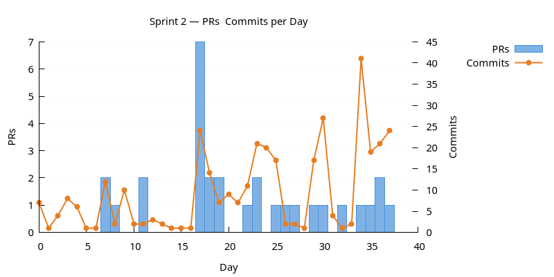
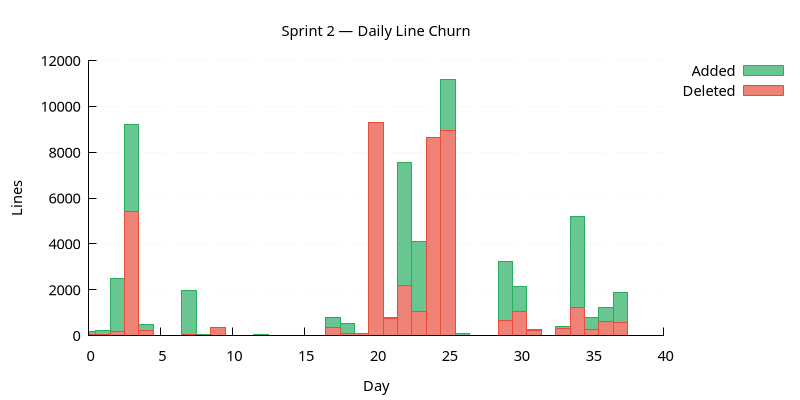
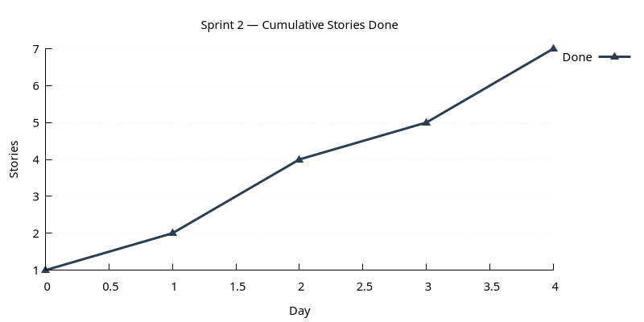

:PROPERTIES:
:ID: 8CBC2B51-E3D0-4320-8582-3CFD2F96537A
:END:
#+title: Sprint 02
#+description: Lay client/server foundations (cobalt, comms, messaging) and modernise serialisation and storage.
#+type: sprint
#+version: 2
#+level: s3
#+filetags: :client_server:serialisation:storage:v0:
#+created: 2025-08-01
#+updated: 2026-05-18
#+todo: STARTED | DONE

This page documents a [[id:0820B7FD-147C-4832-AC25-C043D38D5B61][sprint]] (*Sprint 02*) of ORE Studio v0. It captures the sprint's mission, current status, and the stories that compose it. For the surrounding context — version goals, sprint order, and product identity — see [[id:E6FD30ED-963E-4705-B414-91BF471C23D0][Version 0]].

* Mission

Lay the foundations for a client/server architecture and modernise the
project's serialisation and storage paths.

(Synthesised from the v0 mission: "Create basic project infrastructure"
plus "Add client and server support". The serialisation and storage work
was the largest single thread by time, so it is reflected in the mission
explicitly.)

* Status

| Field          | Value                                                                                                                      |
|----------------+----------------------------------------------------------------------------------------------------------------------------|
| State          | DONE                                                                                                                       |
| Parent version | [[id:E6FD30ED-963E-4705-B414-91BF471C23D0][Version 0]]                                                                     |
| Previous       | [[id:2CF90D10-890D-4CB0-A71B-5E8C3261BC54][Sprint 01]]                                                                     |
| Start          | 2025-02-02                                                                                                                 |
| End (expected) | 2025-10-23                                                                                                                 |
| Now            | Sprint closed 2025-10-23. Client/server foundations in place; serialisation and storage modernised; risk module extracted. |
| Waiting on     | Nothing.                                                                                                                   |
| Next           | [[id:3BC3B9ED-60C8-4A86-A6F1-925E58C74B6E][Sprint 03]]                                                                     |
| Release Notes  | —                                                                                                                          |
| Last touched   | 2025-10-23                                                                                                                 |

* Stories

#+ATTR_HTML: :class hug-leading
| Story                                                                            | State | Start      | End        | Theme                                                                                                                                        |
|----------------------------------------------------------------------------------+-------+------------+------------+----------------------------------------------------------------------------------------------------------------------------------------------|
| [[id:0FE2033D-180F-4195-A314-998917D570BE][Sprint 02 housekeeping]]              | DONE  |            | 2025-10-23 | sprint refinement, whiteboarding for the new architecture, dev-environment fixes, Gemini action.                                             |
| [[id:AC14558D-A526-4BE2-ADB6-81BCFE0E7292][Build stabilisation]]                 | DONE  |            | 2025-10-23 | Windows/macOS builds, vcpkg caching, Valgrind suppressions, broken-build firefighting.                                                       |
| [[id:145ADEDE-C3DD-4B51-AD3B-D6B5506C6C37][Client/server foundations]]           | DONE  |            | 2025-10-15 | cobalt-based server and client, =comms= library, messaging for risk. Records the GRPC and 0MQ experiments that were abandoned along the way. |
| [[id:1F9F213C-6BEA-45FB-B0E0-AA5A7A9B7A23][Modernise serialisation and storage]] | DONE  |            | 2025-10-10 | adopt reflect-cpp for JSON, replace XML parsing with reflect-cpp, use sqlgen for Postgres.                                                   |
| [[id:ED5BC735-FB54-4CE0-9A08-6DAB88C242D0][Currencies temporal and export]]      | DONE  |            | 2025-09-30 | temporal support for currencies, CLI dump command, a containing structure for ORE example data.                                              |
| [[id:6C63D2B2-7065-4AFC-AE54-86220C427B20][Risk module extraction]]              | DONE  |            | 2025-10-05 | rename =core= to =risk= and refactor the contents accordingly.                                                                               |
| [[id:CF13FFB1-4D84-4965-AD65-C38B1D4849AB][CLI refactor and test]]               | DONE  |            | 2025-10-10 | restructure the CLI to follow the new project layout and add tests to the CLI parser.                                                        |

* Charts

Charts generated via [[id:6F3D9B1A-5C7E-4A2D-8F1B-3C9D7E5F2A1B][sprint_charts cmake target]].

** PRs & Commits per Day

Dual-axis bar chart. PRs (left axis) and commits (right axis) per day.
A high commits-to-PR ratio may indicate scope creep.

** Daily Line Churn

Lines added (green) and deleted (red) per day. Building work produces
mostly additions; refactoring produces a mix. Days with no churn may
indicate blockers.

** Cumulative Stories Done

Line chart tracking stories marked DONE during the sprint.
Steady upward slope is healthy; plateauing signals a stall.

* Retrospective

Filled in retrospect, from the v0 record:

- /What worked/ :: the whiteboard-first approach to the client/server
  architecture paid off — once the picture was clear, the cobalt
  implementation came together quickly. Reflect-cpp dramatically
  reduced serialisation boilerplate.
- /What did not/ :: significant time was spent firefighting Windows
  and macOS build issues. The GRPC and 0MQ experiments were
  worthwhile architectural exploration but cost ~10 hours that
  produced no merged code.
- /Carry forward to v2/ :: the cancelled experiments are recorded as
  =ABANDONED= tasks rather than deleted — they document why we are
  *not* using GRPC or 0MQ. This is exactly the kind of provenance
  that is missing in the v0 model.
