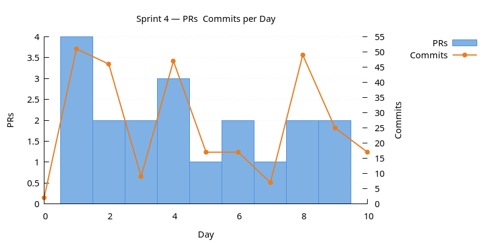
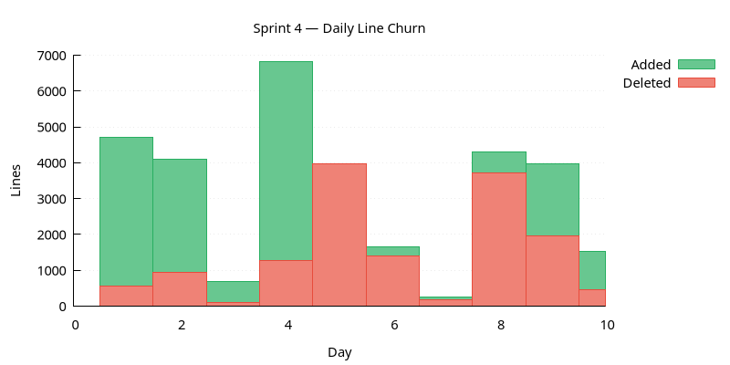
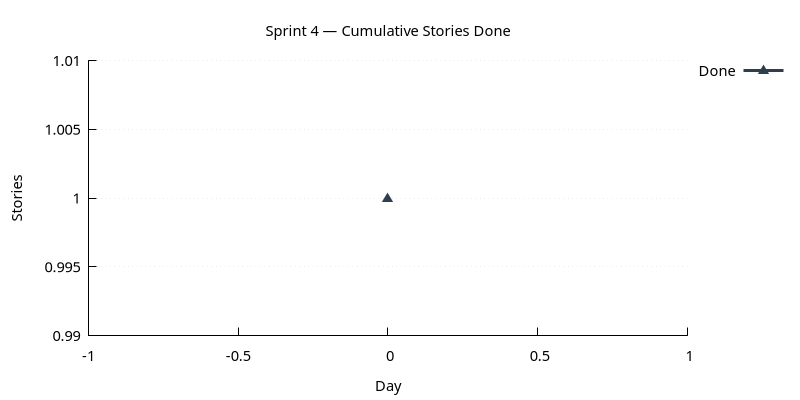

:PROPERTIES:
:ID: 38DAA167-E791-48FB-AFEB-1813615037DE
:END:
#+title: Sprint 04
#+description: LLM-driven code review and follow-on refactors; complete the currencies UI; introduce the Claude Code skills layer.
#+type: sprint
#+level: s3
#+filetags: :code_review:skills:currencies_ui:v0:
#+created: 2025-11-07
#+updated: 2025-11-30
#+todo: STARTED | DONE

This page documents a [[id:0820B7FD-147C-4832-AC25-C043D38D5B61][sprint]] (*Sprint 04*) of ORE Studio v0. It captures the
sprint's mission, current status, and the stories that compose it. For the
surrounding context — version goals, sprint order, and product identity — see
[[id:E6FD30ED-963E-4705-B414-91BF471C23D0][Version 0]].

* Mission

LLM-driven code review and follow-on refactors; complete the currencies
UI; introduce the Claude Code skills layer.

* Status

| Field          | Value         |
|----------------+---------------|
| State          | DONE          |
| Parent version | [[id:E6FD30ED-963E-4705-B414-91BF471C23D0][Version 0]]     |
| Previous       | [[id:3BC3B9ED-60C8-4A86-A6F1-925E58C74B6E][Sprint 03]]     |
| Start          | 2025-11-07    |
| End (expected) | 2025-11-16    |
| Now            | Nothing.      |
| Waiting on     | Nothing.      |
| Next           | [[id:2429DB80-EC7B-482C-9FF3-4D1933035863][Sprint 05]]     |
| Release Notes  | [[id:142E1574-03BE-435F-AABB-6E4504C32D28][Release notes]] |
| Last touched   | 2025-11-30    |

** Achievements

- LLM-driven review pass complete across the first three components.
- Currencies UI feature-complete.
- Claude Code skills layer established in the build.

* Stories

For the definitions of the themes see [[id:A064D838-F127-4DD6-BB42-9A7902039AEE][Themes]].

** Infrastructure

#+ATTR_HTML: :class hug-leading
| Story                         | State | Start |        End | Description |
|-------------------------------+-------+-------+------------+---------------------------------------------------------------------------------|
| [[id:A9055A54-AE06-4CC4-8B51-2CB9627E0D5A][Test infrastructure follow-up]] | DONE  |       | 2025-11-20 | successor of sprint 03's BLOCKED CTest item.                                    |
| [[id:C2E401C5-3F2B-4910-A91A-82DCF1B826E1][Build and packaging]]           | DONE  |       | 2025-11-20 | Windows install end-to-end, =localtime= fix, shutdown crash, sqlgen leak fixes. |

** Product

#+ATTR_HTML: :class hug-leading
| Story                  | State | Start |        End | Description |
|------------------------+-------+-------+------------+----------------------------------------------------------------------------------------|
| [[id:2A9269E4-049A-49C3-9354-F26C95390E1F][UI polish and branding]] | DONE  |       | 2025-11-22 | splash, Fluent icons, application icon, window-management defaults.                    |
| [[id:1E99EEE4-DCA5-4384-942E-0CE28B0A467C][Currencies UI]]          | DONE  |       | 2025-11-25 | export, edit, add, history, multi-select. Pattern-setter for later reference-data UIs. |

** LLMs

#+ATTR_HTML: :class hug-leading
| Story                           | State | Start |        End | Description |
|---------------------------------+-------+-------+------------+------------------------------------------------------------------|
| [[id:50B83CE1-6E12-44E7-AFEB-F6BAC09DDC14][Claude Code skills introduction]] | DONE  |       | 2025-11-15 | first skill, CMake deploy targets, weaving analysis.             |
| [[id:F8D6459D-71D3-4BAE-8ECE-43201CD2B8BA][LLM code review and refactor]]    | DONE  |       | 2025-11-28 | review pass + Dogen-layout restructure + per-component PlantUML. |

** Documentation

#+ATTR_HTML: :class hug-leading
| Story                | State | Start |        End | Description |
|----------------------+-------+-------+------------+--------------------------------------------------------------------------------|
| [[id:13E4F41F-82E1-400A-9C84-E60A587E2647][Documentation polish]] | DONE  |       | 2025-11-30 | website restructure following the weaving analysis, Doxygen main-page refresh. |

** Agile

#+ATTR_HTML: :class hug-leading
| Story                  | State | Start |        End | Description |
|------------------------+-------+-------+------------+------------------------------------------------------------|
| [[id:D0A1C624-DC57-424E-A958-279F68956976][Sprint 04 housekeeping]] | DONE  |       | 2025-11-30 | backlog refinement plus a new pie-chart resourcing report. |

* Charts

Charts generated via [[id:6F3D9B1A-5C7E-4A2D-8F1B-3C9D7E5F2A1B][sprint_charts cmake target]].

** PRs & Commits per Day

Dual-axis bar chart. PRs (left axis) and commits (right axis) per day.
A high commits-to-PR ratio may indicate scope creep.

** Daily Line Churn

Lines added (green) and deleted (red) per day. Building work produces
mostly additions; refactoring produces a mix. Days with no churn may
indicate blockers.

** Cumulative Stories Done

Line chart tracking stories marked DONE during the sprint.
Steady upward slope is healthy; plateauing signals a stall.

* Retrospective

- /What worked/ :: the LLM review pass produced enough actionable
  items to fill its own story plus follow-ons in successor sprints.
  The MASD-influenced weaving analysis turned out to be load-bearing
  — it's why doc_polish lands now and why the skills layer becomes a
  real build target rather than a side project.
- /What did not/ :: two long-tail items carry forward as =BLOCKED=
  again (CDash warning filters; macOS package via GitHub images).
  The split between currencies UI work and "UI polish" was fuzzier
  than it should have been — several entries plausibly belonged to
  either story.
- /Carry forward to v2/ :: the BLOCKED-then-resolved pattern (sprint
  03 → sprint 04 for the CTest item) is the first concrete use of
  the cross-sprint predecessor/successor link mechanism. Worth
  preserving in subsequent sprints.
