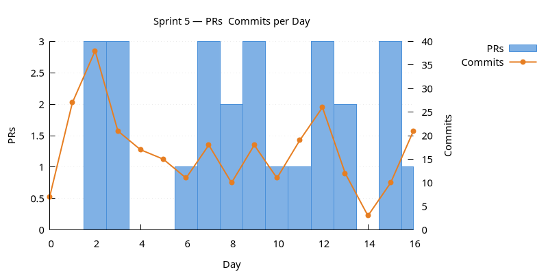
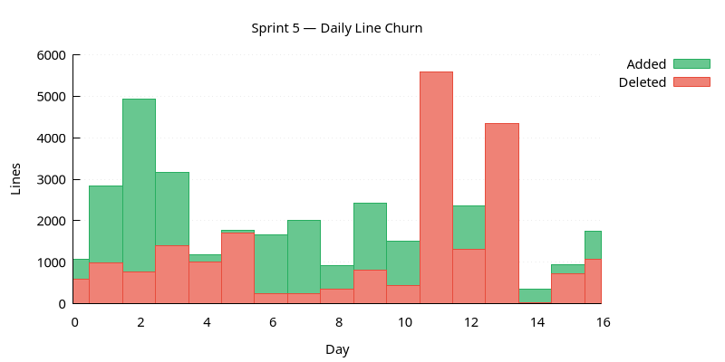
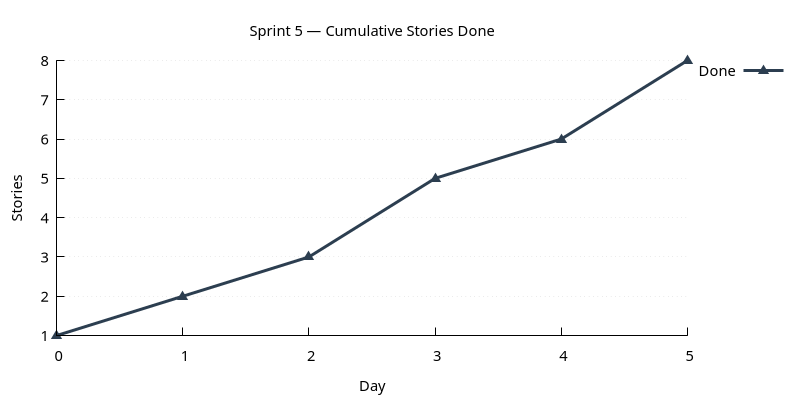

:PROPERTIES:
:ID: 2429DB80-EC7B-482C-9FF3-4D1933035863
:END:
#+title: Sprint 05
#+description: Implement the authentication bootstrap workflow; finish up domain-entity surfaces (currencies, accounts); expand the Claude Code skills layer.
#+type: sprint
#+version: 2
#+level: s3
#+filetags: :authentication:domain_entities:skills:v0:
#+created: 2025-11-16
#+updated: 2025-12-01
#+todo: STARTED | DONE

This page documents a [[id:0820B7FD-147C-4832-AC25-C043D38D5B61][sprint]] (*Sprint 05*) of ORE Studio v0. It captures the
sprint's mission, current status, and the stories that compose it. For the
surrounding context — version goals, sprint order, and product identity — see
[[id:E6FD30ED-963E-4705-B414-91BF471C23D0][Version 0]].

* Mission

Implement the authentication bootstrap workflow; finish up the
domain-entity surfaces (currencies, accounts); expand the Claude Code
skills layer.

* Status

| Field          | Value                                                                                                                                                                                                |
|----------------+------------------------------------------------------------------------------------------------------------------------------------------------------------------------------------------------------|
| State          | DONE                                                                                                                                                                                                 |
| Parent version | [[id:E6FD30ED-963E-4705-B414-91BF471C23D0][Version 0]]                                                                                                                                                                                            |
| Start          | 2025-11-16                             |
| End (expected) | 2025-12-01                             |
| Now            | Sprint closed 2025-12-01. Bootstrap workflow live; CLI/REPL reshape landed; currency messaging collapsed to =save_currency=; skills layer grew to cover sprint-opening and release-notes generation. |
| Waiting on     | None.                                                                                                                                                                                                |
| Next           | None.                                                                                                                                                                                                |
| Last touched   | 2025-12-01                                                                                                                                                                                           |

* Stories

#+ATTR_HTML: :class hug-leading
| Story                                                                           | State | Start      | End        | Theme                                                                                                   |
|---------------------------------------------------------------------------------+-------+------------+------------+---------------------------------------------------------------------------------------------------------|
| [[id:DE3EEE9F-331E-440C-B62C-ABDEFE1D87E2][Sprint 05 housekeeping]]             | DONE  |            | 2025-12-01 | backlog, AI sprint summary, OCR notebooks.                                                              |
| [[id:656EABB7-C9D1-4FDD-8CAC-0AB77ADCD9B2][Claude Code skills expansion]]       | DONE  |            | 2025-11-17 | new-sprint skill, release-notes skill, project-planning support.                                        |
| [[id:69C49095-A91F-41D9-9D7E-0E9478143E93][Valgrind leaks follow-up]]           | DONE  |            | 2025-11-25 | successor of sprint 03's OpenSSL BLOCKED item; sweeps up sqlgen residuals and comms-test leaks.         |
| [[id:A465D630-5972-484B-A2E8-AD1F91657103][Authentication bootstrap follow-up]] | DONE  |            | 2025-11-22 | successor of sprint 03's POSTPONED bootstrap workflow; adds delete-account and the feature-flags split. |
| [[id:645DF0B4-51B5-40BC-BE07-0AB986111653][Infrastructure features]]            | DONE  |            | 2025-11-20 | detached-mode default; database configuration unified across console and Qt.                            |
| [[id:7BE09D1C-E25A-4783-A911-C37DEC55CC43][CLI / REPL reshape]]                 | DONE  |            | 2025-11-25 | entity-first command syntax across CLI and REPL; synchronous REPL sockets.                              |
| [[id:9836E113-DEA9-4605-AE1B-9B0C955B6B73][Currencies UI polish]]               | DONE  |            | 2025-11-28 | JSON parsing, merged save_currency message, XML-import dialog.                                          |
| [[id:3A763AFB-22F3-4E9A-B121-A71997221C3F][Documentation and diagrams]]         | DONE  |            | 2025-12-01 | UML refresh after the reshape; per-component diagram links.                                             |

* Charts

Charts generated via [[id:6F3D9B1A-5C7E-4A2D-8F1B-3C9D7E5F2A1B][sprint_charts cmake target]].

** PRs & Commits per Day

Dual-axis bar chart. PRs (left axis) and commits (right axis) per day.
A high commits-to-PR ratio may indicate scope creep.

** Daily Line Churn

Lines added (green) and deleted (red) per day. Building work produces
mostly additions; refactoring produces a mix. Days with no churn may
indicate blockers.

** Cumulative Stories Done

Line chart tracking stories marked DONE during the sprint.
Steady upward slope is healthy; plateauing signals a stall.

* Retrospective

- /What worked/ :: the predecessor/successor mechanism finally got a
  proper workout — /two/ successor stories link back to sprint 03,
  with bidirectional =#+predecessor=/=#+successor= keywords on both
  ends and inline /Continued in/ notes. The pattern handles
  multiple-carryovers-from-the-same-predecessor cleanly.
- /What did not/ :: the merged-currency-messages work was a breaking
  protocol change and the Qt UI's response to the version mismatch
  was awful ("Failed to connect to server"). The fix took its own
  side-quest (see =infrastructure_features='s notes).
- /Carry forward to v2/ :: =POSTPONED: Troubleshoot skills in Claude=
  and =POSTPONED: Implement session cancellation= will become
  successor stories or product-backlog candidates in a later sprint.
