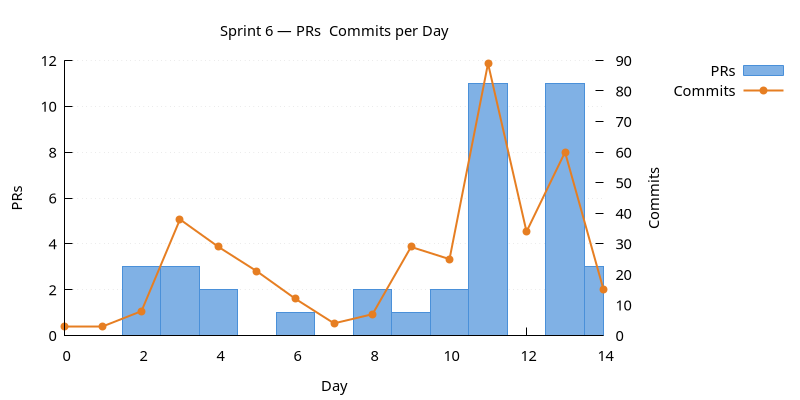
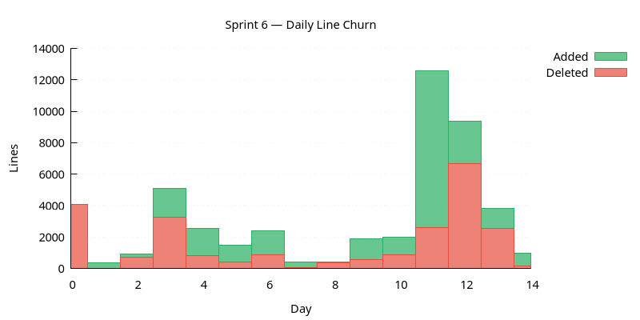
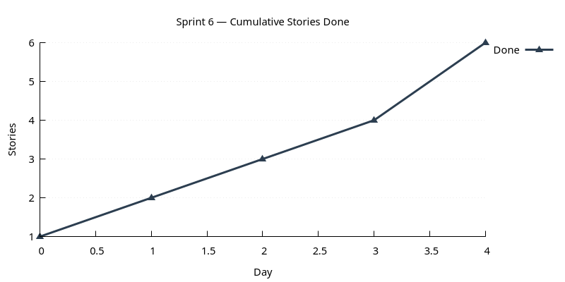

:PROPERTIES:
:ID: 06CB9D8B-92D5-4C51-A1D7-B73B22EB93E8
:END:
#+title: Sprint 06
#+description: Finish domain-entity follow-ups: session cancellation, feature-flag service, comms robustness; tidy bootstrap and logging.
#+type: sprint
#+version: 2
#+level: s3
#+filetags: :domain_entities:comms:variability:bootstrap:v0:
#+created: 2025-12-02
#+updated: 2025-12-15
#+todo: STARTED | DONE

This page documents a [[id:0820B7FD-147C-4832-AC25-C043D38D5B61][sprint]] (*Sprint 06*) of ORE Studio v0. It captures the
sprint's mission, current status, and the stories that compose it. For the
surrounding context — version goals, sprint order, and product identity — see
[[id:E6FD30ED-963E-4705-B414-91BF471C23D0][Version 0]].

* Mission

Finish domain-entity follow-ups (session cancellation, feature-flag
service); make the comms substrate production-ready; tidy bootstrap
and logging surfaces.

(The v0 mission had a second clause — /templatise domain entity
generation/ — that did /not/ land. The =Experiment with simple code
generation= entry was CANCELLED. Templatised generation reappears in
later sprints with the codegen-driven approach.)

* Status

| Field          | Value                                                                                                                                                                                                                                                                          |
|----------------+--------------------------------------------------------------------------------------------------------------------------------------------------------------------------------------------------------------------------------------------------------------------------------|
| State          | DONE                                                                                                                                                                                                                                                                           |
| Parent version | [[id:E6FD30ED-963E-4705-B414-91BF471C23D0][Version 0]]                                                                                                                                                                                                                         |
| Previous       | [[id:2429DB80-EC7B-482C-9FF3-4D1933035863][Sprint 05]]                                                                                                                                                                                                                         |
| Start          | 2025-12-01                                                                                                                                                                                                                                                                     |
| End (expected) | 2025-12-13                                                                                                                                                                                                                                                                     |
| Now            | Sprint closed 2025-12-15. Session cancellation live; variability is its own service; comms substrate has handshake/protocol split and retry; logging migrated to =std::string_view= (with the inevitable post-migration cleanup); two predecessor links from sprint 05 closed. |
| Waiting on     | Nothing.                                                                                                                                                                                                                                                                       |
| Next           | [[id:A79D42AF-1B38-43EE-9607-848A4A84C09A][Sprint 07]]                                                                                                                                                                                                                         |
| Release Notes  | [[id:8E209DC9-E432-4E2A-89AC-81A91E11A43D][Release notes]]                                                                                                                                                                                                                                                                              |
| Last touched   | 2025-12-15                                                                                                                                                                                                                                                                     |

* Stories

#+ATTR_HTML: :class hug-leading
| Story                                                                            | State | Start      | End        | Theme                                                                                                      |
|----------------------------------------------------------------------------------+-------+------------+------------+------------------------------------------------------------------------------------------------------------|
| [[id:193A779F-A313-414C-9236-D075B84A2F67][Sprint 06 housekeeping]]              | DONE  |            | 2025-12-15 | backlog, AI summary via the skill, OCR.                                                                    |
| [[id:4B50A7E5-D862-47A6-AEBE-353CAD55B058][Session lifecycle follow-up]]         | DONE  |            | 2025-12-04 | successor of sprint 05's authentication bootstrap; lands session cancellation + logout + client heartbeat. |
| [[id:88971AFE-E0B4-4E54-B0D7-B1C627C2F239][Comms robustness]]                    | DONE  |            | 2025-12-10 | split protocol, handshake service, multi-thread coverage, retry-with-give-up.                              |
| [[id:55C35962-46A0-4353-93AD-FC15BF847C7E][Variability service]]                 | DONE  |            | 2025-12-08 | feature-flag service end-to-end.                                                                           |
| [[id:D9C5FCEF-DA11-45DA-B7FB-2A7B62C8AA0B][Logging refactor (std::string_view)]] | DONE  |            | 2025-12-12 | migration + fallout.                                                                                       |
| [[id:50BB2ACB-5687-4BAD-B03A-12AF606E8EAB][Bootstrap polish]]                    | DONE  |            | 2025-12-13 | context to DB, drop bootstrap flag, manifest password-validation knob.                                     |
| [[id:06C56CA2-9846-4DC9-B2F3-271BF4F084CE][CLI entity syntax follow-up]]         | DONE  |            | 2025-12-13 | successor of sprint 05's CLI/REPL reshape; mops up snags and adds top-level shell login/logout.            |
| [[id:DBB7EEAB-C8E3-4AF9-B04F-E54FABD34A8F][Infrastructure features]]             | DONE  |            | 2025-12-15 | event bus, system tray, past-timepoint faker.                                                              |

* Charts

Charts generated via [[id:6F3D9B1A-5C7E-4A2D-8F1B-3C9D7E5F2A1B][sprint_charts cmake target]].

** PRs & Commits per Day

Dual-axis bar chart. PRs (left axis) and commits (right axis) per day.
A high commits-to-PR ratio may indicate scope creep.

** Daily Line Churn

Lines added (green) and deleted (red) per day. Building work produces
mostly additions; refactoring produces a mix. Days with no churn may
indicate blockers.

** Cumulative Stories Done

Line chart tracking stories marked DONE during the sprint.
Steady upward slope is healthy; plateauing signals a stall.

* Retrospective

- /What worked/ :: Boost.Asio session cancellation — initially planned
  as a tidy hierarchical-signal solution, broken by the one-slot-per-
  signal limitation, recovered via explicit session-list management.
  The /pivot caught in flight/ pattern is the right way to handle
  upstream surprises. Two cross-sprint successors closed cleanly.
- /What did not/ :: the second mission clause (/templatise domain
  entity generation/) didn't land. The codegen experiment was
  CANCELLED, and templatisation reappears later with the v2 codegen
  approach. Worth being more conservative about second mission
  clauses in future sprints.
- /Carry forward to v2/ :: the LISTEN/NOTIFY thread started here but
  the full client fan-out is incomplete; expect a successor story in
  a later sprint when the event bus gets its second consumer.
