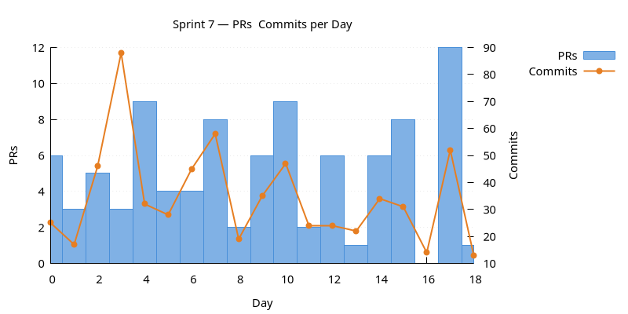
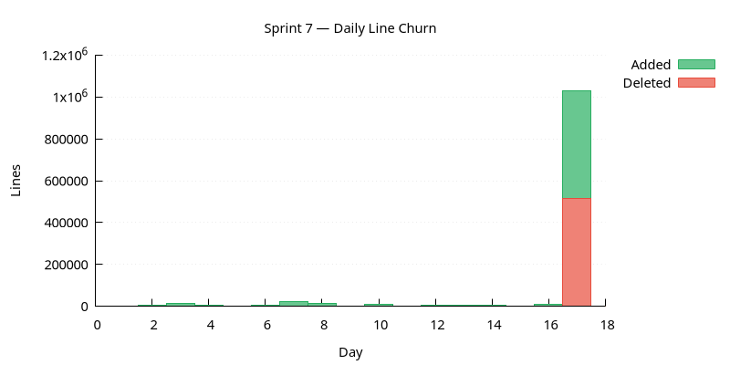
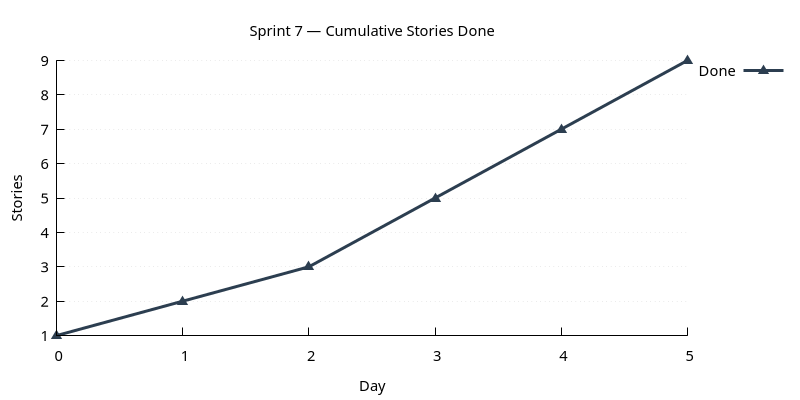

:PROPERTIES:
:ID: A79D42AF-1B38-43EE-9607-848A4A84C09A
:END:
#+title: Sprint 07
#+description: IAM rename, RBAC, currencies history polish, Qt UX polish, comms features, observability & telemetry components, Wt + HTTP introduction, build platform follow-up.
#+type: sprint
#+version: 2
#+level: s3
#+filetags: :iam:rbac:observability:wt:http:sprint_07:v0:
#+created: 2026-05-19
#+updated: 2026-05-19
#+todo: STARTED | DONE

This page documents a [[id:0820B7FD-147C-4832-AC25-C043D38D5B61][sprint]] (*Sprint 07*) of ORE Studio v0. It captures the
sprint's mission, current status, and the stories that compose it. For the
surrounding context — version goals, sprint order, and product identity — see
[[id:E6FD30ED-963E-4705-B414-91BF471C23D0][Version 0]].

* Mission

Broaden accounts into a proper IAM component, add RBAC on top, introduce
a second presentation tier (Wt + HTTP), stand up observability and
telemetry as first-class components, and tidy the build platform.

* Status

| Field          | Value                                                               |
|----------------+---------------------------------------------------------------------|
| State          | DONE                                                                |
| Parent version | [[id:E6FD30ED-963E-4705-B414-91BF471C23D0][Version 0]]                                                           |
| Start          | 2025-12-13                             |
| End (expected) | 2025-12-30                             |
| Now            | Sprint closed 2025-12-30.                                           |
| Waiting on     | None.                                                               |
| Next           | Sprint 08 picks up the threads opened by Wt/HTTP and observability. |
| Last touched   | 2025-12-30                                                          |

* Stories

#+ATTR_HTML: :class hug-leading
| Story                                                                    | State | Start      | End        | Theme                                                                                |
|--------------------------------------------------------------------------+-------+------------+------------+--------------------------------------------------------------------------------------|
| [[id:A5060B3B-A3C0-40FF-B5D3-36ED1E74B609][Sprint 07 housekeeping]]      | DONE  |            | 2025-12-30 | recurring per-sprint chores: backlog, AI summary, notebook OCR.                      |
| [[id:BB39ECBD-1EA5-4D53-A117-A0C88E0463C1][Build platform follow-up]]    | DONE  |            | 2025-12-18 | WSL setup, prebuilt Qt, Windows clang build breaks. Continues from sprint 04.        |
| [[id:818B6261-1780-4FB3-AA89-DA02C91DA363][Currencies history polish]]   | DONE  |            | 2025-12-20 | visual distinction for the active version, revert action, country flags.             |
| [[id:72F723F4-378C-4E0A-B6F1-6BA3C29F5BEA][Qt UX polish]]                | DONE  |            | 2025-12-22 | account management UI, exit confirmation, relative-time formatting.                  |
| [[id:B306F938-F939-44CA-9D69-6FAEDBF91C08][Comms features]]              | DONE  |            | 2025-12-25 | optional compression, =LISTEN=/=NOTIFY= through the shell, type traits for messages. |
| [[id:6B57C190-4BB7-4F63-BF3D-7FB6D81D8D94][Accounts to IAM]]             | DONE  |            | 2025-12-25 | rename =ores.accounts= to =ores.iam=, add lock, password reset, sign-up.             |
| [[id:6255BC9F-95BC-4FC7-98C8-6060B8679B85][Roles and permissions]]       | DONE  |            | 2025-12-28 | RBAC core, enforcement, Qt UI.                                                       |
| [[id:8C4C8429-9328-46DD-88EF-27689FB556F2][Observability and telemetry]] | DONE  |            | 2025-12-28 | new components, MaxMind replacement.                                                 |
| [[id:DB625C07-811A-4A61-8DE8-910B29913744][Wt and HTTP introduction]]    | DONE  |            | 2025-12-30 | Wt scaffolding, HTTP entry point.                                                    |

* Charts

Charts generated via [[id:6F3D9B1A-5C7E-4A2D-8F1B-3C9D7E5F2A1B][sprint_charts cmake target]].

** PRs & Commits per Day

Dual-axis bar chart. PRs (left axis) and commits (right axis) per day.
A high commits-to-PR ratio may indicate scope creep.

** Daily Line Churn

Lines added (green) and deleted (red) per day. Building work produces
mostly additions; refactoring produces a mix. Days with no churn may
indicate blockers.

** Cumulative Stories Done

Line chart tracking stories marked DONE during the sprint.
Steady upward slope is healthy; plateauing signals a stall.

* Retrospective

** What went well

- Pure-rename PR (=ores.accounts= → =ores.iam=) up front kept the
  IAM and RBAC work clean and uneventful.
- Type-traits-driven dispatch in the comms story paid back twice in
  the same sprint: RBAC enforcement and the HTTP entry point both
  consumed it.
- Prebuilt Qt landed and immediately cut CI runtime.

** What hurt

- Sprint scope was ambitious — IAM rename + RBAC + Wt + HTTP +
  observability + telemetry inside one sprint window. Several items
  carried risk of slipping; the build follow-up landing early bought
  the budget for the rest.
- Replacing MaxMind under licence pressure surfaced licensing as an
  audit dimension we hadn't been tracking; deserves a knowledge doc
  in a later sprint.

** What changed

- Observability and telemetry now treated as distinct components
  (durable structured store vs. live trace stream).
- Compression negotiated per-session rather than per-message — keeps
  the wire protocol forward-compatible.
- =ores.iam= now owns both identity and access (RBAC), not just
  accounts.
