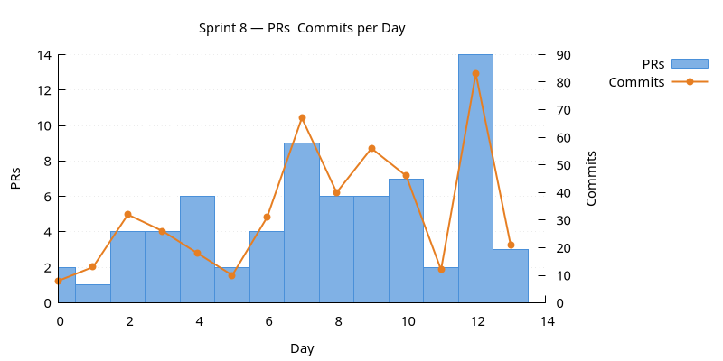
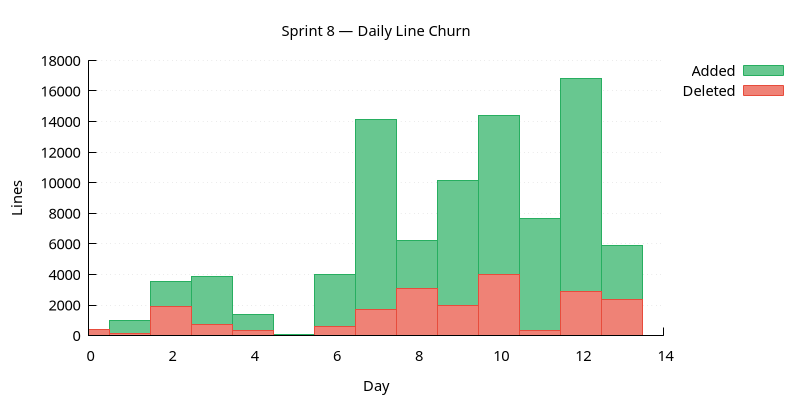
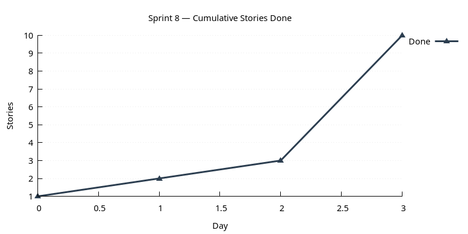

:PROPERTIES:
:ID: 49C4E380-68EE-4D80-839A-41311A99C734
:END:
#+title: Sprint 08
#+description: Database/seeding overhaul, ISO countries, change-management infrastructure, Qt UX polish, Wt/HTTP review, comms substrate evolution, native pagination, entity-creator skills suite, books domain analysis.
#+type: sprint
#+level: s3
#+filetags: :refdata:countries:change_management:qt:comms:skills:sprint_08:v0:
#+created: 2026-05-19
#+updated: 2026-05-19
#+todo: STARTED | DONE

This page documents a [[id:0820B7FD-147C-4832-AC25-C043D38D5B61][sprint]] (*Sprint 08*) of ORE Studio v0. It captures the
sprint's mission, current status, and the stories that compose it. For the
surrounding context — version goals, sprint order, and product identity — see
[[id:E6FD30ED-963E-4705-B414-91BF471C23D0][Version 0]].

* Mission

Originally /implement basic reference data/. In practice the sprint
expanded to cover the substrate beneath that work: database
reproducibility, change-management infrastructure for amends/deletes,
Qt UX polish across most dialogs, plus a full set of entity-creator
skills to make the next entity cheaper.

* Status

| Field          | Value                                                                                                    |
|----------------+----------------------------------------------------------------------------------------------------------|
| State          | DONE                                                                                                     |
| Parent version | [[id:E6FD30ED-963E-4705-B414-91BF471C23D0][Version 0]]                                                   |
| Previous       | [[id:A79D42AF-1B38-43EE-9607-848A4A84C09A][Sprint 07]]                                                   |
| Start          | 2025-12-30                                                                                               |
| End (expected) | 2026-01-11                                                                                               |
| Now            | Sprint closed 2026-01-11. Three observability-review items and the accounts-dialog polish carry forward. |
| Waiting on     | None — carried-forward items are scheduled for sprint 09+.                                               |
| Next           | [[id:AF0B027B-77BF-4794-810D-39AD49A5EFAD][Sprint 09]]                                                   |
| Release Notes  | [[id:67E62E6F-F85E-48E1-8099-4E6AE3E0872B][Release notes]]                                                                                                        |
| Last touched   | 2026-01-11                                                                                               |

** Achievements

- Countries landed as the first proper reference-data entity end-to-end.
- Database schema and seeding overhauled; TimescaleDB tier detection in place.
- Native pagination adopted across list views (sqlgen 0.6.0).
- Change management infrastructure landed: reason codes with UI.
- Entity-creator skills suite extended to Qt, shell, HTTP, Wt, and CLI surfaces.
- Wt/HTTP validated and documented as the second presentation tier.

* Stories

For the definitions of the themes see [[id:A064D838-F127-4DD6-BB42-9A7902039AEE][Themes]].

** Infrastructure

#+ATTR_HTML: :class hug-leading
| Story                                                                             | State   | Start      | End        | Description |
|-----------------------------------------------------------------------------------+---------+------------+------------+------------------------------------------------------------------------------------------|
| [[id:42E6C351-795F-48AA-A435-EB3D1C9B6704][Database schema and seeding overhaul]] | DONE    |            | 2025-12-31 | rerun SQL from scratch with TimescaleDB tier detection; remove code seeders.             |
| [[id:DA77FB50-27E8-4B42-A826-CAB289C7826E][Comms substrate evolution]]            | DONE    |            | 2026-01-11 | composable options, rename =ores.shell= → =ores.comms.shell=, dynamic channel discovery. |
| [[id:40D153E3-4A87-44B6-B605-1E3E28A44D03][Native pagination support]]            | DONE    |            | 2026-01-07 | adopt sqlgen 0.6.0.                                                                      |
| [[id:13FBE901-B255-49F7-88C3-13B2A2506BF3][Wt and HTTP review]]                   | DONE    |            | 2026-01-06 | validate the sprint-07 surfaces; document the HTTP service.                              |
| [[id:150E3C44-AADB-48C8-A11E-322B44A0357A][Change management infrastructure]]     | DONE    |            | 2026-01-11 | reasons base + UI.                                                                       |
| [[id:CD9E9D04-44D2-4D0D-95CE-719D55C40DA4][Observability follow-up]]              | BACKLOG |            |            | review pass only; three implementation tasks carry forward.                              |

** Product

#+ATTR_HTML: :class hug-leading
| Story                                                                             | State   | Start      | End        | Description |
|-----------------------------------------------------------------------------------+---------+------------+------------+--------------------------------------------------------------------------------------------|
| [[id:CB564C6A-F248-4740-8D1C-A1BE148CE576][Qt UX polish]]                         | DONE    |            | 2026-01-11 | validate holiday features; assorted dialog fixes; log-viewer UI; accounts polish deferred. |
| [[id:501C05B5-AA7F-4807-A4F2-627B857CE2AA][Reference data: countries]]            | DONE    |            | 2026-01-11 | first proper refdata entity, end-to-end.                                                   |
| [[id:77211166-9316-40C0-88D6-C92F983A00B5][Books domain modelling analysis]]      | DONE    |            | 2026-01-11 | strategic next-modelling effort.                                                           |

** LLMs

#+ATTR_HTML: :class hug-leading
| Story                                                                             | State   | Start      | End        | Description |
|-----------------------------------------------------------------------------------+---------+------------+------------+-------------------------------------------|
| [[id:B302B2B6-13F8-49CC-A6AF-88418668BE31][Entity-creator skills suite]]          | DONE    |            | 2026-01-11 | Qt, shell, HTTP (incl. recipes), Wt, CLI. |

** Agile

#+ATTR_HTML: :class hug-leading
| Story                                                                             | State   | Start      | End        | Description |
|-----------------------------------------------------------------------------------+---------+------------+------------+-----------------------------------------------------|
| [[id:F40E0162-A092-4716-A256-206FDBA93452][Sprint 08 housekeeping]]               | DONE    |            | 2026-01-11 | backlog refinement, OCR scans; AI summary deferred. |

* Charts

Charts generated via [[id:6F3D9B1A-5C7E-4A2D-8F1B-3C9D7E5F2A1B][sprint_charts cmake target]].

** PRs & Commits per Day

Dual-axis bar chart. PRs (left axis) and commits (right axis) per day.
A high commits-to-PR ratio may indicate scope creep.

** Daily Line Churn

Lines added (green) and deleted (red) per day. Building work produces
mostly additions; refactoring produces a mix. Days with no churn may
indicate blockers.

** Cumulative Stories Done

Line chart tracking stories marked DONE during the sprint.
Steady upward slope is healthy; plateauing signals a stall.

* Retrospective

** What went well

- The database overhaul (license-tier detection, SQL populate
  centralisation) was a foundational piece that unlocked subsequent
  reference-data work; landed early and paid back through the rest of
  the sprint.
- Sprint-07 follow-ups (Wt and HTTP review, observability review)
  arrived on schedule, even if some of the resulting fix work was
  deferred — separating review from fixes was the right call.
- Six entity-creator skills landed in parallel; the countries story
  exercised the shell + Wt skills as their first real workload.

** What hurt

- Ambitious in volume: 11 stories / 31 tasks made it the biggest
  v0 sprint to date. The cost showed up as four deferred items
  (AI summary, accounts dialog, all three observability fixes).
- =ores.refdata= doesn't have a versioned modelling doc with a
  stable ID; the "see also" linkage from the countries story has
  to point sideways at the skills story instead of at the component
  doc.
- Change-management UI polish ran longer than expected, mostly
  because the icon / save-dialog / human-time pattern changes
  touched every existing dialog.

** What changed

- =ores.shell= is now =ores.comms.shell= — the name reflects its
  binary-protocol scope and frees the =ores.shell= slot for any
  future protocol-agnostic shell.
- Seeding centralised in SQL populate scripts; C++ seeders gone.
- All dialogs mark stale on external change rather than
  auto-reloading, a pattern that came out of the feature-flags
  work and was generalised across the codebase.
- Native sqlgen pagination replaces the offset workarounds and the
  =single_connection= aggregation hack.
