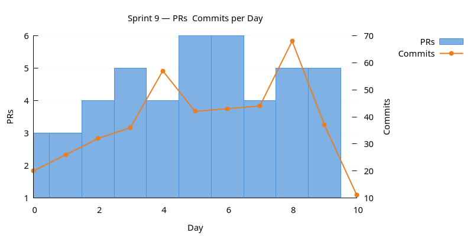
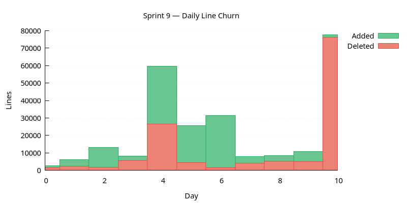
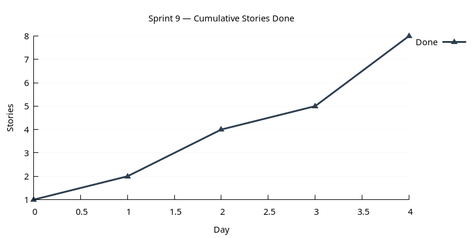

:PROPERTIES:
:ID: AF0B027B-77BF-4794-810D-39AD49A5EFAD
:END:
#+title: Sprint 09
#+description: Data Quality subsystem + Data Librarian; connection management; database naming refactor; security module; CLI entity coverage; engineering hygiene.
#+type: sprint
#+version: 2
#+level: s3
#+filetags: :dq:librarian:connections:refdata:security:sprint_09:v0:
#+created: 2026-05-19
#+updated: 2026-05-19
#+todo: STARTED | DONE

This page documents a [[id:0820B7FD-147C-4832-AC25-C043D38D5B61][sprint]] (*Sprint 09*) of ORE Studio v0. It captures the
sprint's mission, current status, and the stories that compose it. For the
surrounding context — version goals, sprint order, and product identity — see
[[id:E6FD30ED-963E-4705-B414-91BF471C23D0][Version 0]].

* Mission

Originally /implement data management infrastructure/. Delivered:
stood up Data Quality as a first-class subsystem (=ores.dq=) end to
end — concept model, domain types + FpML, ER refactor, breaking
protocol bump, Data Librarian UI, publication workflow, validated
against a fake-world dataset. Around it: connection management (so the
multi-environment agent workflow stops being painful), database
naming made component-explicit, a dedicated security module, and CLI
coverage of the entities that landed in earlier sprints.

* Status

| Field          | Value                                                                                                                                                      |
|----------------+------------------------------------------------------------------------------------------------------------------------------------------------------------|
| State          | DONE                                                                                                                                                       |
| Parent version | [[id:E6FD30ED-963E-4705-B414-91BF471C23D0][Version 0]]                                                                                                     |
| Previous       | [[id:49C4E380-68EE-4D80-839A-41311A99C734][Sprint 08]]                                                                                                     |
| Start          | 2026-01-11                                                                                                                                                 |
| End (expected) | 2026-01-20                                                                                                                                                 |
| Now            | Sprint closed 2026-01-20. Two items carry forward: the per-entity documentation refactor (already mostly absorbed into v2) and the party-table groundwork. |
| Waiting on     | Nothing.                                                                                                                                                   |
| Next           | [[id:4BAC3B0F-819F-43F3-8A59-2B48ABE56938][Sprint 10]]                                                                                                     |
| Release Notes  | —                                                                                                                                                          |
| Last touched   | 2026-01-20                                                                                                                                                 |

* Stories

#+ATTR_HTML: :class hug-leading
| Story                                                                                  | State   | Start      | End        | Theme                                                                                   |
|----------------------------------------------------------------------------------------+---------+------------+------------+-----------------------------------------------------------------------------------------|
| [[id:1E7A8ABC-1ABC-4A37-BDCE-1D8DFB9D21FF][Sprint 09 housekeeping]]                    | DONE    |            | 2026-01-20 | backlog + OCR.                                                                          |
| [[id:09A8D544-22F3-491A-82A9-306B1AA7C756][CLI entity coverage]]                       | DONE    |            | 2026-01-12 | list/delete commands for the five entities the CLI was missing; helper-driven refactor. |
| [[id:E7DDB653-CEAA-4922-B0F9-8BD5393A747E][Engineering hygiene]]                       | DONE    |            | 2026-01-14 | model refresh + pr-manager skill + valgrind fixes; documentation refactor postponed.    |
| [[id:8C29B0E8-64EA-4F32-ADD0-59419769BCD4][Security module]]                           | DONE    |            | 2026-01-13 | ores.security with RAII OpenSSL.                                                        |
| [[id:AACC71E6-3DEE-47D2-B77C-E0B4847260BD][Connection management]]                     | DONE    |            | 2026-01-15 | ores.connections + Connection Browser MDI + modernised login dialog.                    |
| [[id:61485635-64BA-4C31-A35B-2F60D7FB41AA][Database naming refactor]]                  | DONE    |            | 2026-01-14 | ores.risk → ores.refdata; =<component>_<entity>_<suffix>= across the schema.            |
| [[id:3579AB5E-D5D8-45AE-8CB5-00AD1C58644F][Data Quality subsystem and Data Librarian]] | DONE    |            | 2026-01-20 | the flagship of the sprint.                                                             |
| [[id:ABD80EC4-E7E4-4BB2-B5AE-4FC7F8C46FD3][Qt visual refresh]]                         | DONE    |            | 2026-01-20 | icon-enum + theme refactor.                                                             |
| [[id:EF555D10-3FD3-4928-8E43-E63284D7706F][Party database groundwork]]                 | BACKLOG |            |            | table structure only; postponed.                                                        |

* Charts

Charts generated via [[id:6F3D9B1A-5C7E-4A2D-8F1B-3C9D7E5F2A1B][sprint_charts cmake target]].

** PRs & Commits per Day

Dual-axis bar chart. PRs (left axis) and commits (right axis) per day.
A high commits-to-PR ratio may indicate scope creep.

** Daily Line Churn

Lines added (green) and deleted (red) per day. Building work produces
mostly additions; refactoring produces a mix. Days with no churn may
indicate blockers.

** Cumulative Stories Done

Line chart tracking stories marked DONE during the sprint.
Steady upward slope is healthy; plateauing signals a stall.

* Retrospective

** What went well

- Data Quality landed as a coherent subsystem rather than piecemeal:
  concept first, then domain types + FpML, then ER refactor, messaging,
  UI, publication, and finally a fake-world validation pass.
- Connection management unblocked the multi-environment agent workflow
  the project has been operating under for the last few sprints.
- Two big refactors — rename risk→refdata and the schema-wide naming
  pass — landed cleanly thanks to the prefix pattern being mechanical.
- The DQ subsystem migration of change-management messages out of IAM
  forced a circular-dependency fix that improved layering more
  broadly.

** What hurt

- The DQ protocol bump (21.3 → 22.0) is genuinely breaking; the cost
  is paid up-front while client count is small, but it's still a cost.
- Documentation-refactor scope overlapped substantially with v2; we
  ended up postponing the v0 task because doing both would have been
  duplicate work.
- Boost.Graph as a build-time dependency is heavy for the one
  topological-sort we need today; justified by the more-graphs-coming
  argument but worth revisiting if that doesn't materialise.

** What changed

- =ores.security= is now the only place that knows about OpenSSL
  primitives; =ores.iam= and =ores.connections= consume it.
- =ores.risk= is gone — =ores.refdata= replaces it everywhere.
- Schema-wide =<component>_<entity>_<suffix>= naming is now the
  rule; new entities follow it by default.
- =ores.dq= is the home of data-quality and change-management
  machinery; messaging migrated accordingly.
- Connection bookmarks live on the client (SQLite + AES-256-GCM)
  rather than mixed into the server schema.
