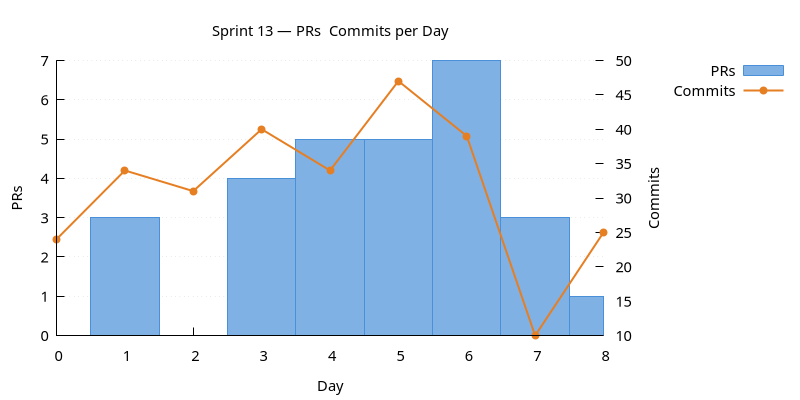
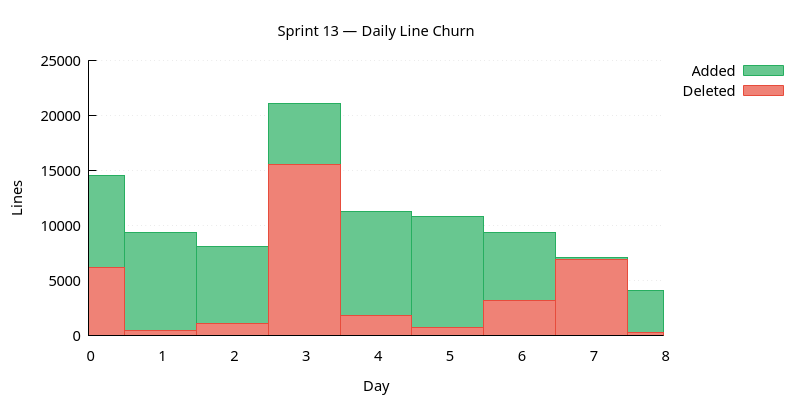
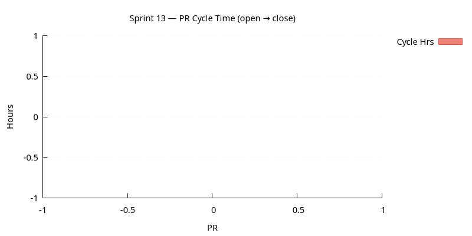
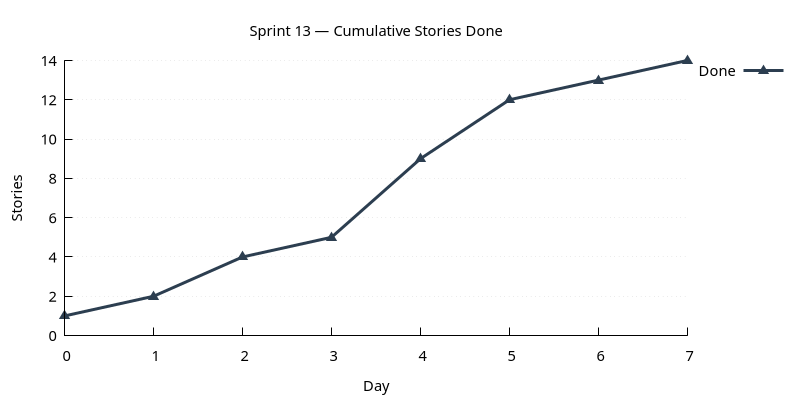

:PROPERTIES:
:ID: 48230FC0-9061-48DC-853F-1E507C1A97AD
:END:
#+title: Sprint 13
#+description: Trade + scheduling foundations: account-party + multi-party login; scheduling subsystem (pg_cron); message queue; batch operations; FSM merged into DQ; portfolio explorer; party isolation for books / portfolios / trades; tabbed dialogs; provenance fix.
#+type: sprint
#+version: 2
#+level: s3
#+filetags: :trade:scheduling:party:rls:qt:dq:fsm:sprint_13:v0:
#+created: 2026-05-20
#+updated: 2026-05-20
#+todo: STARTED | DONE

This page documents a [[id:0820B7FD-147C-4832-AC25-C043D38D5B61][sprint]] (*Sprint 13*) of ORE Studio v0. It captures the
sprint's mission, current status, and the stories that compose it. For the
surrounding context — version goals, sprint order, and product identity — see
[[id:E6FD30ED-963E-4705-B414-91BF471C23D0][Version 0]].

* Mission

/Add trade and scheduling support./ Delivered the foundations:
multi-party login + account-party management closes the future-story
note from sprint 12; the scheduling subsystem stands up
=ores.scheduler= over =pg_cron= with a Quartz.NET-style fluent API;
the portfolio explorer combines books + portfolios + trades into a
navigable tree; batch save/delete go atomic across 23 entities; FSM
moves into DQ where it belongs; party-level RLS extends to books /
portfolios / trades.

* Status

| Field          | Value                                                                                                                                                               |
|----------------+---------------------------------------------------------------------------------------------------------------------------------------------------------------------|
| State          | DONE                                                                                                                                                                |
| Parent version | [[id:E6FD30ED-963E-4705-B414-91BF471C23D0][Version 0]]                                                                                                              |
| Previous       | [[id:D846B986-2D6D-434E-AF68-4B3DDAAA09D8][Sprint 12]]                                                                                                              |
| Start          | 2026-02-20                                                                                                                                                          |
| End (expected) | 2026-02-28                                                                                                                                                          |
| Now            | Sprint closed 2026-02-28. Two items carry forward: the trade-import mapping dialog (6h work-in-progress) and the party-level refdata restrictions (framework only). |
| Waiting on     | Nothing.                                                                                                                                                            |
| Next           | [[id:A63C60DC-C3A6-4F4F-8977-012A7BF1D566][Sprint 14]]                                                                                                              |
| Release Notes  | [[id:0B0A8BDA-2DB1-4222-825E-493B1D5A68F0][Release notes]]                                                                                                                                                                   |
| Last touched   | 2026-02-28                                                                                                                                                          |

* Stories

#+ATTR_HTML: :class hug-leading
| Story                                                                                        | State   | Start      | End        | Theme                                                                         |
|----------------------------------------------------------------------------------------------+---------+------------+------------+-------------------------------------------------------------------------------|
| [[id:90161BF2-67F0-4542-899C-5D844A3F6F95][Sprint 13 housekeeping]]                          | DONE    |            | 2026-02-24 | backlog + two-step release notes.                                             |
| [[id:6AC2981B-BA0A-4916-A2C1-6B5A816A9148][FSM consolidation into DQ]]                       | DONE    |            | 2026-02-20 | moves FSM under DQ. Continues from sprint 12 fsm_and_trade_support.           |
| [[id:EC6D8E8D-4421-412A-9331-9BBA5B542D54][Detail dialogs modernisation]]                    | DONE    |            | 2026-02-25 | tabbed dialogs + toolbar removal.                                             |
| [[id:7B926ACE-57F6-414D-8F3E-568175041F87][Provenance and actor]]                            | DONE    |            | 2026-02-21 | performed_by / modified_by stamping tightened; current_actor GUC.             |
| [[id:6F799AF2-9844-4CB6-9E9C-A57C06ECBF23][Session telemetry plotting]]                      | DONE    |            | 2026-02-22 | RTT + bytes hypertable + QChartView.                                          |
| [[id:956FCD0E-41C3-46E4-9895-B64B4C143E6D][Account-party management and login]]              | DONE    |            | 2026-02-23 | multi-party login picker. Continues from sprint 12 party_level_rls_isolation. |
| [[id:7AE49D47-624C-41C6-8C07-CDBEB71D85EC][Refdata taxonomy work]]                           | DONE    |            | 2026-02-24 | rounding type, currency taxonomy split, asset-class naming.                   |
| [[id:19EE14C8-952D-42D6-9AE1-ECEA45A5EFCF][Business centre polish]]                          | DONE    |            | 2026-02-22 | city_name + flag fixes.                                                       |
| [[id:DF3B299E-7FED-4411-B257-125ED35C3A9E][Party isolation for books / portfolios / trades]] | DONE    |            | 2026-02-24 | RLS extended.                                                                 |
| [[id:EE315A6F-8933-4738-AE3F-E63CBBF57F03][Connection browser environments]]                 | DONE    |            | 2026-02-24 | environment + connection split.                                               |
| [[id:8A04DE16-6BDD-4696-9F04-122C92692D59][Portfolio explorer]]                              | DONE    |            | 2026-02-25 | combined tree + trade table.                                                  |
| [[id:68C577A4-B33E-47CB-953F-F3D90A4440D6][Trade import mapping analysis]]                   | DONE    |            | 2026-02-25 | design pass.                                                                  |
| [[id:F8CAA6CE-A36F-464C-A9A2-058E796A0F81][Trade import mapping dialog]]                     | BACKLOG |            |            | POSTPONED.                                                                    |
| [[id:A0B6C877-2FAD-457A-B0C2-000D3F707A5B][Scheduling subsystem]]                            | DONE    |            | 2026-02-27 | protocol + lib + queue.                                                       |
| [[id:0251593A-0D85-49C4-AEE1-7AAC673978B7][Batch operations]]                                | DONE    |            | 2026-02-28 | atomic save + delete.                                                         |
| [[id:241A6DE6-8978-4DAF-A052-7E1CF06A8FC8][Party-level refdata restrictions]]                | BACKLOG |            |            | BACKLOG framework only.                                                       |

* Charts

Charts generated via [[id:6F3D9B1A-5C7E-4A2D-8F1B-3C9D7E5F2A1B][sprint_charts cmake target]].

** PRs & Commits per Day

Dual-axis bar chart. PRs (left axis) and commits (right axis) per day.
A high commits-to-PR ratio may indicate scope creep.

** Daily Line Churn

Lines added (green) and deleted (red) per day. Building work produces
mostly additions; refactoring produces a mix. Days with no churn may
indicate blockers.

** PR Cycle Time

Hours from PR open to merge, one bar per PR. Long bars indicate
review bottlenecks. Generated only when PR data is available.

** Cumulative Stories Done

Line chart tracking stories marked DONE during the sprint.
Steady upward slope is healthy; plateauing signals a stall.

* Retrospective

** What went well

- Account-party + multi-party login closes the largest open thread
  from the sprint-12 party-RLS landing.
- Portfolio explorer pulls together books, portfolios, and trades
  into one navigable view scoped by session party — the first time
  these surfaces felt cohesive.
- Scheduling subsystem landed end-to-end inside the sprint: lib,
  protocol, and queue.
- Batch save/delete across 23 entities was a big payback on the
  protocol consolidation discipline.
- The two-step release-notes process (summarise → write) is now
  process; needed for any future LLM-aided release notes.

** What hurt

- 16 stories / 22 tasks is right at the top of comfortable; trade-
  import dialog (6h of work) and party-level refdata restrictions
  (framework only) carry forward.
- Three breaking protocol bumps in one sprint (38, 41, 43, 45, 46
  actually five) — wire-format churn was high; each was justified
  individually but the cumulative cost on clients is real.
- Currency-taxonomy rename pass happened immediately after the
  taxonomy split — would have been cleaner to ship together.

** What changed

- =ores.fsm= is gone; FSM lives under DQ as =ores.dq.fsm.*=.
- Login is multi-party-aware; accounts can carry multiple party
  assignments.
- Trade visibility is party-scoped (alongside books and portfolios).
- Currency carries =asset_class= + =market_tier= instead of free-text
  =currency_type=.
- =ores.scheduler= wraps =pg_cron= for scheduled jobs.
- Save + delete are atomic at the batch level.
- =environment= and =connection= are separate concepts in the
  connection browser.
- Provenance no longer has a =current_user= escape hatch.
