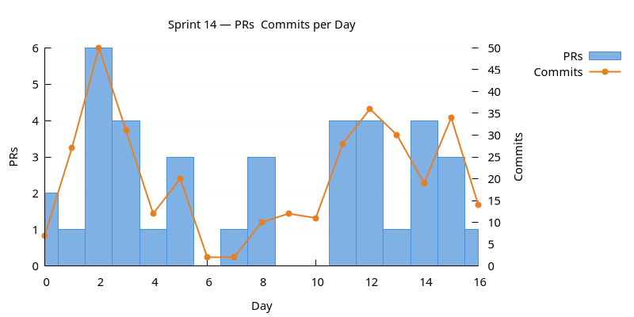
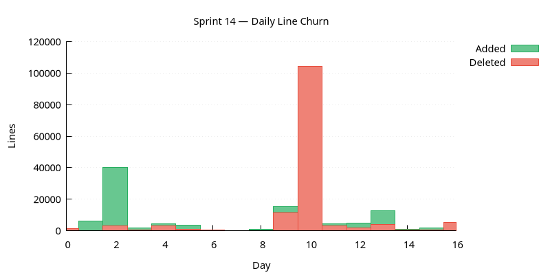
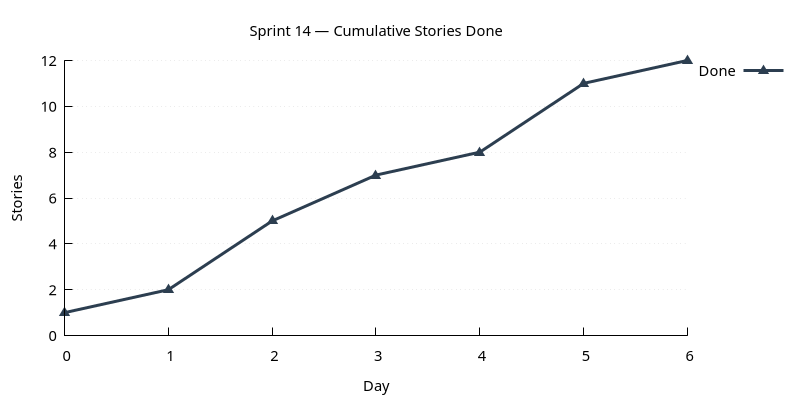

:PROPERTIES:
:ID: A63C60DC-C3A6-4F4F-8977-012A7BF1D566
:END:
#+title: Sprint 14
#+description: Messaging infrastructure: ORE Import Wizard; ores.reporting subsystem (design + schema + domain + UI); trade status FSM; CLI domain layer; messaging journey from pgmq+pg_cron → custom → NNG → NATS; party codename + race fixes; JWT RS256 in ores.security.
#+type: sprint
#+version: 2
#+level: s3
#+filetags: :messaging:nats:reporting:fsm:cli:jwt:codename:sprint_14:v0:
#+created: 2026-05-20
#+updated: 2026-05-20
#+todo: STARTED | DONE

This page documents a [[id:0820B7FD-147C-4832-AC25-C043D38D5B61][sprint]] (*Sprint 14*) of ORE Studio v0. It captures the
sprint's mission, current status, and the stories that compose it. For the
surrounding context — version goals, sprint order, and product identity — see
[[id:E6FD30ED-963E-4705-B414-91BF471C23D0][Version 0]].

* Mission

/Work on messaging infrastructure./ Delivered exactly that — but
through a messy three-way pivot: pgmq + pg_cron → custom in-process MQ
+ scheduler → NNG broker attempt → NATS for everything. The NATS
landing removed ~107k lines of old binary-protocol code and added
~20k lines of new NATS-idiomatic code across 10 domain services.
Alongside it: reporting subsystem from scratch, trade-status FSM,
JWT RS256 in ores.security, party codename for per-party queue
isolation (with a couple of race-condition fixes), CLI domain layer,
ORE Import Wizard, CMake preset suffixes.

* Status

| Field          | Value                                                                                                                                                                                        |
|----------------+----------------------------------------------------------------------------------------------------------------------------------------------------------------------------------------------|
| State          | DONE                                                                                                                                                                                         |
| Parent version | [[id:E6FD30ED-963E-4705-B414-91BF471C23D0][Version 0]]                                                                                                                                       |
| Previous       | [[id:48230FC0-9061-48DC-853F-1E507C1A97AD][Sprint 13]]                                                                                                                                       |
| Start          | 2026-02-28                                                                                                                                                                                   |
| End (expected) | 2026-03-19                                                                                                                                                                                   |
| Now            | Sprint closed 2026-03-19. One BACKLOG item carries forward: the trade- import dialog (second attempt, postponed again). The ORE Import Wizard landed in this sprint covers part of its goal. |
| Waiting on     | Nothing.                                                                                                                                                                                     |
| Next           | [[id:03D189E0-1960-4F19-B71F-EE7C8D0941A7][Sprint 15]]                                                                                                                                       |
| Release Notes  | —                                                                                                                                                                                            |
| Last touched   | 2026-03-19                                                                                                                                                                                   |

* Stories

#+ATTR_HTML: :class hug-leading
| Story                                                                                     | State   | Start      | End        | Theme                                                                                          |
|-------------------------------------------------------------------------------------------+---------+------------+------------+------------------------------------------------------------------------------------------------|
| [[id:7DCF008E-33A5-4493-8FF2-ABE1E7D78053][Sprint 14 housekeeping]]                       | DONE    |            | 2026-03-12 | backlog refinement.                                                                            |
| [[id:F80BAD05-2E66-458D-9223-1DB0A83EF694][ORE import wizard]]                            | DONE    |            | 2026-03-01 | seven-page directory-scan wizard. Continues from sprint 13 trade_import_analysis.              |
| [[id:84559B48-546B-4724-BDD0-53DBFCA2C24A][Reporting subsystem]]                          | DONE    |            | 2026-03-03 | design + schema + domain + messaging + repo + Qt UI with cron widget.                          |
| [[id:86927EBE-880C-42E4-8C94-E4705C4A622A][Trade status FSM]]                             | DONE    |            | 2026-03-02 | status FSM + activity_type taxonomy.                                                           |
| [[id:4D9869DA-72CE-4B92-BB19-91C274CA7A2B][CLI domain layer]]                             | DONE    |            | 2026-03-03 | domain sub-menu in CLI syntax.                                                                 |
| [[id:7B45BE68-3970-4657-B2A3-F24151156AC7][pgmq queue management and messaging UI]]       | DONE    |            | 2026-03-03 | first MQ UI.                                                                                   |
| [[id:ED082D5A-4AFB-4BF9-81DB-8712F881DDE3][Custom MQ tables and in-process scheduler]]    | DONE    |            | 2026-03-04 | replace external extensions. Continues from sprint 13 scheduling_subsystem.                    |
| [[id:9C57D467-3F17-469A-A245-5F57E6B20784][Party codename]]                               | DONE    |            | 2026-03-12 | adjective_noun + two race-condition fixes.                                                     |
| [[id:1DE357FF-7139-49FD-BC97-B30CD095EF53][JWT RS256 in ores.security]]                   | DONE    |            | 2026-03-04 | centralised JWT with RS256.                                                                    |
| [[id:55BF0070-33C2-4F1D-986F-A787138942F6][NNG message broker attempt]]                   | DONE    |            | 2026-03-12 | partially built; hook-up cancelled in favour of NATS.                                          |
| [[id:05CBD9FA-B1F2-4B53-8F83-2952A892C94D][CMake preset build-tool suffixes]]             | DONE    |            | 2026-03-10 | explicit Ninja / Make naming.                                                                  |
| [[id:23D1F2BB-D2D3-423A-8167-657098E30542][NATS migration]]                               | DONE    |            | 2026-03-18 | the pivot. Binary protocol replaced with NATS request/reply + JetStream; 10 services migrated. |
| [[id:05CFEF69-F80B-437F-AEEE-3881E4FE96F1][Trade import mapping dialog (second attempt)]] | BACKLOG |            |            | BACKLOG; postponed again. Continues from sprint 13 trade_import_dialog.                        |

* Charts

Charts generated via [[id:6F3D9B1A-5C7E-4A2D-8F1B-3C9D7E5F2A1B][sprint_charts cmake target]].

** PRs & Commits per Day

Dual-axis bar chart. PRs (left axis) and commits (right axis) per day.
A high commits-to-PR ratio may indicate scope creep.

** Daily Line Churn

Lines added (green) and deleted (red) per day. Building work produces
mostly additions; refactoring produces a mix. Days with no churn may
indicate blockers.

** Cumulative Stories Done

Line chart tracking stories marked DONE during the sprint.
Steady upward slope is healthy; plateauing signals a stall.

* Retrospective

** What went well

- The reporting subsystem went from zero to design + schema + domain
  + UI in a couple of days, riding on the FSM + scheduler + cron-
  widget infrastructure already in place.
- ORE Import Wizard ended up being a much better shape than the
  trade-import dialog originally planned; the directory-scan approach
  is a far better fit for how users actually have ORE data.
- The NATS landing removed ~107k lines of binary-protocol code and
  decomposed the service neatly into 10 microservices — by far the
  largest single architectural simplification of v0.
- JWT RS256 + JWT-in-frame survived the NNG abandonment; the security
  layer is independent of the transport choice.
- Party codename + sequence-based suffix solved batch-insert
  uniqueness correctly — the second attempt was right.

** What hurt

- Three pivots in one sprint (pgmq → custom → NNG → NATS) is a lot.
  Each pivot threw away code from the previous iteration; the cost
  is real even when each individual decision is the right one.
- /Hook up broker and comms service/ got cancelled — NNG broker is
  half-implemented dead code we now have to delete or retire.
- Trade-import dialog postponed for the second consecutive sprint.
- Sprint is 3 weeks long (Feb 28 – Mar 19), not the usual 1-2 weeks.
  The pivot stretched the timeline.

** What changed

- Transport is NATS, not the old binary protocol.
- Service shape is microservices (10 of them), not the monolith.
- =ores.shell= is back to its original name (not =ores.comms.shell=).
- pgmq + pg_cron extensions are gone; custom MQ + in-process
  scheduler + JetStream replace them.
- JWT lives in =ores.security=, signed RS256, carrying
  =tenant_id= + =party_id=.
- Parties carry =adjective_noun= codenames as per-party queue
  prefix.
- Trade status enforced via FSM; activity_type taxonomy replaces
  the loose lifecycle_events concept.
- CLI commands group under =refdata / iam / dq / variability= domains.
- CMake presets name the build tool explicitly.
