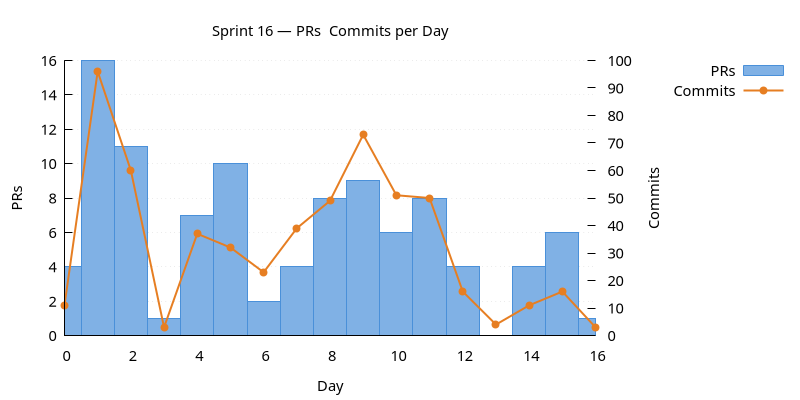
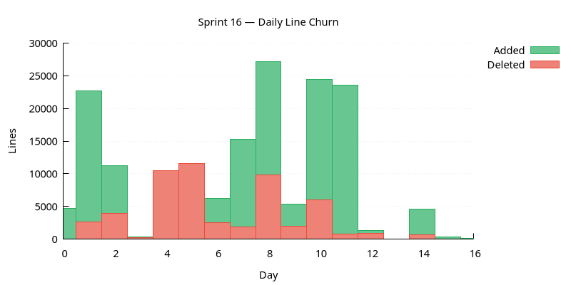
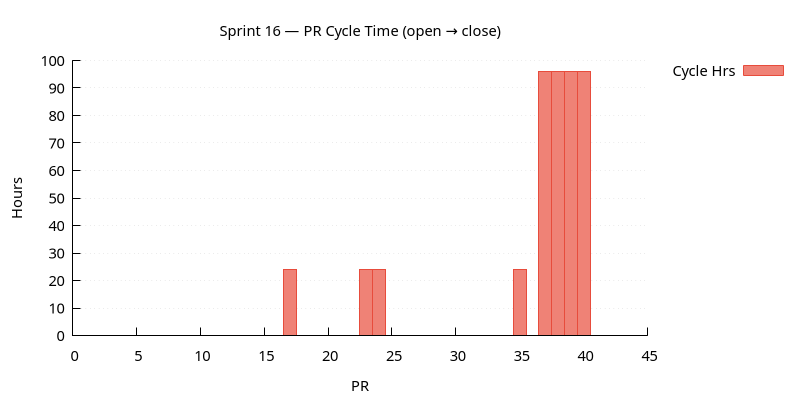
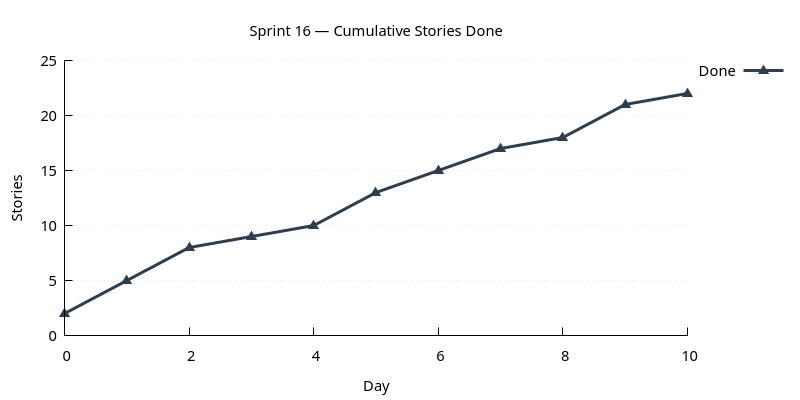

:PROPERTIES:
:ID: 1C778CE6-25D6-429B-920E-D08A2CE9A0A6
:END:
#+title: Sprint 16
#+description: ORE import end-to-end, plus the cross-cutting infrastructure it depends on: workflow engine + sagas, market data subsystem, service lifecycle controller, Qt plugin split, reporting + analytics, asset-class / product-type separation, and a ~20-fix Windows portability sweep.
#+type: sprint
#+version: 2
#+level: s3
#+filetags: :ore:workflow:marketdata:controller:plugins:trading:reporting:windows:sprint_16:v0:
#+created: 2026-05-20
#+updated: 2026-05-20
#+todo: STARTED | DONE

This page documents a [[id:0820B7FD-147C-4832-AC25-C043D38D5B61][sprint]] (*Sprint 16*) of ORE Studio v0. It captures the
sprint's mission, current status, and the stories that compose it. For the
surrounding context — version goals, sprint order, and product identity — see
[[id:E6FD30ED-963E-4705-B414-91BF471C23D0][Version 0]].

* Mission

Make ORE import work end-to-end, and land the cross-cutting
infrastructure it leans on.

- ORE import end-to-end: dispatch pipeline, mappers for every
  instrument family, server-side =ores.ore.service=, supporting
  market / fixings / calendar / conventions, golden roundtrip tests,
  portfolio export.
- Infrastructure import depends on: workflow engine + saga
  orchestration, market data subsystem from scratch, =ores.controller=
  service lifecycle, Qt plugin architecture, reporting + analytics
  stack.
- Surrounding cleanup: trade detail dialog unification, per-type
  instrument tables, asset-class / product-type separation, UTC-
  everywhere policy, ~20 Windows portability fixes, party-isolation
  RLS gaps closed.

The largest v0 sprint to date (157h, 89 tasks across 22 stories).

* Status

| Field          | Value                                                  |
|----------------+--------------------------------------------------------|
| State          | DONE                                                   |
| Parent version | [[id:E6FD30ED-963E-4705-B414-91BF471C23D0][Version 0]] |
| Previous       | [[id:03D189E0-1960-4F19-B71F-EE7C8D0941A7][Sprint 15]] |
| Start          | 2026-03-30                                             |
| End (expected) | 2026-04-18                                             |
| Now            | Sprint closed 2026-04-17.                              |
| Waiting on     | Nothing.                                               |
| Next           | [[id:A2B8A670-3B02-11F1-BCE2-4B06F4BBA5D7][Sprint 17]] |
| Release Notes  | [[id:88484BF4-AC03-4058-98DF-2D769C0D6223][Release notes]]                                                      |
| Last touched   | 2026-04-17                                             |

* Stories

For the definitions of the themes see [[id:A064D838-F127-4DD6-BB42-9A7902039AEE][Themes]].

** Infrastructure

#+ATTR_HTML: :class hug-leading
| Story                                                                                 | State | Start      | End        | Theme                                                                                           |
|---------------------------------------------------------------------------------------+-------+------------+------------+-------------------------------------------------------------------------------------------------|
| [[id:2FAF5366-2FED-4FBE-99F2-8CB46CA84AEB][Party isolation RLS policies]]             | DONE  |            | 2026-04-09 | close the gaps. Continues from sprint 13 party_isolation_books_portfolios_trades.               |
| [[id:7399693E-F61B-4E3D-B37C-F53F3CE5A197][Generic object storage API]]               | DONE  |            | 2026-04-03 | ores.storage + compute grid migration.                                                          |
| [[id:014352D4-AAA5-48E7-903D-C06B5B4F7D62][Service lifecycle controller]]             | DONE  |            | 2026-04-08 | ores.controller + unified NATS heartbeat. Continues from sprint 15 compute_grid_ observability. |
| [[id:38C972E1-2DD2-41AE-A770-800FEE90D1E6][Qt plugin architecture]]                   | DONE  |            | 2026-04-09 | ores.qt.api + 7 domain plugins.                                                                 |
| [[id:BA5268AF-DF0E-4338-A6CE-1D5F84E1166D][Nats-Session-Id]]                          | DONE  |            | 2026-04-01 | session-level correlation.                                                                      |
| [[id:1997CCEF-3E2F-44C9-AB1C-9435A646BD61][UTC-everywhere timestamp policy]]          | DONE  |            | 2026-04-08 | canonical UTC API.                                                                              |
| [[id:CEF64A10-082E-447F-8A39-F8F60D984F11][Windows portability fixes]]                | DONE  |            | 2026-04-11 | ~20 fixes surfaced by Windows builds.                                                           |
| [[id:2C3A9E28-68DC-4BF1-8EB7-5C4379E5C248][Engineering hygiene]]                      | DONE  |            | 2026-04-07 | clock_cast, nodiscard, codegen profiles, menu repositioning.                                    |

** Product

#+ATTR_HTML: :class hug-leading
| Story                                                                                 | State | Start      | End        | Theme                                                                                                                 |
|---------------------------------------------------------------------------------------+-------+------------+------------+-----------------------------------------------------------------------------------------------------------------------|
| [[id:FFC60DB1-B82A-4C8A-961E-2C6720379508][Asset class and product_type unification]] | DONE  |            | 2026-04-03 | rename + analysis + implementation.                                                                                   |
| [[id:4FCD03AC-51AD-47AD-8203-FAEFAA4211B9][Workflow engine]]                          | DONE  |            | 2026-04-06 | scaffold + FSM state UUIDs + generalised event-driven engine.                                                         |
| [[id:C0ED556B-57A4-4BCE-9196-70BCF4FD0D63][Party provisioning saga]]                  | DONE  |            | 2026-03-31 | first concrete saga + UX.                                                                                             |
| [[id:87599263-BD70-42CF-B653-0803E12F4D0B][Workflow monitor]]                         | DONE  |            | 2026-04-11 | Qt plugin + late fixes.                                                                                               |
| [[id:8361BC43-BD96-433D-889E-367072BAD44E][ORE import pipeline]]                      | DONE  |            | 2026-04-04 | the sprint's mission. Continues from sprint 15 fix_ore_import_bugs.                                                   |
| [[id:44ECAD9C-332A-48F5-ACB4-7C30F9EB8DDF][ORE import supporting files]]              | DONE  |            | 2026-04-03 | market.txt + fixings.txt + calendar + conventions.                                                                    |
| [[id:43F68B11-1870-46DB-BFC3-C5FBC83FE6CF][ORE golden roundtrip tests]]               | DONE  |            | 2026-03-31 | three test PRs.                                                                                                       |
| [[id:FB0471F1-6BD2-4955-AC39-15D7800BB973][ORE portfolio export]]                     | DONE  |            | 2026-04-01 | exporter + Qt actions.                                                                                                |
| [[id:47CE4C06-2C59-4B8B-89B3-232D04B2DA23][Market data subsystem]]                    | DONE  |            | 2026-04-01 | parser + schema + repo + service + Qt UI.                                                                             |
| [[id:08D2B499-53CE-4B1C-92CF-A7C26D036EC9][Reporting and analytics]]                  | DONE  |            | 2026-04-07 | DQ-sourced report defs + execution workflow + analytics pricing engine. Continues from sprint 14 reporting_subsystem. |
| [[id:1490E130-08F9-4D43-8F80-D7E0F5022FBD][Trade detail dialog unification]]          | DONE  |            | 2026-04-07 | six instrument family merges + IInstrumentForm registry.                                                              |
| [[id:CE26E56B-944F-4C89-B5A9-E0DABF521908][Per-type instrument tables]]               | DONE  |            | 2026-04-10 | rates / FX / equity. Continues from sprint 15 cdm_instruments.                                                        |
| [[id:2D496A77-5238-4B5B-8CC6-C61FC59FA9C1][Scheduler UI complete]]                    | DONE  |            | 2026-04-11 | Job Instances + Monitor.                                                                                              |

** Agile

#+ATTR_HTML: :class hug-leading
| Story                                                                                 | State | Start      | End        | Theme               |
|---------------------------------------------------------------------------------------+-------+------------+------------+---------------------|
| [[id:C1DB4C7A-16D7-4289-A457-A6C6CE5C8B5C][Sprint 16 housekeeping]]                   | DONE  |            | 2026-04-17 | backlog refinement. |

* Charts

Charts generated via [[id:6F3D9B1A-5C7E-4A2D-8F1B-3C9D7E5F2A1B][sprint_charts cmake target]].

** PRs & Commits per Day

Dual-axis bar chart. PRs (left axis) and commits (right axis) per day.
A high commits-to-PR ratio may indicate scope creep.

** Daily Line Churn

Lines added (green) and deleted (red) per day. Building work produces
mostly additions; refactoring produces a mix. Days with no churn may
indicate blockers.

** PR Cycle Time

Hours from PR open to merge, one bar per PR. Long bars indicate
review bottlenecks. Generated only when PR data is available.

** Cumulative Stories Done

Line chart tracking stories marked DONE during the sprint.
Steady upward slope is healthy; plateauing signals a stall.

* Retrospective

** What went well

- ORE import landed end-to-end inside the sprint — pipeline +
  mappers for all six instrument families + supporting files +
  server-side service.
- Workflow engine generalised mid-sprint and immediately consumed
  two sagas (party provisioning + ORE import); the engine becomes
  load-bearing infrastructure rather than party-specific machinery.
- Market data subsystem from scratch in one sprint: parser + schema
  + domain + repository + service + UI.
- Trade detail dialog unification (six merge PRs + IInstrumentForm
  registry) closes a long-running UX inconsistency.
- Qt plugin architecture (ores.qt.api + 7 domain plugins) prepares
  the codebase for v1's modularity needs.
- Windows portability sweep — 20+ fixes — gets Windows CI back to
  green and keeps it there.
- Asset class unification finally separates risk-taxonomy
  (asset_class) from structural-routing (product_type).
- Sprint hit 89 tasks across 22 stories; everything either DONE or
  documented as next-version work.

** What hurt

- 157h sprint — by far the longest. The breadth was hard to keep
  coherent + the review queue was substantial.
- Per-type instrument table refactor (rates / FX / equity) repeats
  parts of the sprint-15 CDM modelling work; that we needed both
  passes is evidence the first design wasn't quite right.
- Trade detail dialog merge surfaced several regressions in
  intermediate PRs (CDO zero values, new-trade tab visibility, etc.)
  that lingered across PRs before being cleaned up.
- Workflow engine generalisation came after the first concrete saga
  rather than before — saga-2 (ORE import) had to wait while the
  engine grew up.
- Windows portability fixes were largely reactive — surfaced by CI
  rather than prevented by deliberate cross-platform discipline.

** What changed

- =ores.controller= owns service lifecycle; the dashboard is the
  visible window into it.
- =ores.qt= is now =ores.qt.api= + 7 domain plugins; the monolith
  is gone.
- TradeDetailDialog drives every instrument family via the
  =IInstrumentForm= registry.
- ORE import is end-to-end with mappers for every family + server-
  side service + supporting market data / fixings / calendar /
  conventions.
- Workflow engine is general-purpose; party provisioning and ORE
  import are both event-driven sagas on top of it.
- Market data is a real component with its own subsystem.
- =asset_class= and =product_type= are recognised as distinct
  concepts with shared refdata source of truth.
- Per-type instrument tables (rates / FX / equity) replace the
  generic instruments table from sprint 15.
- Party isolation RLS gaps closed; trading instrument subtables
  have proper RLS.
- UTC-everywhere timestamp policy enforced from DB to wire format.
- Windows is a first-class build target with the ~20 portability
  fixes that landed this sprint.

** Where v0 stands after this sprint

The bulk of v0's mission is now delivered: every ORE entity type is
modelled, importable, and manageable through the GUI; the platform
has multi-tenant + multi-party RLS, JWT-based auth, NATS-based
microservices, a compute grid, a scheduler, a workflow engine, an
analytics + reporting stack, and a Qt plugin architecture. v0
remains open — Sprint 17 carries the remaining work and any
follow-ups surfaced here.
