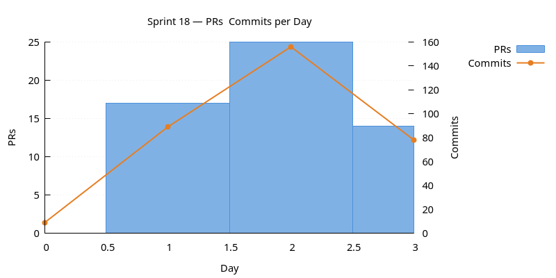
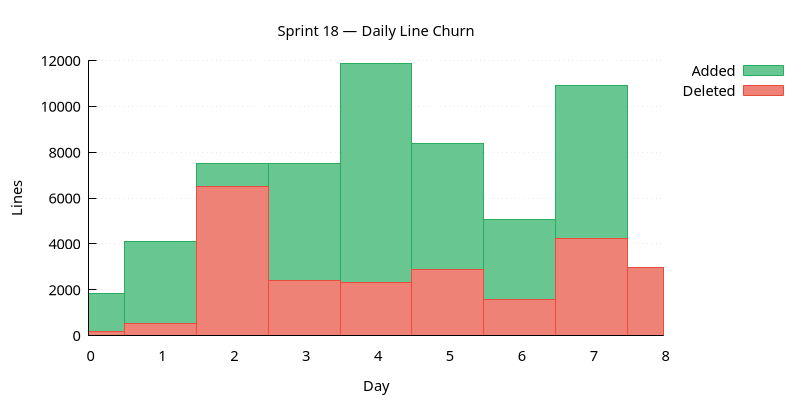
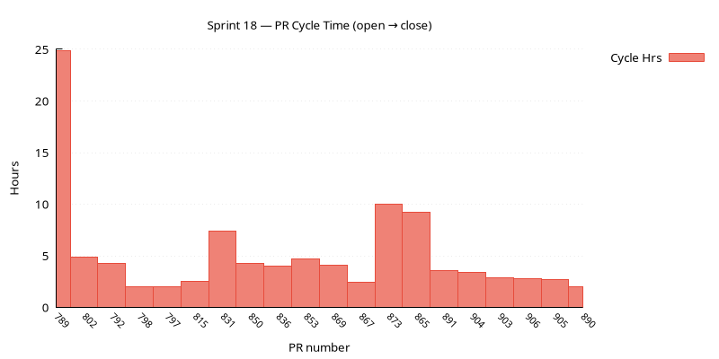
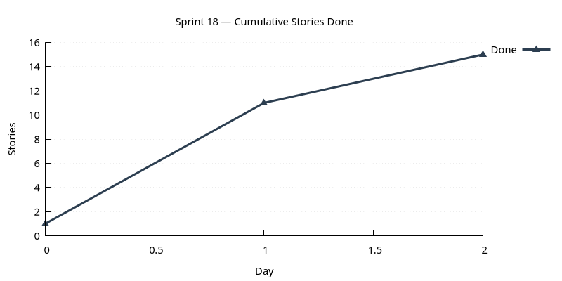

:PROPERTIES:
:ID: FE82780A-789D-4C41-BADF-827B0CD9A540
:END:
#+title: ORE Studio Sprint 18 – Release Notes
#+description: Sprint 18 release notes (May 2026).
#+type: release_notes
#+level: cross
#+filetags: :release_notes:sprint_18:v0:
#+created: 2026-05-29
#+updated: 2026-05-29
#+startup: inlineimages

/May 2026/

[[../../../../../assets/images/ore_studio-v0.0.18.png]]

Sprint 18 set out to enable end-to-end ORE imports into workspaces and expand
supported ORE types, but the sprint health review concluded RED: no primary
product goals were met and the ten product stories that remained were carried
forward unfinished. This was not ideal — the sprint lost focus early and
accumulated tooling and documentation work at the expense of its stated mission.
What the sprint /did/ deliver was substantial platform investment: 117 PRs over
eight days covering the new =ores.compass= CLI tool, comprehensive LLM-first
documentation, improved agile artefacts, runbook and skill tooling, PlantUML
integration, sprint health charts and System 2 reviews, and a rich cybernetics
and org-roam knowledge base. Sprint 19 must return to the product backlog and
treat ORE pipeline progress as the primary objective.

-----

* ✅ Highlights

- New =ores.compass= CLI tool: orientation (=where=), agile scaffolding (=add=),
  capture workflow, cross-worktree status, and =goto= for one-command unit
  start.
- Sprint health charts (PRs, commits, line churn, story completion) rendered
  as PNGs into each sprint page, plus structured System 2 health reviews.
- Runbook document type introduced; skill tooling tightened (compass skill type,
  updated skill-creation recipe, run-runbook skill).
- LLM-first philosophy page, Claude Code tool page, Emacs/org-roam/Zettelkasten
  knowledge pages, and cybernetics documentation improvements.
- PlantUML integration: how-to recipe, compass diagram scaffold, and licence
  header convention.
- Theme grouping in sprint.org, task-list-to-table refactor, and hotfix
  handling runbook complete the agile artefact improvements.

* 🛠️ Key Improvements

** Build & Portability

- *Build and publish user manual PDF via CMake*: A =deploy_manual= CMake target compiles =user_manual.org= to a PDF via Emacs/LaTeX.
- *Resolve RFL complexity issues*: Permanently resolve MSVC C1202 and Clang expression-nesting failures in =ores.qt.api= via TU splits, two-phase parsing, and increased compiler limits.
- *SQLite CLI quality-of-life setup*: Committed =.sqliterc= gives headed, box-drawn, non-wrapping output with NULL markers and query timing from the =sqlite3= shell.
- *Lock down uppercase UUID invariant*: All =:ID:= properties and =[[id:UUID]]= links in =doc/= must be uppercase; all code paths that mint UUIDs produce uppercase by construction.
- *Remove unused GitHub Actions workflows*: Delete the four dormant Gemini workflows; PR review stays via the gemini-code-assist app.

** Financial Features

- *Add support for running ORE samples*: End-to-end execution of ORE sample input files from within ORE Studio: workspace promoted to a full entity, data import session backend and UI, and ORE results surfaced in the UI.

** Compass Tooling

- *ores.compass repository compass tool*: New =ores.compass= Python project: /Locate/ (current version, sprint, in-flight stories and tasks), /Search/ (semantic doc retrieval from =org-roam= data), and /Scaffold/ (add stories, tasks, sprints, recipes via codegen).
- *ores.compass Locate — temporal orientation*: =compass where= reports current version, sprint, and in-flight stories and tasks computed from the documentation graph.
- *ores.compass Scaffold — agile authoring*: =compass add story/task/sprint/recipe= creates agile artefacts from the CLI.
- *Track PRs per task and surface in compass where*: PRs table in task docs; =compass where --prs= fetches live PR status via =gh=.
- *Add org-roam index links to compass.org folder entries*: Every folder entry in =doc/compass.org= links to its index file.
- *compass cross-worktree status (global where)*: One command shows every git worktree's branch, story, task, and open PR, preventing parallel-agent collisions.
- *compass goto: start a unit of work in one command*: =compass goto= fetches main, creates the branch, and scaffolds the linked story and task in a single step.
- *compass goto --kind flag*: Add =--kind hotfix= to =compass goto= for =hotfix/<slug>= branches; update runbook, recipe, and docs.
- *Per-sprint capture workflow: individual files and compass integration*: Per-sprint =captures/= folder with =compass capture= command replacing the single overloaded =capture.org=.
- *Fix product-backlog bucket names in scripts and captures*: Update =regenerate_backlog_indexes.py=, =compass.py=, and captures to use =next/deferred= instead of the old =near/far= names.

** Agile & Process

- *Product backlog refinement*: =backlog-refiner= and =sprint-planner= skills with companion recipes for structured backlog housekeeping and sprint planning.
- *Sprint health review — System 2 analysis*: =sprint-reviewer= skill writes a structured health-check section into =sprint.org=: goal alignment, load, PR velocity, story/task balance, focus signal, and verdict.
- *Sprint health charts*: Daily charts of PRs, commits, line churn, and story completions rendered as PNGs into the sprint page.
- *Refactor story task lists to a status table*: =* Tasks= section in story docs converted from bullet lists to State/Start/End/Description tables.
- *Sprint theme grouping*: =* Stories= in each =sprint.org= grouped under theme subheadings.
- *Hotfix handling*: Hotfix runbook, branching recipe update, and Hotfixes section in the sprint template.

** LLM & Documentation Infrastructure

- *Runbook support*: New =runbook= document type as a named composition of recipes for repeatable multi-step operations.
- *Improve LLM runbook and skill tooling*: Add =compass skill= type, update skill-creation recipe, create =run-runbook= skill.
- *Document deduplication recipe*: Generalised recipe for merging duplicate docs; applied to the duplicate sprint health review runbooks.
- *PlantUML integration: recipe and codegen scaffold*: PlantUML how-to recipe, =compass add diagram= scaffold, and standard licence header convention.
- *Document ORE Studio as an LLM-first system*: LLM-first philosophy page and Claude Code tool page; update =llm.org= index.
- *Port Tufte visualisation skill into ORE Studio*: =tufte-viz= SKILL and two Tufte reference docs converted to org-mode and catalogued.
- *Port domain concept notes to knowledge documents*: Domain notes converted to knowledge documents under =doc/knowledge/domain/=.

** Knowledge & Architecture

- *System model readability*: Layer blurbs and table-based component inventory added to the system model; architecture diagram linked.
- *Document NATS: technology overview, system integration, and recipes*: NATS knowledge page, system model section, per-component subject tables, and NATS recipes.
- *Tooling documentation*: =Tooling= section added to =knowledge.org=; developer scripts doc; overhaul of compass, sql, lisp, and codegen overviews.
- *Add Emacs and org-roam knowledge pages*: Emacs, org-roam, and Zettelkasten knowledge pages; =ores.lisp= expanded; orientation updated.
- *Improve cybernetics documentation*: VSM overview page, expanded Cybernetic Levels with context and limitations, compass link added.
- *Inline org-roam export into ores.lisp*: Vendor =org-roam-export.el= into =ores.lisp= so the CI site build is self-contained.

** Infrastructure

- *Doc format cleanup: migrate v1 docs and remove v2 branding*: Eliminate all "v2" branding from the document toolchain; audit and migrate remaining v1 docs.
- *ORE Studio Emacs dashboard*: Env-aware =emacs-dashboard= console replaces the broken per-mode =ores.lisp= approach where scripts from one checkout bled into another.
- *Move .build-*.el scripts to ores.lisp*: Relocate five build scripts from the project root into =projects/ores.lisp/src/= with the =ores-= prefix convention.

* ⚠️ Known Issues & Postponed

- *Windows and macOS builds are RED*: Both the Windows (MSVC) and macOS CI
  builds are currently failing. The fixes are non-trivial and were not
  addressed this sprint. This is high-priority work for sprint 19 — ORE
  Studio should not remain Linux-only for multiple sprints.
- *ORE sample data* (BACKLOG): deferred.
- *Work through all types for ORE Example 1* (BACKLOG): deferred.
- *Fix instruments not visible in UI* (BACKLOG): deferred.
- *Qt: instrument creation in TradeDetailDialog* (BACKLOG): deferred.
- *Detect and report NATS disconnection* (BACKLOG): deferred.
- *Fix account registration NATS SSL error* (BACKLOG): deferred.
- *ores.compass Product Backlog — next and deferred listing* (BACKLOG): deferred.
- *Compass PR review management* (BACKLOG): deferred.
- *Add Downloads and Agile nav entries to the site* (BACKLOG): deferred.
- *Rebuild org-roam DB independently from CMake* (BACKLOG): deferred.

* 📈 Sprint Charts

** PRs and Commits per Day

Dual-axis bar chart. PRs (left axis) and commits (right axis) per day.
A high commits-to-PR ratio may indicate scope creep.

#+attr_html: :width 100%

** Daily Line Churn

Lines added (green) and deleted (red) per day. Building work produces
mostly additions; refactoring produces a mix.

#+attr_html: :width 100%

** PR Cycle Time

Hours from PR open to merge, one bar per PR. Long bars indicate
review bottlenecks.

#+attr_html: :width 100%

** Cumulative Stories Done

Line chart tracking stories marked DONE during the sprint.
Steady upward slope is healthy; plateauing signals a stall.

#+attr_html: :width 100%

* 📊 Time Summary

- *Total effort*: not tracked
- *PRs merged*: 117 (since v0.0.17)
- *Sprint duration*: 2026-05-22 → 2026-05-29

-----

/Sprint 19 priorities: restore Windows and macOS CI builds (both are currently
RED and this must not carry into a third sprint); advance the ORE pipeline
product stories deferred from sprint 18; process and tooling improvements take
a back seat./
