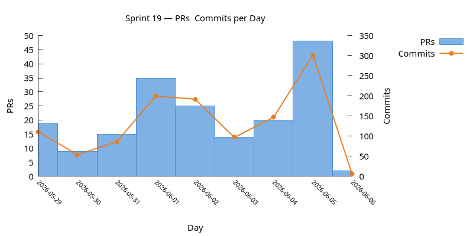
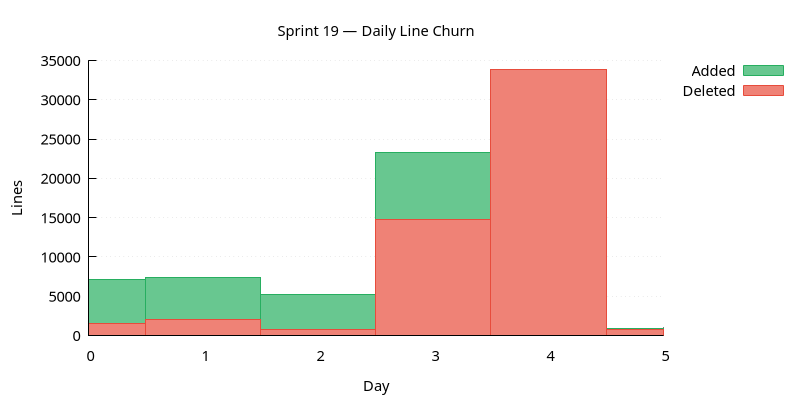
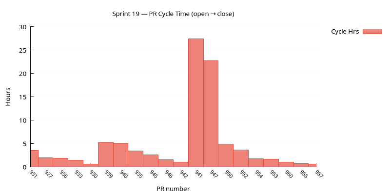
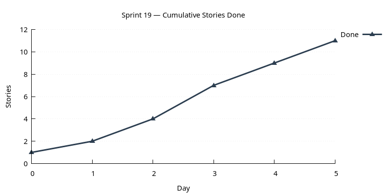

:PROPERTIES:
:ID: 76AE36A4-A3ED-4F48-BDA0-977B362F2238
:END:
#+title: Sprint 19
#+description: Sprint 19 — entity health review post-NATS migration, manual documentation, evaluation tooling, and CI fixes.
#+type: sprint
#+level: s3
#+filetags: :v0:
#+created: 2026-05-29
#+updated: 2026-05-29
#+todo: STARTED | DONE

This page documents a [[id:0820B7FD-147C-4832-AC25-C043D38D5B61][sprint]] (*Sprint 19*) of ORE Studio. It captures the sprint's mission, current status, and the stories that compose it. For the surrounding context — version goals, sprint order, and product identity — see [[id:E6FD30ED-963E-4705-B414-91BF471C23D0][Version 0]].

* Mission

Verify all entity functionality post-NATS migration, document entities in the manual, create entity evaluation tooling, and fix Windows/macOS CI builds.

* Status

| Field          | Value                                                                  |
|----------------+------------------------------------------------------------------------|
| State          | STARTED                                                                |
| Parent version | [[id:E6FD30ED-963E-4705-B414-91BF471C23D0][Version 0]]                                                              |
| Previous       | [[id:1737C00C-699A-475A-BC94-743C6CDA1001][Sprint 18]]                                                              |
| Start          | 2026-05-29                                                             |
| End (expected) |                                                                        |
| Now            | Sprint planning complete; stories lined up for entity health review.   |
| Waiting on     | Nothing.                                                               |
| Next           | Pick up fix_rfl_complexity or refdata_entity_health_review.            |
| Release Notes  | Added at end of sprint.                                                |
| Last touched   | 2026-05-29                                                             |

* Stories

For the definitions of the themes see [[id:A064D838-F127-4DD6-BB42-9A7902039AEE][Themes]].

** Product

*** Epic: ores.refdata Commissioning

Commission all =ores.refdata= entities across every access layer: verify Qt UI end-to-end
post-NATS migration (list window, detail window, history, delete, eventing), implement or
verify shell and CLI commands (list, add, remove), document each entity in the user manual,
and file backlog captures for Wt and HTTP gaps. One story per entity.

#+ATTR_HTML: :class hug-leading
| Story | State | Start | End | Description |
|-------+-------+-------+-----+-------------|
| [[id:7F9C0F29-4268-4B62-A1BB-2153ECF0A858][Commission: currency]] | BACKLOG | | | Verify Qt + shell + CLI (existing); manual; Wt/HTTP captures. |
| [[id:F0FC905B-6A70-486F-A23F-0064B6A3EE75][Commission: country]] | BACKLOG | | | Verify Qt + shell + CLI (existing); manual; Wt/HTTP captures. |
| [[id:FA87AB1F-E0ED-4AC3-A41E-43321626B77C][Commission: party]] | BACKLOG | | | Verify Qt; implement shell + CLI; manual; Wt/HTTP captures. |
| [[id:59583AFF-7657-4F79-BB7E-2086BCA04A91][Commission: party_type]] | BACKLOG | | | Verify Qt; implement shell + CLI; manual; Wt/HTTP captures. |
| [[id:8B3D478B-DD68-44B7-A8BF-DB50F76C9506][Commission: party_status]] | BACKLOG | | | Verify Qt; implement shell + CLI; manual; Wt/HTTP captures. |
| [[id:835EEB1A-DEE8-4E3F-A852-9FFF0FF3AA6C][Commission: party_id_scheme]] | BACKLOG | | | Verify Qt; implement shell + CLI; manual; Wt/HTTP captures. |
| [[id:E1F9C83E-645D-4CFC-B1C9-656651C55BCD][Commission: contact_type]] | BACKLOG | | | Verify Qt; implement shell + CLI; manual; Wt/HTTP captures. |
| [[id:38F1C14C-517C-4EE9-B541-AEA47B252687][Commission: counterparty]] | BACKLOG | | | Verify Qt; implement shell + CLI; manual; Wt/HTTP captures. |
| [[id:04BE9B6F-B43C-426B-96D1-AED89F88FA93][Commission: book]] | BACKLOG | | | Verify Qt; implement shell + CLI; manual; Wt/HTTP captures. |
| [[id:1D582DC3-E5E4-466F-9F8D-C4E16227FA8A][Commission: book_status]] | BACKLOG | | | Verify Qt; implement shell + CLI; manual; Wt/HTTP captures. |
| [[id:2BA9566F-4ACB-4736-AD3D-186FE1E33904][Commission: business_unit]] | BACKLOG | | | Verify Qt; implement shell + CLI; manual; Wt/HTTP captures. |
| [[id:2406AA9C-6B67-4B74-954E-2C04AE833FB9][Commission: business_centre]] | BACKLOG | | | Verify Qt; implement shell + CLI; manual; Wt/HTTP captures. |
| [[id:FD09AD84-DB59-4F22-A31F-3CB32351EE44][Commission: portfolio]] | BACKLOG | | | Verify Qt; implement shell + CLI; manual; Wt/HTTP captures. |
| [[id:3567664E-70D5-4492-946E-B9AC63339651][Commission: rounding_type]] | BACKLOG | | | Verify Qt; implement shell + CLI; manual; Wt/HTTP captures. |
| [[id:DCB5D77C-3BDA-40C1-A74A-F11F9A8C7FEC][Commission: purpose_type]] | BACKLOG | | | Verify Qt; implement shell + CLI; manual; Wt/HTTP captures. |

** Tooling

** Agile

#+ATTR_HTML: :class hug-leading
| Story | State | Start | End | Description |
|-------+-------+-------+-----+-------------|
| [[id:A48DEC19-E769-4C71-AC0B-434B551DC801][Open sprint 19]] | STARTED | 2026-05-29 | | Scaffold sprint 19, wire version manifest, bump version, PR. |
| [[id:2A6F5FE2-8C50-494F-948F-6BA519075FA9][Sprint planning]] | STARTED | 2026-05-29 | | Select stories from backlog, size tasks, confirm mission. |

** LLMs

#+ATTR_HTML: :class hug-leading
| Story | State | Start | End | Description |
|-------+-------+-------+-----+-------------|
| [[id:058DF966-13E0-4D97-9A8B-F22301411015][Entity evaluation skill and runbook]] | BACKLOG | | | Reusable skill + runbook: coverage lookup, functional verification steps, gap report. |

** Documentation

#+ATTR_HTML: :class hug-leading
| Story | State | Start | End | Description |
|-------+-------+-------+-----+-------------|
| [[id:40B50055-EB09-4B5B-B26C-24F0F9CD1C5B][Entity manual: add shell documentation per chapter]] | BACKLOG | | | Each entity chapter in the manual covers Qt UI and shell usage side by side. |

** Infrastructure

#+ATTR_HTML: :class hug-leading
| Story | State | Start | End | Description |
|-------+-------+-------+-----+-------------|
| [[id:7763D0EE-A500-4497-9B2D-973C02ADC739][Fix rfl complexity failure (Windows + macOS CI)]] | BACKLOG | | | Fix ClientManagerTradeDetail.cpp rfl::Literal 502-field compile failure; restore CI builds. |

** Hotfixes

* Health Review

(Run =sprint-reviewer= to generate this section.)

* Charts

Charts generated via [[id:6F3D9B1A-5C7E-4A2D-8F1B-3C9D7E5F2A1B][sprint_charts cmake target]].

** PRs & Commits per Day

Dual-axis bar chart. PRs (left axis) and commits (right axis) per day.
A high commits-to-PR ratio may indicate scope creep.

#+attr_html: :width 100%

** Daily Line Churn

Lines added (green) and deleted (red) per day. Building work produces
mostly additions; refactoring produces a mix. Days with no churn may
indicate blockers.

#+attr_html: :width 100%

** PR Cycle Time

Hours from PR open to merge, one bar per PR. Long bars indicate
review bottlenecks. Generated only when PR data is available.

#+attr_html: :width 100%

** Cumulative Stories Done

Line chart tracking stories marked DONE during the sprint.
Steady upward slope is healthy; plateauing signals a stall.

#+attr_html: :width 100%

* Retrospective

(Filled at sprint close.)
