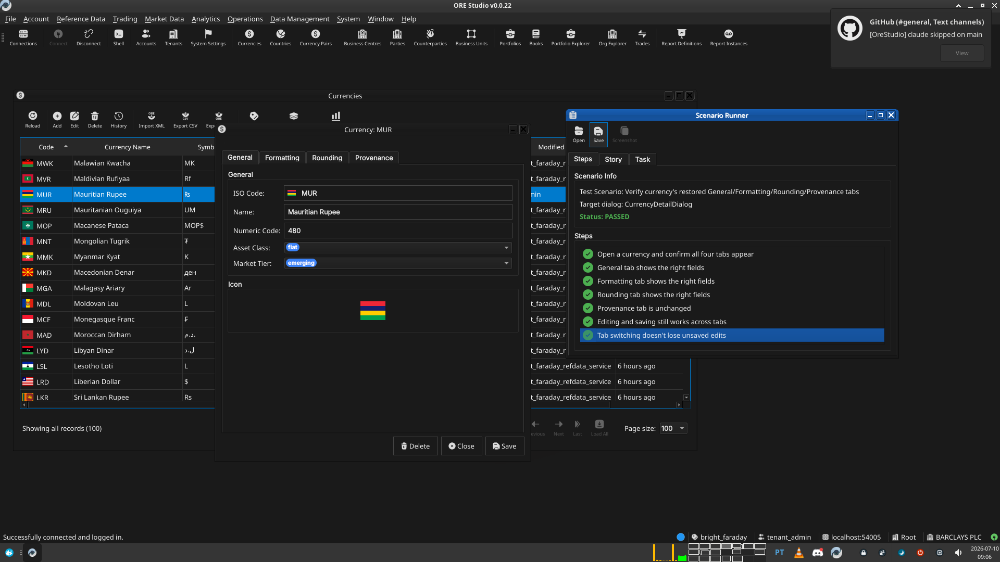

:PROPERTIES:
:ID: D8C8CD08-DB0E-4AF1-9D97-824EBFDE4411
:END:
#+title: Test Scenario: Verify currency's restored General/Formatting/Rounding/Provenance tabs
#+description: Manually verify the view_group codegen support renders currency's detail dialog with the correct four tabs, fields, and editing behaviour, matching the pre-codegen dialog.
#+type: test_scenario
#+level: s1
#+filetags: :codegen:qt:currency:refdata:sprint_22:v0:codegen-view-groups:
#+target_dialog: CurrencyDetailDialog
#+created: 2026-07-10
#+updated: 2026-07-10
#+environment:
#+todo: PENDING | PASSED FAILED

This page documents a test scenario verifying [[id:2C1C628B-7C55-4CC7-B8F9-B3E52A0739A6][Apply view_group tabs to the currency entity (pilot)]] in [[id:FBD97665-3F69-4070-B8D2-5B936B6FEE31][Codegen support for view groups (Qt detail-dialog tabs)]]. It is filled in with the target dialog and checklist of steps before testing starts; the QA Validation Runner panel rewrites =* Results= in place on save.

* Scenario Info

| Field         | Value                                   |
|---------------+------------------------------------------|
| Verifies task | [[id:2C1C628B-7C55-4CC7-B8F9-B3E52A0739A6][Apply view_group tabs to the currency entity (pilot)]] |
| Parent story  | [[id:FBD97665-3F69-4070-B8D2-5B936B6FEE31][Codegen support for view groups (Qt detail-dialog tabs)]]   |
| Target dialog | CurrencyDetailDialog                    |
| Clients       |                                          |
| State         | PENDING                               |

* Steps

** Open a currency and confirm all four tabs appear

Open any currency's detail dialog (e.g. from the Currencies window,
double-click a row). Confirm the dialog shows four tabs, in this
order: General, Formatting, Rounding, Provenance — matching the
manual's description ("The Currency Details dialog has four tabs...").

*** Result

| Field  | Value |
|--------+-------|
| Status | PASS |

** General tab shows the right fields

Confirm the General tab shows: ISO Code, Name, Numeric Code, Asset
Class (a combo), Market Tier (a combo), and the currency's flag icon.
Confirm ISO Code is read-only (it's the primary key).

*** Result

| Field  | Value |
|--------+-------|
| Status | PASS |

** Formatting tab shows the right fields

Confirm the Formatting tab shows: Symbol, Fraction Symbol, Fractions
Per Unit, and Format — and none of the General tab's fields.

*** Result

| Field  | Value |
|--------+-------|
| Status | PASS |

** Rounding tab shows the right fields

Confirm the Rounding tab shows: Rounding Type (a combo) and Rounding
Precision — and none of the other tabs' fields.

*** Result

| Field  | Value |
|--------+-------|
| Status | PASS |

** Provenance tab is unchanged

Confirm the Provenance tab still shows the read-only audit metadata
(version, service, who, when, change reason, commentary) exactly as
before — this tab isn't part of view_group, so it should be completely
untouched by this change.

*** Result

| Field  | Value |
|--------+-------|
| Status | PASS |

** Editing and saving still works across tabs

Change a field on one tab (e.g. the Format field on Formatting), switch
to another tab, then Save. Confirm the change reason dialog appears,
save succeeds, and the change actually took (reopen the dialog or check
the list window's updated row).

*** Result

| Field  | Value |
|--------+-------|
| Status | PASS |

** Tab switching doesn't lose unsaved edits

Type into a field on one tab, switch to a different tab, then switch
back. Confirm the typed value is still there (tab switching shouldn't
reset the underlying widgets — Qt keeps unrelated tabs' state by
default, but worth confirming nothing in the generated code interferes
with it).

*** Result

| Field  | Value |
|--------+-------|
| Status | PASS |

* Results

| Field         | Value |
|---------------+-------|
| Status        | PASSED |
| Completed at  | 2026-07-10T08:06:53Z |
| Branch        | feature/codegen-view-groups |
| Commit        | 039fe4ffd |
| Worktree      | bright_faraday |

* Notes

