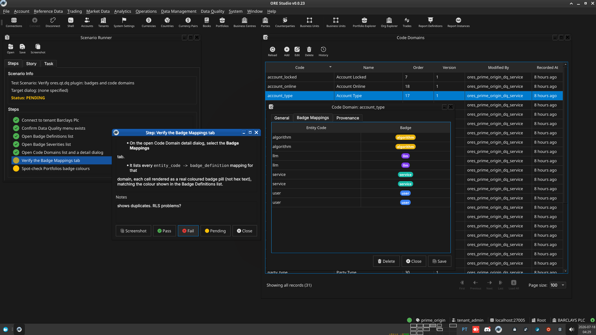

:PROPERTIES:
:ID: AE98D13F-BDB0-4DCE-ACF8-FDAA97B0A707
:END:
#+title: Test Scenario: Verify ores.qt.dq plugin: badges and code domains
#+description: Manually verify the new Data Quality menu and its Badge Definitions/Severities/Code Domains windows after moving them into the ores.qt.dq plugin.
#+type: test_scenario
#+level: s1
#+filetags: :badge-colour-scheme-support:sprint_23:v0:
#+target_dialog:
#+created: 2026-07-18
#+updated: 2026-07-18
#+environment:
#+todo: PENDING | PASSED FAILED
#+startup: inlineimages

This page documents a test scenario verifying [[id:98AC38DD-E800-4961-A6BE-9F018097DAB2][Add a badge_mapping browser UI]] in [[id:1744E882-3141-4EAE-ABC0-C79CD3DA0767][Improve badge colour scheme support]]. It is filled in with the target dialog and checklist of steps before testing starts; the QA Validation Runner panel rewrites =* Results= in place on save.

* Scenario Info

| Field         | Value                                   |
|---------------+------------------------------------------|
| Verifies task | [[id:98AC38DD-E800-4961-A6BE-9F018097DAB2][Add a badge_mapping browser UI]] |
| Parent story  | [[id:1744E882-3141-4EAE-ABC0-C79CD3DA0767][Improve badge colour scheme support]]   |
| Target dialog | CodeDomainDetailDialog                  |
| Clients       |                                          |
| State         | PENDING                               |

* Steps

Each step is its own heading — the title should be short (it's shown
as a single list entry in the QA Validation Runner); put any longer
instructions in the body below the title. The panel writes each
step's PASS/FAIL/PENDING outcome and notes back as a =*** Result=
child heading directly under it.

** Connect to tenant Barclays Plc

Log in against the =prime_origin= environment as
=tenant_admin@barclays_plc= / =Secure-Password-123= and select
*BARCLAYS PLC*.

*** Result

| Field  | Value |
|--------+-------|
| Status | PASS |

** Confirm Data Quality menu exists

- Menu bar shows a top-level *Data &Quality* menu (between Data
  Management and System).
- It contains *Badge Definitions*, *Badge Severities*, and *Code
  Domains* actions.

*** Result

| Field  | Value |
|--------+-------|
| Status | PASS |
| Notes  | in data quality, do not place badge entities in the top level menu. add a badges sub menu |

** Open Badge Definitions list

- Trigger Data Quality > Badge Definitions.
- List window opens showing seeded rows (active/inactive, etc.),
  each with a colour swatch, not raw hex text.

*** Result

| Field  | Value |
|--------+-------|
| Status | PASS |

** Open Badge Severities list

- Trigger Data Quality > Badge Severities.
- List window opens showing seeded severities with swatches.

*** Result

| Field  | Value |
|--------+-------|
| Status | PASS |

** Open Code Domains list and a detail dialog

- Trigger Data Quality > Code Domains.
- List window opens showing seeded domains (e.g. =book_status=).
- Open a detail dialog for a domain that has mappings (e.g.
  =book_status= or =tenant_status=).

*** Result

| Field  | Value |
|--------+-------|
| Status | PASS |

** Verify the Badge Mappings tab

- On the open Code Domain detail dialog, select the *Badge Mappings*
  tab.
- It lists every =entity_code -> badge_definition= mapping for that
  domain, each cell rendered as a real coloured badge pill (not hex
  text), matching the colour shown in the Badge Definitions list.

*** Result

| Field  | Value |
|--------+-------|
| Status | PASS |
| Notes  | shows duplicates. RLS problems?;  |

** Spot-check Portfolios badge colours

- Open the Portfolios list window (Reference Data menu).
- Confirm the *Status* and *Is Virtual* badge columns render with
  correct, non-fallback colours (this was the originally reported
  bug — wrong badge colours on Portfolios screens).
- Open a portfolio's detail dialog and confirm the same badges
  render correctly there too.

*** Result

| Field  | Value |
|--------+-------|
| Status | PASS |
| Notes  | looks good; |

* Results

| Field         | Value |
|---------------+-------|
| Status        | PASSED |
| Completed at  | 2026-07-18T07:34:55Z |
| Branch        | feature/badge-mapping-browser-ui-resume |
| Commit        | dbe245671 |
| Worktree      | prime_origin |

* Notes
