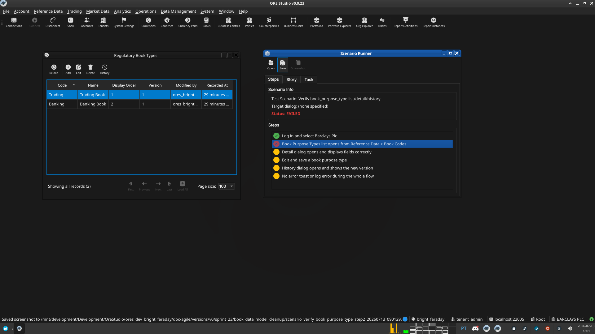

:PROPERTIES:
:ID: B95F7ECA-ABD7-499E-9337-30B3E70EAA25
:END:
#+title: Test Scenario: Verify book_purpose_type list/detail/history
#+description: Manual Qt client steps confirming the new book_purpose_type lookup entity (list, detail, history windows, save, change-reason cache) works end to end with no regressions.
#+type: test_scenario
#+level: s1
#+filetags: :book_data_model_cleanup:sprint_23:v0:
#+target_dialog:
#+created: 2026-07-13
#+updated: 2026-07-13
#+environment:
#+todo: PENDING | PASSED FAILED
#+startup: inlineimages

This page documents a test scenario verifying [[id:5C89033D-224E-4105-A8CF-B0336C2A9014][Add book_purpose_type lookup entity to book]] in [[id:EA22E78F-E4CB-4E76-B854-F85EB4E6AF48][Book data model cleanup]]. It is filled in with the target dialog and checklist of steps before testing starts; the QA Validation Runner panel rewrites =* Results= in place on save.

* Scenario Info

| Field         | Value                                   |
|---------------+------------------------------------------|
| Verifies task | [[id:5C89033D-224E-4105-A8CF-B0336C2A9014][Add book_purpose_type lookup entity to book]] |
| Parent story  | [[id:EA22E78F-E4CB-4E76-B854-F85EB4E6AF48][Book data model cleanup]]   |
| Target dialog | BookPurposeTypeMdiWindow / BookPurposeTypeDetailDialog / BookPurposeTypeHistoryDialog (Reference Data > Book Codes) |
| Clients       |                                          |
| State         | PENDING                               |

* Prerequisites

- Services running: =compass services start=.
- A fresh, Barclays-provisioned database:
  #+begin_src sh :results verbatim
  compass db recreate -y -k
  compass services start
  compass shell -f projects/ores.shell/scripts/library/provisioning/barclays_system_provision.ores
  #+end_src
- A running Qt client, not yet logged in.

* Steps

Each step is its own heading — the title should be short (it's shown
as a single list entry in the QA Validation Runner); put any longer
instructions in the body below the title. The panel writes each
step's PASS/FAIL/PENDING outcome and notes back as a =*** Result=
child heading directly under it.

** Log in and select Barclays Plc

Log in as =tenant_admin@barclays_plc= / =Secure-Password-123=, select
=BARCLAYS PLC=. Confirm all menus enable with no errors.

*** Result

| Field  | Value |
|--------+-------|
| Status | PASS |

** Book Purpose Types list opens from Reference Data > Book Codes

Open Reference Data > Book Codes > Book Purpose Types. Confirm exactly
9 rows appear -- Trading, Reserve, Funding, Wash, Write-off, Test,
Sales, Sweep target, Remittance target -- each with Description and
Display Order populated, no error banner.

*** Result

| Field  | Value |
|--------+-------|
| Status | PASS |

** Detail dialog opens and displays fields correctly

Double-click the "Wash" row. Confirm Code (read-only), Name,
Description, Display Order, Version, and Modified By all populate
correctly.

*** Result

| Field  | Value |
|--------+-------|
| Status | PASS |

** Edit and save a book purpose type

Change the "Wash" row's Description and Save. Confirm the
change-reason prompt appears, the save succeeds, the grid refreshes,
and Version increments by 1.

*** Result

| Field  | Value |
|--------+-------|
| Status | PASS |

** History dialog opens and shows the new version

Open History on "Wash". Confirm both versions appear with distinct
valid_from/valid_to timestamps, and that closing the history dialog
only closes the sub-window, not the whole app.

*** Result

| Field  | Value |
|--------+-------|
| Status | PASS |

** No error toast or log error during the whole flow

Check the client's log tail
(=build/output/<preset>/publish/log/ores.qt.<colour>.log=) for any
ERROR-level line.

*** Result

| Field  | Value |
|--------+-------|
| Status | PASS |
| Notes  | check logs |

* Results

| Field         | Value |
|---------------+-------|
| Status        | PASSED |
| Completed at  | 2026-07-13T08:19:06Z |
| Branch        | feature/add-book-classification-flags |
| Commit        | abd62be30 |
| Worktree      | bright_faraday |

* Notes

