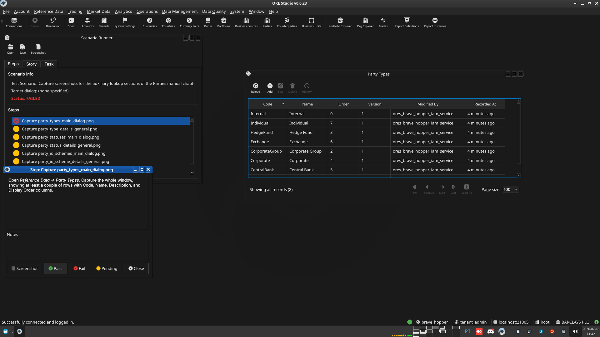
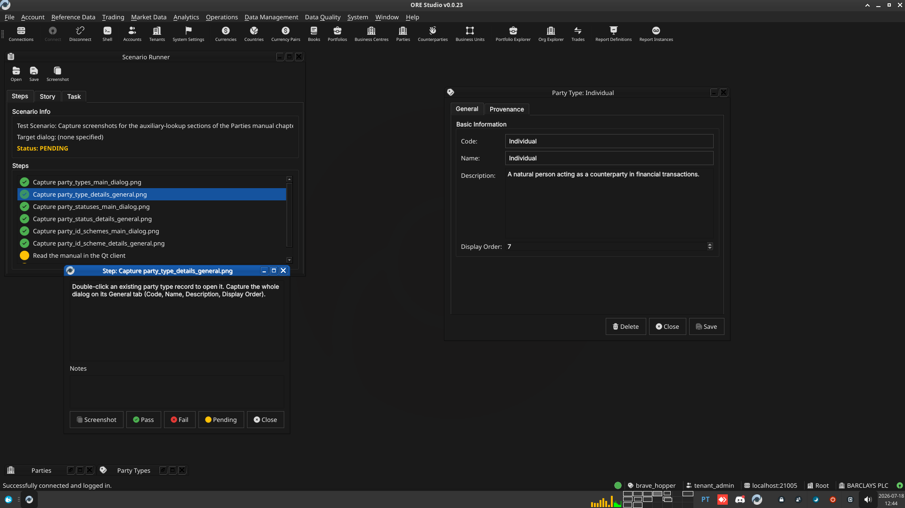
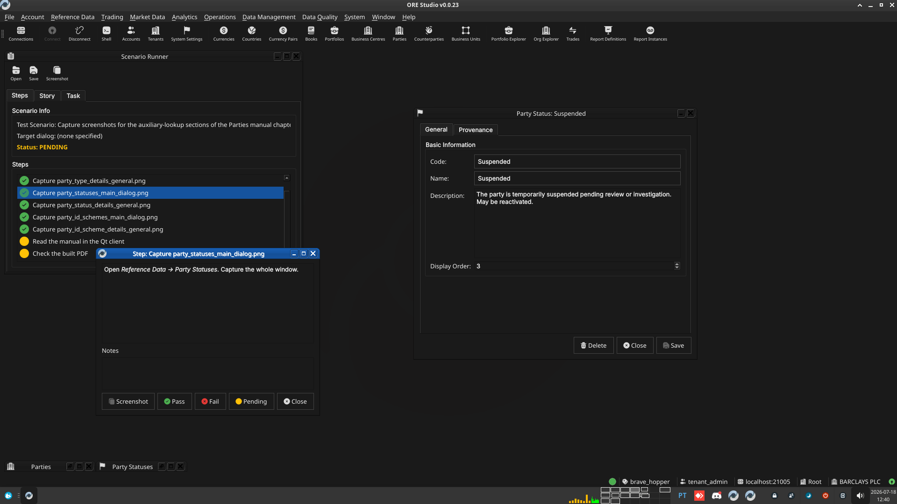
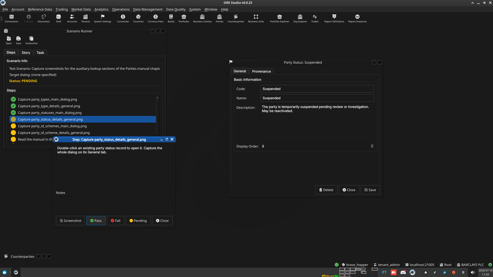
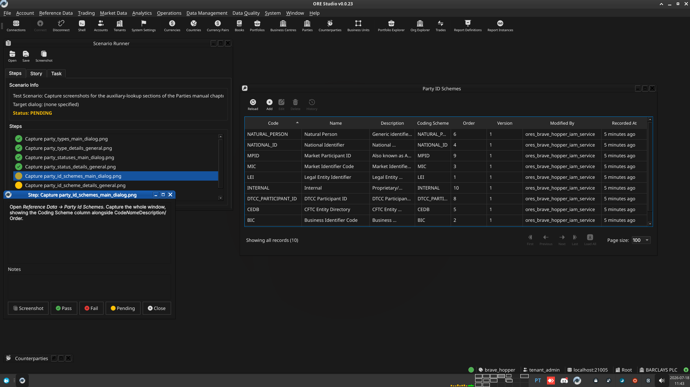
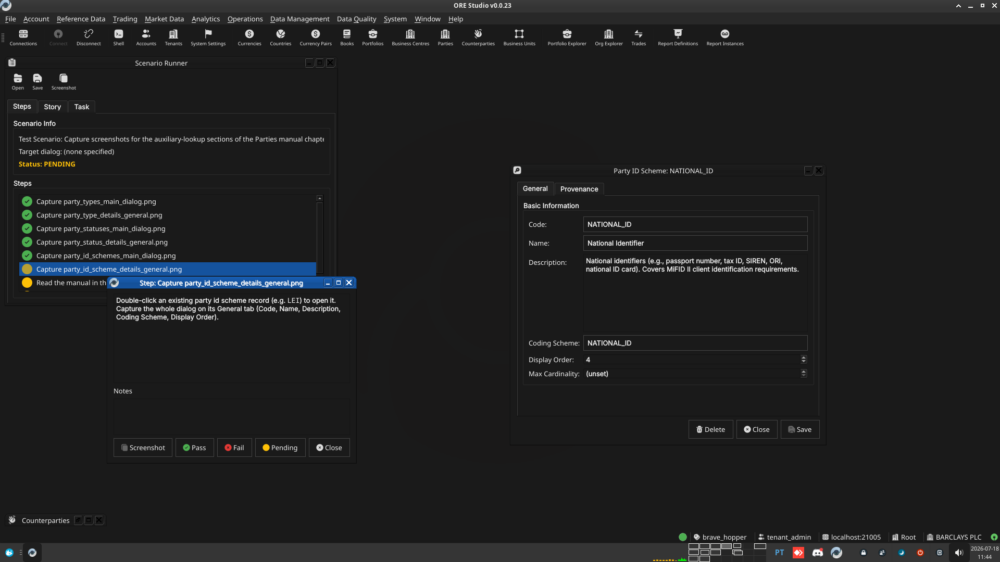

:PROPERTIES:
:ID: 8C58BC03-FD26-4530-8C7D-062768D68B3D
:END:
#+title: Test Scenario: Capture screenshots for the auxiliary-lookup sections of the Parties manual chapter
#+description: Set up UI state and capture the 6 screenshot placeholders added to chapter_8_parties.org for the Party Types, Party Statuses, and Party Id Schemes sections.
#+type: test_scenario
#+level: s1
#+filetags: :commission-party-counterparty-party-status:sprint_23:v0:
#+target_dialog:
#+created: 2026-07-18
#+updated: 2026-07-18
#+environment:
#+todo: PENDING | PASSED FAILED
#+startup: inlineimages

This page documents a test scenario verifying [[id:0AEAA66B-3B71-4E25-B7FA-145416F46C38][Write party_status manual chapter]] in [[id:FE07BF4D-054D-4A69-AF3C-D70D10493370][Commission: party, counterparty, and party_status]]. It is filled in with the target dialog and checklist of steps before testing starts; the QA Validation Runner panel rewrites =* Results= in place on save.

* Scenario Info

| Field         | Value                                   |
|---------------+------------------------------------------|
| Verifies task | [[id:0AEAA66B-3B71-4E25-B7FA-145416F46C38][Write party_status manual chapter]] |
| Parent story  | [[id:FE07BF4D-054D-4A69-AF3C-D70D10493370][Commission: party, counterparty, and party_status]]   |
| Target dialog | PartyTypeMdiWindow, PartyTypeDetailDialog, PartyStatusMdiWindow, PartyStatusDetailDialog, PartyIdSchemeMdiWindow, PartyIdSchemeDetailDialog |
| Clients       |                                          |
| State         | PENDING                               |

* Context

Log in as =tenant_admin@barclays_plc= (password =Secure-Password-123=)
against the =brave_hopper= environment and select the BARCLAYS PLC
party. If the DB was recreated since, run =compass shell -f
projects/ores.shell/scripts/library/provisioning/barclays_system_provision.ores=
first. Services and the Qt client should already be running
(=compass services status=, =compass client start= if not).

This scenario is not a pass/fail correctness check; it exists to walk
through the exact UI states needed for the six screenshot placeholders
in [[proj:doc/manual/user_guide/chapter_8_parties.org][=chapter_8_parties.org=]]. Take the screenshot at each step, save it
under [[proj:doc/assets/images][=assets/images/=]] using the filename given, then mark the step
PASS once captured.

* Steps

** Capture party_types_main_dialog.png

Open /Reference Data → Party Types/. Capture the whole window,
showing at least a couple of rows with Code, Name, Description, and
Display Order columns.

*** Result

| Field  | Value |
|--------+-------|
| Status | PASS |
| Notes  |  |

** Capture party_type_details_general.png

Double-click an existing party type record to open it. Capture the
whole dialog on its General tab (Code, Name, Description, Display
Order).

*** Result

| Field  | Value |
|--------+-------|
| Status | PASS |
| Notes  |  |

** Capture party_statuses_main_dialog.png

Open /Reference Data → Party Statuses/. Capture the whole window.

*** Result

| Field  | Value |
|--------+-------|
| Status | PASS |
| Notes  |  |

** Capture party_status_details_general.png

Double-click an existing party status record to open it. Capture the
whole dialog on its General tab.

*** Result

| Field  | Value |
|--------+-------|
| Status | PASS |
| Notes  |  |

** Capture party_id_schemes_main_dialog.png

Open /Reference Data → Party Id Schemes/. Capture the whole window,
showing the Coding Scheme column alongside Code/Name/Description/Order.

*** Result

| Field  | Value |
|--------+-------|
| Status | PASS |
| Notes  |  |

** Capture party_id_scheme_details_general.png

Double-click an existing party id scheme record (e.g. =LEI=) to open
it. Capture the whole dialog on its General tab (Code, Name,
Description, Coding Scheme, Display Order).

*** Result

| Field  | Value |
|--------+-------|
| Status | PASS |
| Notes  |  |

** Read the manual in the Qt client

Rebuild the Qt-embedded HTML help (=compass build --direct help= then
=cmake --build --preset <preset> --target deploy_help_qch=), restart
the Qt client, open the Parties chapter in /Help → User Manual/, and
read it top to bottom: confirm the prose reads correctly, the segues
work, and every screenshot appears where expected and matches its
caption.

*** Result

| Field  | Value |
|--------+-------|
| Status | PENDING |
| Notes  | Not yet run — pending the Qt-embedded HTML help + .qch rebuild. |

** Check the built PDF

Open the rebuilt =user_manual.pdf= (e.g. =zathura= or =evince=) at the
Parties chapter's pages and confirm layout, figure numbering, and
captions look correct in the PDF's own rendering.

*** Result

| Field  | Value |
|--------+-------|
| Status | PASS |
| Notes  | Rendered page 155-156 via pdftoppm and visually reviewed: figures 13.1/13.2 (Party Types/Type Details) render correctly with correct captions and figure numbers; List of Figures entries for all 6 new figures (13.1, 13.2, 13.3, 13.4, 13.10, 13.11) confirmed via pdftotext. |

* Results

| Field         | Value |
|---------------+-------|
| Status        | PASSED |
| Completed at  | 2026-07-18T14:05:00Z |
| Branch        | feature/add-lookup-toolbar-buttons-party-counterparty |
| Worktree      | brave_hopper |

* Notes
