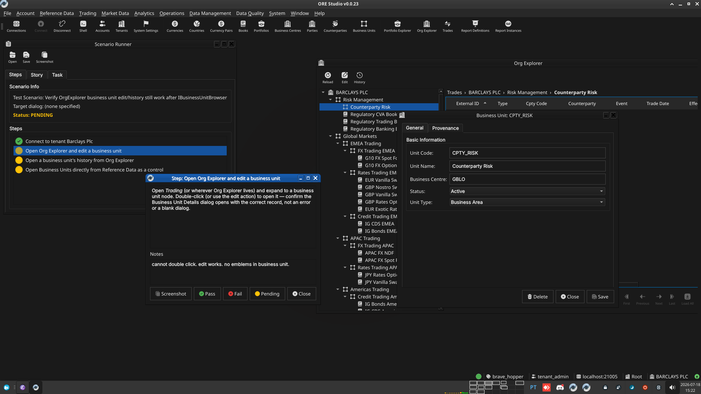

:PROPERTIES:
:ID: 370BA753-673D-4AA4-8A7B-53CD93E271B8
:END:
#+title: Test Scenario: Verify OrgExplorer business unit edit/history still work after IBusinessUnitBrowser regen
#+description: Confirm Org Explorer's business unit edit and history actions still open the correct BusinessUnit windows after regenerating BusinessUnitController against the new explorer_interface codegen seam.
#+type: test_scenario
#+level: s1
#+filetags: :commission-party-counterparty-party-status:sprint_23:v0:
#+target_dialog:
#+created: 2026-07-18
#+updated: 2026-07-18
#+environment:
#+todo: PENDING | PASSED FAILED
#+startup: inlineimages

This page documents a test scenario verifying [[id:C5825F59-3E1A-4E81-98E5-9F9FE8674BF0][Migrate party_status/party_id_scheme/business_unit/business_unit_type from ores.qt.party to ores.qt.refdata]] in [[id:FE07BF4D-054D-4A69-AF3C-D70D10493370][Commission: party, counterparty, and party_status]]. It is filled in with the target dialog and checklist of steps before testing starts; the QA Validation Runner panel rewrites =* Results= in place on save.

* Scenario Info

| Field         | Value                                   |
|---------------+------------------------------------------|
| Verifies task | [[id:C5825F59-3E1A-4E81-98E5-9F9FE8674BF0][Migrate party_status/party_id_scheme/business_unit/business_unit_type from ores.qt.party to ores.qt.refdata]] |
| Parent story  | [[id:FE07BF4D-054D-4A69-AF3C-D70D10493370][Commission: party, counterparty, and party_status]]   |
| Target dialog | OrgExplorerMdiWindow, BusinessUnitDetailDialog, HistoryDialog |
| Clients       |                                          |
| State         | PENDING                               |

* Steps

** Connect to tenant Barclays Plc

Log in against the =brave_hopper= environment as
=tenant_admin@barclays_plc= / =Secure-Password-123= and select
*BARCLAYS PLC*.

*** Result

| Field  | Value |
|--------+-------|
| Status | PASS |

** Open Org Explorer and edit a business unit

Open /Trading/ (or wherever Org Explorer lives) and expand to a
business unit node. Double-click (or use the edit action) to open it
— confirm the Business Unit Details dialog opens with the correct
record, not an error or a blank dialog.

*** Result

| Field  | Value |
|--------+-------|
| Status | PASS |
| Notes  | The actual scope under test (openEdit via IBusinessUnitBrowser) works correctly — the edit action opens the right record. Double-click itself doesn't open it, but that's a pre-existing gap: OrgExplorerMdiWindow never wires doubleClicked on the tree view at all (only on the trade table), unrelated to this task's codegen change. Also found 3 further pre-existing, unrelated gaps while testing: no badge emblems on business unit (filed against the badge-adoption coverage audit task), Business Centre rendered as plain text not a combo (party/counterparty use a flagged_combo for the same field), and editing a business unit doesn't live-refresh an already-open Org Explorer (no event subscription, manual Reload only). All three filed as separate captures; none are regressions from this task's change.  |

** Open a business unit's history from Org Explorer

From the same node, open its history — confirm the History dialog
opens showing the correct business unit's version history.

*** Result

| Field  | Value |
|--------+-------|
| Status | PASS |

** Open Business Units directly from Reference Data as a control

Open /Reference Data → Business Units/ directly (bypassing Org
Explorer) and confirm the list still loads and a record opens
normally, showing the new Business Units toolbar behaves as before.

*** Result

| Field  | Value |
|--------+-------|
| Status | PASS |

* Results

| Field         | Value |
|---------------+-------|
| Status        | PASSED |
| Completed at  | 2026-07-18T15:25:00Z |
| Branch        | feature/migrate-party-lookup-entities-to-refdata |
| Commit        | 989d5b08a |
| Worktree      | brave_hopper |

* Notes
