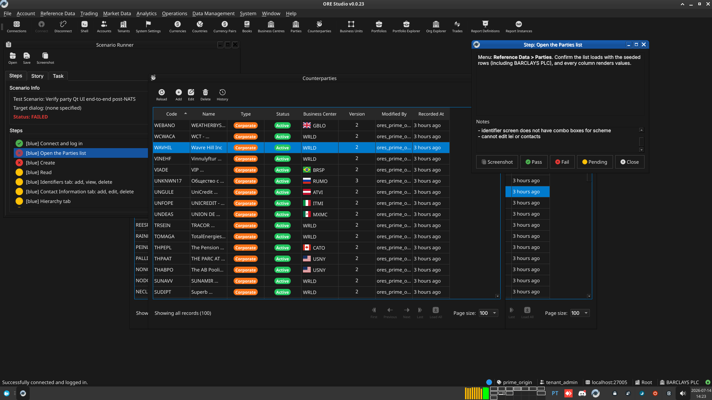
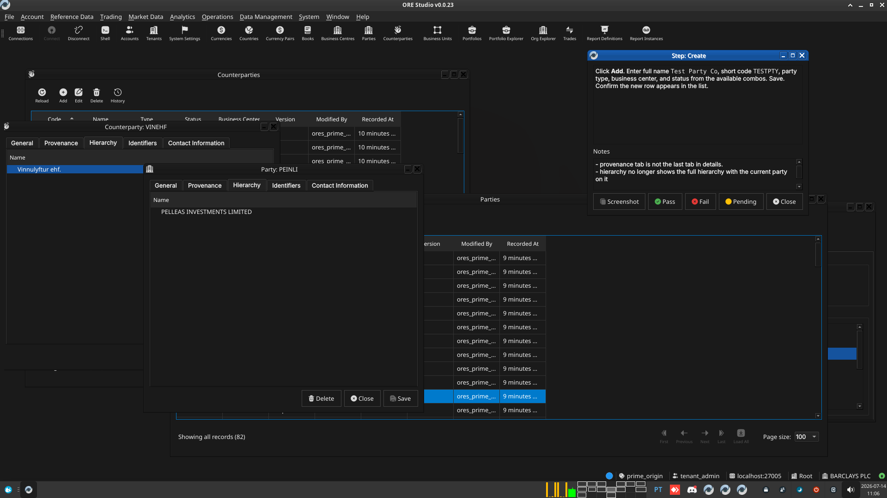

:PROPERTIES:
:ID: 6EB36081-41D3-4500-9BBB-03451959A279
:END:
#+title: Test Scenario: Verify party Qt UI end-to-end post-NATS
#+description: Manual verification of party's Qt UI post-NATS: list, detail (identifiers/contacts/hierarchy tabs), history, delete, and cross-client eventing.
#+type: test_scenario
#+level: s1
#+filetags: :commission-party-counterparty-party-status:sprint_23:v0:
#+target_dialog:
#+created: 2026-07-13
#+updated: 2026-07-13
#+environment:
#+todo: PENDING | PASSED FAILED
#+startup: inlineimages

This page documents a test scenario verifying [[id:32700602-1610-4F40-9914-E704469FDA30][Verify party Qt UI end-to-end post-NATS]] in [[id:FE07BF4D-054D-4A69-AF3C-D70D10493370][Commission: party, counterparty, and party_status]]. It is filled in with the target dialog and checklist of steps before testing starts; the QA Validation Runner panel rewrites =* Results= in place on save.

* Scenario Info

| Field         | Value                                   |
|---------------+------------------------------------------|
| Verifies task | [[id:32700602-1610-4F40-9914-E704469FDA30][Verify party Qt UI end-to-end post-NATS]] |
| Parent story  | [[id:FE07BF4D-054D-4A69-AF3C-D70D10493370][Commission: party, counterparty, and party_status]]   |
| Target dialog | =PartyDetailDialog= / =PartyHistoryDialog= — Menu: *Reference Data > Parties* |
| Clients       | blue, red                               |
| State         | PENDING                               |

* Steps

Each step is its own heading — the title should be short (it's shown
as a single list entry in the QA Validation Runner); put any longer
instructions in the body below the title. The panel writes each
step's PASS/FAIL/PENDING outcome and notes back as a =*** Result=
child heading directly under it.

** blue

*** Connect and log in

Log in as =tenant_admin@barclays_plc= / =Secure-Password-123= (from
=projects/ores.shell/scripts/library/provisioning/barclays_system_provision.ores=
— the exact credentials this scenario's provisioning step used). Select
the *Barclays Plc* / *BARCLAYS PLC* party. If the database has been
recreated since provisioning, re-run:

#+begin_src sh
./compass.sh shell -f projects/ores.shell/scripts/library/provisioning/barclays_system_provision.ores
#+end_src

**** Result

| Field  | Value |
|--------+-------|
| Status | PASS |

*** Open the Parties list

Menu: *Reference Data > Parties*. Confirm the list loads with the
seeded rows (including BARCLAYS PLC), and every column renders values.

**** Result

| Field  | Value |
|--------+-------|
| Status | FAIL |
| Notes  | - all type badges are orange, no colour scheme seems to be in place; - cant save (missing change reasons support?); - in status, suspended partyshould be yellow for warning; - cant add identifiers; - can add contacts but then they dont show up; - identifier screen does not have combo boxes for scheme; - cannot edit lei or contacts; ; ;  |

*** Create

Click *Add*. Enter full name =Test Party Co=, short code =TESTPTY=,
party type, business center, and status from the available combos.
Save. Confirm the new row appears in the list.

**** Result

| Field  | Value |
|--------+-------|
| Status | FAIL |
| Notes  | - provenance tab is not the last tab in details.; - hierarchy no longer shows the full hierarchy with the current party on it; - no combo boxes for party type, status and business centre; ;  |

*** Read

Double-click the =TESTPTY= row to reopen its detail dialog. Confirm
every field round-trips exactly as saved.

**** Result

| Field  | Value |
|--------+-------|
| Status | PENDING |

*** Identifiers tab: add, view, delete

Open the *Identifiers* tab. Click *Add Identifier*, enter a scheme and
value, save. Confirm the new row appears in the table. Select it and
click *Delete Identifier*; confirm it disappears.

**** Result

| Field  | Value |
|--------+-------|
| Status | PENDING |

*** Contact Information tab: add, edit, delete

Open the *Contact Information* tab. Click *Add Contact*, fill in type/
street/city/country/phone, save. Confirm the row appears. Double-click
the row to reopen the full edit dialog (all 10 fields: type, street
line 1/2, city, state, country code, postal code, phone, email, web
page); change a field and save via *Save*. Confirm the change persists
on reopen. Select the row and click *Delete Contact*; confirm it
disappears.

**** Result

| Field  | Value |
|--------+-------|
| Status | PENDING |

*** Hierarchy tab

Open the *Hierarchy* tab for a party known to have children (e.g. the
Barclays Plc root party, if the seed data has subsidiaries) or set
=TESTPTY='s parent to an existing party first. Confirm the tree
displays the expected parent/child structure.

**** Result

| Field  | Value |
|--------+-------|
| Status | PENDING |

*** Update

Edit =TESTPTY='s full name to =Test Party Co (updated)= and save.
Confirm the list refreshes with the new name without a manual reload,
and that a change-reason prompt was shown and recorded.

**** Result

| Field  | Value |
|--------+-------|
| Status | PENDING |

*** Delete

Select the =TESTPTY= row and click *Delete*, confirming the prompt.
Confirm the row disappears from the list.

**** Result

| Field  | Value |
|--------+-------|
| Status | PENDING |

*** History

Reopen =TESTPTY= via History (not the main list, since its current
version is deleted) and open the History dialog. Confirm all prior
operations — create, update, delete — are listed in order with the
change reasons entered above.

**** Result

| Field  | Value |
|--------+-------|
| Status | PENDING |

** red

*** Connect as a second instance

Log in with the same credentials as the =blue= instance
(=tenant_admin@barclays_plc= / =Secure-Password-123=) and open the
Parties list here too, *before* the =blue= instance performs its
Create step above.

**** Result

| Field  | Value |
|--------+-------|
| Status | PENDING |

*** Confirm the create event arrives

After =blue='s Create step, confirm the =TESTPTY= row appears in this
=red= instance's list *without a manual reload* — this exercises the
Postgres LISTEN/NOTIFY-to-NATS relay end to end.

**** Result

| Field  | Value |
|--------+-------|
| Status | PENDING |

*** Confirm the update and delete events arrive

After =blue='s Update step, confirm the name change lands here
automatically. After =blue='s Delete step, confirm the row disappears
here automatically too.

**** Result

| Field  | Value |
|--------+-------|
| Status | PENDING |

* Results

| Field         | Value |
|---------------+-------|
| Status        | FAILED |
| Completed at  | 2026-07-14T13:23:32Z |
| Branch        | feature/build-composite-child-table-qt-facet |
| Commit        | 538fc9881 |
| Worktree      | prime_origin |

* Notes
