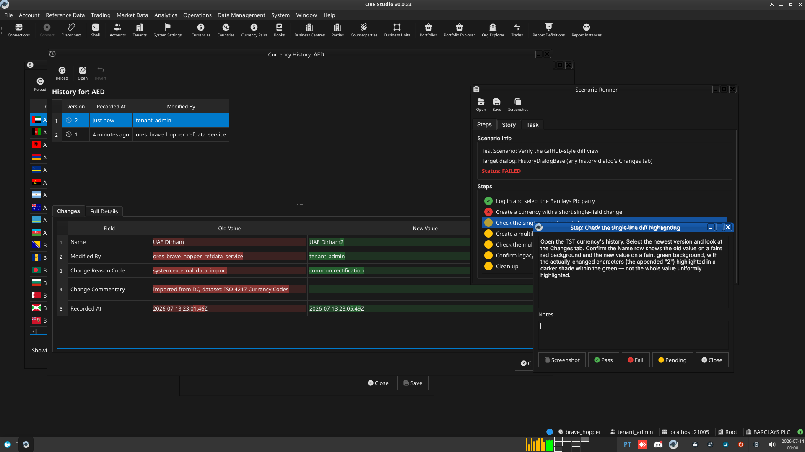
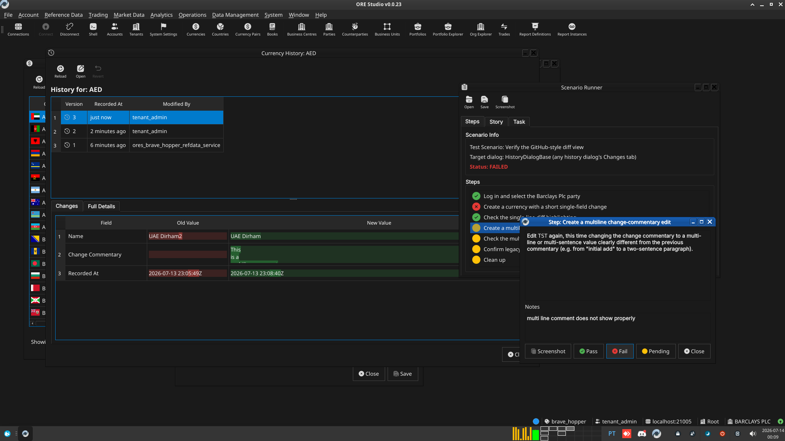

:PROPERTIES:
:ID: 500304C7-2B57-4C2F-A95B-2CF5450EDD73
:END:
#+title: Test Scenario: Verify the GitHub-style diff view
#+description: Manually verify the changes tab renders red/green backgrounds with intra-line/token highlighting, including multiline field diffs.
#+type: test_scenario
#+level: s1
#+filetags: :consolidate_history_dialogs:sprint_23:v0:
#+target_dialog: HistoryDialogBase (any history dialog's Changes tab)
#+created: 2026-07-14
#+updated: 2026-07-14
#+environment:
#+todo: PENDING | PASSED FAILED
#+startup: inlineimages

This page documents a test scenario verifying [[id:7454EE7E-1763-495B-94F4-0AFC9BADB2C5][GitHub-style diff view in history changes tab]] in [[id:037B474D-84ED-4888-9054-D58AB1FB10D2][Consolidate history dialogs onto HistoryDialogBase]]. It is filled in with the target dialog and checklist of steps before testing starts; the QA Validation Runner panel rewrites =* Results= in place on save.

* Scenario Info

| Field         | Value                                   |
|---------------+------------------------------------------|
| Verifies task | [[id:7454EE7E-1763-495B-94F4-0AFC9BADB2C5][GitHub-style diff view in history changes tab]] |
| Parent story  | [[id:037B474D-84ED-4888-9054-D58AB1FB10D2][Consolidate history dialogs onto HistoryDialogBase]]   |
| Target dialog | HistoryDialogBase (any history dialog's Changes tab) |
| Clients       |                                          |
| State         | PENDING                               |

* Steps

** Log in and select the Barclays Plc party

Log in as =tenant_admin@barclays_plc= / =Secure-Password-123= and
select "BARCLAYS PLC" as the active party if prompted. If the
database has been recreated since this was last provisioned, first
run =./compass.sh shell -f
projects/ores.shell/scripts/library/provisioning/barclays_system_provision.ores=
to reprovision it.

*** Result

| Field  | Value |
|--------+-------|
| Status | PASS |

** Create a currency with a short single-field change

Reference Data > Currencies > Add. Add a currency with ISO code
=TST=, then edit it once changing only the Name (e.g.
=TestCurrency= -> =TestCurrency2=). Use change reason code
=system.test=.

*** Result

| Field  | Value |
|--------+-------|
| Status | FAIL |
| Notes  | save button disabled |

** Check the single-line diff highlighting

Open the =TST= currency's history. Select the newest version and
look at the Changes tab. Confirm the Name row shows the old value on
a faint red background and the new value on a faint green
background, with the actually-changed characters (the appended "2")
highlighted in a darker shade within the green — not the whole value
uniformly highlighted.

*** Result

| Field  | Value |
|--------+-------|
| Status | PASS |
| Notes  |  |

** Create a multiline change-commentary edit

Edit =TST= again, this time changing the change commentary to a
multi-line or multi-sentence value clearly different from the
previous commentary (e.g. from "initial add" to a two-sentence
paragraph).

*** Result

| Field  | Value |
|--------+-------|
| Status | PASS |

** Check the multiline diff rendering

Select that newest version's Changes tab row for Change Commentary.
Confirm it renders as a real line-by-line diff (unchanged lines/words
in the tint background, changed words highlighted darker) rather
than the entire multi-line value highlighted as one block, and that
line breaks render as actual line breaks (not squashed onto one
line).

*** Result

| Field  | Value |
|--------+-------|
| Status | FAIL |
| Notes  | multi line comment does not show properly; ;  |

** Confirm legacy per-entity dialogs also upgraded

Open the history for an entity that still uses its own hand-rolled
per-entity dialog (i.e. not currency) — e.g. Reference Data >
Countries. Make a small edit first if it has no history yet. Confirm
its Changes tab also shows the same red/green highlighting, proving
the change is centralised in HistoryDialogBase and not specific to
the generic HistoryDialog.

*** Result

| Field  | Value |
|--------+-------|
| Status | PASS |

** Clean up

Delete the =TST= currency (and any test edits made to the other
entity) once verification is complete.

*** Result

| Field  | Value |
|--------+-------|
| Status | PASS |

* Results

| Field         | Value |
|---------------+-------|
| Status        | FAILED |
| Completed at  | 2026-07-13T23:10:04Z |
| Branch        | feature/github-style-history-diff-view |
| Commit        | 922a7ae5f |
| Worktree      | brave_hopper |

* Notes
