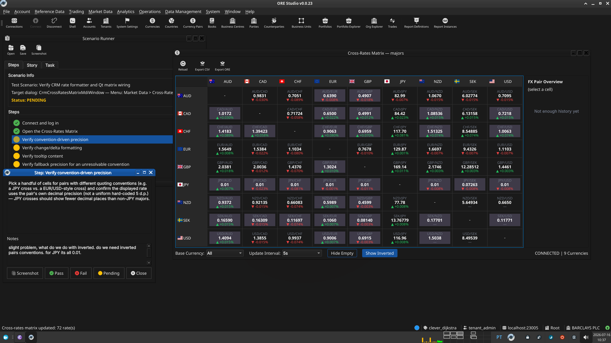

:PROPERTIES:
:ID: 7F8A32C1-98D8-4CF7-9927-F8A62C3C3626
:END:
#+title: Test Scenario: Verify CRM rate formatter and Qt matrix wiring
#+description: Verifies convention-aware rate/change/tooltip formatting and precision fallback in the Cross-Rates Matrix window.
#+type: test_scenario
#+level: s1
#+filetags: :crm_implementation:sprint_23:v0:
#+target_dialog: CrmCrossRatesMatrixMdiWindow — Menu: Market Data > Cross-Rates Matrix
#+created: 2026-07-16
#+updated: 2026-07-16
#+environment:
#+todo: PENDING | PASSED FAILED
#+startup: inlineimages

This page documents a test scenario verifying [[id:4F2FC58A-D715-4159-A93F-E372AD720D0D][Add convention-aware CRM rate formatter and wire into Qt matrix]] in [[id:B38B3869-02FD-4CC7-99BD-9A77904ACA19][Cross-rates matrix (CRM)]]. It is filled in with the target dialog and checklist of steps before testing starts; the QA Validation Runner panel rewrites =* Results= in place on save.

* Scenario Info

| Field         | Value                                   |
|---------------+------------------------------------------|
| Verifies task | [[id:4F2FC58A-D715-4159-A93F-E372AD720D0D][Add convention-aware CRM rate formatter and wire into Qt matrix]] |
| Parent story  | [[id:B38B3869-02FD-4CC7-99BD-9A77904ACA19][Cross-rates matrix (CRM)]]   |
| Target dialog | CrmCrossRatesMatrixMdiWindow — Menu: Market Data > Cross-Rates Matrix |
| Clients       |                                          |
| State         | PENDING                               |

* Steps

Each step is its own heading — the title should be short (it's shown
as a single list entry in the QA Validation Runner); put any longer
instructions in the body below the title. The panel writes each
step's PASS/FAIL/PENDING outcome and notes back as a =*** Result=
child heading directly under it.

** Connect and log in

Start the client, connect to =nats://localhost:23005= (or whatever
=--nats-url= the running instance was started with), and log in as
=tenant_admin@barclays_plc= / =Secure-Password-123= (from
=barclays_system_provision.ores=). Select tenant *Barclays Plc* and
party *BARCLAYS PLC* if prompted (the account's default party is
already set to BARCLAYS PLC).

*** Result

| Field  | Value |
|--------+-------|
| Status | PASS |

** Open the Cross-Rates Matrix

Menu: *Market Data > Cross-Rates Matrix*. Pick "All" (or a specific
CRM if a dialog prompts) and confirm the matrix window opens showing
a grid of currency-pair cells.

*** Result

| Field  | Value |
|--------+-------|
| Status | PASS |

** Verify convention-driven precision

Pick a handful of cells for pairs with different quoting conventions
(e.g. a JPY cross vs. a EUR/USD-style cross) and confirm the
displayed rate uses the pair's own decimal precision (not a uniform
hard-coded 5 d.p.) — JPY crosses should show fewer decimal places
than non-JPY majors.

*** Result

| Field  | Value |
|--------+-------|
| Status | FAIL |
| Notes  | slight problem, what do we do with inverted. do we need inverted pairs conventions. for JPY its all 0.01.; ; ;  |

** Verify change/delta formatting

Reload the matrix (toolbar reload action) and confirm each cell's
change indicator (colour/sign) reflects the delta from the previous
rate, formatted to the same precision as the rate itself.

*** Result

| Field  | Value |
|--------+-------|
| Status | PASS |

** Verify tooltip content

Hover over a cell and confirm the tooltip shows the full pair code,
the unrounded/raw rate, and the resolved convention detail (e.g.
which pair-code direction was used), consistent with
=crm_rate_formatter='s tooltip text.

*** Result

| Field  | Value |
|--------+-------|
| Status | PASS |

** Verify fallback precision for an unresolvable convention

If a cell's pair has no =currency_pair_convention= in either
direction (check the *Reference Data > Trading Conventions > Currency
Pair Conventions* list to find or infer one, or use a synthetic/rare
pair if the topology includes one), confirm the cell still renders
using the formatter's default precision rather than erroring or
showing blank.

*** Result

| Field  | Value |
|--------+-------|
| Status | PASS |

* Results

| Field         | Value |
|---------------+-------|
| Status        | FAILED |
| Completed at  | 2026-07-16T09:39:01Z |
| Branch        | feature/crm-rate-formatter-and-qt-wiring |
| Commit        | 1b5b7a7ac |
| Worktree      | clever_dijkstra |

* Notes
