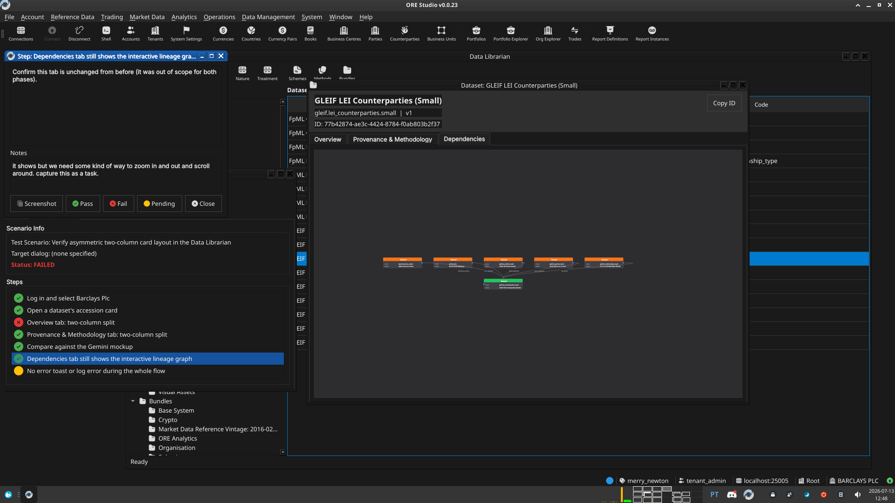

:PROPERTIES:
:ID: C6239167-79BD-4560-B0E5-1459A1FFC03A
:END:
#+title: Test Scenario: Verify asymmetric two-column card layout in the Data Librarian
#+description: Log in, open a dataset's accession card, and confirm the Overview and Provenance & Methodology tabs use the two-column QSplitter card layout matching the Gemini review's mockup.
#+type: test_scenario
#+level: s1
#+filetags: :improve_data_librarian_accession_card_ui:sprint_23:v0:
#+target_dialog:
#+created: 2026-07-13
#+updated: 2026-07-13
#+environment:
#+todo: PENDING | PASSED FAILED
#+startup: inlineimages

This page documents a test scenario verifying [[id:9D115861-58B9-488F-A639-146666CA1059][Phase 2: asymmetric two-column card layout]] in [[id:E2FCDE38-9EF7-434D-BAB0-CA34DFD3E5CC][Improve Data Librarian accession card UI/UX]]. It is filled in with the target dialog and checklist of steps before testing starts; the QA Validation Runner panel rewrites =* Results= in place on save.

* Scenario Info

| Field         | Value                                   |
|---------------+------------------------------------------|
| Verifies task | [[id:9D115861-58B9-488F-A639-146666CA1059][Phase 2: asymmetric two-column card layout]] |
| Parent story  | [[id:E2FCDE38-9EF7-434D-BAB0-CA34DFD3E5CC][Improve Data Librarian accession card UI/UX]]   |
| Target dialog | DatasetViewDialog (Data Librarian accession card)   |
| Clients       |                                          |
| State         | PENDING                               |

* Prerequisites

- Services running: =compass services start=.
- A running Qt client, not yet logged in.

* Steps

Each step is its own heading — the title should be short (it's shown
as a single list entry in the QA Validation Runner); put any longer
instructions in the body below the title. The panel writes each
step's PASS/FAIL/PENDING outcome and notes back as a =*** Result=
child heading directly under it.

** Log in and select Barclays Plc

Log in as =tenant_admin@barclays_plc= / =Secure-Password-123=, select
=BARCLAYS PLC=.

*** Result

| Field  | Value |
|--------+-------|
| Status | PASS |

** Open a dataset's accession card

Data Management > Data Librarian, open any seeded dataset (e.g.
=ORE Asset Class=).

*** Result

| Field  | Value |
|--------+-------|
| Status | PASS |

** Overview tab: two-column split

Confirm a horizontal splitter with Description and Commentary cards
on the left (~65% width) and Classification, Data Governance
(badges), Audit cards stacked on the right (~35% width) — not the
old flat property tree.

*** Result

| Field  | Value |
|--------+-------|
| Status | PASS |

** Provenance & Methodology tab: two-column split

Confirm the same split: Methodology, Business Context, Commentary
prose cards, a Lifecycle Timeline card, and an Implementation Details
text box on the left; Source, Lineage Metrics, Methodology Info, and
Audit cards on the right.

*** Result

| Field  | Value |
|--------+-------|
| Status | PASS |

** Compare against the Gemini mockup

Open [[file:gemini_librarian_data_cards.png]] side by side with the
running dialog. Confirm the overall shape (persistent header,
two-column split, card sidebar) reads as the same design language —
exact pixel match is not expected.

*** Result

| Field  | Value |
|--------+-------|
| Status | PASS |

** Dependencies tab still shows the interactive lineage graph

Confirm this tab is unchanged from before (it was out of scope for
both phases).

*** Result

| Field  | Value |
|--------+-------|
| Status | PASS |
| Notes  | it shows but we need some kind of way to zoom in and out and scroll around. capture this as a task.;  |

** No error toast or log error during the whole flow

Check the client's log tail
(=build/output/<preset>/publish/log/ores.qt.<colour>.log=) for any
ERROR-level line during this flow.

*** Result

| Field  | Value |
|--------+-------|
| Status | PASS |
| Notes  | check logs |

* Results

| Field         | Value |
|---------------+-------|
| Status        | PASSED |
| Completed at  | 2026-07-13T12:05:28Z |
| Branch        | feature/asymmetric-two-column-layout |
| Commit        | 08c1d9591 |
| Worktree      | merry_newton |

* Notes
