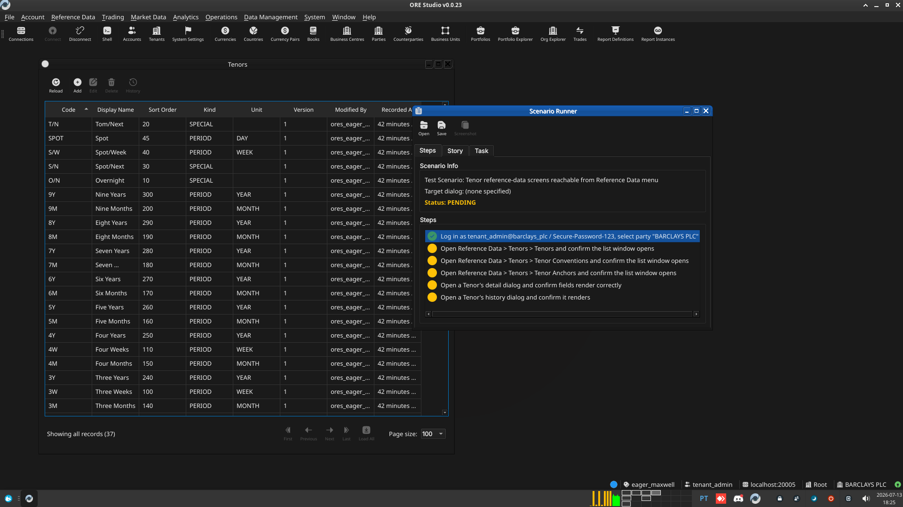

:PROPERTIES:
:ID: 124C6B4E-57FE-4F9A-BDFA-9E7C73275836
:END:
#+title: Test Scenario: Tenor reference-data screens reachable from Reference Data menu
#+description: Verify the Tenors/Tenor Conventions/Tenor Anchors list windows are reachable from Reference Data > Tenors and support basic CRUD, and that a freshly provisioned tenant has its own copy of the tenor reference data.
#+type: test_scenario
#+level: s1
#+filetags: :ir-rates-synthetic-generation:sprint_23:v0:
#+target_dialog:
#+created: 2026-07-13
#+updated: 2026-07-13
#+environment:
#+todo: PENDING | PASSED FAILED
#+startup: inlineimages

This page documents a test scenario verifying [[id:5970B7FF-503D-477B-88DC-04F7147593C3][Migrate tenor entities to ores.refdata, add tenant provisioner copy fix and Tenor Management UI]] in [[id:3ECC4BA8-6ACA-4028-9E42-AE7F25FC3B98][IR Rates synthetic data generation]]. It is filled in with the target dialog and checklist of steps before testing starts; the QA Validation Runner panel rewrites =* Results= in place on save.

* Scenario Info

| Field         | Value                                   |
|---------------+------------------------------------------|
| Verifies task | [[id:5970B7FF-503D-477B-88DC-04F7147593C3][Migrate tenor entities to ores.refdata, add tenant provisioner copy fix and Tenor Management UI]] |
| Parent story  | [[id:3ECC4BA8-6ACA-4028-9E42-AE7F25FC3B98][IR Rates synthetic data generation]]   |
| Target dialog | TenorMdiWindow / TenorConventionMdiWindow / TenorAnchorMdiWindow — Menu: Reference Data > Tenors |
| Clients       |                                          |
| State         | PENDING                               |

* Steps

** Log in as tenant_admin@barclays_plc / Secure-Password-123, select party "BARCLAYS PLC"

If the database was recreated since this tenant was last provisioned,
re-run =projects/ores.shell/scripts/library/provisioning/barclays_system_provision.ores=
via =compass shell -f <path>= first.

*** Result

| Field  | Value |
|--------+-------|
| Status | PASS |

** Open Reference Data > Tenors > Tenors and confirm the list window opens

Should show 37 rows (system default tenor labels: O/N, T/N, S/N, S/W,
1W..1Y etc.) copied into this tenant.

*** Result

| Field  | Value |
|--------+-------|
| Status | PASS |
| Notes  | - default sort column should be the sort order.; - tenor window should have icons in toolbar for conventions and anchors. see how this is done elsewhere with codegen (e.g. currency) |

** Open Reference Data > Tenors > Tenor Conventions and confirm the list window opens

Should show 3 rows (e.g. RATES_SPOT_FORWARD, FX_SWAP_NEAR_LEG, CREDIT_CDS_IMM).

*** Result

| Field  | Value |
|--------+-------|
| Status | PASS |

** Open Reference Data > Tenors > Tenor Anchors and confirm the list window opens

Should show 5 rows (e.g. SPOT, TODAY, TOMORROW, NEAR_LEG, IMM_ROLL).

*** Result

| Field  | Value |
|--------+-------|
| Status | PASS |

** Open a Tenor's detail dialog and confirm fields render correctly

Double-click any row in the Tenors list; check code/display_name/kind/
unit/multiplier fields are populated and the dialog closes cleanly.

*** Result

| Field  | Value |
|--------+-------|
| Status | PASS |

** Open a Tenor's history dialog and confirm it renders

Right-click (or the history action) on a Tenor row; confirm the
history dialog opens without error.

*** Result

| Field  | Value |
|--------+-------|
| Status | PASS |

* Results

| Field         | Value |
|---------------+-------|
| Status        | PASSED |
| Completed at  | 2026-07-13T17:29:29Z |
| Branch        | feature/tenor-management-ui |
| Commit        | 0d3c1c71f |
| Worktree      | eager_maxwell |

* Notes

