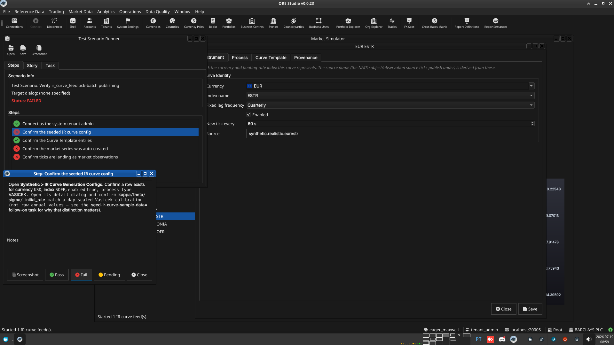
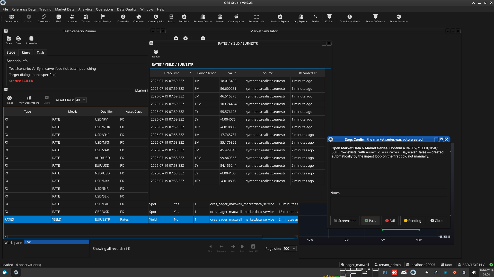

:PROPERTIES:
:ID: 24976F4B-7F04-4430-8DA6-361FF8108AD6
:END:
#+title: Test Scenario: Verify ir_curve_feed tick-batch publishing
#+description: Verify an enabled IR curve generation config publishes a synchronised tenor tick batch and lands as market observations.
#+type: test_scenario
#+level: s1
#+filetags: :ir-rates-synthetic-generation:sprint_23:v0:
#+target_dialog:
#+created: 2026-07-18
#+updated: 2026-07-18
#+environment:
#+todo: PENDING | PASSED FAILED
#+startup: inlineimages

This page documents a test scenario verifying [[id:615FD100-BCD9-4CF5-B9DF-197447769AA9][Tick-batch publishing and persistence for curve instruments]] in [[id:3ECC4BA8-6ACA-4028-9E42-AE7F25FC3B98][IR Rates synthetic data generation]]. It is filled in with the target dialog and checklist of steps before testing starts; the QA Validation Runner panel rewrites =* Results= in place on save.

* Scenario Info

| Field         | Value                                   |
|---------------+------------------------------------------|
| Verifies task | [[id:615FD100-BCD9-4CF5-B9DF-197447769AA9][Tick-batch publishing and persistence for curve instruments]] |
| Parent story  | [[id:3ECC4BA8-6ACA-4028-9E42-AE7F25FC3B98][IR Rates synthetic data generation]]   |
| Target dialog | =IrCurveGenerationConfigMdiWindow=, =IrCurveTemplateEntryMdiWindow=, =MarketSeriesMdiWindow=, =MarketObservationMdiWindow= — Menu: Synthetic > IR Curve Generation Configs / IR Curve Template Entries; Market Data > Market Series / Market Observations |
| Clients       | |
| State         | PENDING                               |

* Steps

Each step is its own heading — the title should be short (it's shown
as a single list entry in the QA Validation Runner); put any longer
instructions in the body below the title. The panel writes each
step's PASS/FAIL/PENDING outcome and notes back as a =*** Result=
child heading directly under it.

** Connect as the system tenant admin

Log in against the =eager_maxwell= environment as =super_admin= /
=Secure-Password-123=, tenant *system* (not Barclays Plc). Auto-start
for IR curve feeds currently only reads system-tenant configs
(matching the existing FX =auto_start_enabled_feeds= pattern) — there
is no manual "start" NATS control-plane for curve feeds yet (Phase 1
scope; see the =seed-ir-curve-sample-data= follow-on task), so a
per-tenant config (e.g. one created under Barclays Plc) would never
actually tick without one.

*** Result

| Field  | Value |
|--------+-------|
| Status | PASS |

** Confirm the seeded IR curve config

Open *Synthetic > IR Curve Generation Configs*. Confirm a row exists
for currency =USD=, index =SOFR=, =enabled= = true, process type
=VASICEK=. Open its detail dialog and confirm =kappa=/=theta=/=sigma=/
=initial_rate= match a day-scaled Vasicek calibration (not raw annual
values — see the =seed-ir-curve-sample-data= follow-on task for why
that distinction matters).

*** Result

| Field  | Value |
|--------+-------|
| Status | PASS |
| Notes  |  |

** Confirm the Curve Template entries

Open *Synthetic > IR Curve Template Entries*, filtered to the config
above. Confirm three ordered rows: sequence 0 (=SPOT=→=3M=, =DEPO=),
sequence 1 (=3M=→=6M=, =FRA=), sequence 2 (=SPOT=→=2Y=, =IRS=).

*** Result

| Field  | Value |
|--------+-------|
| Status | PASS |

** Confirm the market series was auto-created

Open *Market Data > Market Series*. Confirm a =RATES/YIELD/USD/SOFR=
row exists, with =asset_class= = rates, =is_scalar= = false — created
automatically by the ingest loop on the first tick, not manually.

*** Result

| Field  | Value |
|--------+-------|
| Status | PASS |
| Notes  |  |

** Confirm ticks are landing as market observations

Open *Market Data > Market Observations*, filtered to the
=RATES/YIELD/USD/SOFR= series. Confirm three =point_id= values are
present (=3M=, =6M=, =2Y=), each with a numeric =value=, and that
successive batches (poll again after ~1 minute — the config publishes
every tick at 60 ticks/hour) share one =observation_datetime= per
batch and add a new batch on the next tick, with =source= =
=ir_curve.usd.sofr=.

*** Result

| Field  | Value |
|--------+-------|
| Status | PASS |

* Results

| Field         | Value |
|---------------+-------|
| Status        | PASSED |
| Completed at  | 2026-07-19T08:01:18Z |
| Branch        | feature/tick-batch-publishing |
| Commit        | adc49ccbd |
| Worktree      | eager_maxwell |

* Notes

Overall: steps 1-3 (login, config, Curve Template entries) pass
cleanly through the generic CRUD list windows. Steps 4-5 fail only
because the tester was looking in =MarketSimulatorWindow= ("Market
Simulator"), which is hardcoded FX-only and has no IR curve view --
not because the feature doesn't work. The actual mechanism (tick
generation, batching, publish, ingest, auto-create series, persist
observations) is independently confirmed correct via direct SQL
against a live, auto-started system-tenant feed. Re-run this scenario
once the =seed-ir-curve-sample-data= follow-on task adds an IR view to
the manual control-plane, at which point steps 4-5 should be
re-verified through the intended UI path rather than direct SQL.
