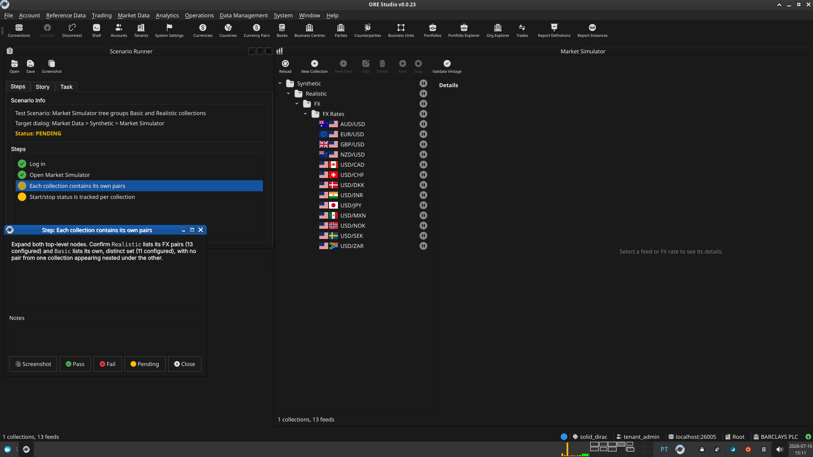

:PROPERTIES:
:ID: 984D929B-4732-47EB-9E7D-392B85034329
:END:
#+title: Test Scenario: Market Simulator tree groups Basic and Realistic collections
#+description: Manual Qt client steps verifying the Market Data Feeds tree shows two top-level nodes (Basic, Realistic) for a party with both collections published, each with its own FX pairs.
#+type: test_scenario
#+level: s1
#+filetags: :synthetic-data-collections:sprint_23:v0:
#+target_dialog: Market Data > Synthetic > Market Simulator
#+created: 2026-07-15
#+updated: 2026-07-15
#+environment: solid_dirac
#+todo: PENDING | PASSED FAILED

This page documents a test scenario verifying [[id:E3DEBE80-3B35-42D4-97B6-F1994D671F4F][Group Market Simulator feed tree by collection]] in [[id:D1234E9D-D79A-4C59-991C-988D1D8F515F][Synthetic data collections: Basic and Realistic]]. It is filled in with the target dialog and checklist of steps before testing starts; the QA Validation Runner panel rewrites =* Results= in place on save.

* Scenario Info

| Field         | Value                                   |
|---------------+------------------------------------------|
| Verifies task | [[id:E3DEBE80-3B35-42D4-97B6-F1994D671F4F][Group Market Simulator feed tree by collection]] |
| Parent story  | [[id:D1234E9D-D79A-4C59-991C-988D1D8F515F][Synthetic data collections: Basic and Realistic]]   |
| Target dialog | Market Data > Synthetic > Market Simulator |
| Clients       |                                          |
| State         | PENDING                               |

* Prerequisites

- Services running: =compass services start=.
- A fresh, Barclays-provisioned database, with the *Basic* dataset
  additionally published for the same party (in addition to the
  *Realistic* dataset the provisioning script publishes by default):
  #+begin_src sh :results verbatim
  compass db recreate -y -k
  compass services start
  compass shell -f projects/ores.shell/scripts/library/provisioning/barclays_system_provision.ores
  #+end_src
  Then, with the tenant/party ids from the provisioned party and the
  "Synthetic FX Spot Configs: Basic" dataset id, publish Basic directly:
  #+begin_src sh :results verbatim
  echo "select * from ores_synthetic_publish_fx_spot_configs_from_dq_fn(
    (select id from ores_dq_datasets_tbl where name = 'Synthetic FX Spot Configs: Basic'
     and valid_to = ores_utility_infinity_timestamp_fn()),
    '<tenant_id>'::uuid, 'upsert',
    jsonb_build_object('party_id', '<party_id>'));" | compass db sql
  #+end_src
- Every Basic/Realistic feed has =price_source = vintage= against
  =fed.h10.2016-02-05=, guarded by the vintage-availability check in
  =feed_controller= -- without this import, *every* start attempt
  (single-feed or folder-cascaded) is correctly rejected as "no vintage
  data found", which reads as a false failure of the Start/stop step
  below. Import it after provisioning:
  #+begin_src sh :results verbatim
  compass shell -u tenant_admin@barclays_plc -p Secure-Password-123 \
    -f projects/ores.shell/scripts/library/marketdata/import_legacy_example_56.ores
  #+end_src
- A running Qt client (not yet logged in — see first step below).

* Steps

** Log in

Username: =tenant_admin@barclays_plc=. Password: =Secure-Password-123=.
Confirm the =BARCLAYS PLC= party is active after login.

*** Result

| Field  | Value |
|--------+-------|
| Status | PASS |

** Open Market Simulator

Menu: *Market Data > Synthetic > Market Simulator*. Confirm the Market
Data Feeds tree shows *two top-level nodes*, one named =Basic= and one
named =Realistic= — not a single flat list of feed-source labels.

*** Result

| Field  | Value |
|--------+-------|
| Status | PASS |

** Each collection contains its own pairs

Expand both top-level nodes. Confirm =Realistic= lists its FX pairs
(13 configured) and =Basic= lists its own, distinct set (11
configured), with no pair from one collection appearing nested under
the other.

*** Result

| Field  | Value |
|--------+-------|
| Status | PASS |
| Notes  |  |

** Start/stop status is tracked per collection

Start a feed under =Basic=. Confirm only that collection's status icon
and the specific pair's status icon change — the =Realistic= node and
its pairs remain unaffected. Stop the feed afterwards.

*** Result

| Field  | Value |
|--------+-------|
| Status | FAIL |
| Notes  | - i've added more data from librarian. that worked well.; - clicking start at FX Rates level did not start. ; - start at the feed level works. ; - start at FX or basic level does not work; - start at synthatic level does not work.; ;  |

* Results

| Field         | Value |
|---------------+-------|
| Status        | FAILED |
| Completed at  | 2026-07-16T14:14:30Z |
| Branch        | feature/feed-namespacing |
| Commit        | 32c37e19d |
| Worktree      | solid_dirac |

* Notes
