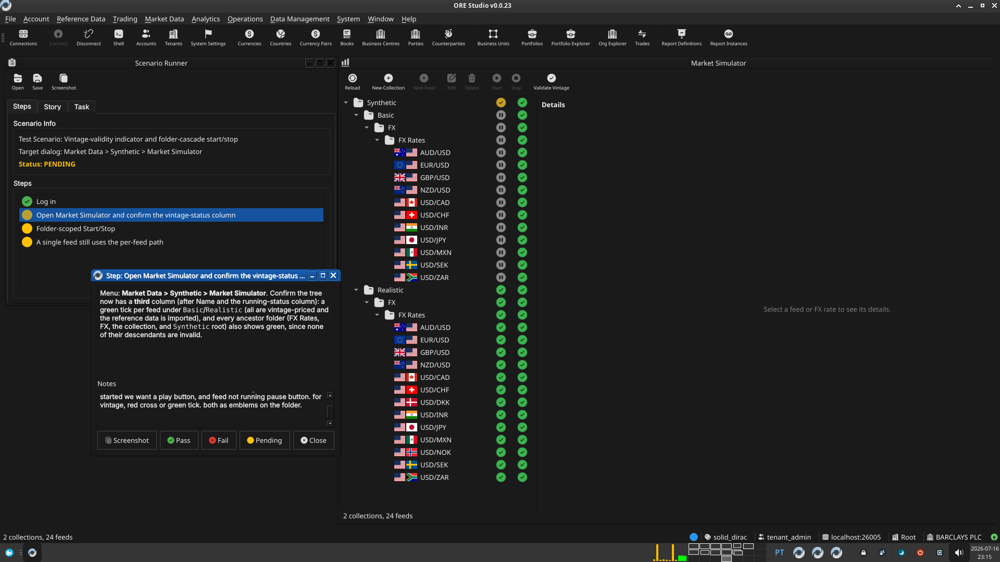

:PROPERTIES:
:ID: 1B5D3529-E591-4A29-BCE3-1D144EE6A0B0
:END:
#+title: Test Scenario: Vintage-validity indicator and folder-cascade start/stop
#+description: Verify the Market Simulator tree shows per-feed/per-folder vintage status and that folder-scoped Start/Stop works.
#+type: test_scenario
#+level: s1
#+filetags: :synthetic-data-collections:sprint_23:v0:
#+target_dialog: Market Data > Synthetic > Market Simulator
#+created: 2026-07-16
#+updated: 2026-07-16
#+environment: solid_dirac
#+todo: PENDING | PASSED FAILED
#+startup: inlineimages

This page documents a test scenario verifying [[id:5E4CD7F4-F267-4CE5-8862-55D15A2B98E0][Server-computed vintage-validity indicator per feed and folder]] in [[id:D1234E9D-D79A-4C59-991C-988D1D8F515F][Synthetic data collections: Basic and Realistic]]. It is filled in with the target dialog and checklist of steps before testing starts; the QA Validation Runner panel rewrites =* Results= in place on save.

* Scenario Info

| Field         | Value                                   |
|---------------+------------------------------------------|
| Verifies task | [[id:5E4CD7F4-F267-4CE5-8862-55D15A2B98E0][Server-computed vintage-validity indicator per feed and folder]] |
| Parent story  | [[id:D1234E9D-D79A-4C59-991C-988D1D8F515F][Synthetic data collections: Basic and Realistic]]   |
| Target dialog | Market Data > Synthetic > Market Simulator |
| Clients       |                                          |
| State         | PENDING                               |

* Steps

** Log in

Username: =tenant_admin@barclays_plc=. Password: =Secure-Password-123=.
Confirm the =BARCLAYS PLC= party is active after login.

*** Result

| Field  | Value |
|--------+-------|
| Status | PASS |

** Open Market Simulator and confirm the vintage-status column

Menu: *Market Data > Synthetic > Market Simulator*. Confirm the tree
now has a *third* column (after Name and the running-status column):
a green tick per feed under =Basic=/=Realistic= (all are vintage-priced
and the reference data is imported), and every ancestor folder (FX
Rates, FX, the collection, and =Synthetic= root) also shows green,
since none of their descendants are invalid.

*** Result

| Field  | Value |
|--------+-------|
| Status | FAIL |
| Notes  | this screen is now very confusing, lots of green ticks all over the place. what we want to see is: what is currently enabled, what is currenly valid. can we make these things a tiny emblem on the folder? like one on the bottom left, one on the bottom right? and for feed started we want a play button, and feed not running pause button. for vintage, red cross or green tick. both as emblems on the folder.; ; ;  |

** Folder-scoped Start/Stop

Select the =Realistic= collection node (not an individual feed) and
click *Start*. Confirm all of its feeds start (running-status icons
turn green) in one action — not one request per feed. Click *Stop* on
the same node and confirm they all stop. Repeat by selecting the
=Synthetic= root node instead, and confirm it starts/stops every feed
across both collections.

*** Result

| Field  | Value |
|--------+-------|
| Status | PASS |

** A single feed still uses the per-feed path

Select one individual feed (not a folder) and click *Start*, then
*Stop*. Confirm it behaves exactly as before — only that feed's status
changes, its collection and root are unaffected until you start
something else under them.

*** Result

| Field  | Value |
|--------+-------|
| Status | PASS |

* Results

| Field         | Value |
|---------------+-------|
| Status        | FAILED |
| Completed at  | 2026-07-16T22:16:27Z |
| Branch        | feature/feed-namespacing |
| Commit        | 9326d2cf7 |
| Worktree      | solid_dirac |

* Notes
