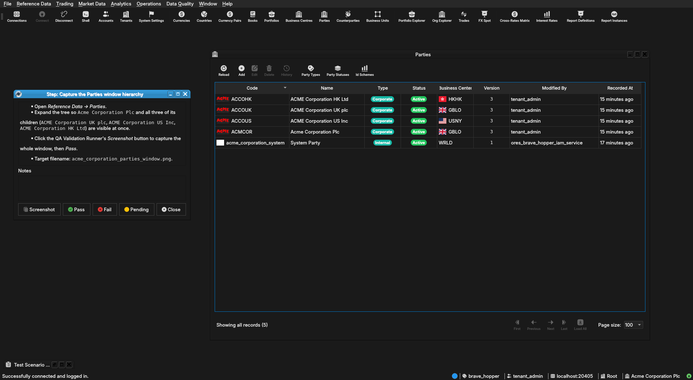
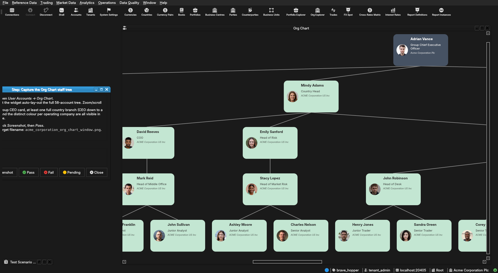

:PROPERTIES:
:ID: BDA711D3-0FBB-4439-AB2E-A485D55D0497
:END:
#+title: Test Scenario: Capture screenshots for the Acme Corporation manual chapter
#+description: Set up UI state and capture the 4 screenshot placeholders in chapter_acme_corporation.org.
#+type: test_scenario
#+level: s1
#+filetags: :acme_corporation_holding_group:sprint_24:v0:
#+target_dialog: PartiesMdiWindow, OrgChartWidget, CounterpartyDetailDialog, TenantProvisioningWizard
#+created: 2026-08-01
#+updated: 2026-08-01
#+environment: brave_hopper
#+todo: PENDING | PASSED FAILED
#+startup: inlineimages

This page documents a test scenario verifying [[id:3630BEB2-A5CE-42FD-85ED-22496B3DBCA7][Write user manual chapter: Acme Corporation as the system's test/demo entity]] in [[id:CB7351E9-8E7E-4BA4-9399-4EB22F6192D4][Commission Acme Corporation: a realistic holding-group test entity]]. It is filled in with the target dialog and checklist of steps before testing starts; the QA Validation Runner panel rewrites =* Results= in place on save.

* Before you start

- The database must be freshly recreated and Acme Corporation
  provisioned via =--source acme=: =compass db recreate -y -k=, then
  =compass services start=, then =compass shell -f
  projects/ores.shell/scripts/library/provisioning/how_do_i_provision_the_system_with_acme_corporation_holding_group.ores=.
  Confirm the run reports "Acme Corporation holding group provisioned"
  with no failed steps before starting.
- The build must be current: =compass build --preset
  linux-clang-debug-make=.

* Scenario Info

| Field         | Value                                   |
|---------------+------------------------------------------|
| Verifies task | [[id:3630BEB2-A5CE-42FD-85ED-22496B3DBCA7][Write user manual chapter: Acme Corporation as the system's test/demo entity]] |
| Parent story  | [[id:CB7351E9-8E7E-4BA4-9399-4EB22F6192D4][Commission Acme Corporation: a realistic holding-group test entity]]   |
| Target dialog | PartiesMdiWindow, OrgChartWidget, CounterpartyDetailDialog, TenantProvisioningWizard |
| Clients       |                                          |
| State         | PASSED                               |

* Steps

** Log in as tenant_admin@acme_corporation

- Start the Qt client (=compass client start=) if it isn't already
  running, or restart it to pick up the fresh build.
- Log in as =tenant_admin@acme_corporation= / =Secure-Password-123=.
  This account carries cross-entity access to all four Acme
  Corporation legal entities (granted by provisioning's Step 7), so
  every later step can see the full holding-group structure without
  switching accounts.
- Confirms the step passed: login succeeds and the main window opens
  with a party selector showing =Acme Corporation Plc= or one of its
  children.

*** Result

| Field  | Value |
|--------+-------|
| Status | PASS |

** Capture the Parties window hierarchy

- Open /Reference Data → Parties/.
- Expand the tree so =Acme Corporation Plc= and all three of its
  children (=ACME Corporation UK plc=, =ACME Corporation US Inc=,
  =ACME Corporation HK Ltd=) are visible at once.
- Click the QA Validation Runner's /Screenshot/ button to capture the
  whole window, then /Pass/.
- Target filename: =acme_corporation_parties_window.png=.

*** Result

| Field  | Value |
|--------+-------|
| Status | PASS |
| Notes  | ; ;  |

** Capture the Org Chart staff tree

- Open /User Accounts → Org Chart/.
- Let the widget auto-lay-out the full 58-account tree. Zoom/scroll
  so the Group CEO card, at least one full country branch (CEO down
  to a trader), and the distinct colour per operating company are all
  visible in one frame.
- Click /Screenshot/, then /Pass/.
- Target filename: =acme_corporation_org_chart_window.png=.

*** Result

| Field  | Value |
|--------+-------|
| Status | PASS |
| Notes  |  |

** Capture the Barclays PLC demo logo

- Open /Reference Data → Counterparties/.
- Find =BARCLAYS PLC= (short code =BRCLYS=) and double-click to open
  its detail dialog.
- Confirm the General tab shows the pre-populated demo logo in its
  picker/flag button — no upload needed, it should already be there
  from provisioning.
- Click /Screenshot/, then /Pass/.
- Target filename: =acme_corporation_barclays_logo.png=.

*** Result

| Field  | Value |
|--------+-------|
| Status | DROPPED |
| Notes  | Decided against including a Barclays-specific worked example in the Acme chapter -- the whole "The Barclays PLC counterparty logo" section was removed from chapter_acme_corporation.org rather than capturing this screenshot. Not a scenario failure. |

** Capture the tenant wizard's Acme choice

- Log out, then log back in as the platform administrator
  (=super_admin=, password =Secure-Password-123=) on the system
  tenant.
- Open /System → Administration → Tenants/ and click /Onboard/ to
  launch the tenant-creation wizard.
- Advance to the data-source step offering the /Acme Corporation
  (full sample bank)/ vs /Manual setup/ radio choice. Capture that
  step *before* selecting either option, then cancel the wizard
  without actually creating a second tenant.
- Click /Screenshot/, then /Pass/.
- Target filename: =acme_corporation_wizard_choice.png=.

*** Result

| Field  | Value |
|--------+-------|
| Status | DROPPED |
| Notes  | QA Validation Runner cannot screenshot QWizard dialogs (not MDI windows), only a manual desktop capture would work. Decided to drop this screenshot and describe the Acme-vs-Manual wizard choice in prose only instead. |

** Read the manual in the Qt client

- Rebuild the Qt-embedded HTML help: =compass build --direct help=,
  then =cmake --build --preset linux-clang-debug-make --target
  deploy_help_qch=.
- Restart the Qt client so it picks up the rebuilt =.qch=.
- Open /Help → User Manual/ and navigate to the Acme Corporation
  chapter. Read it top to bottom exactly as an end user would:
  confirm the prose reads correctly, the segues between sections
  work, and every screenshot appears where expected and actually
  shows what its caption claims.
- Confirms the step passed: no broken image, no section reads
  disconnected from the one before it.

*** Result

| Field  | Value |
|--------+-------|
| Status | PASS |
| Notes  | Found and worked around a real gotcha along the way: the client's HelpViewer only re-registers the .qch if its QHelpEngine namespace isn't already known in the co-located user_manual.qhc index, and the exe's POST_BUILD copy_if_different step only runs on an actual relink -- so a plain full rebuild after deploy_help_qch silently kept serving the stale .qch. Had to manually copy resources/help/user_manual.qch over publish/bin/help/user_manual.qch and delete the stale .qhc before the new chapter appeared. Filed as its own capture for the recipe to document. Chapter reads correctly end to end once the stale cache was cleared. |

** Check the built PDF

- Rebuild the manual PDF: =compass build --direct manual=.
- Open the rebuilt =doc/manual/user_guide/user_manual.pdf= (e.g.
  =zathura= or =evince=) at the Acme Corporation chapter's pages.
- Confirm layout, figure numbering, and captions render correctly in
  the PDF's own rendering (page breaks, figure placement, and the
  List of Figures entries), which can differ from the HTML/Qt-help
  view.
- Confirms the step passed: all four figures appear, correctly
  captioned, with no obvious layout breakage.

*** Result

| Field  | Value |
|--------+-------|
| Status | PASS |
| Notes  | Reviewed via zathura (evince was slow over the network connection). Layout, figure captions, and List of Figures entries for the Acme Corporation chapter all render correctly. |

* Results

| Field         | Value |
|---------------+-------|
| Status        | PASSED |
| Completed at  | 2026-08-01T01:15:00Z |
| Branch        | feature/write-acme-corporation-manual-chapter |
| Commit        | (uncommitted at scenario close) |
| Worktree      | brave_hopper |

* Notes

Two of the four originally-planned screenshots were dropped by
design decisions made during the scenario, not scenario failures:
the Barclays PLC counterparty logo section was removed from the
chapter entirely (see step 4's Result), and the tenant wizard's
Acme-vs-Manual choice is described in prose only, since the QA
Validation Runner cannot screenshot QWizard dialogs (see step 5's
Result). Chapter ships with 2 real screenshots (Parties window, Org
Chart) instead of the originally planned 4.
