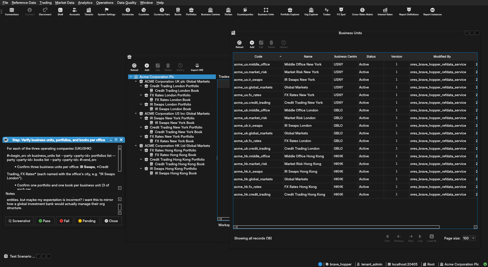

:PROPERTIES:
:ID: D28E67F7-0F2B-4184-B338-57D0F8A29DEC
:END:
#+title: Test Scenario: Acme Corporation readiness: full-system verification
#+description: Comprehensive QA pass verifying Acme Corporation is genuinely ready to replace Barclays as the system's main reference entity: party/business-unit/portfolio/book structure, account default parties, per-role login behaviour, onboarding suppression, logos, and live CRM/IR market data ticking.
#+type: test_scenario
#+level: s1
#+filetags: :acme_corporation_holding_group:sprint_24:v0:
#+target_dialog:
#+created: 2026-07-29
#+updated: 2026-07-29
#+environment:
#+todo: PENDING | PASSED FAILED
#+startup: inlineimages

This page documents a test scenario verifying [[id:D9FC5720-C3B2-4280-9512-A0335CEF8D61][Rework Acme provisioning: simulate real per-party setup via internal actor impersonation]] in [[id:CB7351E9-8E7E-4BA4-9399-4EB22F6192D4][Commission Acme Corporation: a realistic holding-group test entity]]. It is filled in with the target dialog and checklist of steps before testing starts; the QA Validation Runner panel rewrites =* Results= in place on save.

* Scenario Info

| Field         | Value                                   |
|---------------+------------------------------------------|
| Verifies task | [[id:D9FC5720-C3B2-4280-9512-A0335CEF8D61][Rework Acme provisioning: simulate real per-party setup via internal actor impersonation]] |
| Parent story  | [[id:CB7351E9-8E7E-4BA4-9399-4EB22F6192D4][Commission Acme Corporation: a realistic holding-group test entity]]   |
| Target dialog | (several — see individual steps)        |
| Clients       | blue, red, green                        |
| State         | PENDING                               |

* Before you start

- The database must be freshly provisioned via =--source acme=, not
  reused from an earlier partial/failed run: =compass db recreate -y
  -k= then =compass shell -f
  projects/ores.shell/scripts/library/provisioning/how_do_i_provision_the_system_with_acme_corporation_holding_group.ores=
  (see [[id:45B89A49-B2B8-4C1C-9BB7-09EB27E4D50C][How do I provision the system with Acme Corporation (holding group)?]]).
  Confirm the run completes with no failed steps before starting.
- Have a =compass shell= session available alongside the clients —
  several steps cross-check server-side data against what a client
  displays.
- Launch *three separate client instances*, one per role under test,
  so each account's session (default party, menus, permissions) is
  observed in isolation rather than overwriting a shared session via
  logout/login on one window:
  #+begin_src sh
  compass client start --colour blue
  compass client start --colour red
  compass client start --colour green
  #+end_src
  - *blue* — general verification + =tenant_admin@acme_corporation=.
  - *red* — a Trader account.
  - *green* — a Middle Office Manager account.
- Usernames for generated staff accounts are randomised per run
  (=first.last.office.index=) — steps that need one have you look it
  up via =accounts list= rather than assuming a fixed name. Look these
  up (blue client's step below) *before* logging in on red/green.

* Steps

** blue

*** Log in as tenant_admin and select Acme Corporation Plc

- On the *blue* client, log in as =tenant_admin@acme_corporation= / password
  =Secure-Password-123=.
- If the database was recreated since provisioning, re-run: =compass
  db recreate -y -k= then =compass shell -f
  projects/ores.shell/scripts/library/provisioning/how_do_i_provision_the_system_with_acme_corporation_holding_group.ores=
  before logging in.
- Confirm the session lands on *Acme Corporation Plc* with no wizard
  popping up.

**** Result

| Field  | Value |
|--------+-------|
| Status | PASS |
| Notes  | party setup wizard comes up on tenant admin |

*** Verify all four parties exist and are active

In =compass shell=, logged in as =tenant_admin@acme_corporation=:

#+begin_src sh
parties list
#+end_src

- Confirm exactly four parties: *Acme Corporation Plc* (holding) and
  its three operating companies — *ACME Corporation UK plc*, *ACME
  Corporation US Inc*, *ACME Corporation HK Ltd*.
- Confirm every one shows =status: Active= — none left =Inactive= (the
  LEI-import default before activation runs).
- Confirm each has a =full_name= and valid LEI (=9695=-prefixed test
  LEI).

**** Result

| Field  | Value |
|--------+-------|
| Status | PASS |

*** Verify business units, portfolios, and books per office

For each of the three operating companies (UK/US/HK):

#+begin_src sh
business_units list --party <party-id>
portfolios list --party <party-id>
books list --party <party-id>
#+end_src

- Confirm three business units per office: *IR Swaps*, *Credit
  Trading*, *FX Rates* (each named with the office's city, e.g. "IR
  Swaps London").
- Confirm one portfolio and one book per business unit (3 of each per
  office, 9 total across UK/US/HK).
- Confirm the holding company (Acme Corporation Plc) has *no* business
  units/portfolios/books of its own — it's a pure holding entity.

**** Result

| Field  | Value |
|--------+-------|
| Status | FAIL |
| Notes  | we seem to have lost the correct strucutre we had in barclays. i am now able to see all business units and all portfolios books that relate to all entities. what i expected was for each entity to have their own business units and portfolios all completely isolated from the other entities. but maybe my expectation is incorrect? i want this to mirror how a global investment bank would actually manage their org structure.; ;  |

*** Verify staff accounts and roles per office

#+begin_src sh
accounts list --party <party-id>
#+end_src

- Confirm each office has accounts across five desks/functions: *IR
  Swaps*, *Credit Trading*, *FX Rates* (each: 1 Desk Head + 2 Traders)
  and *Middle Office*, *Market Risk* (each: 1 Manager + 2 Analysts) —
  9 accounts per office, 27 across UK/US/HK.
- Confirm each account's =role= field matches its desk (Desk Head /
  Trader / Manager / Analyst).
- Note down one *Trader* username from any office (for the red
  client) and one *Manager* username from Middle Office (for the
  green client) — both needed below.

**** Result

| Field  | Value |
|--------+-------|
| Status | PENDING |

*** Verify the tenant admin's default party

#+begin_src sh
accounts list --party <acme-corporation-plc-party-id>
#+end_src

- Confirm =tenant_admin='s account has =default_party_id= set to
  *Acme Corporation Plc* (the holding company) — not the
  auto-created System Party.
- On the *blue* client, log in as =tenant_admin@acme_corporation= and confirm
  the session lands directly on Acme Corporation Plc (no Party
  Provisioning Wizard, no manual party selection needed).

**** Result

| Field  | Value |
|--------+-------|
| Status | PENDING |

*** Verify onboarding is suppressed for every activated party

- Still logged in as =tenant_admin= on *blue*, switch context to each
  of the four parties in turn (party switcher / equivalent).
- Confirm none of them re-launches the Party Provisioning Wizard —
  =onboarding.party= must read =true= for every party (this was the
  specific gap the old hand-written =--source acme= SQL path used to
  leave unset for LEI-imported parties).

**** Result

| Field  | Value |
|--------+-------|
| Status | PENDING |

*** Verify GLEIF counterparties and the demo logo

#+begin_src sh
counterparties list --limit 5
#+end_src

- Confirm real GLEIF counterparties are present (not empty) —
  confirms Step 2's best-effort import actually landed data.
- On *blue*, open *BARCLAYS PLC*'s counterparty detail dialog and
  confirm its logo/flag renders (regression check for the earlier
  "logo doesn't render" bug — see [[id:BF7C9D7C-F974-4EF5-B34D-ABA5618491C4][Fix: counterparty/party logo does
  not render in the Qt detail dialog]]).
- Open *Acme Corporation Plc*'s party detail dialog and confirm its
  own logo renders too.

**** Result

| Field  | Value |
|--------+-------|
| Status | PENDING |

*** Verify the CRM cross-rates matrix is ticking

- On *blue*, still logged in as =tenant_admin=, open the *CRM
  Cross-Rates Matrix* window scoped to one of the operating-company
  parties.
- Confirm FX pairs from the =synthetic_realistic_2026= theme appear
  with non-zero rates.
- Watch for at least 30 seconds and confirm rates *tick* (values
  change/update live) rather than sitting static — this is the
  concrete "CRM data is installed and live" check the other
  environment's gap report was about.
- If rates appear but never tick, check whether a feed binding exists
  for this party (=FeedBindingMdiWindow= / =feed_bindings list=) —
  bundle-publishing market *data* does not by itself create a feed
  *binding*; note in Notes below whether one had to be created
  manually and record that as a finding, don't silently work around
  it.

**** Result

| Field  | Value |
|--------+-------|
| Status | PENDING |

*** Verify IR curves/rates are ticking

- On *blue*, open the IR rate/curve view (Rate Curves / IR Curve
  Template window) for the same Acme party.
- Confirm IR points from the =marketdata.reference_vintage_2026_05_05=
  vintage / =synthetic_realistic_2026= theme are present for at least
  one currency (e.g. GBP for UK, USD for US, HKD for HK).
- Confirm the curve reflects live ticking data, same caveat as the
  CRM step above — note whether a feed binding was needed.

**** Result

| Field  | Value |
|--------+-------|
| Status | PENDING |

*** Verify each office trades against a realistic counterparty set

- On *blue*, for one operating company, open its book and confirm
  counterparties available for trading are the real GLEIF-imported
  set (not empty, not a synthetic placeholder) — Acme's own legal
  entities are parties, not counterparties, so no "self-trading"
  should appear as an option.

**** Result

| Field  | Value |
|--------+-------|
| Status | PENDING |

** red

*** Log in as a Trader and confirm RBAC

- On the *red* client, log in as the Trader account noted in blue's
  "Verify staff accounts and roles per office" step
  (=<username>@acme_corporation=, password =Secure-Password-123= unless the
  generator set something else — check =generate_data.py= if login
  fails).
- Confirm the session's default party is that trader's *own office*
  party (e.g. a UK trader defaults to ACME Corporation UK plc), not
  the holding company or another office.
- Confirm trading-related menus/screens are visible and accessible
  (whatever the Trader role is expected to unlock) and that
  admin-only screens (tenant management, account management) are
  *not* visible.

**** Result

| Field  | Value |
|--------+-------|
| Status | PENDING |

** green

*** Log in as a Middle Office Manager and confirm RBAC

- On the *green* client, log in as the Middle Office Manager account
  noted in blue's "Verify staff accounts and roles per office" step.
- Confirm the default party is that account's own office.
- Confirm the permission set differs visibly from the Trader's
  session on *red* — e.g. Middle Office/oversight screens accessible,
  trade-entry restricted or absent (record exactly what you see; this
  is the first real exercise of Middle-Office-vs-Trader visibility on
  Acme data).

**** Result

| Field  | Value |
|--------+-------|
| Status | PENDING |

* Results

| Field         | Value |
|---------------+-------|
| Status        | FAILED |
| Completed at  | 2026-07-29T14:38:33Z |
| Branch        | feature/simulate-holding-group-provisioning-via-internal-impersonation |
| Commit        | 3672f4588 |
| Worktree      | brave_hopper |

* Notes

Root cause of the first step's FAIL ("party setup wizard comes up on
tenant admin"), diagnosed 2026-07-29: =system_settings_repository::
remove()= deletes by =name= only (=DELETE ... WHERE name = $1=),
relying on RLS for scoping -- but the RLS policy on
=ores_variability_system_settings_tbl= isolates by =tenant_id= only,
not =party_id=. Every =complete_party_onboarding= call for a new
party silently removes the =onboarding.party= row for *every other
party in the tenant*, so only the last party processed (HK, in
office-loop order) keeps its flag -- the holding company (processed
first, in Step 3) and UK/US lose theirs. This is a pre-existing
product bug, not specific to Acme's provisioning path -- it would hit
any tenant with 2+ parties provisioned via the generic "provision
party" flow too. Filed as [[id:CCBBC80E-DC7C-4C0C-AFD8-CE673169FA43][Fix: onboarding.party flag clobbered across
sibling parties in the same tenant]].
