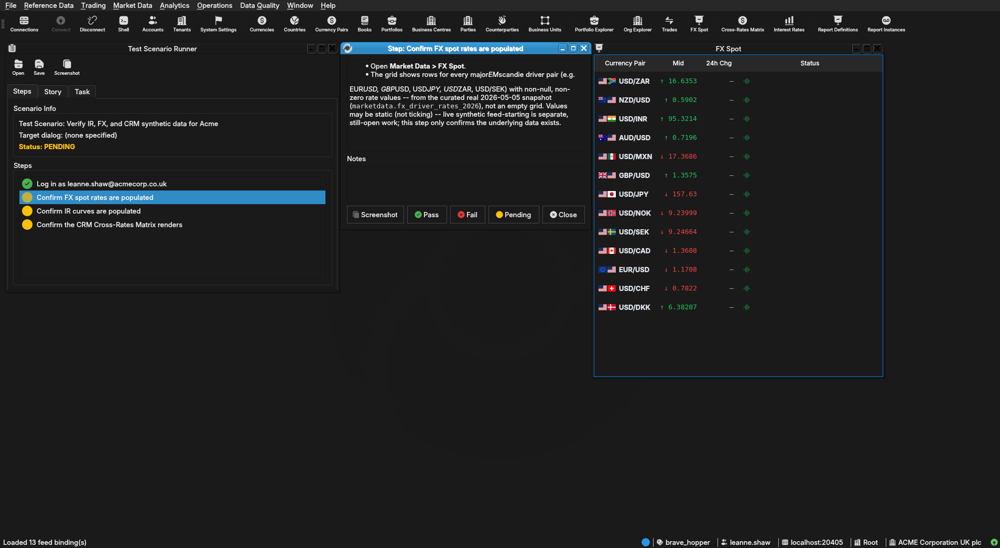
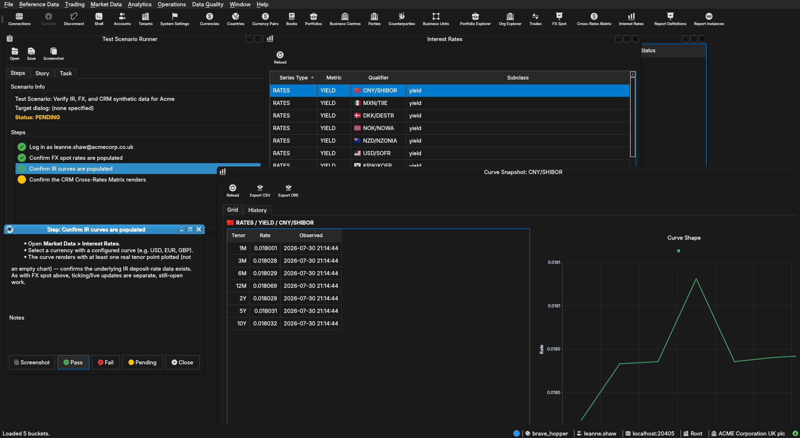
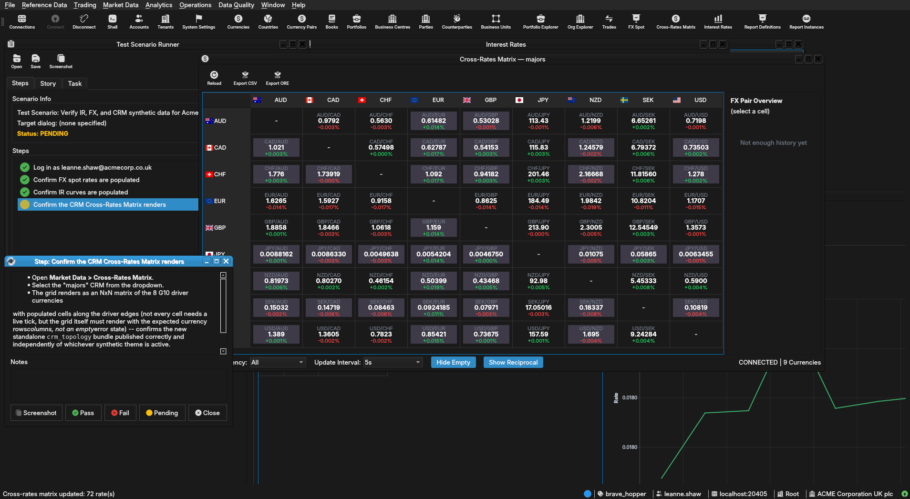

:PROPERTIES:
:ID: B714E735-2F2C-4763-94F6-E3A390373FC5
:END:
#+title: Test Scenario: Verify IR, FX, and CRM synthetic data for Acme
#+description: Confirm Acme's restored synthetic themes (2026 realistic, legacy ORE Samples) and standalone CRM topology bundle actually populate IR curves, FX spot rates, and the CRM Cross-Rates Matrix.
#+type: test_scenario
#+level: s1
#+filetags: :acme_corporation_holding_group:sprint_24:v0:
#+target_dialog:
#+created: 2026-07-30
#+updated: 2026-07-30
#+environment:
#+todo: PENDING | PASSED FAILED
#+startup: inlineimages

This page documents a test scenario verifying [[id:FF81C703-6EFE-4B00-8C79-6F1069E1A6BE][Fix: ores_synthetic_publish_theme_from_dq_fn fails with 'column existing.index_name does not exist']] in [[id:CB7351E9-8E7E-4BA4-9399-4EB22F6192D4][Commission Acme Corporation: a realistic holding-group test entity]]. It is filled in with the target dialog and checklist of steps before testing starts; the QA Validation Runner panel rewrites =* Results= in place on save.

* Before you start

- The database must be freshly provisioned via =--source acme= —
  confirm via =compass db status=, recreating only if stale:
  =compass db recreate -y -k= then =compass shell -f
  projects/ores.shell/scripts/library/provisioning/how_do_i_provision_the_system_with_acme_corporation_holding_group.ores=.
  Confirm the run completes with no failed steps before starting —
  in particular, every office's =synthetic_realistic_2026=,
  =synthetic_ore_samples_2016=, and =crm_topology= steps must show
  =completed=, not =failed= or =skipped=.

* Scenario Info

# The QA Validation Runner treats *any* non-empty Clients cell below as
# "this is a multi-client scenario" and then expects every step nested
# one level deeper, under a per-client heading (Runner source:
# QaValidationRunnerWidget.cpp, `multi_client =
# !find_field_value(*info, "Clients").isEmpty()`). Leave the cell
# genuinely blank — no placeholder text, not even "(single client)" —
# for the common single-client case; a non-empty cell here with flat
# `**` steps (no per-client `**`/`***` nesting) silently loads zero
# steps. Only put text in it when the scenario truly needs several
# running client instances at once (e.g. a NATS notification lands on
# a second instance) — list the instance colours/labels, e.g. "blue,
# red", and nest every step one level deeper under a `**` heading per
# client as shown further down.

| Field         | Value                                   |
|---------------+------------------------------------------|
| Verifies task | [[id:FF81C703-6EFE-4B00-8C79-6F1069E1A6BE][Fix: ores_synthetic_publish_theme_from_dq_fn fails with 'column existing.index_name does not exist']] |
| Parent story  | [[id:CB7351E9-8E7E-4BA4-9399-4EB22F6192D4][Commission Acme Corporation: a realistic holding-group test entity]]   |
| Target dialog | (Qt dialog class under test, if any.)   |
| Clients       |                                          |
| State         | PENDING                               |

* Steps

Each step is its own heading — the title should be five to seven
words so it fits on one line in the QA Validation Runner's step list
without wrapping or truncating (e.g. "Edit and save the record", not
a full sentence describing the whole operation). The body below the
title is a bullet-point checklist, not a prose paragraph: give the
tester every piece of context needed to execute that one step without
looking anything up elsewhere — what UI state must already exist,
exactly what to click or type, and exactly what confirms the step
passed. The panel writes each step's PASS/FAIL/PENDING outcome and
notes back as a =*** Result= child heading directly under it.

** Log in as leanne.shaw@acmecorp.co.uk

Log in with account =leanne.shaw@acmecorp.co.uk= (Acme Corporation
UK plc's Country Head) and password =Secure-Password-123=. Logging
in as this specific staff account, rather than =tenant_admin=, is
how party context is established today -- there is currently no
in-session party switcher (confirm this username via `accounts
list --party <uk-party-id>` in =ores.shell= if it's changed since
this scenario was written; staff usernames are randomised per
provisioning run).

*** Result

| Field  | Value |
|--------+-------|
| Status | PASS |

** Confirm FX spot rates are populated

- Open *Market Data > FX Spot*.
- The grid shows rows for every major/EM/scandie driver pair (e.g.
  EUR/USD, GBP/USD, USD/JPY, USD/ZAR, USD/SEK) with non-null,
  non-zero rate values -- from the curated real 2026-05-05 snapshot
  (=marketdata.fx_driver_rates_2026=), not an empty grid. Values may
  be static (not ticking) -- live synthetic feed-starting is
  separate, still-open work; this step only confirms the underlying
  data exists.

*** Result

| Field  | Value |
|--------+-------|
| Status | PASS |
| Notes  |  |

** Confirm IR curves are populated

- Open *Market Data > Interest Rates*.
- Select a currency with a configured curve (e.g. USD, EUR, GBP).
- The curve renders with at least one real tenor point plotted (not
  an empty chart) -- confirms the underlying IR deposit-rate data
  exists. As with FX spot above, ticking/live updates are separate,
  still-open work.

*** Result

| Field  | Value |
|--------+-------|
| Status | PASS |
| Notes  |  |

** Confirm the CRM Cross-Rates Matrix renders

- Open *Market Data > Cross-Rates Matrix*.
- Select the "majors" CRM from the dropdown.
- The grid renders as an NxN matrix of the 8 G10 driver currencies
  with populated cells along the driver edges (not every cell needs
  a live tick, but the grid itself must render with the expected
  currency rows/columns, not an empty/error state) -- confirms the
  new standalone =crm_topology= bundle published correctly and
  independently of whichever synthetic theme is active.
- Repeat for the "exotics" and "scandies" CRMs from the same
  dropdown.

*** Result

| Field  | Value |
|--------+-------|
| Status | PASS |
| Notes  |  |

* Results

| Field         | Value |
|---------------+-------|
| Status        | PASSED |
| Completed at  | 2026-07-30T21:16:01Z |
| Branch        | feature/fix-synthetic-theme-publish-index-name-column |
| Commit        | bb3833494 |
| Worktree      | brave_hopper |

* Notes
