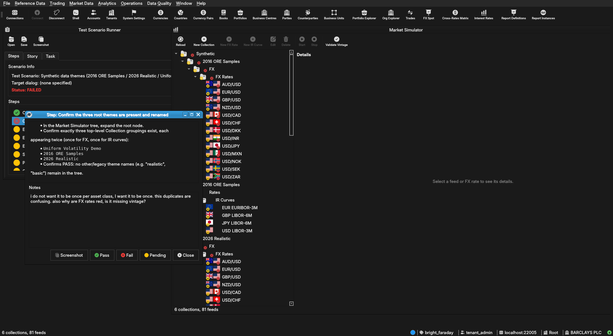

:PROPERTIES:
:ID: 90B1018E-C019-4C75-B0EE-91284A1E1A75
:END:
#+title: Test Scenario: Synthetic data themes (2016 ORE Samples / 2026 Realistic / Uniform Volatility Demo) and the Start-at-Root theme picker
#+description: Manual Qt client steps verifying the Market Simulator tree shows the three renamed themes and that Start at the collection root prompts for a theme instead of cascading all of them.
#+type: test_scenario
#+level: s1
#+filetags: :ir-rates-followups:sprint_24:v0:
#+target_dialog:
#+created: 2026-07-23
#+updated: 2026-07-23
#+environment:
#+todo: PENDING | PASSED FAILED
#+startup: inlineimages

This page documents a test scenario verifying [[id:0FA7ADA7-9A8F-4616-B835-FE2C717B4CBB][Source vintage historical IR rate dataset + populate script]] in [[id:C29FE5A3-61F0-4D2F-BE4F-8A02223EABEF][IR Rates synthetic data: dataset seeding, index cleanup, dual-curve, quoting conventions]]. It is filled in with the target dialog and checklist of steps before testing starts; the QA Validation Runner panel rewrites =* Results= in place on save.

* Scenario Info

# The QA Validation Runner treats *any* non-empty Clients cell below as
# "this is a multi-client scenario" and then expects every step nested
# one level deeper, under a per-client heading (Runner source:
# QaValidationRunnerWidget.cpp, `multi_client =
# !find_field_value(*info, "Clients").isEmpty()`). Leave the cell
# genuinely blank — no placeholder text, not even "(single client)" —
# for the common single-client case; a non-empty cell here with flat
# `**` steps (no per-client `**`/`***` nesting) silently loads zero
# steps. Only put text in it when the scenario truly needs several
# running client instances at once (e.g. a NATS notification lands on
# a second instance) — list the instance colours/labels, e.g. "blue,
# red", and nest every step one level deeper under a `**` heading per
# client as shown further down.

| Field         | Value                                   |
|---------------+------------------------------------------|
| Verifies task | [[id:0FA7ADA7-9A8F-4616-B835-FE2C717B4CBB][Source vintage historical IR rate dataset + populate script]] |
| Parent story  | [[id:C29FE5A3-61F0-4D2F-BE4F-8A02223EABEF][IR Rates synthetic data: dataset seeding, index cleanup, dual-curve, quoting conventions]]   |
| Target dialog | (Qt dialog class under test, if any.)   |
| Clients       |                                          |
| State         | PENDING                               |

* Steps

Each step is its own heading — the title should be five to seven
words so it fits on one line in the QA Validation Runner's step list
without wrapping or truncating (e.g. "Edit and save the record", not
a full sentence describing the whole operation). The body below the
title is a bullet-point checklist, not a prose paragraph: give the
tester every piece of context needed to execute that one step without
looking anything up elsewhere — what UI state must already exist,
exactly what to click or type, and exactly what confirms the step
passed. The panel writes each step's PASS/FAIL/PENDING outcome and
notes back as a =*** Result= child heading directly under it.

** Connect to tenant Barclays Plc

Log in against the =prime_origin= environment as
=tenant_admin@barclays_plc= / =Secure-Password-123= and select
*BARCLAYS PLC*. If the database has been recreated since last use,
re-provision first: =compass shell -f
projects/ores.shell/scripts/library/provisioning/barclays_system_provision.ores=.
Then open the Market Simulator window (System > Market Simulator).

*** Result

| Field  | Value |
|--------+-------|
| Status | PASS |

** Confirm the three root themes are present and renamed

- In the Market Simulator tree, expand the root node.
- Confirm exactly three top-level Collection groupings exist, each
  appearing twice (once for FX, once for IR curves):
  - =Uniform Volatility Demo=
  - =2016 ORE Samples=
  - =2026 Realistic=
- Confirms PASS: no other/legacy theme names (e.g. "realistic",
  "basic") remain in the tree.

*** Result

| Field  | Value |
|--------+-------|
| Status | FAIL |
| Notes  | i do not want it to be once per asset class, I want it to be once. this duplicates are confusing. also why are FX rates red, is it missing vintage?; ; ;  |

** Expand the Uniform Volatility Demo theme

- Expand both =Uniform Volatility Demo= collections (FX and IR).
- Confirm FX shows 8 major + 3 EM/exotic driver pairs and IR shows
  the uniform Vasicek curve set.
- Confirms PASS: node expands without error and item counts look
  populated (non-empty).

*** Result

| Field  | Value |
|--------+-------|
| Status | PENDING |

** Expand the 2016 ORE Samples theme

- Expand both =2016 ORE Samples= collections (FX and IR).
- Confirm IR curves are the legacy IBOR-era set (e.g. LIBOR-style
  indices, not RFR).
- Confirms PASS: node expands without error and curve names reflect
  the legacy IBOR-era archetype.

*** Result

| Field  | Value |
|--------+-------|
| Status | PENDING |

** Expand the 2026 Realistic theme

- Expand both =2026 Realistic= collections (FX and IR).
- Confirm IR curves are the RFR-era set (e.g. SOFR/ESTR-style
  indices, not LIBOR).
- Confirms PASS: node expands without error and curve names reflect
  the RFR archetype.

*** Result

| Field  | Value |
|--------+-------|
| Status | PENDING |

** Start at the tree root and confirm the theme picker appears

- Select the invisible root node (or press "Start" with nothing
  selected below the root) and click *Start*.
- Confirms PASS: a dialog appears titled "Start" asking "Starting
  everything at once would run mutually-exclusive vintages side by
  side. Which dataset would you like to start?" with a dropdown
  listing exactly =Uniform Volatility Demo=, =2016 ORE Samples=,
  =2026 Realistic=.
- Confirms FAIL: Start cascades all themes simultaneously without
  prompting.

*** Result

| Field  | Value |
|--------+-------|
| Status | PENDING |

** Pick a theme from the Start-at-Root dialog and confirm only it starts

- In the dialog from the previous step, select =2016 ORE Samples=
  and confirm (OK).
- Confirm only the =2016 ORE Samples= FX and IR feeds start (status
  icons/ticking prices), and =Uniform Volatility Demo= /
  =2026 Realistic= feeds remain stopped.
- Confirms PASS: only the chosen theme's feeds are running; the
  other two themes are untouched.

*** Result

| Field  | Value |
|--------+-------|
| Status | PENDING |

** Cancel the Start-at-Root dialog and confirm nothing starts

- Select the root node again and click *Start*.
- In the dialog, click *Cancel* (or close it) without picking a
  theme.
- Confirm no feeds start as a result — tree stays in the same
  running/stopped state as before this step.
- Confirms PASS: dialog dismissal is a no-op.

*** Result

| Field  | Value |
|--------+-------|
| Status | PENDING |

** Stop the started theme

- Select the =2016 ORE Samples= collection (or root) and click
  *Stop*.
- Confirm all =2016 ORE Samples= FX and IR feeds stop cleanly.
- Confirms PASS: no feeds left running, no errors in the client log.

*** Result

| Field  | Value |
|--------+-------|
| Status | PENDING |

* Results

| Field         | Value |
|---------------+-------|
| Status        | FAILED |
| Completed at  | 2026-07-23T21:39:50Z |
| Branch        | main |
| Commit        | d91514d8b |
| Worktree      | bright_faraday |

* Notes
