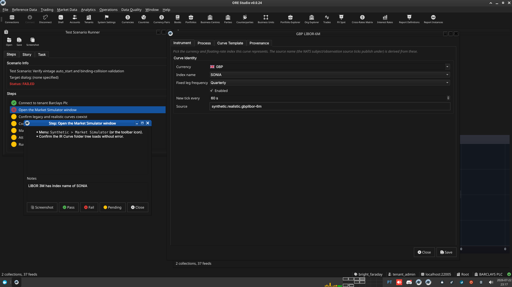
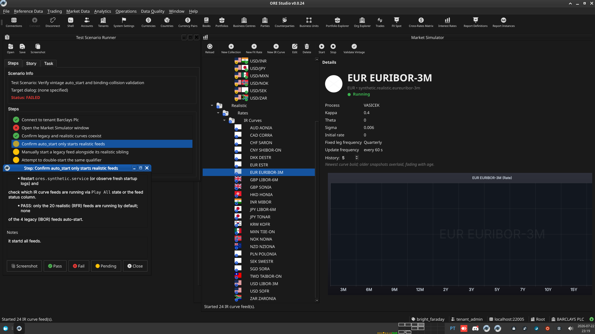

:PROPERTIES:
:ID: 29886E46-8502-441A-BD48-34F247AF8232
:END:
#+title: Test Scenario: Verify vintage auto_start and binding-collision validation
#+description: Manually verify legacy/realistic IR curve configs coexist without collision, auto_start correctly filters the auto-started set, and Validate Vintage flags same-folder enabled+auto_start collisions.
#+type: test_scenario
#+level: s1
#+filetags: :ir-rates-followups:sprint_24:v0:
#+target_dialog:
#+created: 2026-07-22
#+updated: 2026-07-22
#+environment:
#+todo: PENDING | PASSED FAILED
#+startup: inlineimages

This page documents a test scenario verifying [[id:0FA7ADA7-9A8F-4616-B835-FE2C717B4CBB][Source vintage historical IR rate dataset + populate script]] in [[id:C29FE5A3-61F0-4D2F-BE4F-8A02223EABEF][IR Rates synthetic data: dataset seeding, index cleanup, dual-curve, quoting conventions]]. It is filled in with the target dialog and checklist of steps before testing starts; the QA Validation Runner panel rewrites =* Results= in place on save.

* Scenario Info

# The QA Validation Runner treats *any* non-empty Clients cell below as
# "this is a multi-client scenario" and then expects every step nested
# one level deeper, under a per-client heading (Runner source:
# QaValidationRunnerWidget.cpp, `multi_client =
# !find_field_value(*info, "Clients").isEmpty()`). Leave the cell
# genuinely blank — no placeholder text, not even "(single client)" —
# for the common single-client case; a non-empty cell here with flat
# `**` steps (no per-client `**`/`***` nesting) silently loads zero
# steps. Only put text in it when the scenario truly needs several
# running client instances at once (e.g. a NATS notification lands on
# a second instance) — list the instance colours/labels, e.g. "blue,
# red", and nest every step one level deeper under a `**` heading per
# client as shown further down.

| Field         | Value                                   |
|---------------+------------------------------------------|
| Verifies task | [[id:0FA7ADA7-9A8F-4616-B835-FE2C717B4CBB][Source vintage historical IR rate dataset + populate script]] |
| Parent story  | [[id:C29FE5A3-61F0-4D2F-BE4F-8A02223EABEF][IR Rates synthetic data: dataset seeding, index cleanup, dual-curve, quoting conventions]]   |
| Target dialog | (Qt dialog class under test, if any.)   |
| Clients       |                                          |
| State         | PENDING                               |

* Steps

Each step is its own heading — the title should be five to seven
words so it fits on one line in the QA Validation Runner's step list
without wrapping or truncating (e.g. "Edit and save the record", not
a full sentence describing the whole operation). The body below the
title is a bullet-point checklist, not a prose paragraph: give the
tester every piece of context needed to execute that one step without
looking anything up elsewhere — what UI state must already exist,
exactly what to click or type, and exactly what confirms the step
passed. The panel writes each step's PASS/FAIL/PENDING outcome and
notes back as a =*** Result= child heading directly under it.

** Connect to tenant Barclays Plc

Log in against the =prime_origin= environment as
=tenant_admin@barclays_plc= / =Secure-Password-123= and select
*BARCLAYS PLC*.

*** Result

| Field  | Value |
|--------+-------|
| Status | PASS |

** Open the Market Simulator window

- Menu: =Synthetic > Market Simulator= (or the toolbar icon).
- Confirm the IR Curve folder tree loads without error.

*** Result

| Field  | Value |
|--------+-------|
| Status | FAIL |
| Notes  | LIBOR 3M has index name of SONIA; ; ; ; ;  |

** Confirm legacy and realistic curves coexist

- Locate the *realistic* IR curve configs (e.g. =USD/USD-SOFR=,
  =EUR/EUR-ESTR=, =GBP/GBP-SONIA=, =JPY/JPY-TONAR=) and the *legacy*
  configs (=USD/USD-LIBOR-3M=, =EUR/EUR-EURIBOR-3M=,
  =GBP/GBP-LIBOR-6M=, =JPY/JPY-LIBOR-6M=) both present in the tree.
- Open the Detail dialog for one legacy config (e.g. USD-LIBOR-3M) and
  confirm the =description= field shows the multi-paragraph legacy
  blurb (retirement note, single-curve caveat, "enabled but never
  auto-started").
- PASS: both datasets are visible side by side; no config is silently
  missing or duplicated.

*** Result

| Field  | Value |
|--------+-------|
| Status | PASS |

** Confirm auto_start only starts realistic feeds

- Restart =ores.synthetic.service= (or observe fresh startup logs) and
  check which IR curve feeds are running via =Play All= state or the
  feed status column.
- PASS: only the 20 realistic (RFR) feeds are running by default; none
  of the 4 legacy (IBOR) feeds auto-start.

*** Result

| Field  | Value |
|--------+-------|
| Status | FAIL |
| Notes  | it startd all feeds.  ; ; ;  |

** Manually start a legacy feed alongside its realistic sibling

- With the realistic =USD/USD-SOFR= feed already running, manually
  start the legacy =USD/USD-LIBOR-3M= feed (different index_name, same
  currency).
- PASS: it starts successfully — no qualifier collision, since
  =currency_code+index_name= differs between the two.

*** Result

| Field  | Value |
|--------+-------|
| Status | PENDING |

** Attempt to double-start the same qualifier

- With =USD/USD-LIBOR-3M= running, attempt to start it a second time
  (e.g. via a duplicate config bound to the same currency+index, or by
  re-triggering start on the same config from two places).
- PASS: the second start is rejected with a qualifier-conflict message,
  not silently allowed or silently ignored.

*** Result

| Field  | Value |
|--------+-------|
| Status | PENDING |

** Run Validate Vintage and confirm binding-collision detection

- Trigger the =Validate Vintage= action from the Market Simulator
  toolbar.
- Confirm IR curve configs are included in the validation pass (not
  just FX).
- If two configs in the same folder are both =enabled= and
  =auto_start= for the same currency+index (create a temporary test
  config if none exists), confirm both are flagged with the generic
  error indicator, and hovering shows an explanatory tooltip.
- Open the Detail dialog for a flagged config and confirm the same
  error is surfaced there too.
- PASS: collisions are visually flagged in both the tree/list and the
  Detail dialog, using the same generic error-indicator style as the
  existing vintage-date check.

# For a multi-client scenario (Clients field above is non-empty),
# nest steps one level deeper instead, under one sub-heading per
# client, e.g.:
#
#   ** blue
#   *** Open the counterparty lookup and search
#   ** red
#   *** Confirm the notification arrived and the list refreshed
#
# Single-client scenarios (the common case) keep steps as direct
# children of * Steps, as above.

*** Result

| Field  | Value |
|--------+-------|
| Status | PENDING |

* Results

| Field         | Value |
|---------------+-------|
| Status        | FAILED |
| Completed at  | 2026-07-22T22:19:51Z |
| Branch        | feature/source-vintage-ir-dataset |
| Commit        | 6b5f2991a |
| Worktree      | bright_faraday |

* Notes
