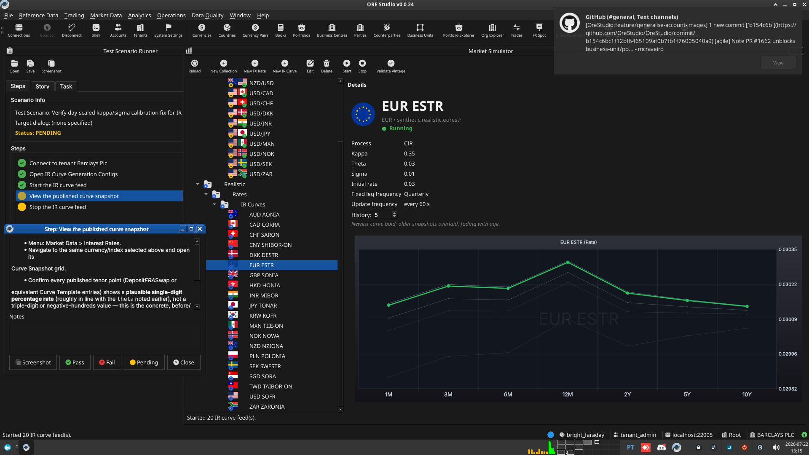
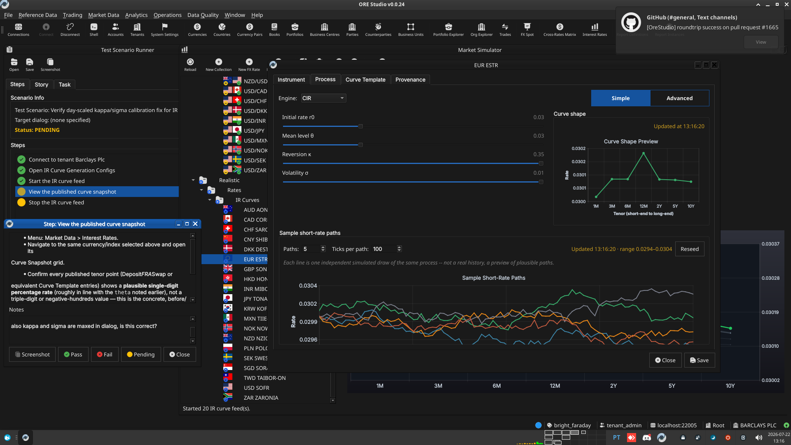

:PROPERTIES:
:ID: A1AD1629-9EF3-4895-AF7A-F441086A5450
:END:
#+title: Test Scenario: Verify day-scaled kappa/sigma calibration fix for IR curve feeds
#+description: Verify that a started IR curve config now publishes realistic rates end-to-end (Vasicek and CIR), instead of the ~150-250% blown-up rates the pre-fix discount_factor() tick-to-time bug produced.
#+type: test_scenario
#+level: s1
#+filetags: :ir-rates-followups:sprint_24:v0:
#+target_dialog:
#+created: 2026-07-22
#+updated: 2026-07-22
#+environment:
#+todo: PENDING | PASSED FAILED
#+startup: inlineimages

This page documents a test scenario verifying [[id:0A64C0F5-2720-41EA-9AEC-8327FA841B5F][Fix day-scaled kappa/sigma calibration across short-rate processes]] in [[id:C29FE5A3-61F0-4D2F-BE4F-8A02223EABEF][IR Rates synthetic data: dataset seeding, index cleanup, dual-curve, quoting conventions]]. It is filled in with the target dialog and checklist of steps before testing starts; the QA Validation Runner panel rewrites =* Results= in place on save.

Before the fix, starting an IR curve config published wildly unrealistic
rates (~150-250%, and a FRA point that never moved) because
=discount_factor()= accumulated bond-time as if every tick were a full
year regardless of what a tick represents. This scenario starts a real,
provisioned config (=synthetic.ir_curve_configs.realistic=, CIR-based —
this is the dataset the Barclays provisioning flow actually publishes;
Vasicek's own =discount_factor()=/=next()= dt-scaling is already covered
by 166 automated Catch2 test cases including dedicated per-process =dt=
coverage, so this scenario's job is an end-to-end UI-level sanity check
of the published numbers, not a re-verification of the per-process math)
and confirms the published rate is a plausible single-digit percentage
that actually moves across tenors, not a blown-up or frozen one.

* Scenario Info

# The QA Validation Runner treats *any* non-empty Clients cell below as
# "this is a multi-client scenario" and then expects every step nested
# one level deeper, under a per-client heading (Runner source:
# QaValidationRunnerWidget.cpp, `multi_client =
# !find_field_value(*info, "Clients").isEmpty()`). Leave the cell
# genuinely blank — no placeholder text, not even "(single client)" —
# for the common single-client case; a non-empty cell here with flat
# `**` steps (no per-client `**`/`***` nesting) silently loads zero
# steps. Only put text in it when the scenario truly needs several
# running client instances at once (e.g. a NATS notification lands on
# a second instance) — list the instance colours/labels, e.g. "blue,
# red", and nest every step one level deeper under a `**` heading per
# client as shown further down.

| Field         | Value                                   |
|---------------+------------------------------------------|
| Verifies task | [[id:0A64C0F5-2720-41EA-9AEC-8327FA841B5F][Fix day-scaled kappa/sigma calibration across short-rate processes]] |
| Parent story  | [[id:C29FE5A3-61F0-4D2F-BE4F-8A02223EABEF][IR Rates synthetic data: dataset seeding, index cleanup, dual-curve, quoting conventions]]   |
| Target dialog | =IrCurveGenerationConfigMdiWindow= — Menu: Market Data > Synthetic > Configuration > IR Curve Generation Configs; =CurveSnapshotMdiWindow= — Menu: Market Data > Interest Rates |
| Clients       |                                          |
| State         | PENDING                               |

* Steps

Each step is its own heading — the title should be five to seven
words so it fits on one line in the QA Validation Runner's step list
without wrapping or truncating (e.g. "Edit and save the record", not
a full sentence describing the whole operation). The body below the
title is a bullet-point checklist, not a prose paragraph: give the
tester every piece of context needed to execute that one step without
looking anything up elsewhere — what UI state must already exist,
exactly what to click or type, and exactly what confirms the step
passed. The panel writes each step's PASS/FAIL/PENDING outcome and
notes back as a =*** Result= child heading directly under it.

** Connect to tenant Barclays Plc

- Log in as =tenant_admin@barclays_plc= / =Secure-Password-123=.
- Select party *BARCLAYS PLC* if not already the default.
- Confirm login succeeds and the main window opens with no error dialog.

*** Result

| Field  | Value |
|--------+-------|
| Status | PASS |

** Open IR Curve Generation Configs

- Menu: Market Data > Synthetic > Configuration > IR Curve Generation
  Configs.
- Confirm the list is populated (published by the
  =synthetic.ir_curve_configs.realistic= dataset during provisioning
  — 20 currency/index rows, CIR process type).
- Pick the =USD/USD-SOFR= row (or any enabled row if that exact one
  is missing) and note its =kappa=/=theta=/=sigma=/=initial_rate=
  values from the detail dialog — they should be plain, real
  annualised numbers now (e.g. =theta= around =0.04=, not a
  day-scaled fraction like =0.0001=).

*** Result

| Field  | Value |
|--------+-------|
| Status | PASS |

** Start the IR curve feed

- With the row from the previous step selected, use the toolbar
  *Start* action.
- Confirm a success status message appears (e.g. "Feed started:
  ..."), not an error.
- Leave the feed running for at least 30 seconds so several ticks
  publish (=ticks_per_hour=60= means roughly one tick per minute of
  wall-clock time; a longer wait sees more ticks).

*** Result

| Field  | Value |
|--------+-------|
| Status | PASS |

** View the published curve snapshot

- Menu: Market Data > Interest Rates.
- Navigate to the same currency/index selected above and open its
  Curve Snapshot grid.
- Confirm every published tenor point (Deposit/FRA/Swap or
  equivalent Curve Template entries) shows a *plausible single-digit
  percentage rate* (roughly in line with the =theta= noted earlier),
  not a triple-digit or negative-hundreds value — this is the
  concrete, before/after-visible symptom of the bug this task fixed.
- Confirm at least one longer-dated point (not just the shortest
  tenor) has moved from its =initial_rate= over the ticks published
  so far — a frozen far-dated point was part of the original bug
  report (the FRA point that "never moved").

*** Result

| Field  | Value |
|--------+-------|
| Status | FAIL |
| Notes  | now the rates look a tad too small, is this expected? should we change the chart to bps instead.; ; ; ; also kappa and sigma are maxed in dialog, is this correct?; ;  |

** Stop the IR curve feed

- Return to the IR Curve Generation Configs window, select the same
  row, and use the toolbar *Stop* action.
- Confirm a success status message appears and no further ticks
  publish after stopping (re-check the Curve Snapshot after another
  30 seconds — the last published values should not have changed).

*** Result

| Field  | Value |
|--------+-------|
| Status | PASS |

* Results

| Field         | Value |
|---------------+-------|
| Status        | FAILED |
| Completed at  | 2026-07-22T12:17:01Z |
| Branch        | feature/fix-vasicek-day-scaled-calibration |
| Commit        | f6b049a03 |
| Worktree      | bright_faraday |

* Notes
