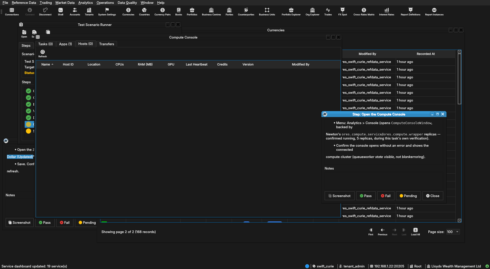

:PROPERTIES:
:ID: 549B8ECF-8D78-4361-8568-E0D332A6E196
:END:
#+title: Test Scenario: Acme end-to-end smoke test against the Newton deployment
#+description: Verifies the full ORE Studio fleet deployed on Newton (18 services, single combined container) end-to-end: connect the local Qt client to Newton's remote NATS/DB, log in as Acme's tenant_admin, exercise CRUD + eventing + history on a reference-data entity, and run a compute job through to completion.
#+type: test_scenario
#+level: s1
#+filetags: :offload-services-to-wsl-host:sprint_24:v0:
#+target_dialog:
#+created: 2026-07-30
#+updated: 2026-07-30
#+environment:
#+todo: PENDING | PASSED FAILED
#+startup: inlineimages

This page documents a test scenario verifying [[id:82F1F41E-3BA4-45EA-AABE-30CA969E2A1A][Get all 18 services running end-to-end on Newton]] in [[id:568238F1-AD99-49CB-817F-09D3810D5185][Offload service and DB runtime to a WSL host over SSH]]. It is filled in with the target dialog and checklist of steps before testing starts; the QA Validation Runner panel rewrites =* Results= in place on save.

* Scenario Info

# The QA Validation Runner treats *any* non-empty Clients cell below as
# "this is a multi-client scenario" and then expects every step nested
# one level deeper, under a per-client heading (Runner source:
# QaValidationRunnerWidget.cpp, `multi_client =
# !find_field_value(*info, "Clients").isEmpty()`). Leave the cell
# genuinely blank — no placeholder text, not even "(single client)" —
# for the common single-client case; a non-empty cell here with flat
# `**` steps (no per-client `**`/`***` nesting) silently loads zero
# steps. Only put text in it when the scenario truly needs several
# running client instances at once (e.g. a NATS notification lands on
# a second instance) — list the instance colours/labels, e.g. "blue,
# red", and nest every step one level deeper under a `**` heading per
# client as shown further down.

| Field         | Value                                   |
|---------------+------------------------------------------|
| Verifies task | [[id:82F1F41E-3BA4-45EA-AABE-30CA969E2A1A][Get all 18 services running end-to-end on Newton]] |
| Parent story  | [[id:568238F1-AD99-49CB-817F-09D3810D5185][Offload service and DB runtime to a WSL host over SSH]]   |
| Target dialog | CurrencyDetailDialog, ComputeConsoleWindow |
| Clients       |                                          |
| State         | PENDING                               |

* Steps

Each step is its own heading — the title should be five to seven
words so it fits on one line in the QA Validation Runner's step list
without wrapping or truncating (e.g. "Edit and save the record", not
a full sentence describing the whole operation). The body below the
title is a bullet-point checklist, not a prose paragraph: give the
tester every piece of context needed to execute that one step without
looking anything up elsewhere — what UI state must already exist,
exactly what to click or type, and exactly what confirms the step
passed. The panel writes each step's PASS/FAIL/PENDING outcome and
notes back as a =*** Result= child heading directly under it.

** Connect to tenant Acme via Newton

Log in as =tenant_admin@acme= / =Secure-Password-123= and select
*Lloyds Wealth Management Ltd*. This client instance's =.env= has
=ORES_NATS_URL=/=ORES_NATS_MONITOR_URL= pointed at Newton
(=nats://192.168.1.22:20205=) and =ORES_DB_HOST=/=ORES_TEST_DB_HOST=
at =192.168.1.22=/port =5433= rather than =localhost= -- if this login
fails outright (not an auth error, a connection error), the client is
still pointed at local services; re-check =.env= before re-running.
If the tenant/party don't exist yet, re-run
=compass shell -f projects/ores.shell/scripts/library/provisioning/acme_system_provision.ores=
against Newton first (same =.env= override).

*** Result

| Field  | Value |
|--------+-------|
| Status | PASS |

** Create a new currency record

- System > Reference Data > Currencies (or the toolbar shortcut).
- Click *New*, fill in a currency not already present (e.g. code
  =ZZT=, name "Zzyzx Test Dollar", minor unit =2=).
- Save. Confirm the new row appears in the list without a manual
  refresh (the eventing path: the create should publish a NATS event
  that live-refreshes the grid).

*** Result

| Field  | Value |
|--------+-------|
| Status | PASS |

** Edit the currency and save

- Open the =ZZT= row just created, change its name to "Zzyzx Test
  Dollar (Updated)".
- Save. Confirm the grid row updates live, again without a manual
  refresh.

*** Result

| Field  | Value |
|--------+-------|
| Status | PASS |

** View the currency's history

- Right-click the =ZZT= row (or use the History toolbar action) to
  open its history dialog.
- Confirm two versions are listed (the original create and the
  edit), each with the correct =modified_by=/timestamp.

*** Result

| Field  | Value |
|--------+-------|
| Status | PASS |

** Delete the currency record

- Select the =ZZT= row, delete it (soft-delete / deactivate per the
  entity's own semantics).
- Confirm it disappears from the active list live, and still appears
  in its history dialog as a closed-out version.

*** Result

| Field  | Value |
|--------+-------|
| Status | PASS |

** Open the Compute Console

- Menu: Analytics > Console (opens =ComputeConsoleWindow=, backed by
  Newton's =ores.compute.service=/=ores.compute.wrapper= replicas --
  confirmed running, 5 replicas, during this task's own verification).
- Confirm the console opens without an error and shows the connected
  compute cluster (queue/worker state visible, not blank/erroring).

*** Result

| Field  | Value |
|--------+-------|
| Status | PASS |
| Notes  |  |

** Submit and run a compute job

- Toolbar: *New Batch* (the =BatchDetailDialog=). Fill in the minimum
  required fields for a batch against Lloyds Wealth Management Ltd's
  own portfolios/books (created by the Acme synthetic provisioning
  step) and submit.
- Watch the batch progress in the console (queued -> running ->
  completed) through to a terminal state. Confirm it reaches
  =completed= (not stuck =queued=/=running= indefinitely, and not
  =failed=) -- this exercises the full dispatch path across
  =ores.compute.service= (dispatch) and the =ores.compute.wrapper=
  replicas (execution) running on Newton.
- Open the batch's result/detail view and confirm output is present
  (not empty), confirming results made it back through NATS/DB to the
  client.

# For a multi-client scenario (Clients field above is non-empty),
# nest steps one level deeper instead, under one sub-heading per
# client, e.g.:
#
#   ** blue
#   *** Open the counterparty lookup and search
#   ** red
#   *** Confirm the notification arrived and the list refreshed
#
# Single-client scenarios (the common case) keep steps as direct
# children of * Steps, as above.

*** Result

| Field  | Value |
|--------+-------|
| Status | PASS |

* Results

| Field         | Value |
|---------------+-------|
| Status        | PASSED |
| Completed at  | 2026-07-30T19:03:39Z |
| Branch        | feature/finish-all-18-services-on-newton |
| Commit        | 5d9da9b17 |
| Worktree      | swift_curie |

* Notes
