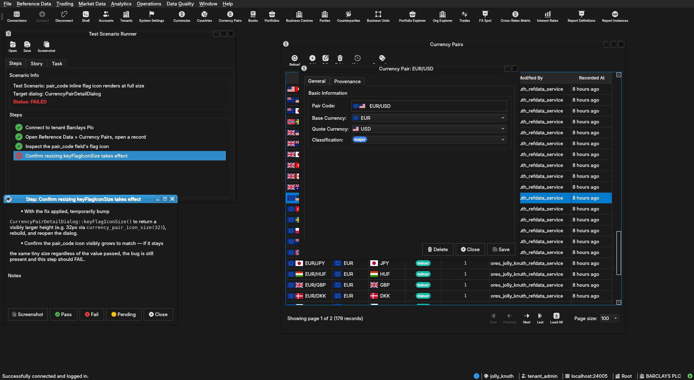

:PROPERTIES:
:ID: E1B1F121-ECAA-4C67-9D6E-AFBA1DA709F0
:END:
#+title: Test Scenario: pair_code inline flag icon renders at full size
#+description: Verify the inline pair_code flag icon in CurrencyPairDetailDialog renders at the full currency_pair_icon_size(), not shrunk, and confirm the fix once applied.
#+type: test_scenario
#+level: s1
#+filetags: :sprint-22-leftover-cleanup:sprint_24:v0:
#+target_dialog: CurrencyPairDetailDialog
#+created: 2026-07-25
#+updated: 2026-07-25
#+environment:
#+todo: PENDING | PASSED FAILED
#+startup: inlineimages

This page documents a test scenario verifying [[id:B4526411-7FDC-48E8-A346-DA69B5F66BDD][pair_code inline flag icon renders tiny regardless of keyFlagIconSize()]] in [[id:F90CDE0A-9813-407C-A145-30BA001FAAA8][Sprint 22 leftover cleanup]]. It is filled in with the target dialog and checklist of steps before testing starts; the QA Validation Runner panel rewrites =* Results= in place on save.

* Scenario Info

# The QA Validation Runner treats *any* non-empty Clients cell below as
# "this is a multi-client scenario" and then expects every step nested
# one level deeper, under a per-client heading (Runner source:
# QaValidationRunnerWidget.cpp, `multi_client =
# !find_field_value(*info, "Clients").isEmpty()`). Leave the cell
# genuinely blank — no placeholder text, not even "(single client)" —
# for the common single-client case; a non-empty cell here with flat
# `**` steps (no per-client `**`/`***` nesting) silently loads zero
# steps. Only put text in it when the scenario truly needs several
# running client instances at once (e.g. a NATS notification lands on
# a second instance) — list the instance colours/labels, e.g. "blue,
# red", and nest every step one level deeper under a `**` heading per
# client as shown further down.

| Field         | Value                                   |
|---------------+------------------------------------------|
| Verifies task | [[id:B4526411-7FDC-48E8-A346-DA69B5F66BDD][pair_code inline flag icon renders tiny regardless of keyFlagIconSize()]] |
| Parent story  | [[id:F90CDE0A-9813-407C-A145-30BA001FAAA8][Sprint 22 leftover cleanup]]   |
| Target dialog | CurrencyPairDetailDialog                |
| Clients       |                                          |
| State         | PENDING                               |

* Steps

Each step is its own heading — the title should be five to seven
words so it fits on one line in the QA Validation Runner's step list
without wrapping or truncating (e.g. "Edit and save the record", not
a full sentence describing the whole operation). The body below the
title is a bullet-point checklist, not a prose paragraph: give the
tester every piece of context needed to execute that one step without
looking anything up elsewhere — what UI state must already exist,
exactly what to click or type, and exactly what confirms the step
passed. The panel writes each step's PASS/FAIL/PENDING outcome and
notes back as a =*** Result= child heading directly under it.

** Connect to tenant Barclays Plc

Log in against this (=jolly_knuth=) environment as
=tenant_admin@barclays_plc= / =Secure-Password-123= and select
*BARCLAYS PLC*. If the DB was recreated since, re-run
=projects/ores.shell/scripts/library/provisioning/barclays_system_provision.ores=
via =compass shell -f <path>= to restore this account, party, and
its reference data first.

*** Result

| Field  | Value |
|--------+-------|
| Status | PASS |

** Open Reference Data > Currency Pairs, open a record

- Navigate to Reference Data > Currency Pairs.
- Double-click any existing row (e.g. EUR/USD) to open its
  =CurrencyPairDetailDialog=.

*** Result

| Field  | Value |
|--------+-------|
| Status | PASS |

** Inspect the pair_code field's flag icon

- Look at the read-only "Pair Code" field at the top of the dialog.
- Confirm the leading composite flag icon (two country flags
  side-by-side) renders at =currency_pair_icon_size()='s configured
  height (=standard_flag_height= = 16px tall, so the icon should be
  clearly legible — both flags individually recognisable — not a
  barely-visible sliver).
- Compare against the flag icons shown in the Base Currency / Quote
  Currency combo boxes just below, which use the same
  =standard_flag_height= via =single_flag_icon_size()= — the
  pair_code icon should look the same height as those, not smaller.

*** Result

| Field  | Value |
|--------+-------|
| Status | PASS |

** Confirm resizing keyFlagIconSize takes effect

- With the fix applied, temporarily bump
  =CurrencyPairDetailDialog::keyFlagIconSize()= to return a visibly
  larger height (e.g. 32px via =currency_pair_icon_size(32)=),
  rebuild, and reopen the dialog.
- Confirm the pair_code icon visibly grows to match — if it stays
  the same tiny size regardless of the value passed, the bug is
  still present and this step should FAIL.

*** Result

| Field  | Value |
|--------+-------|
| Status | PASS |
| Notes  |  |

* Results

| Field         | Value |
|---------------+-------|
| Status        | PASSED |
| Completed at  | 2026-07-25T21:13:00Z |
| Branch        | feature/currency-pair-code-flag-icon-size-unfixed |
| Commit        | 03039ff45 |
| Worktree      | jolly_knuth |

* Notes
