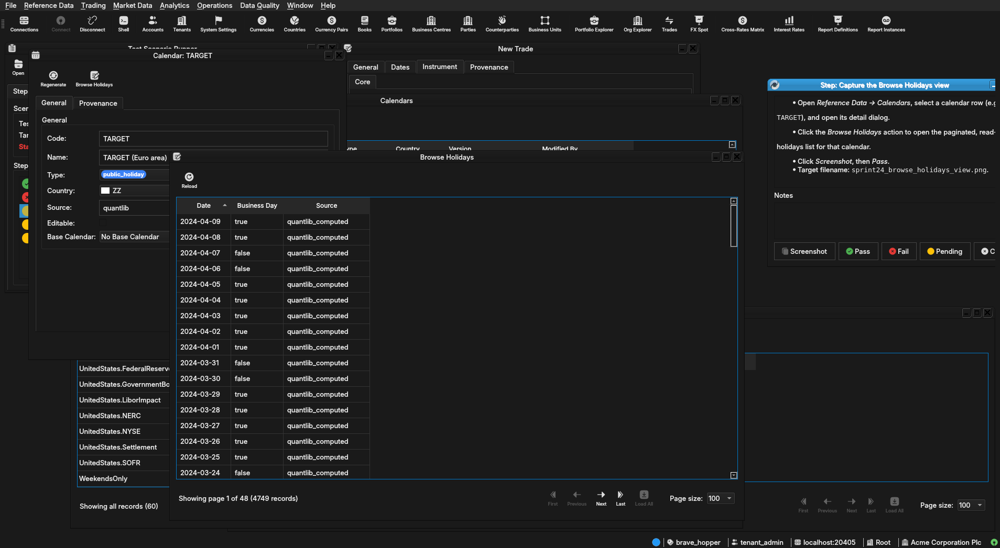
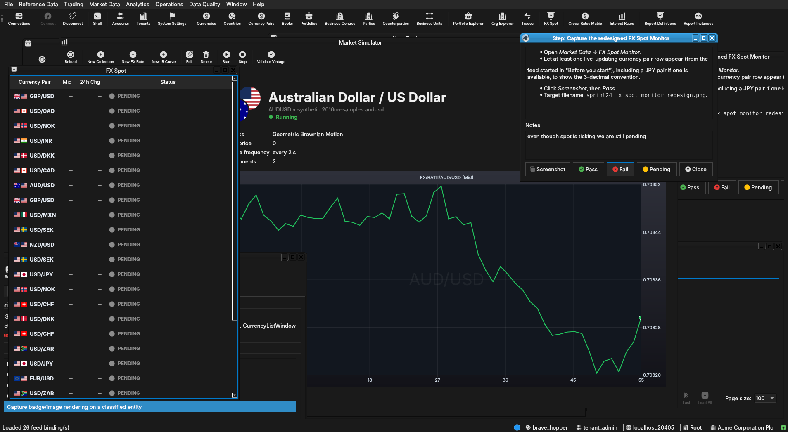
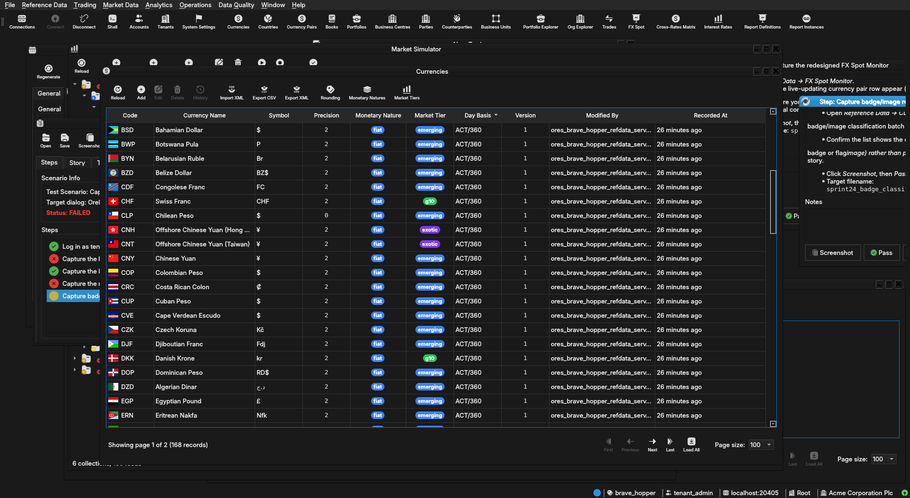

:PROPERTIES:
:ID: CC253840-1BC5-4671-945C-8E65D8F25E42
:END:
#+title: Test Scenario: Capture screenshots for the sprint 24 release notes
#+description: Capture screenshots illustrating sprint 24's key UI-visible shipped features: the holiday-aware date picker, the Browse Holidays view, the redesigned FX Spot Monitor, and badge/image rendering on a classified entity.
#+type: test_scenario
#+level: s1
#+filetags: :sprint-24-close:sprint_24:v0:
#+target_dialog: OreDateEdit/HolidayAwareDatePicker, CalendarDetailDialog, FxSpotMonitorWindow, CurrencyListWindow
#+created: 2026-08-03
#+updated: 2026-08-03
#+environment:
#+todo: PENDING | PASSED FAILED
#+startup: inlineimages

This page documents a test scenario verifying [[id:0D62C998-6B91-4A5A-9428-3FF89C00EFAD][Sprint 24 closure: release notes and demo]] in [[id:0D62C998-6B91-4A5A-9428-3FF89C00EFAD][Sprint 24 closure: release notes and demo]]. It is filled in with the target dialog and checklist of steps before testing starts; the QA Validation Runner panel rewrites =* Results= in place on save.

* Before you start

- The database must be freshly recreated and Acme Corporation
  provisioned: =compass db recreate -y -k=, then =compass services
  start=, then =compass shell -f
  projects/ores.shell/scripts/library/provisioning/how_do_i_provision_the_system_with_acme_corporation_holding_group.ores=.
  Confirm the run reports success with no failed steps before starting.
- The build must be current: =compass build --preset
  linux-clang-debug-make=.
- FX Spot Monitor needs a live feed running: start the FX spot
  synthetic feed for at least one currency pair (e.g. via =compass
  shell= or the Synthetic Data admin UI) before Step 4, so the
  window shows live-updating rows rather than an empty grid.

* Scenario Info

| Field         | Value                                   |
|---------------+------------------------------------------|
| Verifies task | [[id:32C80A2E-CF88-4F6A-9D58-8B070ED41E4F][Write sprint 24 release notes]] |
| Parent story  | [[id:0D62C998-6B91-4A5A-9428-3FF89C00EFAD][Sprint 24 closure: release notes and demo]]   |
| Target dialog | OreDateEdit/HolidayAwareDatePicker, CalendarDetailDialog, FxSpotMonitorWindow, CurrencyListWindow |
| Clients       |                                          |
| State         | PENDING                               |

* Steps

** Log in as tenant_admin@acme_corporation

- Start the Qt client (=compass client start=) if it isn't already
  running, or restart it to pick up the fresh build.
- Log in as =tenant_admin@acme_corporation= / =Secure-Password-123=.
- Confirms the step passed: login succeeds and the main window opens
  with a party selector showing =Acme Corporation Plc= or one of its
  children.

*** Result

| Field  | Value |
|--------+-------|
| Status | PASS |

** Capture the holiday-aware date picker

- Open /Trading → New Trade/ (or wherever a Swap/FRA instrument form
  is reachable) and open the FRA Fixing Date field, which uses the
  new =HolidayAwareDatePicker=.
- Click into the date field to pop up the calendar widget. Confirm
  non-business dates are visually highlighted with a tooltip naming
  the source calendar (e.g. =TARGET=).
- Click /Screenshot/, then /Pass/.
- Target filename: =sprint24_holiday_aware_date_picker.png=.

*** Result

| Field  | Value |
|--------+-------|
| Status | FAIL |
| Notes  | i can see calendar but i cannot screenshot it as its a combo box |

** Capture the Browse Holidays view

- Open /Reference Data → Calendars/, select a calendar row (e.g.
  =TARGET=), and open its detail dialog.
- Click the /Browse Holidays/ action to open the paginated, read-only
  holidays list for that calendar.
- Click /Screenshot/, then /Pass/.
- Target filename: =sprint24_browse_holidays_view.png=.

*** Result

| Field  | Value |
|--------+-------|
| Status | PASS |
| Notes  |  |

** Capture the redesigned FX Spot Monitor

- Open /Market Data → FX Spot Monitor/.
- Let at least one live-updating currency pair row appear (from the
  feed started in "Before you start"), including a JPY pair if one
  is available, to show the 3-decimal convention.
- Click /Screenshot/, then /Pass/.
- Target filename: =sprint24_fx_spot_monitor_redesign.png=.

*** Result

| Field  | Value |
|--------+-------|
| Status | FAIL |
| Notes  | even though spot is ticking we are still pending;  |

** Capture badge/image rendering on a classified entity

- Open /Reference Data → Currencies/ (or another entity from the
  badge/image classification batch already implemented).
- Confirm the list shows the classified rendering treatment (colour
  badge or flag/image) rather than plain text, per the
  audit/classification story.
- Click /Screenshot/, then /Pass/.
- Target filename: =sprint24_badge_classification_rollout.png=.

*** Result

| Field  | Value |
|--------+-------|
| Status | PASS |
| Notes  |  |

* Results

| Field         | Value |
|---------------+-------|
| Status        | FAILED |
| Completed at  | 2026-08-03T09:12:16Z |
| Branch        | feature/implement-fix-wire-codec-default-breaks-headless-instrument-parse-tests |
| Commit        | 6604b84b4 |
| Worktree      | brave_hopper |

* Notes
