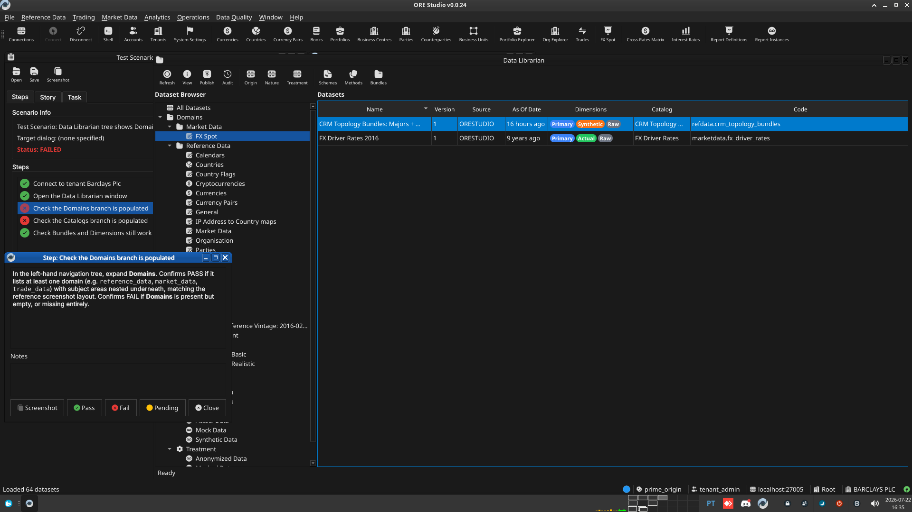
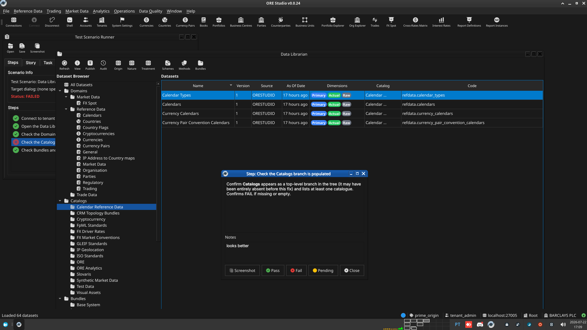
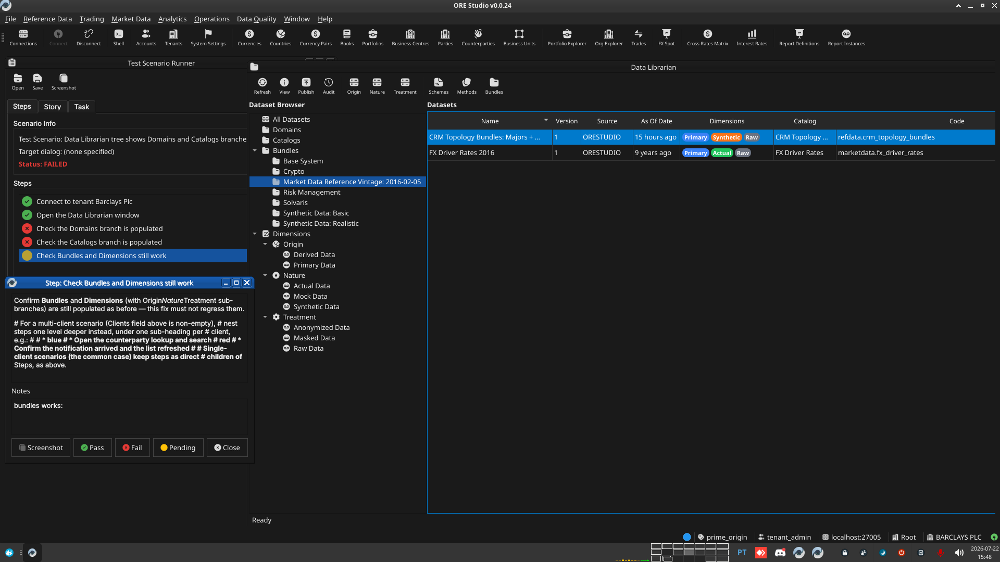
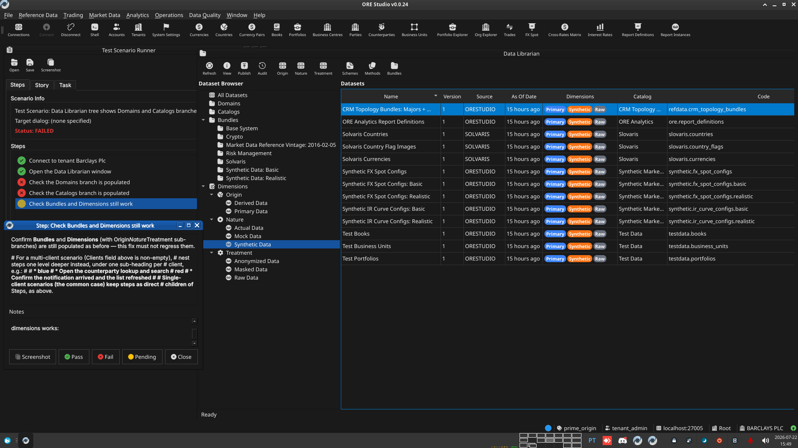

:PROPERTIES:
:ID: 29FE58D1-CCC8-4767-A50D-A67153886946
:END:
#+title: Test Scenario: Data Librarian tree shows Domains and Catalogs branches
#+description: Verify the Data Librarian navigation tree shows populated Domains and Catalogs branches (previously empty/missing for non-system tenants) alongside the already-working Bundles and Dimensions branches.
#+type: test_scenario
#+level: s1
#+filetags: :unify_report_definitions_publish_infrastructure:sprint_24:v0:
#+target_dialog:
#+created: 2026-07-22
#+updated: 2026-07-22
#+environment:
#+todo: PENDING | PASSED FAILED
#+startup: inlineimages

This page documents a test scenario verifying [[id:F66E39CF-9136-4FD2-8150-17432D331F33][Fix Data Librarian tree: no longer shows datasets]] in [[id:81CBF56B-0E5F-491B-A5C5-BFE5FCA3B219][Make party-scoped bundle provisioning data-driven, not one hand-written phase per bundle]]. It is filled in with the target dialog and checklist of steps before testing starts; the QA Validation Runner panel rewrites =* Results= in place on save.

* Scenario Info

# The QA Validation Runner treats *any* non-empty Clients cell below as
# "this is a multi-client scenario" and then expects every step nested
# one level deeper, under a per-client heading (Runner source:
# QaValidationRunnerWidget.cpp, `multi_client =
# !find_field_value(*info, "Clients").isEmpty()`). Leave the cell
# genuinely blank — no placeholder text, not even "(single client)" —
# for the common single-client case; a non-empty cell here with flat
# `**` steps (no per-client `**`/`***` nesting) silently loads zero
# steps. Only put text in it when the scenario truly needs several
# running client instances at once (e.g. a NATS notification lands on
# a second instance) — list the instance colours/labels, e.g. "blue,
# red", and nest every step one level deeper under a `**` heading per
# client as shown further down.

| Field         | Value                                   |
|---------------+------------------------------------------|
| Verifies task | [[id:F66E39CF-9136-4FD2-8150-17432D331F33][Fix Data Librarian tree: no longer shows datasets]] |
| Parent story  | [[id:81CBF56B-0E5F-491B-A5C5-BFE5FCA3B219][Make party-scoped bundle provisioning data-driven, not one hand-written phase per bundle]]   |
| Target dialog | (Qt dialog class under test, if any.)   |
| Clients       |                                          |
| State         | PENDING                               |

* Steps

Each step is its own heading — the title should be five to seven
words so it fits on one line in the QA Validation Runner's step list
without wrapping or truncating (e.g. "Edit and save the record", not
a full sentence describing the whole operation). The body below the
title is a bullet-point checklist, not a prose paragraph: give the
tester every piece of context needed to execute that one step without
looking anything up elsewhere — what UI state must already exist,
exactly what to click or type, and exactly what confirms the step
passed. The panel writes each step's PASS/FAIL/PENDING outcome and
notes back as a =*** Result= child heading directly under it.

** Connect to tenant Barclays Plc

Log in against the =prime_origin= environment as
=tenant_admin@barclays_plc= / =Secure-Password-123= and select
*BARCLAYS PLC*. If the database has been recreated since last use,
re-provision first: =compass shell -f
projects/ores.shell/scripts/library/provisioning/barclays_system_provision.ores=.

*** Result

| Field  | Value |
|--------+-------|
| Status | PASS |

** Open the Data Librarian window

Menu: *Data Quality > Data Librarian*.

*** Result

| Field  | Value |
|--------+-------|
| Status | PASS |

** Check the Domains branch is populated

In the left-hand navigation tree, expand *Domains*. Confirms PASS if
it lists at least one domain (e.g. =reference_data=, =market_data=,
=trade_data=) with subject areas nested underneath, matching the
reference screenshot layout. Confirms FAIL if *Domains* is present
but empty, or missing entirely.

*** Result

| Field  | Value |
|--------+-------|
| Status | PASS |
| Notes  |  |

** Check the Catalogs branch is populated

Confirm *Catalogs* appears as a top-level branch in the tree (it may
have been entirely absent before this fix) and lists at least one
catalogue. Confirms FAIL if missing or empty.

*** Result

| Field  | Value |
|--------+-------|
| Status | PASS |
| Notes  | looks better:; ;  |

** Check Bundles and Dimensions still work

Confirm *Bundles* and *Dimensions* (with Origin/Nature/Treatment
sub-branches) are still populated as before — this fix must not
regress them.

# For a multi-client scenario (Clients field above is non-empty),
# nest steps one level deeper instead, under one sub-heading per
# client, e.g.:
#
#   ** blue
#   *** Open the counterparty lookup and search
#   ** red
#   *** Confirm the notification arrived and the list refreshed
#
# Single-client scenarios (the common case) keep steps as direct
# children of * Steps, as above.

*** Result

| Field  | Value |
|--------+-------|
| Status | PASS |
| Notes  | bundles works:; ; ; ; dimensions works:; ;  |

* Results

| Field         | Value |
|---------------+-------|
| Status        | PASSED |
| Completed at  | 2026-07-22T16:43:52Z |
| Branch        | feature/fix-librarian-tree-regression |
| Commit        | fd83e2129 |
| Worktree      | prime_origin |

* Notes
