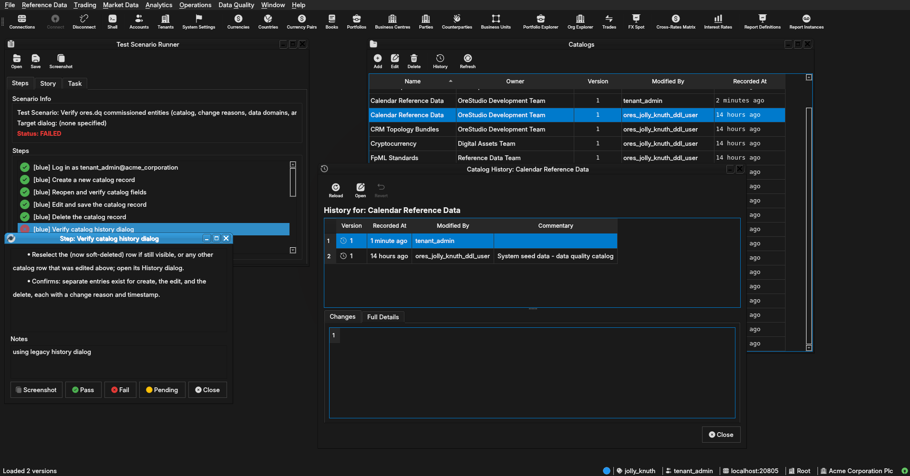

:PROPERTIES:
:ID: E3AC8CAB-2908-4407-8DC6-16C0000A092E
:END:
#+title: Test Scenario: Verify ores.dq commissioned entities (catalog, change reasons, data domains, artefact types, dataset bundles, LEI registry)
#+description: Confirm full CRUD + eventing on the newly-commissioned DQ governance entities, read-only browsing on the LEI registry, and that the two staging-only entities have no Qt UI at all.
#+type: test_scenario
#+level: s1
#+filetags: :entity-classification-drift-dq:sprint_25:v0:
#+target_dialog:
#+created: 2026-08-06
#+updated: 2026-08-06
#+environment:
#+todo: PENDING | PASSED FAILED
#+startup: inlineimages

This page documents a test scenario verifying [[id:163AC07E-19E4-4486-A503-8170D9B46108][Task: Bind ores.dq entities to profiles; verify zero-diff regen]] in [[id:A452F2A7-D9CB-48E6-8B23-4509AFFC5699][Story: Entity classification and drift baseline: ores.dq]]. It is filled in with the target dialog and checklist of steps before testing starts; the QA Validation Runner panel rewrites =* Results= in place on save.

* Before you start

- Build must include this branch's commits (=feature/bind-dq-sql-entities-to-profiles=,
  through the "Commission full C++/Qt for lei_entity, lei_relationship,
  report_definition, synthetic_fx_spot_config" commit). Confirm via
  =compass build= (full build, green, including =ores.qt.exe=).
- The database must be freshly provisioned with Acme Corporation:
  =compass db recreate -y -k= then =compass shell -f
  projects/ores.shell/scripts/library/provisioning/how_do_i_provision_the_system_with_acme_corporation_holding_group.ores=.
  Confirm the run completes with no failed steps before starting.
- Services must be running: =compass services start= — confirm
  =ores.dq.service= and =nats-server= reach =running= via =compass
  services status=.

* Scenario Info

| Field         | Value                                                     |
|---------------+-------------------------------------------------------------|
| Verifies task | [[id:163AC07E-19E4-4486-A503-8170D9B46108][Task: Bind ores.dq entities to profiles; verify zero-diff regen]] |
| Parent story  | [[id:A452F2A7-D9CB-48E6-8B23-4509AFFC5699][Story: Entity classification and drift baseline: ores.dq]] |
| Target dialog | =CatalogDetailDialog= (Data Quality > Data Catalogue > Catalogues) / =DataDomainDetailDialog= (Data Quality > Data Catalogue > Data Domains) / =ChangeReasonDetailDialog= (Data Quality > Audit Trail > Change Reasons) / =ChangeReasonCategoryDetailDialog= (Data Quality > Audit Trail > Change Reason Categories) / =ArtefactTypeDetailDialog= (Data Quality > Data Catalogue > Artefact Types) / =DatasetBundleDetailDialog= (Data Quality > Data Catalogue > Dataset Bundles) / =LeiEntityMdiWindow= / =LeiRelationshipMdiWindow= (Data Quality > LEI Registry) |
| Clients       | blue, red                                                  |
| State         | PENDING                                                    |

* Steps

** blue

*** Log in as tenant_admin@acme_corporation

- Username: =tenant_admin@acme_corporation=
- Password: =Secure-Password-123=
- Confirms: login succeeds and the main window loads with the Data
  Quality menu present.

**** Result

| Field  | Value |
|--------+-------|
| Status | PASS |

*** Create a new catalog record

- Navigate: Data Quality > Data Catalogue > Catalogues.
- Click Add, fill in Name/Description/Owner with any values, Save.
- Confirms: the new row appears in the list without a manual refresh.

**** Result

| Field  | Value |
|--------+-------|
| Status | PASS |

*** Reopen and verify catalog fields

- Double-click the just-created row to reopen =CatalogDetailDialog=.
- Confirms: every field shows exactly what was entered in the
  previous step (round-trip through save/reload).

**** Result

| Field  | Value |
|--------+-------|
| Status | PASS |

*** Edit and save the catalog record

- With the dialog still open, change the Description field and Save.
- Confirms: the list's Description column updates immediately, and
  the dialog's title bar / save button returns to its unmodified state.

**** Result

| Field  | Value |
|--------+-------|
| Status | PASS |

*** Delete the catalog record

- Select the row in the list, use the Delete action, confirm the
  prompt.
- Confirms: the row disappears from the list immediately.

**** Result

| Field  | Value |
|--------+-------|
| Status | PASS |

*** Verify catalog history dialog

- Reselect the (now soft-deleted) row if still visible, or any other
  catalog row that was edited above; open its History dialog.
- Confirms: separate entries exist for create, the edit, and the
  delete, each with a change reason and timestamp.

**** Result

| Field  | Value |
|--------+-------|
| Status | FAIL |
| Notes  | using legacy history dialog, should have been deleted and replaced with new history dialog.; ;  |

*** Create and save a data domain

- Navigate: Data Quality > Data Catalogue > Data Domains.
- Add a new record (Name/Description), Save; reopen it to confirm
  the fields round-trip; edit the Description and Save again.
- Confirms: list refreshes after each save; reopened values match
  what was entered.

**** Result

| Field  | Value |
|--------+-------|
| Status | PENDING |

*** Create and save a change reason category

- Navigate: Data Quality > Audit Trail > Change Reason Categories.
- Add a new record (Code/Description), Save; reopen to confirm
  round-trip; edit and Save again.
- Confirms: same as above for this entity.

**** Result

| Field  | Value |
|--------+-------|
| Status | PENDING |

*** Create and save a change reason

- Navigate: Data Quality > Audit Trail > Change Reasons.
- Add a new record (Code/Description/Category — use the category
  created above), Save; reopen to confirm round-trip; edit and Save
  again.
- Confirms: same as above; the Category column shows the linked code.

**** Result

| Field  | Value |
|--------+-------|
| Status | PENDING |

*** Create and save an artefact type

- Navigate: Data Quality > Data Catalogue > Artefact Types.
- Add a new record (Code/Name/Artefact Table/Target Table/Target
  Subject), Save; reopen to confirm round-trip.
- Confirms: list shows the new row with all columns populated.

**** Result

| Field  | Value |
|--------+-------|
| Status | PENDING |

*** Create and save a dataset bundle

- Navigate: Data Quality > Data Catalogue > Dataset Bundles.
- Add a new record (Code/Name/Description), Save; reopen to confirm
  round-trip; edit and Save again.
- Confirms: same as above for this entity.

**** Result

| Field  | Value |
|--------+-------|
| Status | PENDING |

*** Browse LEI entities read-only list

- Navigate: Data Quality > LEI Registry > LEI Entities.
- Confirms: the list loads and paginates (page-size/offset controls
  work); no Add/Delete action is present anywhere on the list window;
  double-clicking a row opens a read-only view with no Save button
  (or opens nothing beyond a non-editable display) — there must be no
  way to create, edit, or delete a row from this window.

**** Result

| Field  | Value |
|--------+-------|
| Status | PENDING |

*** Browse LEI relationships read-only list

- Navigate: Data Quality > LEI Registry > LEI Relationships.
- Confirms: same read-only checks as the previous step.

**** Result

| Field  | Value |
|--------+-------|
| Status | PENDING |

*** Confirm report definitions has no menu entry

- Open every submenu under Data Quality (Badges, Classifications,
  LEI Registry, Audit Trail, Data Catalogue) and search for
  "Report Definition".
- Confirms: no menu item anywhere opens a report_definition window —
  this entity is DQ-side staging data only, its Qt UI is deliberately
  disabled.

**** Result

| Field  | Value |
|--------+-------|
| Status | PENDING |

*** Confirm synthetic FX configs has no menu entry

- Repeat the same menu search for "Synthetic FX" / "FX Spot".
- Confirms: no menu item anywhere opens a synthetic_fx_spot_config
  window, for the same reason as the previous step.

**** Result

| Field  | Value |
|--------+-------|
| Status | PENDING |

*** Trigger a data domain update for eventing

- Reopen any data domain record saved earlier in this scenario (Data
  Quality > Data Catalogue > Data Domains) and change its Description
  to a new, distinctive value, then Save.
- Confirms: the save succeeds in this (blue) client as normal — the
  *red* client's corresponding step checks the notification side.

**** Result

| Field  | Value |
|--------+-------|
| Status | PENDING |

** red

*** Log in as tenant_admin@acme_corporation

- Username: =tenant_admin@acme_corporation=
- Password: =Secure-Password-123=
- Confirms: a second, independent client session starts successfully
  alongside blue's.

**** Result

| Field  | Value |
|--------+-------|
| Status | PENDING |

*** Open the data domains list and wait

- Navigate: Data Quality > Data Catalogue > Data Domains.
- Leave this list window open and visible while blue performs its
  "Trigger a data domain update for eventing" step.
- Confirms: nothing yet — this just gets the window into the state
  the next step observes.

**** Result

| Field  | Value |
|--------+-------|
| Status | PENDING |

*** Confirm the live update arrives without reload

- After blue saves its Description change, watch this (red) client's
  already-open Data Domains list.
- Confirms: the changed Description value appears in the list within
  a few seconds with *no* manual refresh/reopen action taken in this
  client — this is what actually exercises the LISTEN/NOTIFY-to-NATS
  relay end to end for the newly-commissioned registrar wiring, not
  just the repository layer ctest already covers.

* Results

| Field         | Value |
|---------------+-------|
| Status        | FAILED |
| Completed at  | 2026-08-06T22:40:26Z |
| Branch        | feature/bind-dq-sql-entities-to-profiles |
| Commit        | 0caa387e4 |
| Worktree      | jolly_knuth |

| Status        |       |
| Completed at  |       |
| Branch        |       |
| Commit        |       |
| Worktree      |       |

* Notes
