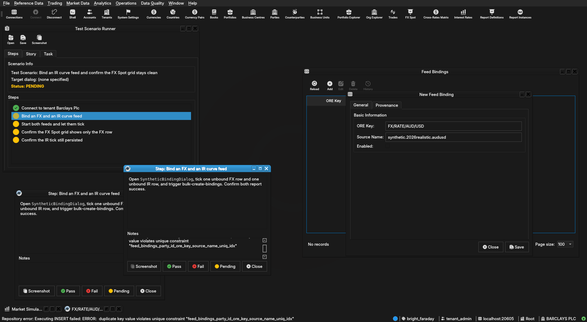

:PROPERTIES:
:ID: FFD4111E-3C40-44D3-8F18-DAA2357D65E8
:END:
#+title: Test Scenario: Bind an IR curve feed and confirm the FX Spot grid stays clean
#+description: Bind an IR curve feed via SyntheticBindingDialog and confirm asset_class routes it out of FxSpotGridWindow's FX-only listing, while a bound FX feed still shows correctly.
#+type: test_scenario
#+level: s1
#+filetags: :ir-rates-followups:sprint_25:v0:
#+target_dialog:
#+created: 2026-07-29
#+updated: 2026-07-29
#+environment:
#+todo: PENDING | PASSED FAILED
#+startup: inlineimages

This page documents a test scenario verifying [[id:C2F23164-99A2-4640-8DA2-8BFB017ACB12][Feed bindings have no product-kind filter: FX Spot grid renders IR bindings as garbage currency-pair rows]] in [[id:C29FE5A3-61F0-4D2F-BE4F-8A02223EABEF][IR Rates synthetic data: dataset seeding, index cleanup, dual-curve, quoting conventions]]. It is filled in with the target dialog and checklist of steps before testing starts; the QA Validation Runner panel rewrites =* Results= in place on save.

* Scenario Info

# The QA Validation Runner treats *any* non-empty Clients cell below as
# "this is a multi-client scenario" and then expects every step nested
# one level deeper, under a per-client heading (Runner source:
# QaValidationRunnerWidget.cpp, `multi_client =
# !find_field_value(*info, "Clients").isEmpty()`). Leave the cell
# genuinely blank — no placeholder text, not even "(single client)" —
# for the common single-client case; a non-empty cell here with flat
# `**` steps (no per-client `**`/`***` nesting) silently loads zero
# steps. Only put text in it when the scenario truly needs several
# running client instances at once (e.g. a NATS notification lands on
# a second instance) — list the instance colours/labels, e.g. "blue,
# red", and nest every step one level deeper under a `**` heading per
# client as shown further down.

| Field         | Value                                   |
|---------------+------------------------------------------|
| Verifies task | [[id:C2F23164-99A2-4640-8DA2-8BFB017ACB12][Feed bindings have no product-kind filter: FX Spot grid renders IR bindings as garbage currency-pair rows]] |
| Parent story  | [[id:C29FE5A3-61F0-4D2F-BE4F-8A02223EABEF][IR Rates synthetic data: dataset seeding, index cleanup, dual-curve, quoting conventions]]   |
| Target dialog | (Qt dialog class under test, if any.)   |
| Clients       |                                          |
| State         | PENDING                               |

* Steps

Each step is its own heading — the title should be five to seven
words so it fits on one line in the QA Validation Runner's step list
without wrapping or truncating (e.g. "Edit and save the record", not
a full sentence describing the whole operation). The body below the
title is a bullet-point checklist, not a prose paragraph: give the
tester every piece of context needed to execute that one step without
looking anything up elsewhere — what UI state must already exist,
exactly what to click or type, and exactly what confirms the step
passed. The panel writes each step's PASS/FAIL/PENDING outcome and
notes back as a =*** Result= child heading directly under it.

** Connect to tenant Barclays Plc

Log in against the =bright_faraday= environment as
=tenant_admin@barclays_plc= / =Secure-Password-123= and select
*BARCLAYS PLC*.

*** Result

| Field  | Value |
|--------+-------|
| Status | PASS |

** Bind an FX and an IR curve feed

Open =SyntheticBindingDialog=, tick one unbound FX row and one
unbound IR row, and trigger bulk-create-bindings. Confirm both report
success.

*** Result

| Field  | Value |
|--------+-------|
| Status | PASS |
| Notes  | Repository error: Executing INSERT failed: ERROR:  duplicate key value violates unique constraint "feed_bindings_party_id_ore_key_source_name_uniq_idx"; ; ;  |

** Start both feeds and let them tick

Start the synthetic feeds for both the FX and IR curve configs just
bound, and let them run long enough to publish at least one tick
each.

*** Result

| Field  | Value |
|--------+-------|
| Status | PASS |

** Confirm the FX Spot grid shows only the FX row

Open the FX Spot grid. Confirm the newly bound FX pair appears and
ticks normally, and that there is no garbled/malformed row for the IR
binding (e.g. no row showing something like "USD/LIBOR-3M" as if it
were a currency pair).

*** Result

| Field  | Value |
|--------+-------|
| Status | PASS |

** Confirm the IR tick still persisted

Via SQL (=compass sql -- -c "select * from
ores_marketdata_market_observations_tbl order by observed_at desc
limit 5;"=) or an observation-backed screen, confirm the IR curve's
tick still landed in =market_observations= despite being filtered out
of the FX Spot grid -- the fix is display-side filtering only, not a
change to persistence.

# For a multi-client scenario (Clients field above is non-empty),
# nest steps one level deeper instead, under one sub-heading per
# client, e.g.:
#
#   ** blue
#   *** Open the counterparty lookup and search
#   ** red
#   *** Confirm the notification arrived and the list refreshed
#
# Single-client scenarios (the common case) keep steps as direct
# children of * Steps, as above.

*** Result

| Field  | Value |
|--------+-------|
| Status | PASS |

* Results

| Field         | Value |
|---------------+-------|
| Status        | PASSED |
| Completed at  | 2026-07-29T15:24:21Z |
| Branch        | feature/filter-feed-bindings-by-product-kind |
| Commit        | 77abcecf7 |
| Worktree      | bright_faraday |

* Notes
