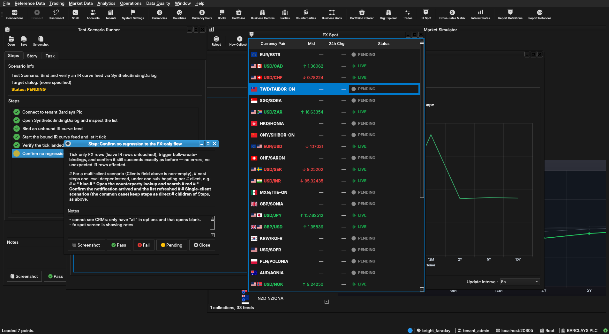

:PROPERTIES:
:ID: E7249ACB-D839-43D9-BF38-864C5A7AB93F
:END:
#+title: Test Scenario: Bind and verify an IR curve feed via SyntheticBindingDialog
#+description: Open SyntheticBindingDialog, confirm IR curve configs are listed alongside FX with a Type column and correct pre-ticking, bind and start an IR curve feed, and verify its ticks land in ores_marketdata_market_observations_tbl -- with no regression to the FX-only flow.
#+type: test_scenario
#+level: s1
#+filetags: :ir-rates-followups:sprint_25:v0:
#+target_dialog:
#+created: 2026-07-29
#+updated: 2026-07-29
#+environment:
#+todo: PENDING | PASSED FAILED
#+startup: inlineimages

This page documents a test scenario verifying [[id:48D6933D-05F4-4B34-B796-FE1B4A2A6444][Extend SyntheticBindingDialog to cover IR curve configs]] in [[id:C29FE5A3-61F0-4D2F-BE4F-8A02223EABEF][IR Rates synthetic data: dataset seeding, index cleanup, dual-curve, quoting conventions]]. It is filled in with the target dialog and checklist of steps before testing starts; the QA Validation Runner panel rewrites =* Results= in place on save.

* Scenario Info

# The QA Validation Runner treats *any* non-empty Clients cell below as
# "this is a multi-client scenario" and then expects every step nested
# one level deeper, under a per-client heading (Runner source:
# QaValidationRunnerWidget.cpp, `multi_client =
# !find_field_value(*info, "Clients").isEmpty()`). Leave the cell
# genuinely blank — no placeholder text, not even "(single client)" —
# for the common single-client case; a non-empty cell here with flat
# `**` steps (no per-client `**`/`***` nesting) silently loads zero
# steps. Only put text in it when the scenario truly needs several
# running client instances at once (e.g. a NATS notification lands on
# a second instance) — list the instance colours/labels, e.g. "blue,
# red", and nest every step one level deeper under a `**` heading per
# client as shown further down.

| Field         | Value                                   |
|---------------+------------------------------------------|
| Verifies task | [[id:48D6933D-05F4-4B34-B796-FE1B4A2A6444][Extend SyntheticBindingDialog to cover IR curve configs]] |
| Parent story  | [[id:C29FE5A3-61F0-4D2F-BE4F-8A02223EABEF][IR Rates synthetic data: dataset seeding, index cleanup, dual-curve, quoting conventions]]   |
| Target dialog | (Qt dialog class under test, if any.)   |
| Clients       |                                          |
| State         | PENDING                               |

* Steps

Each step is its own heading — the title should be five to seven
words so it fits on one line in the QA Validation Runner's step list
without wrapping or truncating (e.g. "Edit and save the record", not
a full sentence describing the whole operation). The body below the
title is a bullet-point checklist, not a prose paragraph: give the
tester every piece of context needed to execute that one step without
looking anything up elsewhere — what UI state must already exist,
exactly what to click or type, and exactly what confirms the step
passed. The panel writes each step's PASS/FAIL/PENDING outcome and
notes back as a =*** Result= child heading directly under it.

** Connect to tenant Barclays Plc

Log in against the =bright_faraday= environment as
=tenant_admin@barclays_plc= / =Secure-Password-123= and select
*BARCLAYS PLC*.

*** Result

| Field  | Value |
|--------+-------|
| Status | PASS |

** Open SyntheticBindingDialog and inspect the list

From the Market Simulator / synthetic marketdata screen, open
=SyntheticBindingDialog=. Confirm:
- Both FX (=fx_spot_generation_config=) and IR curve
  (=ir_curve_generation_config=) rows are listed together.
- A *Type* column shows "FX" or "IR" for every row.
- Rows that already have an existing feed binding are pre-ticked.

*** Result

| Field  | Value |
|--------+-------|
| Status | PASS |

** Bind an unbound IR curve feed

Tick an IR curve row that has no existing binding (Type = IR, not
pre-ticked) and trigger the bulk-create-bindings action. Confirm the
dialog reports success and the row is now shown as bound (e.g.
pre-ticked on reopen).

*** Result

| Field  | Value |
|--------+-------|
| Status | PASS |

** Start the bound IR curve feed and let it tick

Start the synthetic feed for the IR curve config just bound (Market
Simulator tree or equivalent start control) and let it run long
enough to publish at least one tick.

*** Result

| Field  | Value |
|--------+-------|
| Status | PASS |

** Verify the tick landed in market_observations

Via SQL (=compass sql -- -c "select * from
ores_marketdata_market_observations_tbl order by observed_at desc
limit 5;"=) or an observation-backed screen, confirm a fresh row
exists for the IR curve's =ore_key= (e.g. "USD/LIBOR-3M") matching
the feed just started.

*** Result

| Field  | Value |
|--------+-------|
| Status | PASS |

** Confirm no regression to the FX-only flow

Tick only FX rows (leave IR rows untouched), trigger
bulk-create-bindings, and confirm it still succeeds exactly as
before — no errors, no unexpected IR rows affected.

# For a multi-client scenario (Clients field above is non-empty),
# nest steps one level deeper instead, under one sub-heading per
# client, e.g.:
#
#   ** blue
#   *** Open the counterparty lookup and search
#   ** red
#   *** Confirm the notification arrived and the list refreshed
#
# Single-client scenarios (the common case) keep steps as direct
# children of * Steps, as above.

*** Result

| Field  | Value |
|--------+-------|
| Status | FAIL |
| Notes  | - cannot see CRMs: only have "all" in options and that opens blank.; - fx spot screen is showing rates; ;  |

* Results

| Field         | Value |
|---------------+-------|
| Status        | FAILED |
| Completed at  | 2026-07-29T10:03:12Z |
| Branch        | feature/extend-synthetic-binding-dialog-to-ir-curves |
| Commit        | 6ba484473 |
| Worktree      | bright_faraday |

* Notes
