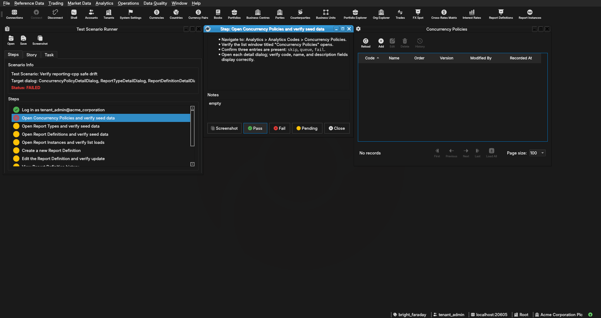

:PROPERTIES:
:ID: 105BA443-BF4E-48DA-9DA3-3DC600CA95C5
:END:
#+title: Test Scenario: Verify reporting-cpp safe drift
#+description: End-to-end verification that the reporting entities (concurrency_policy, report_type, report_definition, report_instance) work correctly after codegen regeneration.
#+type: test_scenario
#+level: s1
#+filetags: :refactor_codegen_cpp:sprint_25:v0:
#+target_dialog: ConcurrencyPolicyDetailDialog, ReportTypeDetailDialog, ReportDefinitionDetailDialog, ReportInstanceDetailDialog — Menus: Analytics > Report Definitions, Analytics > Report Instances, Analytics > Analytics Codes > Report Types, Analytics > Analytics Codes > Concurrency Policies
#+created: 2026-08-08
#+updated: 2026-08-08
#+environment: bright_faraday
#+todo: PENDING | PASSED FAILED
#+startup: inlineimages

This page documents a test scenario verifying [[id:193FF620-BB98-4EB4-9124-2D06CA8FFCE0][Apply safe drift to reporting-cpp]] in [[id:3B8F2A1D-7C4E-4B6A-9E5D-2F1A8C3B7D9E][Refactor ores.codegen C++ generation]]. The reporting component was fully regenerated across all layers after model updates: domain structs, repositories, services, messaging, SQL schemas, and Qt UI.

* Before you start

- Database freshly recreated (schema 0.0.25, commit 7ca43d490).
- Acme Corporation provisioned via =--source acme=.
- Credentials: =tenant_admin@acme_corporation= / =Secure-Password-123=.

* Scenario Info

| Field         | Value                                   |
|---------------+------------------------------------------|
| Verifies task | [[id:193FF620-BB98-4EB4-9124-2D06CA8FFCE0][Apply safe drift to reporting-cpp]] |
| Parent story  | [[id:3B8F2A1D-7C4E-4B6A-9E5D-2F1A8C3B7D9E][Refactor ores.codegen C++ generation]]   |
| Target dialog | ConcurrencyPolicyDetailDialog, ReportTypeDetailDialog, ReportDefinitionDetailDialog, ReportInstanceDetailDialog — Menus: Analytics > Report Definitions / Report Instances; Analytics > Analytics Codes > Report Types / Concurrency Policies |
| Clients       |                                          |
| State         | PENDING                               |

* Steps

** Log in as tenant_admin@acme_corporation

- Username: =tenant_admin@acme_corporation=
- Password: =Secure-Password-123=
- Verify the main window opens with the ORE Studio menu bar visible.

*** Result

| Field  | Value |
|--------+-------|
| Status | PASS |

** Open Concurrency Policies and verify seed data

- Navigate to: Analytics > Analytics Codes > Concurrency Policies.
- Verify the list window titled "Concurrency Policies" opens.
- Confirm three entries are present: =skip=, =queue=, =fail=.
- Open each detail dialog; verify code, name, and description fields display correctly.

*** Result

| Field  | Value |
|--------+-------|
| Status | FAIL |
| Notes  | empty;  |

** Open Report Types and verify seed data

- Navigate to: Analytics > Analytics Codes > Report Types.
- Verify the list window titled "Report Types" opens.
- Confirm two entries are present: =risk= and =grid=.
- Open each detail dialog; verify code, name, and description fields display.

*** Result

| Field  | Value |
|--------+-------|
| Status | PENDING |

** Open Report Definitions and verify seed data

- Navigate to: Analytics > Report Definitions.
- Verify the list window titled "Report Definitions" opens.
- Confirm the list shows 28 report definitions loaded from seed data.
- Verify columns: Name, Type, Schedule, Concurrency, Version, Modified By.
- Open a few detail dialogs; verify all fields display (name, description, report type, schedule expression, concurrency policy).

*** Result

| Field  | Value |
|--------+-------|
| Status | PASS |

** Open Report Instances and verify list loads

- Navigate to: Analytics > Report Instances.
- Verify the list window titled "Report Instances" opens.
- The list may be empty — report instances are created by the scheduler trigger.

*** Result

| Field  | Value |
|--------+-------|
| Status | PASS |

** Create a new Report Definition

- In the Report Definitions list, click Add.
- In the detail dialog, fill in:
  - Name: =Test Daily Risk Report=
  - Description: =Scenario test report definition=
  - Report Type: enter =risk=
  - Schedule (cron): =0 8 * * 1-5=
  - Concurrency Policy: enter =queue=
- Click Save.
- Verify the new definition appears in the list with the entered values.

*** Result

| Field  | Value |
|--------+-------|
| Status | PASS |

** Edit the Report Definition and verify update

- In the Report Definitions list, find "Test Daily Risk Report".
- Open its detail dialog, change Description to: =Updated — scenario test=.
- Click Save.
- Verify the list refreshes and the new description appears.

*** Result

| Field  | Value |
|--------+-------|
| Status | PASS |

** View Report Definition history

- In the Report Definitions list, select "Test Daily Risk Report".
- Open its History dialog (right-click or toolbar button).
- Verify the create and update entries are listed.
- Confirm change reasons are recorded.
- Close the history dialog.

*** Result

| Field  | Value |
|--------+-------|
| Status | PASS |

** Delete the Report Definition and confirm removal

- In the Report Definitions list, select "Test Daily Risk Report".
- Click Delete and confirm.
- Verify the definition disappears from the list.

*** Result

| Field  | Value |
|--------+-------|
| Status | PASS |

** Create a new Concurrency Policy (CRUD end-to-end)

- In the Concurrency Policies list, click Add.
- Fill in Code: =test-policy=, Name: =Test Policy=, Description: =Created by scenario test=.
- Click Save.
- Verify it appears in the list.
- Open its History dialog; confirm the creation is recorded.
- Delete the test policy; verify it is removed.

*** Result

| Field  | Value |
|--------+-------|
| Status | PASS |
| Notes  | no eventing, manual reload works |

* Results

| Field         | Value |
|---------------+-------|
| Status        | PASSED |
| Completed at  | 2026-08-08T19:10:45Z |
| Branch        | fix/reporting-main-break |
| Commit        | 7b0ab7fc3 |
| Worktree      | bright_faraday |

* Notes
