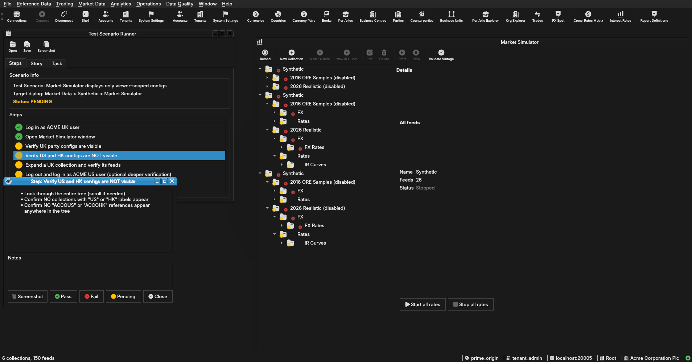

:PROPERTIES:
:ID: 127AA151-AFFD-4655-AA85-754B56170879
:END:
#+title: Test Scenario: Market Simulator displays only viewer-scoped configs
#+description: Verify that logging in as ACME UK user shows only UK configs in Market Simulator tree, not US/HK
#+type: test_scenario
#+level: s1
#+filetags: :synthetic_data_scope_and_binding:sprint_25:v0:
#+target_dialog: Market Data > Synthetic > Market Simulator
#+created: 2026-08-05
#+updated: 2026-08-06
#+environment:
#+todo: PENDING | PASSED FAILED
#+startup: inlineimages

This page documents a test scenario verifying [[id:601A7F49-E2A5-4DCB-992F-19665472E629][Filter Market Simulator tree by viewer scope]] in [[id:9DEED9D1-680C-4B87-A7DF-2B9AA9ED7277][Synthetic data scope and binding: system/tenant/party levels, bound vs sandboxed]]. It is filled in with the target dialog and checklist of steps before testing starts; the QA Validation Runner panel rewrites =* Results= in place on save.

* Before you start

- Services must be running: =compass services status= should show all services running
- ACME Corporation must be provisioned with UK/US/HK parties (confirmed via =compass sql -- -c "SELECT short_code FROM ores_refdata_parties_tbl WHERE short_code LIKE 'ACCO%';"=)
- Synthetic configs must be published for each ACME party (Basic and Realistic collections)
- Qt client is running and not yet logged in
- This test scenario is open in the QA Validation Runner panel

* Scenario Info

# The QA Validation Runner treats *any* non-empty Clients cell below as
# "this is a multi-client scenario" and then expects every step nested
# one level deeper, under a per-client heading (Runner source:
# QaValidationRunnerWidget.cpp, `multi_client =
# !find_field_value(*info, "Clients").isEmpty()`). Leave the cell
# genuinely blank — no placeholder text, not even "(single client)" —
# for the common single-client case; a non-empty cell here with flat
# `**` steps (no per-client `**`/`***` nesting) silently loads zero
# steps. Only put text in it when the scenario truly needs several
# running client instances at once (e.g. a NATS notification lands on
# a second instance) — list the instance colours/labels, e.g. "blue,
# red", and nest every step one level deeper under a `**` heading per
# client as shown further down.

| Field         | Value                                   |
|---------------+------------------------------------------|
| Verifies task | [[id:601A7F49-E2A5-4DCB-992F-19665472E629][Filter Market Simulator tree by viewer scope]] |
| Parent story  | [[id:9DEED9D1-680C-4B87-A7DF-2B9AA9ED7277][Synthetic data scope and binding: system/tenant/party levels, bound vs sandboxed]]   |
| Target dialog | (Qt dialog class under test, if any.)   |
| Clients       |                                          |
| State         | PENDING (RLS fix committed, ready for test)  |

* Steps

** Log in as ACME UK user

- Username: =acme_uk_user= (any ACME UK-scoped party user, verify via =compass shell -- accounts list=)
- Password: =Secure-Password-123=
- Confirm the active party shown in the top-right is "ACME Corporation UK plc" or equivalent

*** Result

| Field  | Value |
|--------+-------|
| Status | PASS |

** Open Market Simulator window

- Menu: *Market Data > Synthetic > Market Simulator*
- Confirm the window opens with a tree on the left labeled "Synthetic"
- Confirm the right panel shows a summary (may be empty until a node is selected)

*** Result

| Field  | Value |
|--------+-------|
| Status | PASS |

** Verify UK party configs are visible

- Expand the "Synthetic" root node
- Confirm two or more collections appear (e.g., "2026 Realistic", "2016 ORE Samples")
- These should all be labeled with "UK" in the display or be the visible collections for the viewer
- Note the names of visible collections

*** Result

| Field  | Value |
|--------+-------|
| Status | PENDING |
| Notes  | Collections visible: |

** Verify US and HK configs are NOT visible

- Look through the entire tree (scroll if needed)
- Confirm NO collections with "US" or "HK" labels appear
- Confirm NO "ACCOUS" or "ACCOHK" references appear anywhere in the tree

*** Result

| Field  | Value |
|--------+-------|
| Status | FAIL |
| Notes  |  |

** Expand a UK collection and verify its feeds

- Click the triangle/arrow next to one of the UK collections (e.g., "2026 Realistic")
- Expand it to see the FX asset class folder, then FX Rates
- Confirm FX pairs are listed (GBP/USD, GBP/EUR, etc.)
- These should all be the same pairs that belong to the UK-scoped collection, not a mix from different parties

*** Result

| Field  | Value |
|--------+-------|
| Status | PENDING |

** Log out and log in as ACME US user (optional deeper verification)

- Use the main menu to log out
- Log back in as =acme_us_user= (verify via =compass shell -- accounts list=)
- Confirm the active party is now "ACME Corporation US Inc"
- Re-open Market Simulator (or close and re-open)
- Verify that the tree NOW shows US collections, and UK/HK collections are no longer visible

*** Result

| Field  | Value |
|--------+-------|
| Status | PENDING |
| Notes  | US collections visible: |

* Results

| Field         | Value |
|---------------+-------|
| Status        | FAILED |
| Completed at  | 2026-08-06T10:43:48Z |
| Branch        | feature/filter-market-simulator-tree-by-viewer-scope |
| Commit        | 0c845a08b |
| Worktree      | prime_origin |

* Notes
