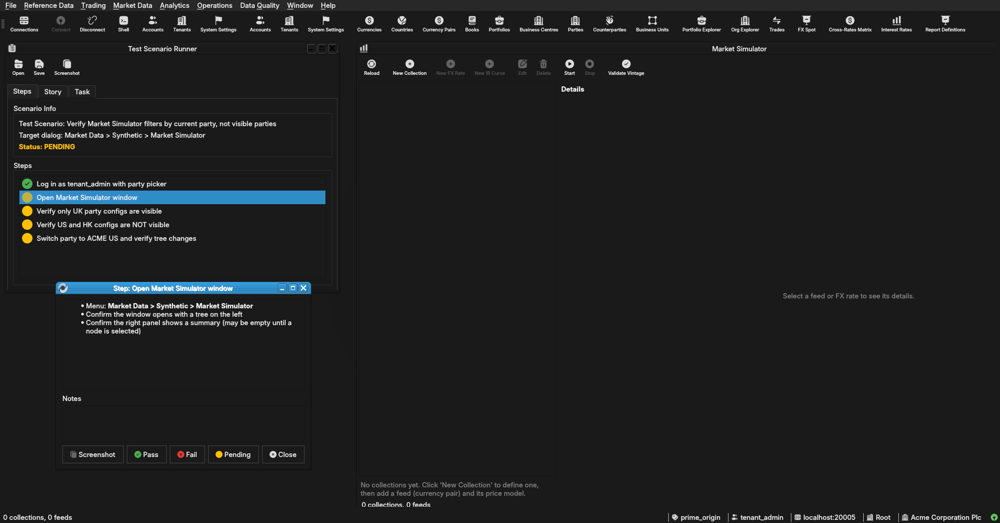

:PROPERTIES:
:ID: C6AF8353-522A-48C7-98A3-F414B27720A1
:END:
#+title: Test Scenario: Verify Market Simulator filters by current party, not visible parties
#+description: Verify that after the RLS policy change from visible_party_ids to current_party_id, logging in as a multi-party ACME user and selecting ACME UK shows only UK configs in the Market Simulator tree, with US and HK configs hidden.
#+type: test_scenario
#+level: s1
#+filetags: :synthetic_data_scope_and_binding:sprint_25:v0:
#+target_dialog: Market Data > Synthetic > Market Simulator
#+created: 2026-08-06
#+updated: 2026-08-06
#+environment:
#+todo: PENDING | PASSED FAILED
#+startup: inlineimages

This page documents a test scenario verifying [[id:601A7F49-E2A5-4DCB-992F-19665472E629][Filter Market Simulator tree by viewer scope (supersedes existing capture)]] in [[id:9DEED9D1-680C-4B87-A7DF-2B9AA9ED7277][Synthetic data scope and binding: system/tenant/party levels, bound vs sandboxed]]. It is filled in with the target dialog and checklist of steps before testing starts; the QA Validation Runner panel rewrites =* Results= in place on save.

* Before you start

- Services must be running: =compass services status= should show all services running
- Acme Corporation must be provisioned with UK/US/HK parties via =--source acme=: confirm with =compass shell -f provisioning/how_do_i_provision_the_system_with_acme_corporation_holding_group.ores=
- Database must have the current-party RLS policies deployed: confirm with =compass sql -- -c "SELECT policyname FROM pg_policies WHERE tablename LIKE '%synthetic%' AND policyname LIKE '%party%' AND qual LIKE '%current_party_id%' LIMIT 1;"= — should return at least one row
- Qt client is running and not yet logged in
- This test scenario is open in the QA Validation Runner panel

* Scenario Info

| Field         | Value                                   |
|---------------+------------------------------------------|
| Verifies task | [[id:601A7F49-E2A5-4DCB-992F-19665472E629][Filter Market Simulator tree by viewer scope (supersedes existing capture)]] |
| Parent story  | [[id:9DEED9D1-680C-4B87-A7DF-2B9AA9ED7277][Synthetic data scope and binding: system/tenant/party levels, bound vs sandboxed]]   |
| Target dialog | (Qt dialog class under test, if any.)   |
| Clients       |                                          |
| State         | PENDING (RLS policies deployed, DB provisioned, ready for test)  |

* Steps

** Log in as tenant_admin

- Username: =tenant_admin@acme_corporation=
- Password: =Secure-Password-123=
- Note: =tenant_admin= belongs to 5 parties; quick-login auto-selects the default (Acme Corporation Plc). Do NOT manually override in the party picker — let quick-login proceed.
- Confirm the active party shown in the top-right status bar after login

*** Result

| Field  | Value |
|--------+-------|
| Status | PASS |
| Notes  | Active party after login: |

** Switch party to ACME UK

- Use the main menu *File > Switch Party* (or the party selector in the status bar)
- Select *ACME Corporation UK plc* from the party list
- Confirm the active party changes to "ACME Corporation UK plc"

*** Result

| Field  | Value |
|--------+-------|
| Status | PASS |

** Open Market Simulator window

- Menu: *Market Data > Synthetic > Market Simulator*
- Confirm the window opens with a tree on the left
- Confirm the right panel shows a summary (may be empty until a node is selected)

*** Result

| Field  | Value |
|--------+-------|
| Status | PASS |
| Notes  | no data:; ;  |

** Verify only UK party configs are visible

- Expand the tree root nodes (if not already expanded)
- Confirm collections labelled "2016 ORE Samples" and/or "2026 Realistic" appear
- Count the top-level folders: there should be exactly ONE "Synthetic" root folder, not three
- If multiple collections are visible, confirm none are labelled with US or HK party identifiers
- Note the names of visible collections and their party affiliation

*** Result

| Field  | Value |
|--------+-------|
| Status | PASS |
| Notes  | Collections visible: |

** Verify US and HK configs are NOT visible

- Look through the entire tree (scroll if needed)
- Confirm NO collections, folders, or feeds labelled "ACME Corporation US Inc" or "ACME Corporation HK Ltd" appear
- Confirm NO "ACCOUS" or "ACCOHK" references appear anywhere in the tree

*** Result

| Field  | Value |
|--------+-------|
| Status | PASS |

** Switch party to ACME US and verify tree changes

- Use the main menu to switch party to *ACME Corporation US Inc* (or log out and log back in selecting US)
- Confirm the active party is now "ACME Corporation US Inc"
- Re-open Market Simulator (or press Reload)
- Verify the tree NOW shows US collections and UK/HK collections are NO longer visible
- Verify the tree shows exactly ONE "Synthetic" root folder (US party only)

*** Result

| Field  | Value |
|--------+-------|
| Status | PASS |
| Notes  | US collections visible: |

* Results

| Field         | Value |
|---------------+-------|
| Status        | PASSED |
| Completed at  | 2026-08-06T21:24:28Z |
| Branch        | feature/filter-market-simulator-tree-by-viewer-scope |
| Commit        | d8e79a5f2 |
| Worktree      | prime_origin |

* Notes
