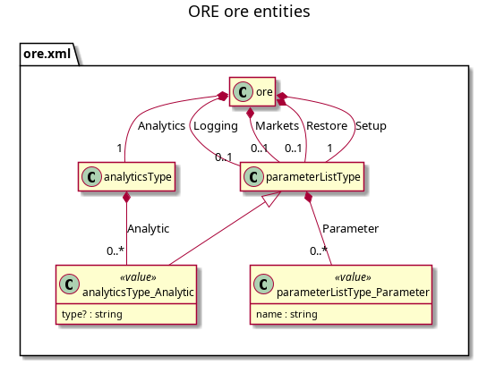
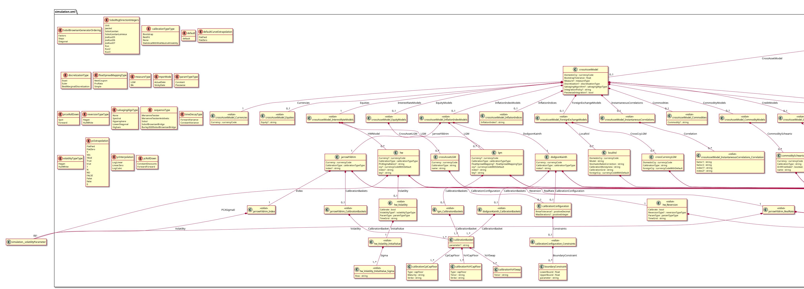
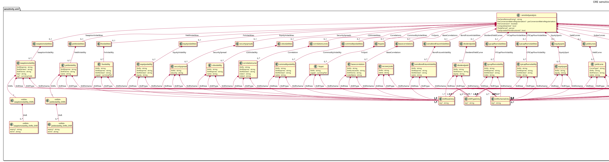
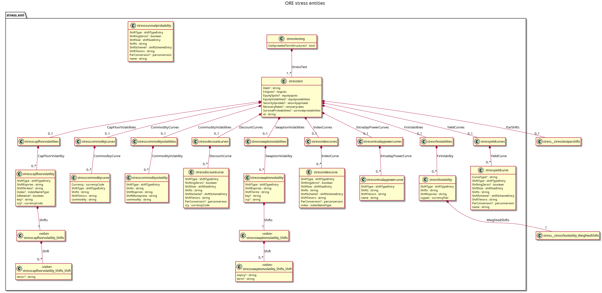
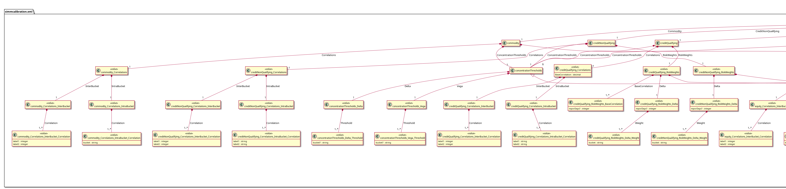
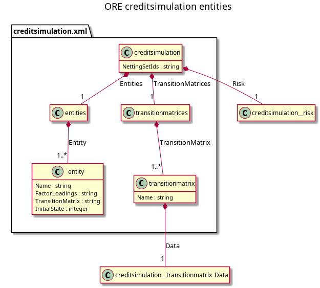
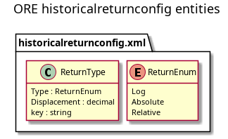
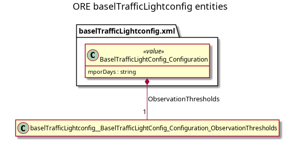

:PROPERTIES:
:ID: 220F3CA3-115F-4398-B88A-7F429333FFE2
:END:
#+title: Investigation: the ORE configuration entity taxonomy
#+description: Every entity in the ORE report configuration vocabulary, with the reviewed entity and value-type counts per document and the list of all modelled classes with their owner and relation.
#+type: investigation
#+level: s1
#+filetags: :ore-report-configuration:sprint_26:v0:
#+created: 2026-09-27
#+updated: 2026-09-27

* Summary

Every entity ORE defines for report configuration is drawn here, with its
attributes, its children and its cardinality, and listed with the component that
owns it and the relation a report definition has to it. The counts are on
[[id:0FC2B828-ED9C-4C8F-A8DD-84C1BB913A09][The ORE report configuration
documents]]; this page is the detail behind them.

The diagrams are generated from the schemas, so they cannot drift from the
vocabulary. Read the overview first; the per-document diagrams are for working
from when modelling one document.

* Detail

** The whole vocabulary

#+caption: Every entity and block in the seventeen configuration documents: 363 classes and 625 relationships. Market data and trades are absent.
[[proj:doc/agile/versions/v0/sprint_26/ore-report-configuration/analysis/ore_report_configuration_entities.png]]

Source: [[./ore_report_configuration_entities.puml][=ore_report_configuration_entities.puml=]].
Regenerate with =python3 build/scripts/xsd_to_uml.py --entities-only --format puml=.

** The reporting model the taxonomy targets

#+caption: A report definition, what it owns, what it references, and where each entity belongs.
[[proj:doc/agile/versions/v0/sprint_26/ore-report-configuration/analysis/ore_report_configuration_overview.png]]

Source: [[./ore_report_configuration_overview.puml][=ore_report_configuration_overview.puml=]].

** Per-document diagrams

The documents the reporting model has to absorb, drawn on their own:

| Document | Diagram | Entities |
|----------+---------+----------|
| =ore.xml= |  | 4 |
| =simulation.xml= |  | 18 |
| =sensitivity.xml= |  | 58 |
| =stress.xml= |  | 24 |
| =simmcalibration.xml= |  | 43 |
| =creditsimulation.xml= |  | 3 |
| =historicalreturnconfig.xml= |  | 2 |
| =baselTrafficLightconfig.xml= |  | 2 |

The remaining documents are owned by other components; their diagrams come from
the same command run against that document, for example
=--xsd curveconfig= for the 55 curve-configuration entities.

** The entity list, with its owner and relation

The complete list is generated, one row per modelled class, by:

#+begin_src sh
python3 build/scripts/xsd_to_uml.py --format mapping --out-dir .audit/ore-taxonomy
#+end_src

It names the owning component, the reporting entity each class becomes, and
whether the report definition owns or references it. It is the page to check
before modelling: if a class is absent from it, the extractor has been pointed
at the wrong documents.

** What is an entity and what is not

An entity has identity or holds children; a value type is a leaf carrying one
scalar payload plus label attributes. The distinction matters because a value
type becomes columns on its parent, while an entity becomes a table with a key.

Three things are neither. Anonymous containers and inline companions — 43 in
=curveconfig.xsd= alone — are repetition carriers that the model absorbs into the
parent. The =xs:any= wildcard in =simmcalibration.xsd= is an extension point with
no fixed fields. And the 116 =market_*= classes of =simulation.xsd= are market
data, which the brief excludes.

* See also

- [[id:91F2CF85-B743-4CAD-99B3-E635DA075499][ORE report configuration]] — the index of this investigation, and where to read this page in it.
