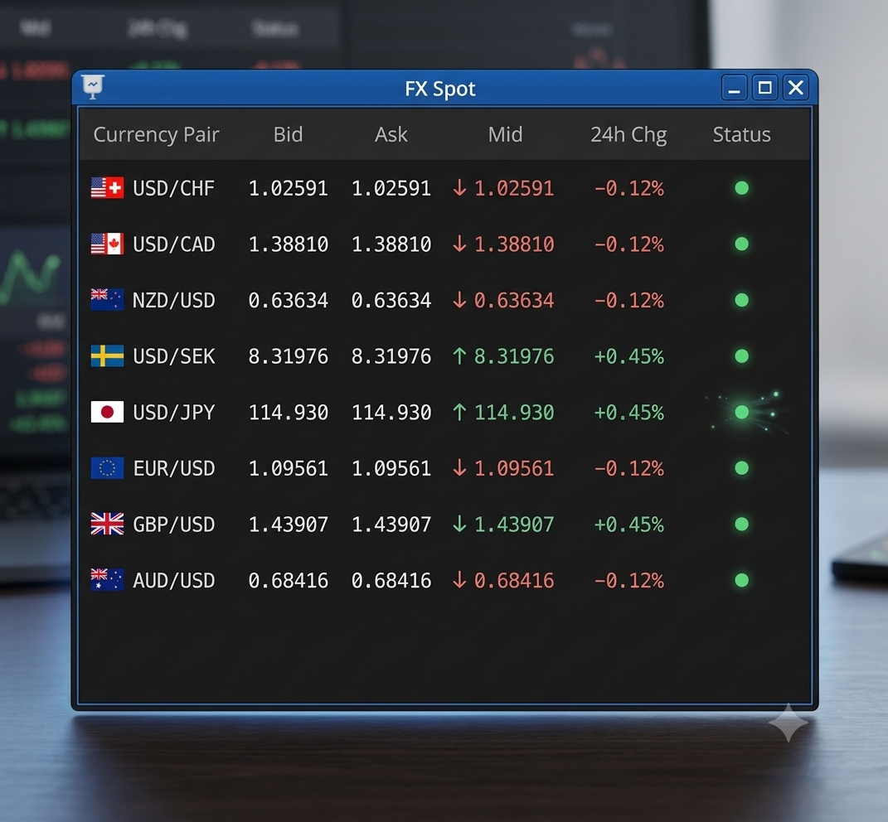

:PROPERTIES:
:ID: 9242195E-21AE-4332-8306-183767046BC3
:END:
#+TITLE: FX Spot Monitor UI/UX Audit & Redesign Specification
#+AUTHOR: Gemini AI
#+DATE: 2026-07-10
#+OPTIONS: toc:2 num:t todo:t
#+STARTUP: inlineimages

#+CAPTION: Gemini's proposed FX Spot Monitor redesign mockup vs. the current widget.

* Executive Summary
This document provides a technical UI/UX evaluation and structural specification for the *FX Spot Ticker Monitor Widget*.

The original interface suffered from severe color fatigue (the "Christmas Tree" effect), poor numeric column alignment, non-standard financial decimal formatting for Japanese Yen pairs, and redundant visual signals that reduced structural efficiency.

The proposed layout modernizes this window into a high-density, accessible trading block component optimized for low cognitive latency in high-throughput environments.

* Critical UI/UX Pain Points & Diagnostic Analysis

** 1. Excessive Color Fatigue (Ticker Visual Noise)
- **Problem:** The original design applied red or green typography across the entire text length of the currency pair string (e.g., full red =USD/CHF= or full green =GBP/USD=).
- **Impact:** In high-frequency environments, flooding structural text labels with active semantic colors causes eye strain and dulls the user's autonomic response to *actual* real-time rate volatility. Color must be reserved exclusively for directional price changes.

** 2. Poor Layout Alignment & Decimals
- **Problem:** Numeric columns were either centered or left-aligned, and the window layout left vast, empty gaps between data fields while compressing labels elsewhere.
- **Impact:** Vertical scanning speed was severely compromised because decimal places did not stack symmetrically over one another.

** 3. Financial Convention Violation (The JPY Exception)
- **Problem:** The system rendered =USD/JPY= out to five decimal places (=114.93026=).
- **Impact:** In global financial markets, Japanese Yen (JPY) pairs are conventionally quoted to *3 decimal places* (with fractional pips on the 3rd decimal place). Displaying 5 decimals on JPY risks misreading by traders accustomed to rapid-fire ordering entries.

** 4. Redundant Status Signaling
- **Problem:** Every active row displayed an identical, bright green pulsing vector accompanied by the word string =LIVE=.
- **Impact:** If the system data connection is stable, repeating the word =LIVE= across dozens of lines acts as constant background noise.

* Core UI/UX Redesign Strategies

** Strategy 1: Isolate Color to Delta Metrics
- Retain a clean, high-contrast desaturated white or neutral light grey (=#E2E8F0=) for the invariant asset ticker strings (e.g., =USD/CAD=).
- Limit green (=#4ADE80=) and red (=#F87171=) treatments solely to price directions (the =Mid= price ticker arrows) and active daily returns (=24h Chg=).

** Strategy 2: Rigid Right-Alignment & Decimals
- Force mandatory right-alignment on all numeric rate values to line up floating-point structures symmetrically.
- Programmatically implement localized decimal masking: 5 decimal fields for standard G10 pairings, and a hard 3-decimal mask tailored specifically for JPY.

** Strategy 3: High-Density Workspace Expansion
- Inject actionable execution primitives into the layout. Instead of displaying a single lone price point flanked by blank gaps, expand the data matrix to introduce explicit **Bid** and **Ask** tracking coordinates, transforming the passive widget into a functional monitoring engine.

** Strategy 4: Clean Status Anchors
- Strip away the redundant text nodes. Replace the string =LIVE= with a compact, glowing green status micro-indicator badge (🟢) aligned uniformly to the right grid margin.

* Proposed Layout Mockup Blueprint

Below is the structured ASCII blueprint mapping out the refactored, high-density dashboard interface:

#+BEGIN_SRC text
+-------------------------------------------------------------------------+
| 📉 FX Spot                                                      [-] [X] |
+-------------------------------------------------------------------------+
| Currency Pair    Bid          Ask          Mid          24h Chg  Status |
+-------------------------------------------------------------------------+
| 🇺🇸🇨🇭 USD/CHF   1.02591      1.02591    ↓ 1.02591        -0.12%     🟢   |
| 🇺🇸🇨🇦 USD/CAD   1.38810      1.38810    ↓ 1.38810        -0.12%     🟢   |
| 🇳🇿🇺🇸 NZD/USD   0.63634      0.63634    ↓ 0.63634        -0.12%     🟢   |
| 🇺🇸🇸🇪 USD/SEK   8.31976      8.31976    ↑ 8.31976        +0.45%     🟢   |
| 🇺🇸🇯🇵 USD/JPY   114.930      114.930    ↑ 114.930        +0.45%     🟢   |
| 🇪🇺🇺🇸 EUR/USD   1.09561      1.09561    ↓ 1.09561        -0.12%     🟢   |
| 🇬🇧🇺🇸 GBP/USD   1.43907      1.43907    ↑ 1.43907        +0.45%     🟢   |
| 🇦🇺🇺🇸 AUD/USD   0.68416      0.68416    ↓ 0.68416        -0.12%     🟢   |
+-------------------------------------------------------------------------+
#+END_SRC

* Action Item Tracking & Implementation Road Map

** TODO Refactor Numerical Engine Grid [0/2]
- [ ] Apply uniform right-alignment rules to =Bid=, =Ask=, =Mid=, and =24h Chg= text properties.
- [ ] Inject custom formatting pipe logic to truncate JPY assets to a strict 3-decimal pipeline.

** TODO Update Typography & Theme Assets [0/2]
- [ ] Neutralize base currency text nodes to standard light grey, stripping row-wide inheritance filters.
- [ ] Swap harsh primary colors for softer, highly visible, accessibly certified dark-mode financial green and red values.

** TODO Optimize Status Columns [0/2]
- [ ] Deprecate the looping layout render of the word asset string "LIVE" and its corresponding graphic frequency waveforms.
- [ ] Implement a lightweight canvas or simple CSS wrapper component utilizing a single glowing health dot indicator.
