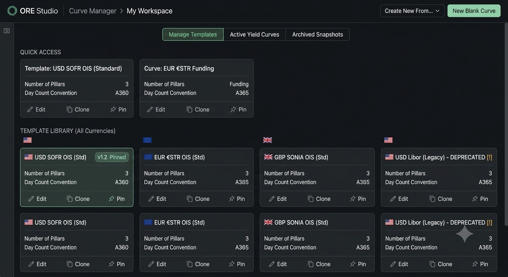
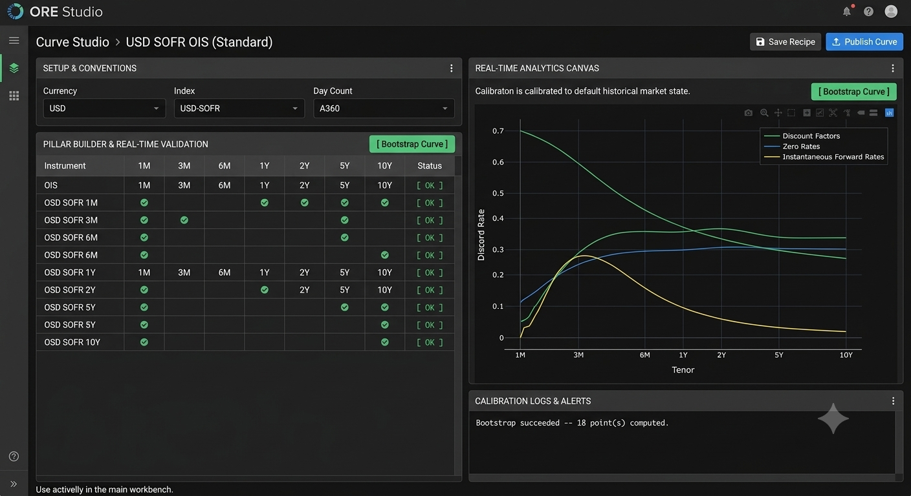
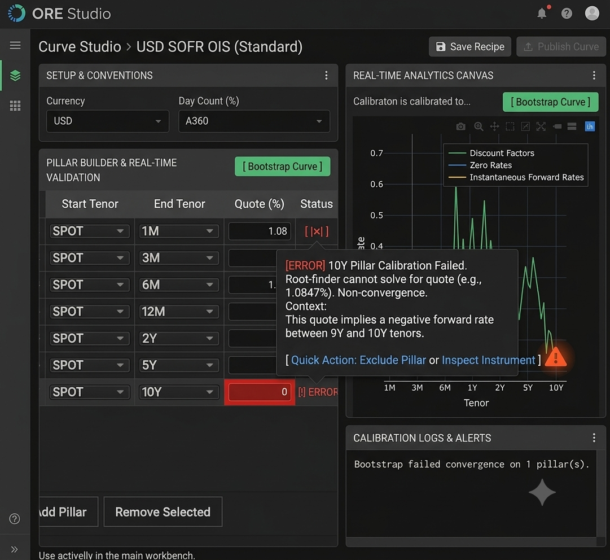
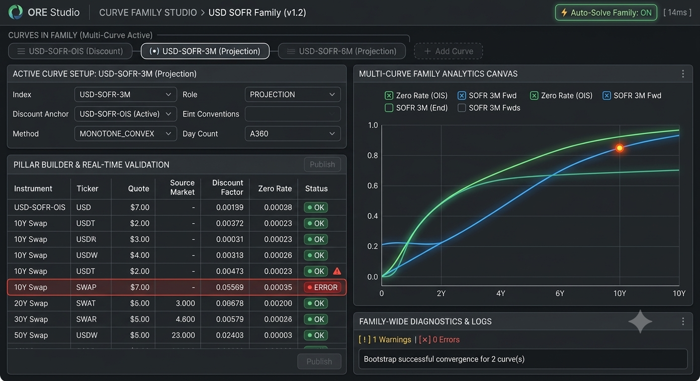
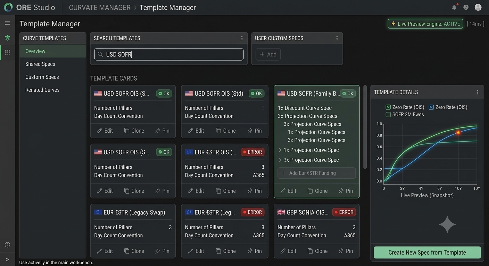

#+TITLE: ORE Studio - Curve Family Studio UI/UX Specification
#+AUTHOR: Quantitative Systems Architecture Team
#+DATE: [2026-08-09]
#+OPTIONS: toc:2 num:nil
#+startup: inlineimages

* Executive Overview

This specification details the UI/UX architecture for the *Curve
Family Studio* in ORE Studio. The goal is to replace legacy
modal-heavy workflows with a single-page, real-time workspace designed
around modern multi-curve market practices.

** Core Objectives

1. *Unified Multi-Curve Paradigm*: Treat every curve setup as a
   /Curve Family/ (where single curves are simply $N=1$ families).
2. *Unified Workspace*: Eliminate tab-switching and modal popups.
   Combine Setup, Pillar Grid, Analytics Canvas, and Diagnostics on
   one screen.
3. *In-Grid RAG Diagnostics*: Provide real-time Red-Amber-Green
   feedback at the individual pillar level with debounced background
   solves.
4. *Source & Output Cohesion*: Display input tickers and quotes
   side-by-side with calculated discount factors and zero rates.

* Workspace Architecture & Container Hierarchy

** Top-Level Document Structure

- *Curve Family Spec (Curve Recipe)*: The version-controlled
  definition specifying currency, index family, curve member roles,
  pillars, and interpolation methods.
- *Market Snapshot*: Point-in-time rates applied to the spec during
  bootstrapping to generate calibrated curves.

** Screen Layout Grid

The workspace uses a responsive split-pane layout:

- *Header Bar (Top)*: Curve Family context, active curve member
  selector, auto-solve engine status.
- *Left Pane (40% Width)*: Active Curve Setup & Unified Pillar Grid.
- *Right Top Pane (35% Height)*: Multi-Curve Real-Time Analytics
  Canvas.
- *Right Bottom Pane (25% Height)*: Diagnostic Console & Convergence
  Logs.

* Component Specifications

** Header Bar & Family Context

- *Family Context Label*: Displays active family (e.g., =USD SOFR
  Family=).
- *Curve Member Selector Bar*: Displays member curves as pill tabs
  (e.g., =[ (•) USD-SOFR-OIS (Discount) ]=, =[ USD-SOFR-3M
  (Projection) ]=).
- *Add Curve Action*: =[ + Add Projection Curve ]= button to
  introduce new member curves to the family.
- *Engine Status Indicator*: Toggle pill displaying =[ ⚡ Auto-Solve:
  ON ]= and calibration latency =[ Solved in 14ms ]=.

** Left Pane: Active Curve Setup & Pillar Grid

*** Curve Setup & Conventions Panel

- =Currency=: Dropdown (e.g., =USD=)
- =Index=: Dropdown (e.g., =USD-SOFR=)
- =Role=: Dropdown (=DISCOUNT=, =FUNDING=, =PROJECTION=)
- =Discount Anchor=: Dropdown (Required for projection curves;
  selects the collateral discounting curve within the family)
- =Interpolation Method=: Dropdown (=LOG_LINEAR_DISCOUNT=,
  =MONOTONE_CONVEX=, =CUBIC_SPLINE=)
- =Day Count Convention=: Dropdown (=A360=, =ACT/ACT=, =A365=)

*** Unified Pillar & Source Grid

Columns must display inputs and calculated outputs side-by-side:

1. =#=: Row index.
2. =Start Tenor=: Selectable tenor (=SPOT=, =1M=, etc.).
3. =End Tenor=: Selectable tenor (=1M=, =10Y=, etc.).
4. =Instrument=: Instrument type (=DEPOSIT=, =OIS SWAP=, =FRA=,
   =FUTURES=).
5. =Source Ticker=: Market feed identifier (e.g.,
   =RATES/YIELD/SOFR10Y=).
6. =Quote (%)=: Editable numerical cell with status tag (=Live= vs
   =Override=).
7. =Discount Factor=: Calibrated output cell.
8. =Zero Rate (%)=: Calibrated output cell.
9. =Status (RAG)=: Visual indicator (=🟢 OK=, =🟡 WARNING=, =🔴
   ERROR=) with hover popover details.

** Right Pane: Analytics Canvas & Diagnostics

*** Real-Time Analytics Canvas

- *Multi-Series Plotting*: Shared time axis plotting Discount Factors,
  Zero Rates, and Instantaneous Forward Rates.
- *Layer Toggles*: Checkboxes to overlay or hide dependent curves in
  the family.
- *Bi-Directional Canvas Sync*:
  - Hovering or clicking an anomaly node on the chart highlights the
    corresponding row in the Pillar Grid.
  - Hovering a =🟡 WARNING= badge in the grid highlights the point on
    the canvas.

*** Diagnostic Console & Logs

- Persistent non-blocking message log.
- Summarizes solver convergence, residual errors ($< 10^{-7}$
  tolerance), and statistical outlier alerts (e.g., =10Y: -4.5σ
  Forward Rate Spike=).
- Provides instant quick-action links (e.g., =[ Quick Action:
  Auto-Sort Rows ]=).

* ASCII Wireframes

** Main Workspace Layout (Multi-Curve Ready State)

#+BEGIN_EXAMPLE
+----------------------------------------------------------------------------------------------------+
|  CURVE FAMILY STUDIO > USD SOFR Family                                  [⚡ Auto-Solve Family: ON ]|
|                                                                                                    |
|  CURVES IN FAMILY:                                                                                 |
|  [ (•) USD-SOFR-OIS (Discount) ]   [ USD-SOFR-3M (Projection) ]   [ + Add Projection Curve ]      |
+-------------------------------------------------------------+--------------------------------------+
|  ACTIVE CURVE SETUP: USD-SOFR-3M (Projection)               |  MULTI-CURVE ANALYTICS CANVAS        |
|  Index: [ USD-SOFR-3M v ]  Discount Anchor: [ OIS-SOFR v ]  |  +---------------------------------+  |
|  Method: [ MONOTONE_CONVEX v ]  Day Count: [ A360 v ]       |  | 5.0% |   /--- (SOFR 3M Fwd)      |  |
|                                                             |  | 4.0% |--/---- (SOFR OIS Zero)     |  |
|-- PILLAR BUILDER & REAL-TIME VALIDATION --------------------|  | 3.0% |/                          |  |
|  [ + Add Pillar ]  [ Auto-Sort Tenors ]                     |  +---------------------------------+  |
|  +--+-------+-----+-----+-------------------+-------+------+  |  * Click node to jump to pillar     |  |
|  |# | Start | End |Inst | Source Ticker     | Quote |Status|  +--------------------------------------+
|  +--+-------+-----+-----+-------------------+-------+------+  |  FAMILY DIAGNOSTICS & LOGS          |  |
|  |1 | SPOT  | 3M  | FRA | RATES/YIELD/SOFR3M| 5.250 |🟢 OK |  | [!] 1 Warnings | [x] 0 Errors       |  |
|  |2 | SPOT  | 6M  | FRA | RATES/YIELD/SOFR6M| 5.120 |🟢 OK |  |                                      |  |
|  |3 | SPOT  | 1Y  | SWAP| RATES/YIELD/SOFR1Y| 4.850 |🟡Spk |  | [WARN] Row 3: 1Y Forward Rate        |  |
|  +--+-------+-----+-----+-------------------+-------+------+  |  deviates +3.8σ from 6M segment.     |  |
|                                                             |  | [ Quick Action: Smooth Spline ]     |  |
|                                                             |  +--------------------------------------+  |
|                                                             |  [ Save Recipe ]   [ Publish Family ]  |  |
+-------------------------------------------------------------+--------------------------------------+
#+END_EXAMPLE

** In-Grid Diagnostic & Error State Wireframe

#+BEGIN_EXAMPLE
+----+-------+-----+------+---------------------+--------+-----------+---------------+
| #  | Start | End | Inst | Source Ticker       | Quote  | Zero Rate | Status (RAG)  |
+----+-------+-----+------+---------------------+--------+-----------+---------------+
| 1  | SPOT  | 1M  | DEP  | RATES/YIELD/SOFR1M  | 5.3100 | 5.3100    | 🟢 OK         |
| 2  | SPOT  | 3M  | DEP  | RATES/YIELD/SOFR3M  | 5.2500 | 5.2500    | 🟢 OK         |
| 3  | SPOT  | 1Y  | SWAP | RATES/YIELD/SOFR1Y  | 4.8500 | 4.8500    | 🟢 OK         |
| 4  | SPOT  | 10Y | SWAP | RATES/YIELD/SOFR10Y | 1.0847 | --        | 🔴 ERROR      |
+----+-------+-----+------+---------------------+--------+-----------+---------------+
|
+-- POPOVER ON CLICK / HOVER:
+---------------------------------------+
| [ERROR] 10Y Calibration Failed.       |
| Root-finder failed to solve for quote |
| (1.0847%). Implies negative forward.  |
|                                       |
| [ Fix / Inspect Instrument ]          |
+---------------------------------------+
#+END_EXAMPLE

** Gemini-Generated Renders

The five mockup renders Gemini generated for this specification:

* Implementation Guidelines for Frontend Engineers

1. *Debounced Live Engine Call*:
   - Attach a ~300ms~ debounce timer to cell edits in the =Quote (%)=
     and =Tenor= columns.
   - On expiration, trigger the background calibration service passing
     the current Curve Spec + Input Market Snapshot.

2. *State Management Hierarchy*:
   - Main Store: =CurveFamilyStore=
   - Members: =Map<CurveId, CurveSpec>=
   - Solver Output: =Map<CurveId, CalibratedCurveState>=
   - UI State: =activeCurveId=, =hoveredPillarIndex=,
     =autoSolveEnabled=

3. *Publish Guard Rails*:
   - Disable the =[ Publish Family ]= button whenever any member curve
     in the active family contains a =🔴 ERROR= status.
   - Display a badge listing blocking error count over the publish
     button.
